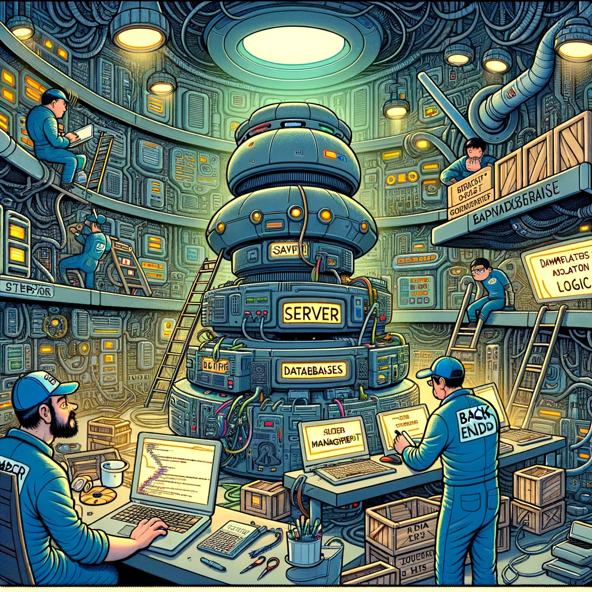

# Back-Endi Mikrokraad

Pildi allikas: Dall-E by OpenAI

## Eesmärgid

Pakkuda õpilastele põhjalikku ülevaadet serveripoolse rakenduse arendamisest, alates põhilistest programmeerimiskontseptsioonidest ja tarkvaraarenduse meetoditest kuni andmebaaside ja rakendusliideste loomiseni. Aine eesmärk on tagada, et õppijad suudavad disainida, ehitada ja hallata rakendusliideseid, mis vastavad kliendi ootustele.

## Õpiväljundid

- Õpilane on tuttav kaasaegsete tarkvaraarenduse põhimõtetega
- Õpilane kasutab koodihalduskeskkonda `Github` koodi ja dokumentatsiooni haldamiseks kursuse jooksul
- Õpilane mõistab ja rakendab põhilisi programmeerimiskonstruktsioone nagu andmetüübid, tsüklid, tingimuslaused ja funktsioonid
- Õpilane on tuttav relatsiooniliste andmebaaside põhimõtetega, kavandab ja rakendab andmebaasi, mis vastab rakendusliidese vajadustele
- Õpilane loob iseseisvalt rakendusliidese, mis vastab etteantud nõuetele, kasutades `NodeJS`-i ja `Express` raamistikku

## Eeldused

- Põhilised arvutioskused
- Huvi programmeerimise ja tarkvaraarenduse vastu
- Varasem programmeerimiskogemus ei ole nõutud

## Läbimise tingimused

- Loengutel osalemine ja iseseisvate tööde esitamine
- Iseseisev töö hõlmab erinevate programmeerimise ja tarkvaraarendusega seotud ülesannete lahendamist
- Kursuse lõpus loob õpilane iseseisvalt rakendusliidese, mis vastab etteantud nõuetele, kasutades `NodeJS`-i ja `Express` raamistikku

## Hindamiskriteeriumid

- Ülesandena valminud rakendusliidese vastavus etteantud nõuetele
- Koodihalduskeskkonna kasutamine koodi ja dokumentatsiooni haldamiseks
- Dokumentatsiooni kättesaadavus ja kvaliteet

## Õppeained

- [Tarkvaraarendus](../Subjects/Software-Development/README.md)
- [Programmeerimise alused](../Subjects/Programming-Basics/README.md)
- [Back-End Raamistikud](../Subjects/Back-End-Frameworks/README.md)
- [Andmebaasid](../Subjects/Databases/README.md)

## Loengud

### Ühised loengud

- [Esimene loeng](../Lessons/Common-Lessons/Lesson-01/README.md)
- [Teine loeng](../Lessons/Common-Lessons/Lesson-02/README.md)
- [Kolmas loeng](../Lessons/Common-Lessons/Lesson-03/README.md)
- [Neljas loeng](../Lessons/Common-Lessons/Lesson-04/README.md)
- [Viies loeng](../Lessons/Common-Lessons/Lesson-05/README.md)
- [Kuues loeng](../Lessons/Common-Lessons/Lesson-06/README.md)
- [Seitsmes loeng](../Lessons/Common-Lessons/Lesson-07/README.md)
- [Kaheksas loeng](../Lessons/Common-Lessons/Lesson-08/README.md)
- [Üheksas loeng](../Lessons/Common-Lessons/Lesson-09/README.md)
- [Kümnes loeng](../Lessons/Common-Lessons/Lesson-10/README.md)

## Back-End loengud

- [Esimene loeng](../Lessons/Back-End/Lesson-01/README.md)
- [Teine loeng](../Lessons/Back-End/Lesson-02/README.md)
- [Kolmas loeng](../Lessons/Back-End/Lesson-03/README.md)
- [Neljas loeng](../Lessons/Back-End/Lesson-04/README.md)
- [Viies loeng](../Lessons/Back-End/Lesson-05/README.md)
- [Kuues loeng](../Lessons/Back-End/Lesson-06/README.md)
- [Seitsmes loeng](../Lessons/Back-End/Lesson-07/README.md)
- [Kaheksas loeng](../Lessons/Back-End/Lesson-08/README.md)
- [Üheksas loeng](../Lessons/Back-End/Lesson-09/README.md)
- [Kümnes loeng](../Lessons/Back-End/Lesson-10/README.md)
  