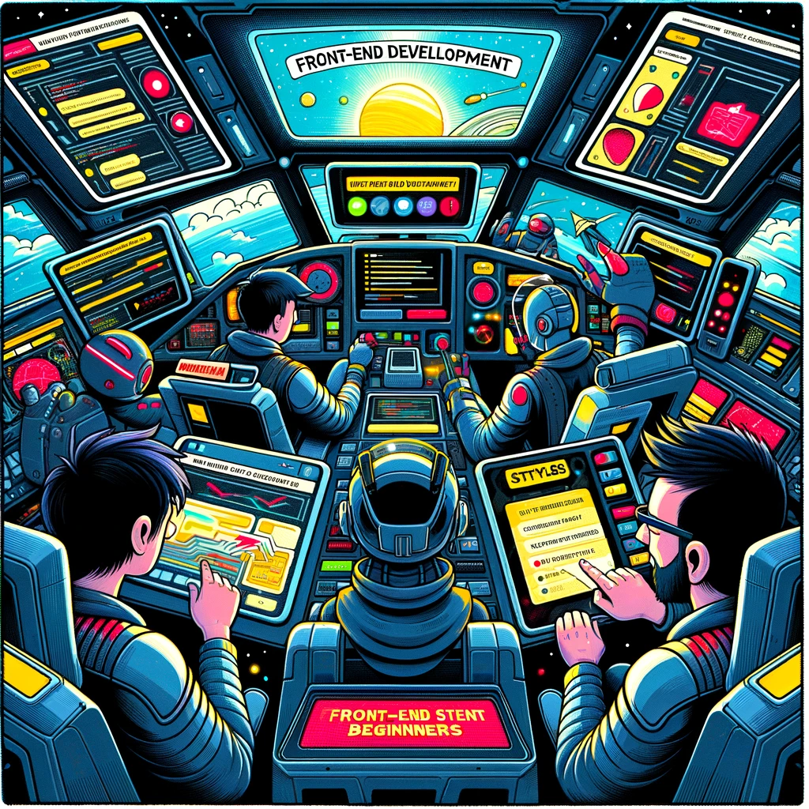

# Front-End Arenduse Mikrokraad

Pildi allikas: Dall-E by OpenAI

## Eesmärgid

Pakkuda õpilasele põhjalikku arusaama põhimõtetest, tööriistadest, parimatest praktikatest ja oskustest, mis on vajalikud interaktiivsete ja kasutajasõbralike veebilehtede loomiseks.

## Õpiväljundid

- Õpilane on tuttav kaasaegsete tarkvaraarenduse põhimõtetega
- Õpilane kasutab koodihalduskeskkonda `Github` koodi ja dokumentatsiooni haldamiseks kursuse jooksul
- Õpilane mõistab ja rakendab põhilisi programmeerimiskonstruktsioone nagu andmetüübid, tsüklid, tingimuslaused ja funktsioonid
- Õpilane on tuttav ja rakendab `HTML`, `CSS` ja `Javascript` tehnoloogiaid veebilehtede loomiseks
- Õpilane loob iseseisvalt dünaamilise veebilehe, mis vastab etteantud nõuetele, kasutades `ReactJS` veebiraamistikku

## Eeldused

- Põhilised arvutioskused
- Huvi programmeerimise ja tarkvaraarenduse vastu

> Varasem programmeerimiskogemus ei ole nõutud

## Läbimise tingimused

- Loengutel osalemine ja iseseisvate tööde esitamine
- Iseseisev töö hõlmab erinevate ülesannete lahendamist, mis on seotud programmeerimise ja tarkvaraarendusega
- Kursuse lõpus loob õpilane iseseisvalt dünaamilise veebilehe, mis vastab etteantud nõuetele, kasutades `ReactJS` veebiraamistikku

## Hindamiskriteeriumid

- Valminud veebilehe vastavus etteantud nõuetele
- Koodihalduskeskkonna kasutamine koodi ja dokumentatsiooni haldamiseks
- Dokumentatsiooni kättesaadavus ja kvaliteet

## Õppeained

- [Tarkvaraarendus](../Subjects/Software-Development/README.md)
- [Programmeerimise alused](../Subjects/Programming-Basics/README.md)
- [Front-End Tehnoloogiad](../Subjects/Front-End-Technologies/README.md)
- [Front-End Raamistikud](../Subjects/Front-End-Frameworks/README.md)

## Loengud

### Ühised loengud

- [Esimene loeng](../Lessons/Common-Lessons/Lesson-01/README.md)
- [Teine loeng](../Lessons/Common-Lessons/Lesson-02/README.md)

## Front-End loengud
