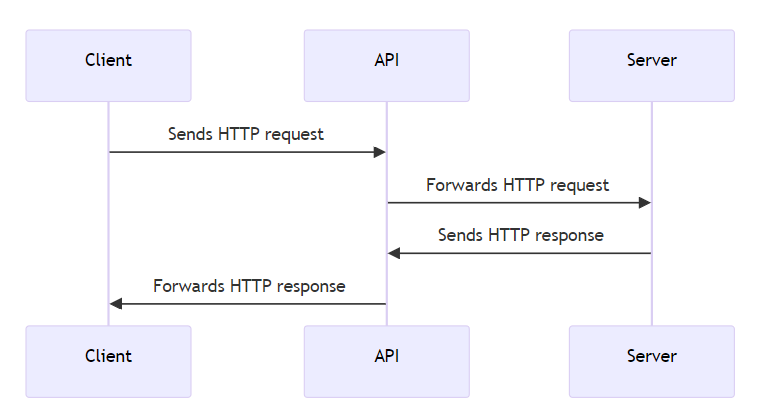

# Veebiarendus

## Back-End arendus

Martti Raavel

<martti.raavel@tlu.ee>

---

## Sissejuhatus

- Mida me tegema hakkame?
- Tööriistad
- Mis on API?
- HTTP
- HTTP meetodid
- Express
- Struktureerimine

---

## Mida me tegema hakkame?

- Õpime, kuidas luua veebi API-sid ja kuidas neid kasutada
- Loengutes teeme praktilisi harjutusi
- Kodutöödes rakendame õpitut Blogi API näitel (või kui soovite, siis mõne muu rakenduse näitel)

---

## Tööriistad

- VSCode
- Thunder Client
- Postman
- curl
- Docker Desktop

---

## Mis on API?

- Application Programming Interface
- Veebi API
- API ressurss
- Päringu - Vastuse tsükkel
- CRUD operatsioonid

---

## Veebi API

Veebi API tähistab veebirakenduste programmeerimisliidest. See on protokollide, tööriistade ja mehhanismide kogum veebipõhiste rakenduste loomiseks, mis saavad üksteisega Interneti kaudu suhelda.

---

## API ressurss

API ressurss on mis tahes andmeosa või funktsionaalsus, millele saab Interneti kaudu juurde pääseda või mida saab URI (*Uniform Resource Identifier*) ja HTTP-päringuid kasutades manipuleerida.

Näiteks võivad tüüpilisel RESTful API-l olla sellised URI-d nagu:

- `/customers`
- `/customers/123`
- `/orders/456`
- `/products/search?q=keyword`

---

## HTTP

- HyperText Transfer Protocol

HTTP tähistab hüperteksti edastusprotokolli. See on rakenduskihi protokoll, mida kasutatakse andmete edastamiseks Interneti kaudu.

---

## HTTP - Client - Server

HTTP põhineb klient-serveri mudelil, kus klient saadab serverile päringusõnumi (*request*) ja server vastab vastusesõnumiga (*response*). HTTP-päringuid algatavad tavaliselt kasutaja veebibrauser või muud kliendipoolsed rakendused ning need võivad sisaldada erinevat tüüpi teavet, näiteks päringumeetodeid (nt GET, POST, PUT, DELETE), päiseid ja andmeid.

---

## Päringu - Vastuse tsükkel



---

## CRUD operatsioonid

Mida saab teha API ressursidega?

- Create
- Read
- Update
- Delete

---

## HTTP meetodid

HTTP päringu meetodeid kasutatakse selleks, et näidata, milliseid toiminguid soovitakse HTTP päringus URI-ga (*Uniform Resource Identifier*) tuvastatud ressursiga sooritada.

---

## HTTP meetodid - GET

GET-meetodit kasutatakse serverist ressursi toomiseks. See on ohutu ja idempotentne meetod, mis tähendab, et mitmel identsel päringul on sama mõju kui ühel päringul. Vastus GET-päringule sisaldab tavaliselt taotletud ressurssi või selle esitust sõnumi kehas.

---

## HTTP meetodid - POST

POST-meetodit kasutatakse andmete esitamiseks serverisse ressursi loomiseks või värskendamiseks. See ei ole idempotentne, mis tähendab, et mitmel identsel päringul võib olla erinev mõju. Vastus POST-päringule sisaldab tavaliselt loodud või värskendatud ressursi esitust sõnumi kehas.

---

## HTTP meetodid - PUT

PUT-meetodit kasutatakse serveris olemasoleva ressursi värskendamiseks. See on idempotentne, mis tähendab, et mitmel identsel päringul on sama mõju kui ühel päringul. Vastus PUT-päringule sisaldab tavaliselt värskendatud ressursi esitust sõnumi kehas.

---

## HTTP meetodid - DELETE

DELETE meetodit kasutatakse ressursi kustutamiseks serverist. See on idempotentne, mis tähendab, et mitmel identsel päringul on sama mõju kui ühel päringul. Vastus DELETE päringule sisaldab tavaliselt kinnitussõnumit sõnumi kehas.

---

## Express

Express on minimalistlik ja paindlik Node.js veebirakenduste raamistik, mis pakub võimsaid funktsioone veebirakenduste loomiseks ja haldamiseks. Expressi kasutatakse sageli veebi API-de loomiseks ja veebirakenduste arendamiseks.

---

## Express - paigaldamine

```bash
npm install express
```

---

## Express - lihtne näide

```javascript
const express = require('express');
const app = express();

const port = 3000;

app.get('/', (req, res) => {
  return res.send('Hello!');
});

app.listen(port, () => {
  console.log(`Listening on port: ${port}`);
});
```

---

## Express - meetodid

- GET - `app.get()`
- POST - `app.post()`
- PUT - `app.put()`
- DELETE - `app.delete()`

---

## Request objekt

Request objekt sisaldab teavet HTTP-päringu kohta, nagu päringu meetod, päised, päringu URL ja päringu keha. Seda kasutatakse serveri pool kliendi poolt saadetud päringu andmete lugemiseks ja töötlemiseks.

Request objekt tekitatakse automaatselt iga kord, kui server saab HTTP-päringu.

---

## Response objekt

Response objekt sisaldab teavet HTTP-vastuse kohta, nagu vastuse olekukood, päised ja vastuse keha. Seda kasutatakse serverist kliendi poolt saadetud päringule vastamiseks.

Response objekti saame ise muuta ja sinna lisada soovitud andmeid.

---

## Struktureerimine

Struktrureerimine tähendab veebirakenduse komponentide jaotamist erinevateks osadeks, et hõlbustada koodi haldamist, taaskasutamist ja testimist.

- Kontrollerid
- Teenused
- Marsruudid

---

## Kontrollerid

Kontrollerid on veebirakenduse komponendid, mis vastutavad päringute töötlemise ja vastuste genereerimise eest. Kontrollerid võtavad vastu päringu objekti, töötlevad seda ja genereerivad vastuse objekti, mis saadetakse tagasi kliendile.

---

## Teenused

Teenused on veebirakenduse komponendid, mis sisaldavad äriloogikat ja andmete töötlemise loogikat. Teenused võivad teostada erinevaid toiminguid, nagu andmete lugemine ja kirjutamine andmebaasist, välise API-ga suhtlemine või muud keerukad arvutused.

---

## Marsruudid

Marsruudid on veebirakenduse komponendid, mis määratlevad, kuidas päringud marsruutidele vastavalt töödeldakse. Marsruudid määratlevad URI-d, päringumeetodid ja vastavad kontrollerid, mis töötlevad päringuid ja genereerivad vastuseid.

---

## Kodune töö

- Analüüsi mõnda blogi ja mõtle, millised API ressursid seal võiksid olla (vähemalt neli)
- Loo Express rakendus, millel on URI-d vähemalt nelja blogi ressursi jaoks
- Loo iga ressursi jaoks massiiv, kus on iga ressursi kohta vähemalt 3 objekti vastavate omaduste ja väärtustega
- Tee nii, et igale ressursile päringu tegemisel tagastatakse vastavad ressursid (nt GET /posts tagastab kõik postitused)
