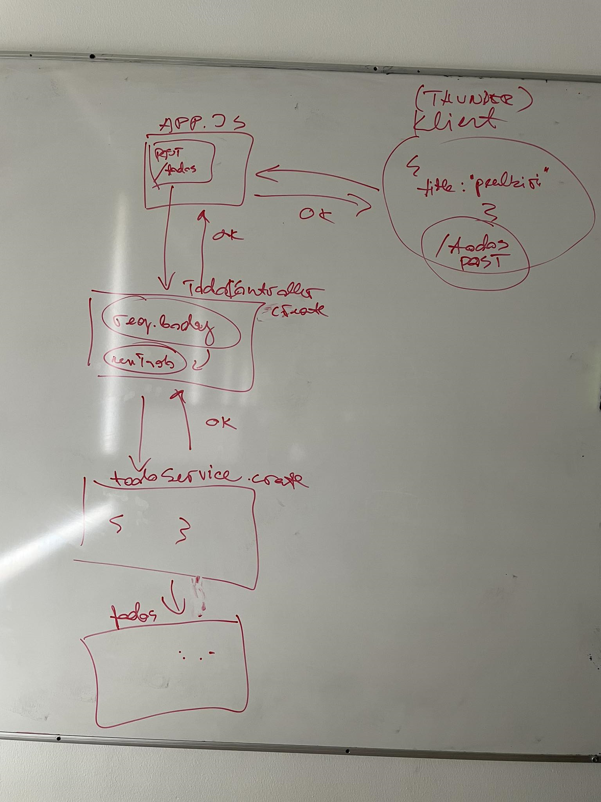

# Teine loeng

- [Esimene loeng](../Lesson-01/README.md)
- [Teise loengu slaidid](Slides.md)
- [Teise loengu salvestus]()
- [Teises loengus kirjutatud kood]()
- [Kolmas loeng](../Lesson-03/README.md)
- [Zoomi link]()

## Teemad

- [Struktureerimine](../../../Subjects/Back-End-Frameworks/Topics/Structuring/README.md) - Kontrollerid
- [Andmete saatmine API-sse](../../../Subjects/Back-End-Frameworks/Topics/Sending-Data-To-Express/README.md)
  - Query string
  - Body
- API tööriista kasutamine
  - Thunder Client

Loengus tahvlile joonistatud skeem:

## Kodutöö

- Loe läbi loengus käsitletud teemad
  - [Struktureerimine](https://github.com/HK-Mikrokraadid/Veebiarendus/tree/main/Subjects/Back-End-Frameworks/Topics/Structuring/README.md)
  - [Andmete saatmine API-sse](https://github.com/HK-Mikrokraadid/Veebiarendus/blob/main/Subjects/Back-End-Frameworks/Topics/Sending-Data-To-Express/README.md)
- Struktureeri oma rakendus vastavalt loengus tehtule kontrolleriteks ja teenusteks
- **Proovi** tekitada oma API-le võimalus andmeid ressursside alla lisada

Abiks on [teises loengus kirjutatud kood](https://github.com/HK-Mikrokraadid/Martti/tree/main/lessons/BE/02)
