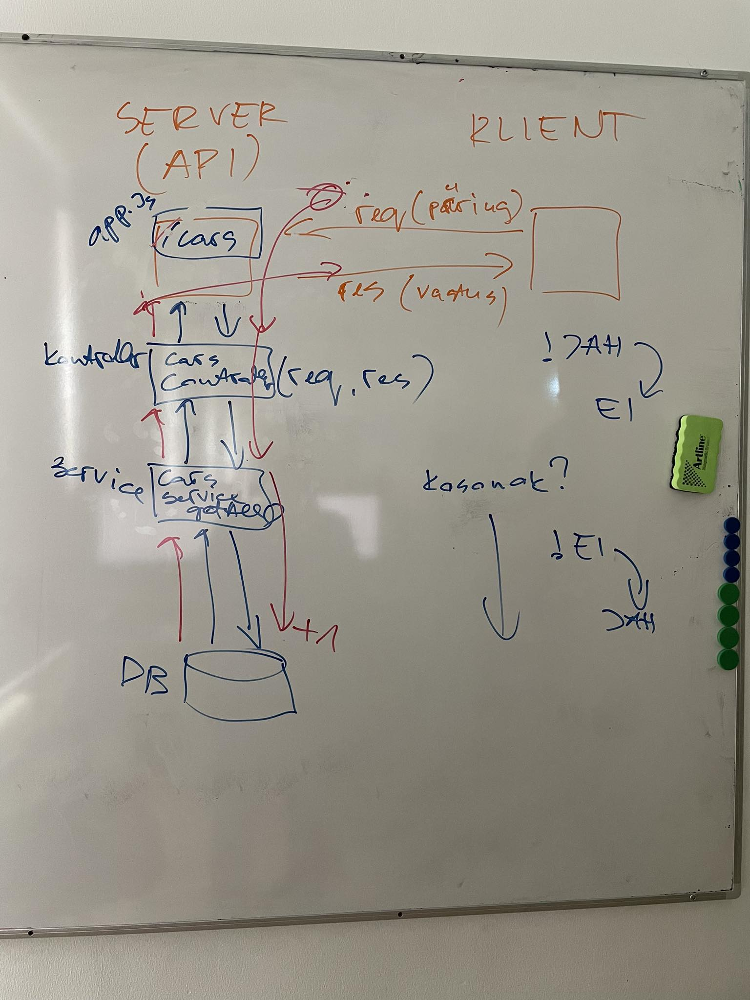

# Kolmas loeng

- [Teine loeng](../Lesson-02/README.md)
- [Kolmanda loengu slaidid](Slides.md)
- [Kolmanda loengu salvestus]()
- [Kolmandas loengus kirjutatud kood]()
- [Neljas loeng](../Lesson-04/README.md)

## Teemad

- Meenutame eelmist loengut
- Kordamine
  - Struktureerimine
    - Vaatame üle teenused ja kontrollerid
  - Andmete saatmine API-sse
    - Request params
    - Request body
    - Query string

## Request-Response tsükkel (loengus joonistatud pilt)

## Kodutöö

- Lisa oma varasemalt alustatud projektile uute ressursside lisamise võimalus (kui juba ei ole lisanud).
- Lisa ressusrsside loomisele kontrollid, et kasutaja ei saaks lisada tühje või vigaseid andmeid.

Kasuks võib olla loengus kirjutatud kood, mille leiad siit: [Kolmandas loengus kirjutatud kood](https://github.com/HK-Mikrokraadid/Martti/tree/main/lessons/BE/03)
