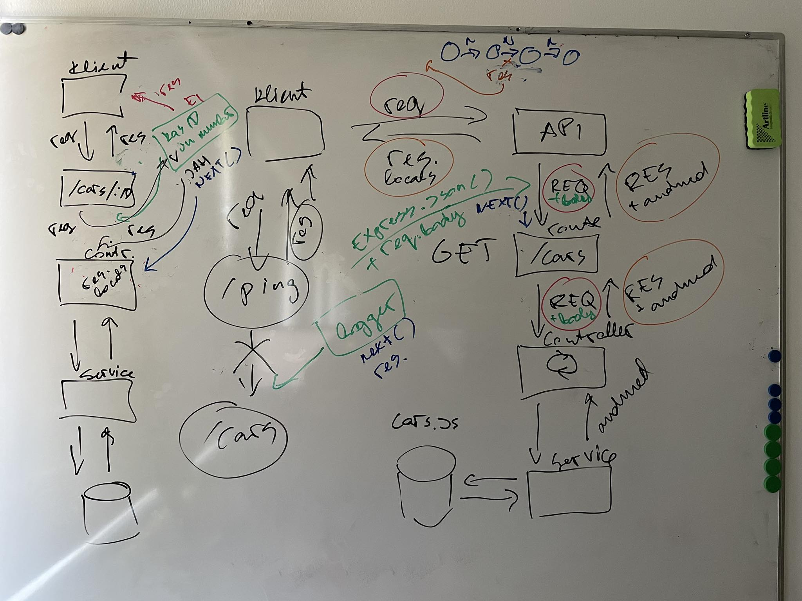

# Neljas loeng

- [Kolmas loeng](../Lesson-03/README.md)
- [Neljanda loengu slaidid](Slides.md)
- [Neljanda loengu salvestus](https://youtu.be/YeKr6oa1cdY)
- [Neljandas loengus kirjutatud kood](https://github.com/HK-Mikrokraadid/Martti/tree/main/lessons/BE/04)
- [Viies loeng](../Lesson-05/README.md)
- [Zoomi link](https://zoom.us/j/94501316239?pwd=MUE3VGpMcVZOTmU3ZHRQRkFsUFYwQT09)

## Teemad

- Meenutame eelmist loengut
- [Middleware](../../../Subjects/Back-End-Frameworks/Topics/Middleware/README.md)
- [Express Router](../../../Subjects/Back-End-Frameworks/Topics/Routes/README.md)

## Middleware (loengus joonistatud pilt)

## Kodutöö

- Loe läbi neljanda loengu materjalid:
  - [Middleware](https://github.com/HK-Mikrokraadid/Veebiarendus/blob/main/Subjects/Back-End-Frameworks/Topics/Middleware/README.md)
  - [Express Router](https://github.com/HK-Mikrokraadid/Veebiarendus/blob/main/Subjects/Back-End-Frameworks/Topics/Routes/README.md) materjalid
- Struktureeri oma projekti marsruudid `Router` objektideks
- Lisa oma projekti `middleware` funktsioon, mis logib konsooli kõik päringud koos kellaajaga
- Paigalda oma arvutisse [Docker Desktop](https://www.docker.com/products/docker-desktop/) rakendus
