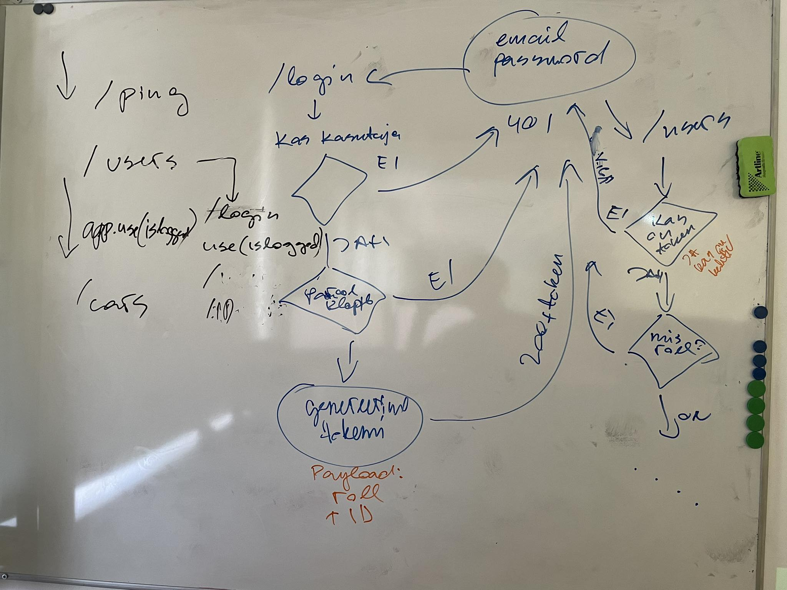

# Viies loeng

- [Neljas loeng](../Lesson-04/README.md)
- [Viienda loengu slaidid](Slides.md)
- [Viienda loengu salvestus]()
- [Viiendas loengus kirjutatud kood](https://github.com/HK-Mikrokraadid/Martti/tree/main/lessons/BE/05)
- [Kuues loeng](../Lesson-06/README.md)

## Teemad

- [Autentimine ja autoriseerimine](../../../Subjects/Back-End-Frameworks/Topics/Auth/README.md)
- [Bcrypt](../../../Subjects/Back-End-Frameworks/Topics/Bcrypt/README.md)
- [JWT](../../../Subjects/Back-End-Frameworks/Topics/JWT/README.md)
- [Andmete saatmine Express API-le - Header](../../../Subjects/Back-End-Frameworks/Topics/Sending-Data-To-Express/README.md#päised)
- [Autentimise ja autoriseerimise rakendamine](../../../Subjects/Back-End-Frameworks/Topics/Auth-Middleware/README.md)

## Viiendas loengus joonistatud pilt

