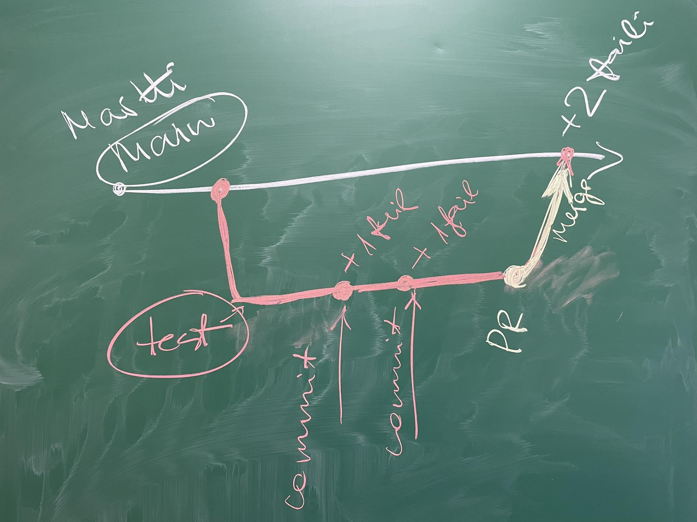

# Teine loeng

- [Esimene loeng](../Lesson-01/README.md)
- [Teise loengu slaidid](Slides.md)
- [Teise loengu salvestus](https://youtu.be/gF2mFUuLvMw) Ainult kohtumise esimene pool, sest unustasin teisel poolel Zoomi uuesti salvestama panna :sad:
- [Kolmas loeng](../Lesson-03/README.md)
- [Zoomi link](https://zoom.us/j/94501316239?pwd=MUE3VGpMcVZOTmU3ZHRQRkFsUFYwQT09)
- [Teise loengu harjutuste lahendused](https://github.com/HK-Mikrokraadid/Martti/blob/3e21ed460cca4ac8711fb3c41e455ba771cfb499/app.js)

## Teemad

### Tarkvaraarendus

- Eelmise loengu meeldetuletus
- Kodutööde ajal tekkinud probleemide lahendamine
- [Github Issue](../../../Subjects/Software-Development/Topics/Github-Issue/README.md)
- [.gitignore](../../../Subjects/Software-Development/Topics/Gitignore/README.md)
- [Harud, Tõmbetaotlus ja ühendamine](../../../Subjects/Software-Development/Topics/Branch/README.md)
- [Git ja Githubi parimad tavad](../../../Subjects/Software-Development/Topics/Git-Best-Practices/README.md)

### Programmeerimine

- Eelmise loengu meeldetuletus
- Kodutööde ajal tekkinud probleemide lahendamine
- [Operaatorid ja avaldised](../../../Subjects/Programming-Basics/Topics/Operators/README.md)
- [Tingimuslaused](../../../Subjects/Programming-Basics/Topics/Conditionals/README.md)
- Harjutused

## Kodutöö

- Loe läbi tänase loengu materjalid
- Tee läbi materjalides olevad harjutused
  - [Operaatorid](../../../Subjects/Programming-Basics/Topics/Operators/README.md#harjutused)
  - [Tingimusaused](../../../Subjects/Programming-Basics/Topics/Conditionals/README.md#harjutused)
  - [Tingimuslausete lisaülesanded](../../../Subjects/Programming-Basics/Topics/Conditionals/Exercises.md) (Soovi korral)
- Laadi tehtud harjutuste kood Githubi
