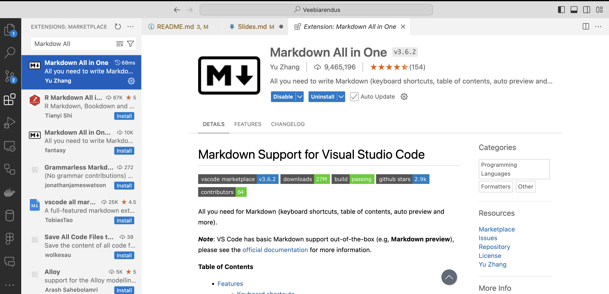
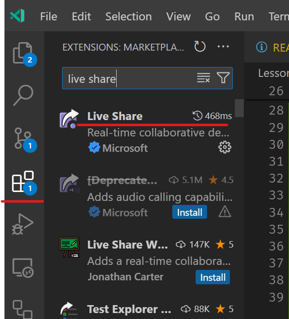

# Tarkvaraarendus ja programmeerimine

Martti Raavel

<martti.raavel@tlu.ee>

---

## Tarkvaraarendus

- Eelmise loengu meeldetuletus
- Markdown
  - Markdown All-in-One pistikprogramm
- Github Issue
- .gitignore
- Harud, Tõmbetaotlus ja ühendamine
- Git ja Githubi parimad tavad

---

## Millest rääkisime eelmisel korral?

---

## Mis on Markdown?

Markdown on kerge märgendikeel, millel on lihtne tekstivormingu süntaks. Markdowni peamine eesmärk oli muuta inimestel teksti kirjutamine ja vormindamine lihtsaks viisil, mis on vabalt loetav ja mida saab konverteerida HTML-iks (või teisteks väljundvorminguteks).

> Discord ja paljud teised platvormid kasutavad Markdowni teksti vormindamiseks.

---

## Markdown All-in-One

Markdown `All-in-One` on Visual Studio Code pistikprogramm, mis võimaldab Markdowni failide redigeerimisel kasutada erinevaid tööriistu ja funktsioone.

---

## Markdown All-in-One pistikrpogrammi paigaldamine



---

## Github `Issue`

- Githubi kontekstis on `Issue` omadus, mis võimaldab kasutajatel jälgida konkreetse hoidla ülesandeid, vigu ja funktsioonitaotlusi.
- `Issue` saab olla avatud või suletud.
- `Issue`-le saab määrata silte, vastutajaid, kommentaare ja muid atribuute.

---

## Millest Issue koosneb?

- Pealkiri (_Title_)
- Kirjeldus (_Description_)
- Sildid (_Labels_)
- Vastutaja (_Assignee_)
- Kommentaarid (_Comments_)
- Olek (_Status_ - avatud või suletud)

---

## Kuidas `Issue`-t luua

- Lisa oma hoidlale `collaborator`
  - `Settings` -> `Manage access` -> `Invite a collaborator`
- Loo oma hoidlale `Issue`
- Määra `Issue`-le `Assignee`-ks `collaborator`
- `Assignee` lisab `Issue`-le kommentaari
- Sulge `Issue`

---

## `.gitignore`

`.gitignore` fail on fail, mis sisaldab hoidla jaoks ignoreeritavaid faile ja kaustu.

---

## Mida lisatakse `.gitignore` faili?

- Kõik failid ja kaustad, mida ei soovita hoidlasse lisada.
- Näiteks:
  - `.env` failid (saladusi sisaldavad failid)
  - `node_modules` kaustad (sõltuvused)
  - `dist` kaustad (tootmisfailid)
  - Muud saladusi sisaldavad failid ja kaustad (_config_, _secrets_, _keys_, _passwords_)
  - Arvuti ja redaktori poolt genereeritud failid (_Thumbs.db_, _Desktop.ini_, _\*.swp_, _\*.swm_, _\*.swo_, DS_Store)

---

## `.gitignore` harjutus

- Loo oma hoidlale `.gitignore` fail
- Lisa faili kirje `config.js`
- `commit`-i ja `push`-i oma muudatused
- lisa fail `draft.md` oma hoidlasse
- `commit`-i ja `push`-i oma muudatused
- Mis juhtus?

---

## Harud

Haru (branch) on tarkvaraversioonide haldamise kontseptsioon, mis võimaldab arendajatel luua tarkvara koodipaasist isoleeritud koopiaid. Harude loomine võimaldab arendajatel töötada uute funktsioonide, paranduste või eksperimentide kallal, ilma et see mõjutaks peamist koodibaasi.

---

## Harud - milleks?

- Uute funktsioonide arendamine
- Vigade parandamine
- Koodi eksperimenteerimine
- Koodi ülevaatamine
- Koodi testimine

---

## Harude tüübid

- Peamine haru (_main branch_)
- Funktsiooniharud (_feature branches_, _development branches_)
- Väljalaskeharud (_release branches_)
- Parandusharud (_hotfix branches_, _bugfix branches_)
- ...

---

## Harud (_branch_), Tõmbetaotlus (_Pull Request_) ja Ühendamine (_Merge_)

- Harude loomine
- Harusse vahetamine
- Töö harus
- Tõmbetaotluse loomine
- Tõmbetaotluse ülevaatamine ja ühendamine
- Haru kustutamine

---

## Harude loomise protsessi harjutus

- Loo oma hoidlale uus haru
- Tee mõned muudatused uues harus
- `commit`-i ja `push`-i muudatused
- Loo tõmbetaotlus
- Ühenda tõmbetaotlus peamise haruga
- Kustuta haru

---

## Git ja Githubi parimad tavad

- `commit`-i tihti
- Kirjuta mõistlikud `commit`-i sõnumid
- Kasuta `.gitignore` faili
- Ära lisa saladusi sisaldavaid faile hoidlasse! (Kui midagi oled `Github`-i lisanud, siis on seda sealt raske lõplikult eemaldada)
- Kasuta harusid
- Sünkroniseeri tihti
- Lisa alati hoidlasse `README.md` fail (dokumentatsiooni puhul ka alamkaustadesse)

---

## Programmeerimine

- Eelmise loengu meeldetuletus
- Operaatorid ja avaldised
- Tingimuslaused
- ...

---

## Millest rääkisime eelmises loengus?

---

## Live share pistikprogramm

- Live Share on Visual Studio Code pistikprogramm, mis võimaldab mitmel inimesel üheaegselt samas koodifailis töötada/seda vaadata.

---

## Live Share paigaldamine



---

## Operaatorid ja avaldised 1

- Operaator on sümbol, mida kasutatakse ühe või mitme väärtusega toimingu sooritamiseks
- Avaldis on väärtuste, muutujate, operaatorite ja funktsioonide kombinatsioon, mille abil arvutatakse uus väärtus

---

## Operaatorid ja avaldised 2

```javascript
let sum = 5 + 10;
```

- `5 + 10` on avaldis
- `sum` on muutuja nimi, kuhu salvestatakse avaldise tulemus
- `+` on operaator
- `5` ja `10` on operandid

---

## Operaatorid ja avaldised 3

- Operaatorid:
  - Aritmeetilised operaatorid
  - Määramisoperaatorid
  - Stringi operaatorid
  - Võrdlusoperaatorid
  - Loogilised operaatorid

---

## Aritmeetilised operaatorid

- `+` - liitmine
- `-` - lahutamine
- `*` - korrutamine
- `/` - jagamine
- `%` - jääk

---

## Määramisoperaatorid

- `=` - määramine, omistamine
- `+=` - liitmine ja omistamine
- `-=` - lahutamine ja omistamine
- `*=` - korrutamine ja omistamine
- `/=` - jagamine ja omistamine
- `%=` - jäägi omistamine
- `++` - suurendamine
- `--` - vähendamine
- `**` - astendamine
- `**=` - astendamine ja omistamine

---

## Stringi operaatorid

- `+` - liitmine

---

## Võrdlusoperaatorid

Võrdlusoperaatoreid kasutatakse kahe väärtuse võrdlemiseks ja tõeväärtuse tagastamiseks - tulemuseks on `true` või `false`.

- `==` - võrdub
- `===` - võrdub ja on sama tüüpi
- `!=` - ei võrdu
- `!==` - ei võrdu ja ei ole sama tüüpi
- `>` - suurem kui
- `<` - väiksem kui
- `>=` - suurem või võrdne
- `<=` - väiksem või võrdne

---

## Loogilised operaatorid

- `&&` - ja (AND)
- `||` - või (OR)
- `!` - mitte (NOT)

---

## Tingimuslaused

Tingimuslause on kontrollmehanism, mida kasutatakse tingimuse alusel valikute tegemisel.

---

## Tingimuslausetega seotud mõisted

- Tõeväärtus avaldis

---

## Tõeväärtus avaldis

Tõeväärtus avaldis on avaldis, mis hindab avaldise väärtust tõeseks (`true`) või vääraks (`false`). Selleks kasutatakse võrdlusoperaatoreid.

Tõeväärtusavaldis võib olla ka muutuja, mille väärtus on `true` või `false`.

Avaldist kasutatakse tingimuslausetes otsustamaks, kas koodiplokk täidetakse või mitte.

---

## Tingimuslausete tüübid

- `if`
- `if-else`
- `if-else-if`
- `switch`

---

## `if`

`if` lauset kasutatakse koodiploki täitmiseks, kui tingimus on tõene.

`if` lausel on järgmine süntaks:

```javascript
if (tingimus) {
  // kood, mida täidetakse, kui tingimus on tõene
}
```

---

## `if` näide

```javascript
let weather = "päikeseline";

if (weather === "päikeseline") {
  console.log("Lähen randa!");
}
```

---

## `if-else`

`if-else` lauset kasutatakse koodiploki täitmiseks, kui tingimus on tõene, ja teise koodiploki täitmiseks, kui tingimus on väär.

`if-else` lausel on järgmine süntaks:

```javascript
if (tingimus) {
  // kood, mida täidetakse, kui tingimus on tõene
} else {
  // kood, mida täidetakse, kui tingimus on väär
}
```

---

## `if-else` näide

```javascript
weather = "päikeseline";

if (ilm === "päikeseline") {
  console.log("Lähen randa!");
} else {
  console.log("Lähen kinno!");
}
```

---

## `if-else-if`

`if-else-if` lauset kasutatakse juhul, kui on vaja kontrollida mitut tingimust.

`if-else-if` lausel on järgmine süntaks:

```javascript
if (tingimus1) {
  // kood, mida täidetakse, kui tingimus1 on tõene
} else if (tingimus2) {
  // kood, mida täidetakse, kui tingimus2 on tõene
} else {
  // kood, mida täidetakse, kui ükski tingimus ei ole tõene
}
```

---

## `if-else-if` näide

```javascript
let number = 5;

if (number > 0) {
  console.log("Number on positiivne");
} else if (number < 0) {
  console.log("Number on negatiivne");
} else {
  console.log("Number on null");
}
```

---

## Tänane kodutöö

- Tee läbi materjalides olevad harjutused
- Kui soovid, siis vali mõni lisaülesanne
- Laadi tehtud harjutuste kood Githubi
- Loe läbi kolmanda loengu materjalid

---
