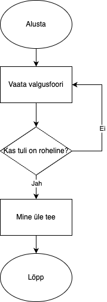

# Tarkvaraarendus ja programmeerimine

Martti Raavel

<martti.raavel@tlu.ee>

---

## Tarkvaraarendus

- Eelmise loengu meeldetuletus
- Kodutööde ajal tekkinud probleemid
- Koodi kvaliteet
- Koodi ülevaatus (Code review)
- Tarkvaraarenduse elutsükkel
- Tarkvaraarenduse meetodid
- Rollid tarkvaraarenduses

---

## Eelmise loengu meeldetuletus

---

## Koodi kvaliteet - Arutelu


---

## Koodi kvaliteet - Mis?

Koodi kvaliteet viitab koodibaasi üldisele kvaliteedile ja hooldatavusele. See hõlmab koodi erinevaid aspekte, sealhulgas selle loetavust, järjepidevust, lihtsust, hooldatavust ja usaldusväärsust. Kvaliteetset koodibaasi on aja jooksul lihtsam mõista, muuta ja hooldada, mis võib säästa arendusmeeskondade aega ja ressursse.

---

## Koodi kvaliteet - Mida sisaldab?

- Loetavus
- Järjepidevus
- Lihtsus
- Hooldatavus
- Töökindlus

---

## Koodi kvaliteet - Kuidas tagada?

- Järjepidev koodi vormindamine
- Kommentaarid ja dokumentatsioon
- Ühiktestimine
- Koodi ülevaatused
- Vigade käsitlemine

---

## Koodi ülevaatus 1 (Code review)

Koodi ülevaatus on protsess, mille käigus üks või mitu arendajat vaatavad üle teise arendaja kirjutatud koodi.

Koodi ülevaatuse eesmärk on tuvastada võimalikud probleemid, parandada koodi kvaliteeti ja tagada koodi vastavus projekti nõuetele.

---

## Koodi ülevaatus - Mis?

Koodi ülevaatus hõlmab tavaliselt koodi ridade kaupa läbilugemist ja selliste probleemide otsimist nagu:

- vead;
- turvanõrkused;
- jõudlusprobleemid;
- kodeerimisstandardite rikkumised;
- disainivead.

---

## Koodi ülevaatus 3 - Kuidas?

- Uus haru
- Koodi kirjutamine
- `commit`, `push`
- `Pull request`
- `Reviewers` - teine arendaja
  - `Comment`
  - `Approve`
  - `Request changes`
- Peale `Approve`-i lisada uueks ülevaatajaks `mrtrvl`
- `Approve`
- `Merge`
- `Delete branch`

---

## Koodi ülevaatus 4 - Harjutus

---

## Tarkvaraarenduse elutsükkel (SDLC - _Software Development Life Cycle_)

Tarkvaraarenduse elutsükkel (SDLC) on süsteemne protsess tarkvara planeerimiseks, loomiseks, testimiseks, juurutamiseks ja hooldamiseks. See määratleb etapid ja ülesanded, mis on seotud tarkvara tootmisega algusest kuni selle lõpetamiseni.

---

## Tarkvaraarenduse elutsükkel Arutelu

Milliseid samme tuleb läbida selleks, et ideest saaks valmis tarkvara?

---

## Tarvaraarenduse elutsükkel - Sammud

1. Planeerimine
2. Nõuete määratlemine ja analüüs
3. Disain
4. Arendamine
5. Testimine
6. Juurutamine
7. Hooldus ja tugi
8. Tagasiside

---

## Tarvaraarenduse elutsükkel - Planeerimine

- Projekti ulatuse määramine.
- Potentsiaalsed riskide, piirangute ja ressurside tuvastamine.
- Projekti plaani koostamine (sealhulgas ajakavad, verstapostid ja eelarve hinnangud).
- Kasutajauuringud kasutajate vajaduste ja ootuste mõistmiseks.

---

## Tarvaraarenduse elutsükkel - Nõuete määratlemine ja analüüs

- Nõuete ja vajaduste kogumine ja dokumenteerimine.
- Spetsifikatsioonide kogumine sidusrühmadelt (_lõppkasutajad, kliendid jne._).
- Nõuete teostavuse analüüs.
- Nõuete loetelu prioritiseerimine ja kinnitamine.

---

## Tarvaraarenduse elutsükkel - Disain

- Nõuete _tõlkimine_ süsteemi spetsifikatsioonideks.
- Süsteemi arhitektuuri ja raamistiku disainimine.
- UX (kasutajakogemus) ja UI (kasutajaliides) disain.
- Sobivate tehnoloogiate, platvormide ja tööriistade valik.

---

## Tarvaraarenduse elutsükkel - Arendamine

- Koodi kirjutamine.
- Disaini muutmine funktsionaalseks tarkvaraks.
- Erinevate komponentide integratisoon ja koostöö tagamine.

---

## Tarvaraarenduse elutsükkel - Testimine

- Tarkvara nõuetele vastavuse kontroll.
- Vigade ja ebakõlade parandus ja kontroll.
- Erinevate testimismeetodite rakendamine (ühiktestimine, integratsioonitestimine, manuaaltestimine jne).
- Tarkvara funktsionaalsuse, jõudluse, turvalisuse ja kasutatavuse valideerimine.

---

## Tarvaraarenduse elutsükkel - Juurutamine

- Tarkvara käivituskeskkonna ettevalmistus.
- Tarkvara tootmiskeskkonda paigaldamine ja rakendamine.
- Vajadusel lõppkasutajte koolitus.
- Tarkvara jõudluse jälgimine ja sujuva töö tagamine.

---

## Tarvaraarenduse elutsükkel - Hooldus ja tugi

- Pärast juurutamist tekkinud probleemide ja vigade lahendamine.
- Uuenduste, paranduste või täiustuste loomine vastavalt kasutajate tagasisidele.
- Tagamine, et tarkvara on ajas töökorras, tõhus ja asjakohane.
- Turvahaavatavuste ja ühilduvusprobleemide lahendamine.

---

## Tarvaraarenduse elutsükkel - Tagasiside

- Tagasiside kogumine sidusrühmadelt ja lõppkasutajatelt.
- Tarkvara jõudluse analüüs ja täiustamiskohtade tuvastamine.
- Järgmise iteratsiooni või tarkvara versiooni planeerimine.

---

## Tarvaraarenduse elutsükkel - Miks on oluline?

---

## Tarkvaraarenduse mudelid

Tarkvaraarenduse mudelid on struktureeritud lähenemised tarkvaraarendusele, mis määratlevad etapid ja protsessid, mida tuleb järgida tarkvara tootmisel. Need mudelid võivad olla lineaarsed, järjestikused või iteratiivsed, sõltuvalt projekti olemusest ja nõuetest.

---

## Tarkvaraarenduse mudelid - Arutelu

---

## Tarkvaraarenduse mudelid - Kose mudel (Waterfall)

- **Kirjeldus:** Lineaarne ja järjestikune lähenemine, kus iga faas tuleb lõpetada enne järgmise algust. See on varaseim SDLC lähenemine.
- **Eelised:** Selge struktuur, lihtne mõistmine, hästi määratletud etapid.
- **Puudused:** Pärast faasi lõpetamist on muudatuste tegemine keeruline, ei sobi keerukate projektide jaoks.

---

## Tarkvaraarenduse mudelid - Agiilne mudel (Agile)

- **Kirjeldus:** Iteratiivne lähenemine tarkvara tarnimisele, mis ehitab tarkvara järk-järgult, keskendudes kliendi tagasisidele ja kiiretele iteratsioonidele.
- **Eelised:** Paindlik, edendab iteratiivset tagasisidet, julgustab kliendi kaasamist.
- **Puudused:** Vähem ennustatav, võib olla raske mõista neile, kes on harjunud traditsiooniliste meetoditega.

---

## Tarkvaraarenduse mudelid - Kanban

- **Kirjeldus:** Visuaalne protsessijuhtimise lähenemine, mis võtab vihjeid lean tootmisest ja rõhutab just õigeaegset tarnimist.
- **Eelised:** Paindlikkus, pidev tarnimine, visuaalne olemus aitab tuvastada kitsaskohti.
- **Puudused:** Vähem struktureeritud, võib viia ülekoormuseni, kui seda korralikult ei hallata.

---

## Tarkvaraarenduse mudelid - Scrum

- **Kirjeldus:** Agiilse metodoloogia tüüp, mis korraldab töö tsüklitena, mida nimetatakse "Sprintideks", mis kestavad tavaliselt 2-4 nädalat.
- **Eelised:** Regulaarsed toodete tarned, läbipaistvus, kohandatavus.
- **Puudused:** Nõuab kogenud meeskonnaliikmeid, ulatus võib mõnikord olla liiga paindlik.

---

## Tarkvaraarenduse mudelid - Extreme Programming (XP)

- **Kirjeldus:** Agiilne raamistik, mis rõhutab kliendi rahulolu, pakkudes sagedasi "väljalaskeid" lühikeste arendustsüklite jooksul, eesmärgiga parandada tootlikkust ja tutvustada kontrollpunkte.
- **Eelised:** Rõhutab koodi kvaliteeti, julgustab kliendi kaasamist.
- **Puudused:** Nõuab ulatuslikku kliendi kaasamist, võib olla arendajatele väga intensiivne.

---

## Rollid tarkvaraarenduses

Tarkvaraarenduse valdkonnas võivad isikud täita erinevaid rolle, millest igaühel on oma eripärad ja panused üldprojekti.

---

## Rollid tarkvaraarenduses - Arutelu

---

## Rollid tarkvaraarenduses

- **Tarkvaraarendaja:** Kirjutab koodi, testimine, dokumenteerimine.
- **Tarkvara arhitekt:** Süsteemi arhitektuuri kavandamine ja disainimine.
- **Projektijuht:** Projekti planeerimine, ressursside haldamine, ajakava koostamine.
- **Testija:** Tarkvara testimine, vigade ja ebakõlade tuvastamine.
- **UX/UI disainer:** Kasutajakogemuse ja kasutajaliidese disainimine.
- **Ärianalüütik:** Nõuete kogumine, analüüs ja dokumenteerimine.

---

## Rollid tarkvaraarenduses

- **Süsteemi administraator:** Tarkvara paigaldamine, konfigureerimine ja hooldamine.
- **Andmebaasi administraator:** Andmebaasi haldamine, andmete kogumine ja analüüs.
- **Klienditugi:** Kliendiküsimuste ja probleemide lahendamine.
- **Turvainsener:** Tarkvara turvalisuse tagamine ja haavatavuste tuvastamine.
- **Tehniline kirjutaja:** Tehniliste dokumentide ja juhendite koostamine.

---

## Programmeerimine

- Eelmise loengu meeldetuletus
- Kodutööde ajal tekkinud probleemid/tähelepanekud
- Algoritmid
- Massiivid
- Tsüklid
- Harjutused

---

## Kodutööde ajal tekkinud probleemid

- `Issue`-de sulgemine ja tagasiside
- `if` lausetes tingimuste järjekord
  - Sageli saab järjekorra abil tingimusi lihtsustada
- `if - else if - else` laused
  - Viimast tingimust ei ole sageli vaja välja kirjutada - selle asemel saab kasutada `else`-i
  - Muutujate nimetamine

---

## Koodinäide `if - else if - else`

```javascript
let age = 19;

if (age <= 13) {
  console.log("Laps");
} else if (age > 13 && age <= 19) {
  console.log("Teismeline");
} else if (age > 19 && age <= 65) {
  console.log("Täiskasvanu");
} else {
  console.log("Seenior");
}
```

---

## Koodinäide `if - else if - else` - lihtsustatud

```javascript
let age = 19;

if (age <= 13) {
  console.log("Laps");
} else if (age <= 19) {
  console.log("Teismeline");
} else if (age <= 65) {
  console.log("Täiskasvanu");
} else {
  console.log("Seenior");
}
```

---

## Algoritmid - Arutelu

---

## Algoritmid

Algoritm on kindlaksmääratud, selgelt defineeritud juhiste või samm-sammulise protsessi kogum, mille eesmärk on sooritada ülesanne või lahendada probleem.

---

## Algoritmid - Kuidas alustada?

- Mõista probleemi
- Tuvasta sisendid ja väljundid
- Tuvasta sammud, mida on vaja probleemi lahendamiseks
- Kirjuta algoritm pseudokoodis või joonistada voodiagramm
- Testi algoritmi erinevate sisenditega
- Vajadusel täiusta algoritmi

---

## Algoritmid - Pseudokood 1

Pseudokood on lihtne, mitteametlik keel, mida kasutatakse algoritmi sammude kirjeldamiseks. See ei ole otseselt programmeerimiskeel, kuid see võib olla programmeerimiskeele sarnane. Pseudokoodi kasutatakse algoritmi sammude kirjeldamiseks viisil, mis on lihtne mõista.

---

## Algoritmid - Pseudokood 2

```bash
ALUSTA
LOE number1
LOE number2
summa = number1 + number2
VÄLJASTA summa
LÕPETA
```

---

## Algoritmid - Voodiagramm

Voodiagramm on visuaalne esitus algoritmi sammudest ja nende järjestusest. Voodiagramm koosneb erinevatest kujunditest, mis tähistavad algoritmi erinevaid samme, nagu tegevused, otsused ja loogilised operatsioonid.

---

## Algoritmid - Voodiagramm



---

## Algoritmid - voodiagrammi sümbolid


---

## Algoritmid - Harjutused

- Paaris või paaritu arv
- Pangaautomaadist raha välja võtmine
- ...

---

## Programmeerimine

---

## Massiivid

Massiiv on väärtuste kogum, mis on salvestatud ühte muutujasse. Tavaliselt kasutatakse massiive omavahel seotud andmekogumite salvestamiseks.

---

## Massiivi deklareerimine

```js
const numbers = [1, 2, 3];
const fruits = ["õun", "pirn", "banaan"];
const mixed = [1, "õun", true];
```

---

## Massiivi elementidele ligipääs

- Igal elemendil on oma indeks (järjekorranumber)
- Indeks algab nullist
- Ligipääs elemendile: `massiiv[indeks]`
- Massiivi pikkus: `massiiv.length`

```js
const numbers = [1, 2, 3];

console.log(numbers[0]); // 1

console.log(numbers.length); // 3
```

---

## Massiivi elementide muutmine

```js
const numbers = [1, 2, 3];

numbers[0] = 10;

console.log(numbers); // [10, 2, 3]
```

---

## Massivid - Harjutused

---

## Tsüklid - Arutelu

---

## Tsüklid - Tüübid

- `for`
- `while`
- `do...while`

---

## `for` tsükkel

`for` tsüklit kasutatakse koodiploki teatud arv kordi kordamiseks. `for` tsükkel koosneb kolmest osast: **algväärtustamine**, **tingimus** ja **suurendamine/vähendamine**.

---

## `for` tsükli süntaks

```js
for (algväärtustamine; tingimus; suurendamine / vähendamine) {
  // kood, mida kordame
}
```

---

## `for` tsükli näide

```js
for (let i = 0; i < 5; i++) {
  console.log(i);
}
```

---

## `while` tsükkel

`while` tsüklit kasutatakse koodiploki kordamiseks seni, kuni teatud tingimus on tõene. `while` tsükkel koosneb **tingimusest** ja **koodiplokist**.

---

## `while` tsükli süntaks

```js
while (tingimus) {
  // kood, mida kordame
}
```

---

## `while` tsükkel - NB!

`while` tsüklil ei ole sisseehitatud **algväärtustamise** osa, ega loenduri **suurendamise/vähendamise** osa. Seetõttu peame `while` tsüklit kasutades olema ettevaatlikud, sest loenduri muutmata jätmine võib põhjustada lõputu tsükli.

---

## `while` tsükli näide

```js
let i = 0;

while (i < 5) {
  console.log(i);
  i++;
}
```

---

## `do...while` tsükkel

`do...while` tsükkel on teist tüüpi tsükkel, mida kasutatakse koodiploki kordamiseks seni, kuni teatud tingimus on tõene.

Erinevus eelmiste tsüklitega seisneb selles, et eelmiste tsüklite puhul kontrolliti tsükli täitmise tingimust enne koodiploki täitmist, kuid `do...while` tsükli puhul kontrollitakse tingimust pärast koodiploki täitmist. See tähendab, et `do...while` tsükli puhul täidetakse koodiplokk alati vähemalt üks kord, isegi kui tingimus ei ole tõene.

---

## `do...while` tsükli süntaks

```js
do {
  // kood, mida kordame
} while (tingimus);
```

---

## `do...while` tsükli näide

```js
let i = 0;

do {
  console.log(i);
  i++;
} while (i < 5);
```

---

## Harjutused

- korrutustabel
- paaris või paaritu arv
- elementide kuvamine massiivist
- käibemaksu lisamine hinnale
- ...

---

## Kodune töö

- Tee läbi materjalides olevad harjutused (need, mis puudutavad tänaseid teemasid)
- Kasuta koodi ülevaatuseks `Code review`-d
- Loe läbi järgmise loengu materjalid

---
