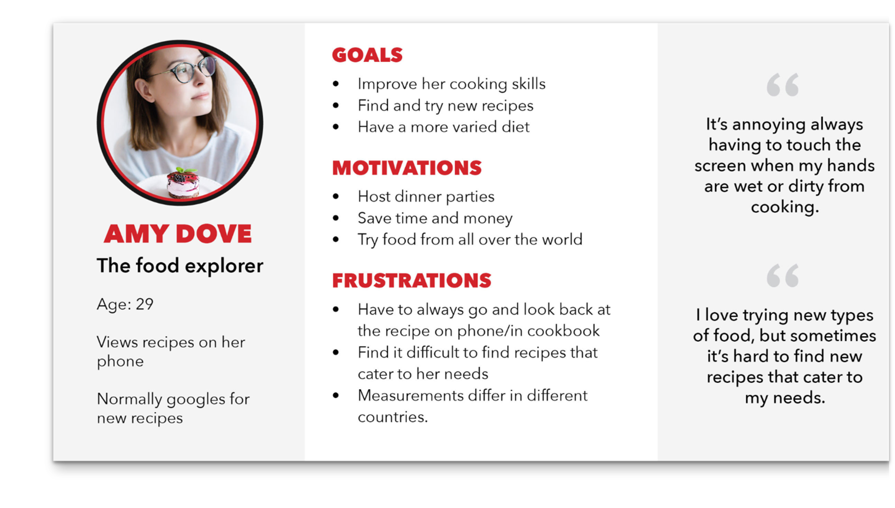

# Veebiarendus

Martti Raavel

<martti.raavel@tlu.ee>

---

- Eelmise loengu meeldetuletus
- Kodutööde ajal tekkinud probleemide lahendamine
- Nõuded ja kasutajauuringud
  - [Lähteülesanne](../../../Subjects/Software-Development/Topics/Brief/README.md)
  - [Persoona](../../../Subjects/Software-Development/Topics/Persona/README.md)
  - [Kasutajalood](../../../Subjects/Software-Development/Topics/User-Stories/README.md)
  - [Stsenaarium](../../../Subjects/Software-Development/Topics/Scenario/README.md)
  - [Kasutaja teekonnad](../../../Subjects/Software-Development/Topics/User-Journey/README.md)

---

## Eelmise loengu meeldetuletus

---

## Koduste tööde ajal tekkinud probleemid

---

## Nõuded ja kasutajauuringud

- Mis?
- Miks?
- Kuidas?

---

## Lähteülesanne

---

## Lähteülesaane - Mis?

Lähteülesanne veebilehe loomise kontekstis on dokument või juhend, mis sisaldab kogu vajalikku teavet ja nõudeid, et arendajad, disainerid ja muud osapooled saaksid mõista, mida veebiprojektilt oodatakse

---

## Lähteülesanne - Lühidalt

- Lühikirjeldus loodava veebilehe eesmärgist, nõuetest ja ajakavast;
- Annab osapooltele selge ühise arusaama projekti ootustest;
- Üldjuhul koostab lähteülesande veebilehe tellija;
- Põhjalik ja konkreetne briif tagab projekti õnnestumise.

---

## Mida lähteülesanne sisaldab?

- Ettevõtte kirjeldus
- Projekti skoop
- Projekti eesmärk
- Sihtrühma määratlus
- Peamised konkurendid
- Tehnilised nõuded
- Ajakava ja eelarve
- Kokkulepete fikseerimine
- Lansseerimine ja hooldus

---

## Lähteülesanne - Arutelu

Blogi keskkonna loomine

---

## Persona

---

## Persoona - Mis?

Tarkvaraarenduse ja kasutajakogemuse kujundamise kontekstis on **persoona** väljamõeldud tegelane, kes esindab teatud tüüpi kasutajat

---

## Persoona - Miks?

**Persoona** luuakse uurimistöö ja andmete põhjal reaalsete kasutajate kohta ning neid kasutatakse abistamaks disaineritel ja arendajatel oma kasutajate mõistmiseks ja nende vajadustest, eesmärkidest ja käitumisest aru saamiseks.

---

## Persoona - Näide



---

## Persoona - Mida sisaldab?

- kasutaja demograafia (näiteks vanus, sugu ja amet)
- üksikasjad nende huvide, motivatsiooni ja käitumise kohta
- teavet kasutaja eesmärkide, pettumuste ja valupunktide kohta
- üksikasju nende eelistatud suhtlemismeetodite kohta tarkvara või rakendusega

---

## Persoona - Lühidalt

- Näidis-kasutaja, tüüpilise lõppkasutaja arhetüüp, kes esindab konkreetset kasutajagruppi;
- Luuakse kliendi paremaks mõistmiseks – mis teda motiveerib, mis ärritab, mida ta vajab?
- Ei asenda kasutajauuringuid, vaid tugineb nendel!
- Aitab disaini loomisel silmas pidada lõppkasutaja vajadusi, nt eristada olulisi funktsionaalsusi ebaolulistest.

---

## Persoona - Loomine

Persoona loomiseks kogub meeskond tavaliselt teavet selliste uurimismeetodite abil nagu:

- küsitlused;
- intervjuud;
- reaalsete kasutajate vaatlus.
  
Seejärel kasutatakse seda teavet väljamõeldud isiku loomiseks, mis kehastab sihtrühma võtmeomadusi.

---

## Persoonade jaotumine

- **Proto-persoona**: ei tugine uutel uuringutel. Eesmärk on kiiresti luua visand või ülevaade olemasolevatest eeldustest!
- **Kvalitatiivne persoona**: tugineb väikesemahulistel uuringutel (nt intervjuu, vaatlus). Eesmärk on klientide süvitsi mõistmine!
- **Kvantitatiivne persoona**: tugineb laiaulatuslikel uuringutel (nt statistika, küsitlused). Eesmärk on andmete isikustamine!

---

## Persoona - Harjutus

Loo vähemalt üks persoona blogimise keskkonna kasutaja kohta.

Võid kasutada selleks mõnda online tööriista, nt

- UXPressia
- Hubspot

Või lihtsalt paberit

---

## Kasutajalood

---

## Kasutajalood 1

Kasutajalugu on lihtne ühelauseline tarkvararakenduse funktsiooni või funktsionaalsuse kirjeldus, mis on kirjutatud lõppkasutaja vaatenurgast.

---

## Kasutaajalood 2

Kasutajalood on levinud tehnika, mida kasutatakse agiilses tarkvaraarenduses, et kirjeldada rakenduse nõudeid nii, et neid on lihtne mõista ja prioriteete seada.

---

## Kasutajalood - Näide

`Registreeritud kasutajana tahan oma parooli lähtestada, et saaksin parooli unustamise korral oma kontole tagasi juurdepääsu.`

---

## Kasutajalood - Kirjutamine

- Tuvastage kasutaja
- Kirjeldage toimingut
- Nimetage kasu
- Prioriseerige

---

## Kasutajalood - Näide 2

1. Külaliskasutajana tahan, et saaksin tooteid sirvida, et leida midagi, mida osta.
2. Registreeritud kasutajana soovin, et saaksin oma ostukorvi tooteid lisada, et saaksin jälgida, mida osta tahan.
3. Registreeritud kasutajana soovin, et mul oleks võimalik oma kaupade eest tasuda, et saaksin ostu lõpule viia.

---

## Kasutajalood - Harjutus

Oletame, et klient soovib tellida keskkonna blogimiseks.

Kirjutage eraldi dokumneti kasutajalood, mida võimalikud kasutajad sooviksid keskkonnas teha.

---

## Stsenaarium

---

## Stsenaarium - Mis?

Tarkvara arendamisel viitab stsenaarium konkreetsele kasutusjuhtumile või olukorrale, millega kasutaja tarkvaraga suheldes võib kokku puutuda.

---

## Stsenaarium - Miks?

Stsenaariume kasutatakse selleks, et kirjeldada, kuidas kasutaja tarkvaraga suhtleb ja milliseid samme nad peavad konkreetse ülesande või eesmärgi täitmiseks tegema.

Stsenaariumid luuakse tarkvara arendamisel sageli nõuete kogumise etapis ja neid kasutatakse tarkvara funktsionaalsete ja mittefunktsionaalsete nõuete määratlemiseks.

---

## Stsenaarium - Näide

| Tegija | Tiina.. |
| --- | --- |
| Motivatsioon | ..soovib õppida, kuidas oma ettevõttele ise veebileht luua |
| Eesmärk | Ta tahab leida koolitust, mis sobiks hinnalt, oleks suunatud algajatele ja toimuks sobivatel kuupäevadel |
| Tegevus | Tiina valib koolituste nimekirjast talle sobiva kategooria, milleks on IT. Seejärel sorteerib ta koolitusi hinna ja toimumisaja alusel ning tutvub nende sisuga |
| Tulemus | Ta leiab nimistust sobiva koolituse ja registreerib osalejaks |

---

## Stsenaariumi koosatamisel

- Väldi tehnoloogia või disaini liigset kirjeldamist – stsenaariumi eesmärk on olla disaini inspiratsiooniks, mitte fikseeringuks!
- Ära kirjelda persoonat ja tema eesmärke ülemäärase detailsusega, keskendu vaid olulisele!

---

## Stsenaarium - Lühidalt

- Persoona-põhine kirjeldus toote/teenuse kasutamisest;
- Ei keskendu ärilistele või tehnoloogilistele nüanssidele ega disainile, vaid kirjeldab kasutajakogemust!
- Sisaldab:
  - tegija;
  - motivatsioon;
  - eesmärk või kavatsus;
  - tegevus;
  - tulemus või lahendus.

---

## Stsenaarium - Harjutus

Loo vähemalt üks stsenaarium blogimise keskkonna kasutaja kohta.

---

## Kasutaja teekond 1

Kasutaja teekond, mida tuntakse ka kui kasutaja teekonnakaarti või kliendi teekonnakaarti, on tööriist, mida kasutatakse tarkvaraarenduses, et visualiseerida kasutaja kogemus toote või teenusega suheldes.

## Kasutaja teekond 2

Kasutaja teekond, mida tuntakse ka kui kasutaja teekonnakaarti või kliendi teekonnakaarti, on tööriist, mida kasutatakse tarkvaraarenduses, et visualiseerida kasutaja kogemus toote või teenusega suheldes.

---

## Kasutaja teekond - Näide


---

## Kasutaja teekonna kaardistamine

Tüüpiline kasutaja teekond võib sisaldada mitmeid võtmeetappe, näiteks:

- Teadlikkus
- Uuringud
- Registreerumine või ost
- Onboarding
- Kasutamine
- Tugi
- Uuendamine või katkestamine

---

## Kasutaja teekond - Lühidalt

- Alternatiiv / laiendus stsenaariumile, loob tervikliku ülevaate kasutajakogemusest;
- Esmalt määratakse persoona ja stsenaarium, samuti eesmärgid.
- Teisena on kaardistuse keskmes kogemuse visualiseering, mis jaotatakse mitmeks etapiks.
- Kolmanda osa moodustavad tähelepanekud ja võimalused edasiseks ning vastutajad.

---

## Programmeerimine

- Eelmise loengu meeldetuletus
- Kodutööde ajal tekkinud probleemide lahendamine
- [Funktsioonid](../../../Subjects/Programming-Basics/Topics/Functions/README.md)

---

## Eelmise loengu meeldetuletus

---

## Koduste tööde ajal tekkinud probleemid

---

## Funktsioon - Mis?

Funktsioon on korduvkasutatav koodiplokk, mis on mõeldud teatud ülesande täitmiseks.

Funktsioone kasutatakse koodi korraldamiseks loogilistesse üksustesse, mida saab programmi teistes osades uuesti kasutada.

---

## Funktsioon - Näide

```javascript
function add(a, b) {
  const sum = a + b;
  return sum;
}
```

---

## Funktsioon - Koosneb

- märksõna funktsiooni deklareerimiseks
- funktsiooni nimi
- funktsiooni parameetrid (valikuline)
- funktsiooni sisu
- tagastusavaldus (valikuline)
- tagastusväärtus (valikuline)

---

## Funktsiooni deklareerimine

Javascriptis saame funktsioone deklareerida kahel viisil:

- funktsiooni deklaratsioon;
- funktsiooni avaldis.

---

## Funktsiooni deklaratsioon

```javascript
function functionName(parameter1, parameter2) {
  // funktsiooni sisu
  return value;
}
```

---

## Funktsiooni avaldis

```javascript
const add = function(a, b) {
  const sum = a + b;
  return sum;
}
```

---

## Funktsiooni väljakutsumine (käivitamine)

```javascript
const sum = add(1, 2);

console.log(sum); // 3
```

---

## Harjutused

---
