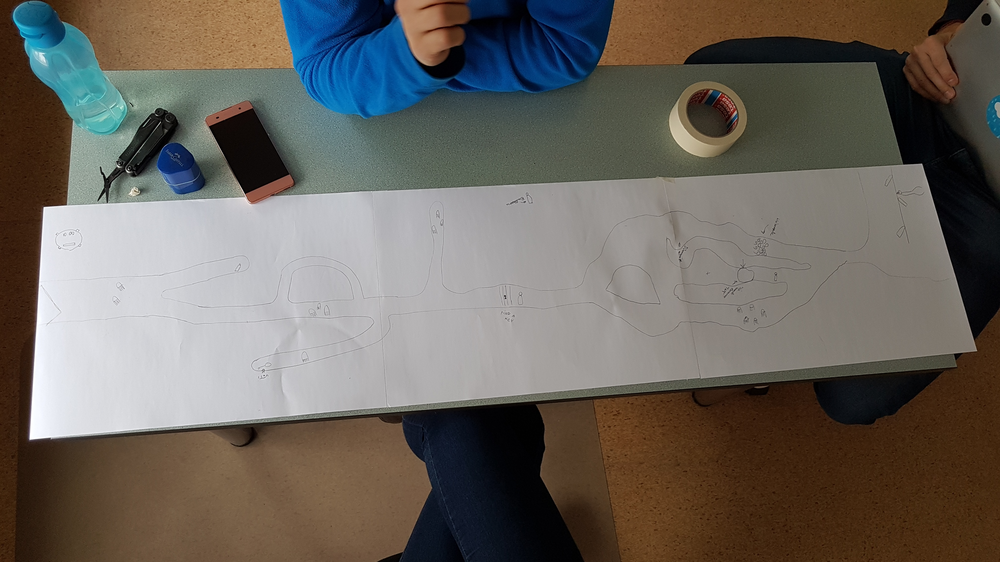

# Veebiarendus

Martti Raavel

<martti.raavel@tlu.ee>

---

## Tarkvaraarendus

- Eelmise loengu meeldetuletus
- [Prototüüpimine](../../../Subjects/Software-Development/Topics/Prototyping/README.md)

---

## Eelmise loengu meeldetuletus

---

## Prototüüpimine - Arutelu

---

## Prototüüpimine - Mis?

Prototüüpimine on tehnika, mida kasutatakse tarkvaraarenduses tarkvaratoote või -süsteemi varajaste töötavate versioonide loomiseks.

Prototüüpimine hõlmab lõpptootest lihtsustatud, kuid funktsionaalse versiooni loomist, mida saab kasutada tagasiside kogumiseks, ideede testimiseks ja nõuete täpsustamiseks enne lõpliku versiooni loomist.

---

## Prototüüpimine - Eelised

- Parem suhtlus ja koostöö meeskonnaliikmete ja sidusrühmade vahel
- Võimalike probleemide ja parendusvaldkondade varajane tuvastamine
- Arusaamatuste ja valesti suhtlemise oht arendajate ja sidusrühmade vahel
- Disainikontseptsioonide ja töövoogude kiirem iteratsioon ja testimine
- Parem kasutajate seotus ja rahulolu varajase tagasiside ja sisendi kaudu

---

## Prototüüpimine - Paberprototüüpimine



---

## Paberprototüüpimine

Paberprototüüpimine on **odav** ja madala täpsusega prototüüpimise tehnika, mida kasutatakse tarkvaraarenduses toote või süsteemi kiire, lihtsa ja interaktiivse esituse loomiseks.

---

## Paberprototüüpimine - Eelised

- Madalad kulud
- Kiire iteratsioon
- Parandatud suhtlus
- Suurem kasutajate kaasatus

---

## Paberprototüüpimine - Miinused

- Madal täpsus
- Piiratud funktsionaalsus
- Piiratud kasutatavus
- Keskkonna piiratus

---

## Prototüüpimine - Digitaalsed tööriistad

Prototüüpimise tööriistad on tarkvaraarenduse oluline tööriistade klass, mis aitab arendajatel kiiresti luua ja testida interaktiivse kasutajaliidese (UI) kujundusi, ilma et oleks vaja koodi kirjutada.

---

## Digitaalsed prototüüpimise tööriistad - Näide

<https://www.figma.com/proto/XGHH08vXQsVMzVlVVYysi2/Metsake---teacher?node-id=1-3>

---

## Digitaalsed prototüüpimise tööriistad

- [Figma](https://www.figma.com/)
- [Adobe XD](https://www.adobe.com/ee/products/xd.html)
- [Sketch](https://www.sketch.com/)
- [InVision](https://www.invisionapp.com/)
- [Axure RP](https://www.axure.com/)
- Igasugused muud digitaalsed tööriistad

---

## Digitaalsed prototüüpimise tööriistad - Eelised

- Kiire iteratsioon
- Reaalajas koostöö
- Interaktiivsed prototüübid
- Kasutatavuse testimine
- Disainisüsteemide tugi
- Arendajatele koodi ekspordi võimalus
- ...

---

## Digitaalsed prototüüpimise tööriistad - Miinused

- Kõrgem hind võrreldes paberprototüüpimisega
- Õppimiskõver
- Aeganõudvam, kui paberprototüüpimine
- ...

---

## Prototüüpimine - Kokkuvõte

- Prototüüpimine on oluline osa tarkvaraarendusest
- Ärge kartke kasutada paberit ja pliiatsit
- Digitaalsed tööriistad on suurepärased, kuid võivad nõuda rohkem aega ja raha
- Vahel panustatakse liiga palju prototüüpimisse
- Vahel ei panustata piisavalt prototüüpimisse
- ...

---

## Programmeerimine

- Eelmise loengu meeldetuletus
- Kodutööde ajal tekkinud probleemide lahendamine
- [Javascripti parimad praktikad](../../../Subjects/Programming-Basics/Topics/Javascript-Best-Practices/README.md)
- [Silumine](../../../Subjects/Programming-Basics/Topics/Debugging/README.md)
- Harjutused

---

## Eelmise loengu meeldetuletus

---

## Koduste tööde ajal tekkinud probleemid

---

## Javascripti parimad praktikad - Arutelu

---

## Javascripti parimad praktikad

Igal programmeerimiskeelel on omad parimad praktikad, mida järgides saame kirjutada paremat ja efektiivsemat koodi.

Lisaks eelnevale on parimate praktikate järgimine oluline ka koodi loetavuse ja hooldatavuse seisukohast. Javascript ei ole selle koha pealt erand.

---

## Javascripti parimad praktikad - Kategooriad

- projekti arhitektuur;
- vigade käsitlemisega seonduv;
- koodi stiil;
- testimine;
- turvalisusega seonduv;
- jne.

---

## Javascripti koodi stiil

---

## Javascripti koodi stiil - Koodianalüsaator

Kasuta koodi kirjutamisel koodianalüsaatorit, mis aitab ennetaada erinevaid koodiga seotud probleeme ja parandab koodi loetavust.

- ESLint
- Prettier
- ...

---

## Javascripti koodi stiil - Loogelise suluga koodiblokid

Alusta loogelise suluga koodiblokiga samal real.

```javascript
// Tee nii
function someFunction() {
  // koodiblokk
}

// Väldi

function someFunction()
{
  // koodiblokk
}
```

---

## Loogeliste sulgude näide - Miks?

```javascript
function test() {
  return { /* <--- curly brace on new line */
    javascript: "fantastic"
  };
}

const r = test();
try {
  console.log(r.javascript); // does this work...?
} catch (e) {
  console.log('no - it broke: ' + typeof r);
}
```

---

```javascript
function test() {
  return { /* <--- curly brace on new line */
    javascript: "fantastic"
  };
}

const r = test();
try {
  console.log(r.javascript); // does this work...?
} catch (e) {
  console.log('no - it broke: ' + typeof r);
}
```

Allikas: <https://stackoverflow.com/questions/3641519/why-do-results-vary-based-on-curly-brace-placement>

---

## Javascripti koodi stiil - Muutujate ja funktsioonide nimedes camelCase stiil

Kasuta muutujate ja funktsioonide nimedes camelCase stiili.

```javascript
// Tee nii
let myVariable = 10;
function myFunction() {
  // koodiblokk
}

// Väldi
let my_variable = 10;
function my_function() {
  // koodiblokk
}
```

---

## Javascripti koodi stiil - const-i kasutamine muutujate jaoks

Kasuta eelistatavalt `const`-i muutujate jaoks, `var` - i ära kasuta üldse.

---

## Moodulite importimine

Kui projekt sisaldab mooduleid, siis impordi neid alati koodi alguses, mitte näiteks funktsiooni sees.

Kui moodulid on imporditud koodi alguses, siis on koodi lihtsam lugeda ja mõista ja koodi vaadates saame kohe aru, millised on vaadeldava faili sõltuvused.

---

## Kasuta rangeid võrdluseid

Kasuta `===` ja `!==` operaatoreid

---

## Malliliteraalide kasutamine

Kasuta malliliteraale (*template literal*) stringide koostamisel.

```javascript
// Tee nii
const name = 'John';
const greeting = `Hello, ${name}!`;

// Väldi
const name = 'John';
const greeting = 'Hello, ' + name + '!';
```

---

## Silumine (*Debugging*)

Silumine on protsess, mille käigus otsitakse ja parandatakse programmeerimisvigu. Viga on programmiviga, mis põhjustab programmi töötamisel ootamatu käitumise.

---

## Silumisvahendid

- NodeJS sisseehitatud silur
- Koodiredaktori silurid
- `console.log()` meetod

---

## Murdepunkt (*Breakpoint*)

Murdepunkt on koht meie koodis, kus soovime, et silur peataks täitmise ja võimaldaks meil muutujate väärtusi kontrollida.

---
