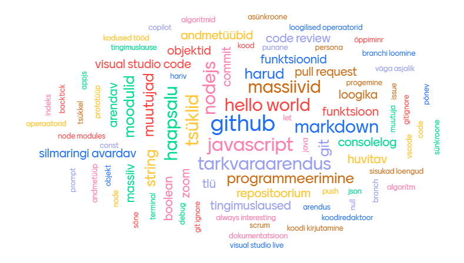

# Kümnes loeng

Viimases loengus teeme kokkuvõtte kursusest, arutleme kogu koolituse üle ja vaatame, kuidas edasi minna.

- [Üheksas loeng](../Lesson-09/README.md)
- [Kümnenda loengu slaidid](Slides.md)
- [Kümnenda loengu salvestus]()
- [Zoomi link](https://zoom.us/j/98412128345?pwd=jNcfZrAJXaJ2m8gJo3Rdlp8poazliv.1)

## Teemad

- Koduste tööde arutelu
- Eelmiste loengute teemade meenutamine (sõnapilv)
- Kuidas hindate oma arengut?
- Kuidas edasi?

## Sõnapilv koolituse märksõnade kohta

