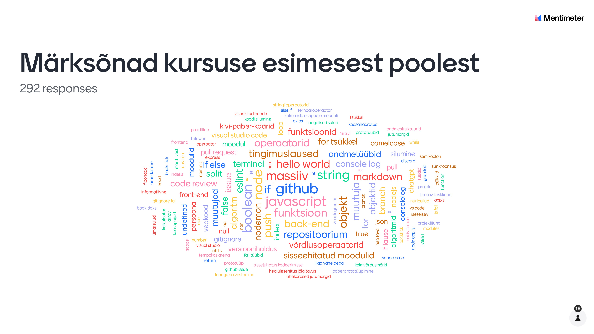

# Kümnes loeng

Viimases loengus teeme kokkuvõtte kursusest, arutleme kogu koolituse üle ja vaatame, kuidas edasi minna.

- [Üheksas loeng](../Lesson-09/README.md)
- [Kümnenda loengu slaidid](Slides.md)
- [Kümnenda loengu salvestus](h)
- [Zoomi link]()

## Teemad

- Koduste tööde arutelu
- Eelmiste loengute teemade meenutamine (sõnapilv)
- Kuidas hindate oma arengut?
- Kuidas edasi?

## Sõnapilv

- [Märksõnade esinemissagedus](Word-Cloud.md)

