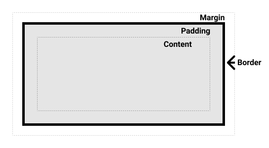

# Veebiarendus

## Front-End arendus

Martti Raavel

<martti.raavel@tlu.ee>

---

## Tänased teemad

- Meenutame eelmist loengut
- Elementide paigutus veebilehel
  - [CSS Display](../../../Subjects/Front-End-Technologies/Topics/CSS-Display/README.md)
  - [CSS Display Flex](../../../Subjects/Front-End-Technologies/Topics/CSS-Display-Flex/README.md)
  - [CSS Box model](../../../Subjects/Front-End-Technologies/Topics/CSS-Box-Model/README.md)
- [Node vs Veebilehitseja](../../../Subjects/Front-End-Technologies/Topics/NodeJS-vs-JS/README.md)
- [Javascript veebilehitsejas](../../../Subjects/Front-End-Technologies/Topics/Javascript-in-Browser/README.md)
  - [Lihtne input ja output](../../../Subjects/Front-End-Technologies/Topics/Primitive-Input-Output/README.md)
- [DOM](../../../Subjects/Front-End-Technologies/Topics/DOM/README.md)
- [JS Sündmused](../../../Subjects/Front-End-Technologies/Topics/Events/README.md)
- [DOM-i manipuleerimine](../../../Subjects/Front-End-Technologies/Topics/Manipulating-DOM/README.md)

---

## Millest rääkisime eelmises loengus?

---

## Elementide paigutus veebilehel

---

## CSS Display

CSS-i `display` omadus määrab, kuidas element dokumentide voos esitatakse. See omadus on väga võimas, kuna see võimaldab kontrollida elementide paigutust ilma HTML-struktuuri muutmata.

Osa veebilehe elemente kasutavad ära terve vaba ruumi laiuse (neile eelneb ja järgneb reavahetus). Selliseid elemente nimetatakse plokielementideks (*block element*), tüüpilisteks näideteks on `<h1>`, `<p>` ja `<div>`.

Osa elemente võtavaid vaid nii palju ruumi kui hädavajalik ning ei too kaasa kohustuslikke reavahetusi, neid nimetatakse reaelementideks (*inline element*). Tüüpilisteks näideteks on `<a>`, `` ja `<span>`.

---

## Peamised Display Väärtused

`display` omadusel on mitmeid väärtusi, kuid siin on mõned enimkasutatavad:

- **`block`**: Muudab elemendi plokielemendiks, mis tähendab, et ta hõivab kogu vanema elemendi laiuse ja algab uuest reast.
- **`inline`**: Muudab elemendi reasisesteks, mis tähendab, et elemendid asetsevad üksteise kõrval samal real, hõivamata rohkem ruumi kui nende sisu.
- **`inline-block`**: Kombineerib `inline` ja `block` omaduste käitumised. Elemendid on reas, kuid saate määrata laiuse ja kõrguse nagu plokielementidel.
- **`none`**: Peidab elemendi dokumentide voost, muutes selle nähtamatuks ja mitte-interaktiivseks.
- **`flex`**: Muudab elemendi paindlikuks konteineriks, mis võimaldab lastelementide paindlikku paigutust.
- **`grid`**: Muudab elemendi ruudustikukonteineriks, mis võimaldab keerukamate paigutuste loomist ruudustiku abil.
- ...

---

## CSS Display Flex

`display: flex` on CSS-i omadus, mis võimaldab luua paindlikke ja kohandatavaid paigutusi HTML-i elementidele. Flexbox modelleerib elementide paigutust rida-realt (või veerg-veerult) ja võimaldab kontrollida nende paigutust, järjekorda, suurust ja vahesid.

---

## Flexbox Omadused

Flexboxi kasutamisel on mitmeid omadusi, mida saate kasutada elementide paigutamiseks. Mõned enimkasutatavad omadused on:

- **`flex-direction`**: Määrab paindliku konteineri põhisuuna - rida/veerg.
- **`justify-content`**: Määrab, kuidas paindliku konteineri lapsed paigutatakse konteineri põhisuunas.
- **`align-items`**: Määrab, kuidas paindliku konteineri lapsed paigutatakse konteineri ristisuunas.
- **`flex-wrap`**: Määrab, kas paindliku konteineri lapsed mahuvad ühte ritta või mitmesse ritta.
- **`flex`**: Määrab, kuidas paindliku konteineri lapsed jagavad ruumi konteineris.
- ...

---

## Flexbox kasutamine - HTML

```html
<div class="container">
    <div class="item">Element 1</div>
    <div class="item">Element 2</div>
    <div class="item">Element 3</div>
</div>
```

---

## Flexbox kasutamine - CSS

Flexboxi kasutamiseks peate määrama elemendi `display` omaduse väärtuseks `flex`. Seejärel saate kasutada teisi omadusi, et kontrollida elementide paigutust.

```css
.container {
    display: flex; /* Muudab elemendi paindlikuks konteineriks */
}

.item {
    flex: 1; /* Iga element võtab ühtviisi jagamata ruumi */
}
```

---

## Flexbox

Oluline on mõista, et samal leheküljel on võimalik kasutada mitmeid jaotusi (konteinereid), mida saab kombineerida vastavalt vajadusele. Näiteks eraldi jaotis menüü loomiseks, eraldi jaotis lehekülje sisu kuvamiseks jne. `display: flex` omaduse abil saad luua paindlikke paigutusi, mis kohanduvad sisu ja ekraani suurusega, pakkudes samal ajal kontrolli elementide paigutuse ja suuruse üle.

---

## CSS Box Model

CSS-i *box model* on viis, kuidas CSS määrab elementide suuruse ja paigutuse. Iga HTML-i element on kast (*box*), millel on sisu (*content*), polsterdus (*padding*), veerised (*margin*) ja välimine raam (*border*).

---

## CSS Box Model - Näide



---

## CSS Box Model - koodinäide

```css
.box {
    width: 350px;
    height: 150px;
    margin: 10px;
    padding: 25px;
    border: 5px solid black;
}
```

---

## CSS Box Model - Standard/Alternatiivne

CSS-is on kaks kastimudelit: standardne ja alternatiivne. Vahe on selles, kuidas arvutatakse elemendi laius ja kõrgus.

---

## Node vs Veebilehitseja

Node.js on serveripoolne JavaScripti keskkond, mis võimaldab JavaScripti käivitada serveris. Veebilehitseja on kliendipoolne keskkond, mis võimaldab JavaScripti käivitada veebilehel.

---

## Javascript veebilehitsejas

Veebilehitsejas töötava Javascript-i eesmärk on muuta veebilehed interaktiivsemaks ja dünaamilisemaks läbi kasutaja tegevuste (sündmuste) reageerimise.

Javascript veebilehitsejas võimaldab jooksvalt muuta veebilehe sisu, stiili ja struktuuri, reageerida kasutaja tegevustele (nt nupuvajutused, hiire liigutused, klaviatuuri sisestused) ja suhelda veebiserveriga (nt andmete saatmine ja vastuvõtmine).

---

## Javascripti koodi lisamine HTML-i

Javascripti koodi saab lisada HTML-i mitmel viisil:

- **Sisemine skript**: Javascripti kood on HTML-i `<script>` elemendi sees.
- **Väline skript**: Javascripti kood on eraldi failis, mida laaditakse HTML-i `<script src="...">` elemendi abil.

---

## Javascripti koodi lisamine HTML-i - HTML-i sees

```html
<!DOCTYPE html>
<html>
<head>
    <title>Javascripti näide</title>
</head>
<body>
    <h1>Tere, maailm!</h1>
    <script>
        alert('Tere, maailm!');
    </script>
</body>
</html>
```

---

## Javascripti koodi lisamine HTML-i - eraldi fail

```js
// script.js
alert('Tere, maailm!');
```

```html
<!DOCTYPE html>
<html>
<head>
    <title>Javascripti näide</title>
    <script src="script.js"></script>
</head>
<body>
    <h1>Tere, maailm!</h1>
</body>
</html>
```

---

## Lihtne input ja output

Veebilehitsejas töötaval Javascript sisaldab mõningaid sisseehitatud funktsioone, mis võimaldavad kasutajalt sisendit saada ja väljundit kuvada.

- **`alert()`**: Kuvab dialoogiboksi, mis sisaldab sõnumit.
- **`prompt()`**: Kuvab dialoogiboksi, mis küsib kasutajalt sisendit.
- **`confirm()`**: Kuvab dialoogiboksi, mis küsib kasutajalt kinnitust.
- **`console.log()`**: Kuvab konsoolis sõnumi.

> NB! `alert()`, `prompt()` ja `confirm()` on modaalaknad, mis peatavad skripti töö seni, kuni kasutaja nendega interakteerub.
>
> Need on funktsioonid, mida saab kasutada testimiseks ja prototüüpimiseks, kuid neid ei soovitata kasutada reaalsetes rakendustes.

---

## DOM

DOM (Document Object Model) on veebilehtede struktuuri ja sisu esitamise viis, mis võimaldab JavaScriptil muuta veebilehe sisu, stiili ja struktuuri.

DOM-i abil saab JavaScript luua, kustutada, muuta ja liigutada HTML-i elemente, atribuute ja tekste. DOM-i kasutamine võimaldab luua dünaamilisi ja interaktiivseid veebilehti, mis reageerivad kasutaja tegevustele.

---

## JS Sündmused

Javascripti sündmused on kasutaja tegevused, mis käivitavad Javascripti koodi. Sündmused võivad olla kasutaja tegevused (nt nupuvajutus, hiire liigutus, klaviatuuri sisestus) või brauseri tegevused (nt lehekülje laadimine, hiire liigutamine).

Javascripti sündmused võimaldavad veebilehel reageerida kasutaja tegevustele ja muuta veebilehe sisu, stiili ja struktuuri vastavalt.

---

## JS Sündmused - Näide

Mõningad sündmused on:

- **`click`**: Käivitatakse, kui kasutaja klõpsab elemendil.
- **`mouseover`**: Käivitatakse, kui kasutaja hiirega elemendi peale liigub.
- **`keydown`**: Käivitatakse, kui kasutaja vajutab klahvi.
- **`load`**: Käivitatakse, kui lehekülg on laetud.
- **`submit`**: Käivitatakse, kui vormi esitatakse.
- ...

---

## DOM-i manipuleerimine

DOM-i manipuleerimine tähendab HTML-i elementide, atribuutide ja teksti muutmist Javascripti abil. DOM-i manipuleerimine võimaldab luua dünaamilisi ja interaktiivseid veebilehti, mis reageerivad kasutaja tegevustele.

DOM-i manipuleerimiseks saate kasutada mitmeid meetodeid, nagu elementide valimine, elementide loomine, elementide kustutamine, elementide muutmine ja sündmuste lisamine.

---

## DOM-i manipuleerimine - Näide

```html
<!DOCTYPE html>
<html>
<head>
    <title>DOM-i manipuleerimine</title>
</head>
<body>
    <h1 id="heading">Tere, maailm!</h1>
    <button id="button">Vaheta teksti</button>
    <script>
        const heading = document.getElementById('heading');
        const button = document.getElementById('button');

        button.addEventListener('click', () => {
            heading.textContent = 'Tere, Javascript!';
        });
    </script>
</body>
</html>
```

---

## Kodune ülesanne

- Loe läbi tänase loengu materjalid
- Korrasta oma loodud Blogi rakenduse välimus kasutades CSS-i `display`, `flex` ja `box model` omadusi
- Lisa oma Blogi lehele Javascripti kood, mille abil saad muuta näiteks pealkirja sisu (eesmärk on harjutada DOM-i manipuleerimist ja sündmuste lisamist)

---

