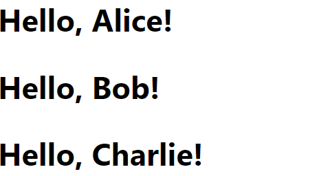

# Veebiarendus

## Front-End arendus

Martti Raavel

<martti.raavel@tlu.ee>

---

## Tänased teemad

- Meenutame eelmist loengut
- [Front-End raamistikud](../../../Subjects/Front-End-Frameworks/Topics/FE-Frameworks/README.md)
- [RactJS](../../../Subjects/Front-End-Frameworks/Topics/React/README.md)
- [React komponendid](../../../Subjects/Front-End-Frameworks/Topics/React-Components/README.md)
- [React props](../../../Subjects/Front-End-Frameworks/Topics/React-Props/README.md)
- [React Bootstrap](../../../Subjects/Front-End-Frameworks/Topics/React-Bootstrap/README.md)
- [React olekuhaldus](../../../Subjects/Front-End-Frameworks/Topics/State-Management/README.md)

---

## Millest rääkisime eelmisel korral?

---

## Front-End raamistikud

JavaScripti front-end raamistikud ja teegid pakuvad tööriistu ja raamistikke, mis lihtsustavad veebirakenduste arendamist. Need raamistikud ja teegid aitavad hallata DOM-i manipuleerimist, sündmuste käsitlemist ja andmehaldust, pakkudes samas struktureeritud lähenemist koodi organiseerimisele.

---

## Populaarsed JavaScripti front-end raamistikud

- React
- Angular
- Vue.js
- Svelte

---

## Front-end raamistikute ja teekide eelised

- **Korduvkasutatavad komponendid:** Komponentidel põhinev arhitektuur võimaldab luua korduvkasutatavaid UI komponente, mis vähendab koodi dubleerimist ja lihtsustab hooldust;
- **Jõudlus:** Virtuaalne DOM ja optimeeritud renderdamisprotsessid parandavad veebirakenduste jõudlust;
- **Modulaarsus:** Raamistikud ja teegid jagavad rakenduse väikesteks, hallatavateks osadeks, mis parandab koodi organiseerimist ja skaleeritavust;
- **Arendusefektiivsus:** Sisseehitatud tööriistad ja funktsioonid, nagu suunamine, andmesidumine ja testimine, kiirendavad arendusprotsessi;

---

## ReactJS

React on populaarne avatud lähtekoodiga JavaScripti teek, mida kasutatakse kasutajaliideste loomiseks. Selle töötas välja Facebook ja see on muutunud üheks enim kasutatavaks tööriistaks tänu oma komponentidel põhinevale arhitektuurile ja jõudlusele. React keskendub komponentide loomisele, mis võimaldavad arendajatel luua korduvkasutatavaid ja isoleeritud UI tükke.

---

## Reactiga seotud mõisted

- Komponendid
- Virtuaalne DOM
- JSX
- Hooks

---

## React komponendid

Reacti põhielemendid, mis võimaldavad arendajatel jagada kasutajaliidese väikesteks, hallatavateks tükkideks.

Veebirakenduses võib olla mitmeid komponente, mis koos moodustavad rakenduse kasutajaliidese. Näiteks võib veebileht koosneda järgmistest komponentidest:

- Pealkiri
- Menüü
- Sisu
- Jalus
- ...

Me võime iga sellise osa eraldi komponendina kirjutada ja seejärel need ühel lehel kokku panna.

---

## React komponendi näide

```jsx
import React from 'react';

function Welcome(props) {
  return <h2>Hello, {props.name}!</h2>;
}

export default Welcome;

```

---

## React komponendi importimine ja kasutamine

```jsx
import React from 'react';

import Welcome from './Welcome';

function App() {
  return (
    <div>
      <Welcome name="Alice" />
      <Welcome name="Bob" />
      <Welcome name="Charlie" />
    </div>
  );
}

export default App;
```

---

## Komponendi kasutamine



---

## Virtuaalne DOM

React kasutab virtuaalset DOM-i, mis on kergversioon tegelikust DOM-ist. See võimaldab Reactil teha efektiivseid uuendusi ja renderdusi, võrreldes muutusi enne tegeliku DOM-i värskendamist.

Näiteks kui komponendi olek muutub, genereerib React uue virtuaalse DOM-i ja võrdleb seda eelmisega, et leida muudatused. Seejärel rakendatakse muudatused tegelikule DOM-ile.

---

## JSX

JavaScripti laiendus, mis võimaldab HTML-i kirjutamist JavaScripti sees. JSX muudab koodi lugemise ja kirjutamise lihtsamaks.

```jsx
const element = <h1>Hello, world!</h1>;
```

JSX-i sees saab kasutada JavaScripti avaldisi ja muutujaid, kasutades loogelisi sulge `{}`.

```jsx
const name = 'Alice';
const element = <h1>Hello, {name}!</h1>;
```

---

## Hooks

Reacti funktsioonid, mis võimaldavad kasutada olekut (*state*) ja muid Reacti omadusi funktsionaalsetes komponentides. Kõige levinumad Hookid on `useState` ja `useEffect`.

Olek on komponendi sisemine seisund, mis võib muutuda ja mõjutada komponendi renderdamist. Olekut võib muuta kasutaja sisend, API päringute vastused jne. Olekut saab hallata Reacti Hookide abil.

---

## React projektiga alustamine

React-iga on võimalik alustada mitut moodi - luua käsitsi projekt, kuhu paigaldada React-iga seotud teegid, või kasutada mõnda tööriista, mis aitab erinevad seadistused ja paigaldused automaatselt teha.

Sellised tööriistad on näiteks:

- [Create React App](https://create-react-app.dev/)
- [Vite](https://vitejs.dev/)
- [Create Next App](https://nextjs.org/docs/api-reference/create-next-app)

---

## Create React App

Create React App on mugav tööriist, mis võimaldab kiiresti seadistada ja käivitada uut React projekti ilma käsitsi konfigureerimata.

---

## Create React App installimine

- Veenduge, et teil on paigaldatud Node.js ja npm
- Avage terminal ja käivitage järgmine käsk:

```bash
npx create-react-app my-app
```

> See käsk loob uue React projekti nimega `my-app`, mis on kohe kasutamiseks valmis.

---

## Create React App käivitamine

- Liikuge oma projekti kausta:

```bash
cd my-app
```

- Käivitage rakendus:

```bash
npm start
```

> See käsk avab teie vaikimisi brauseris uue React rakenduse.

---

## React komponentide tüübid

React komponendid on jagatud kaheks: funktsionaalsed ja klassipõhised komponendid.

---

### Funktsionaalsed komponendid

Funktsionaalsed komponendid on lihtsad JavaScripti funktsioonid, mis võtavad argumentidena propsid ja tagastavad Reacti elemente.

```jsx
import React from 'react';

function Greeting(props) {
  return <h1>Hello, {props.name}!</h1>;
}

export default Greeting;
```

---

### Klassipõhised komponendid

Klassipõhised komponendid on ES6 klassid, mis laiendavad React.Component klassi ja sisaldavad renderdamismeetodit.

```jsx
import React, { Component } from 'react';

class Greeting extends Component {
  render() {
    return <h1>Hello, {this.props.name}!</h1>;
  }
}

export default Greeting;
```

---

## React komponentide eksport ja import

Nagu näha, siis toimub React-is moodulite ja komponentide eksportimine ja importimine kasutades `export default` ja `import` võtmesõnu, erinevalt sellest, kuidas me varasemalt oleme seda Node.js-is teinud.

---

## Andmete edastamine komponentidele

Andmete edastamine komponentidele toimub propside abil. Propsid on komponendi parameetrid, mis võimaldavad andmete edastamist vanemkomponentidelt lapskomponentidele.

---

## Propside kasutamine

Propsid edastatakse komponentidele sarnaselt HTML atribuutidega. Allpool on näide, kuidas kasutada propsid funktsionaalses komponendis.

---

### Propside kasutamine - User.js

```jsx
import React from 'react';

function User(props) {
  return <div>
    <p>Name: {props.name}</p>
    <p>Age: {props.age}</p>
  </div>;
}
```

---

### Propside kasutamine - Users.js

```jsx
import React from 'react';
import User from './User';

const users = [
  { name: 'John', age: 20 },
  { name: 'Jill', age: 30 },
  { name: 'Peter', age: 40 },
];

function Users() {
  return <div>
    {users.map(user => <User name={user.name} age={user.age} />)}
  </div>
}

export default Users;
```

---

### Propside kasutamine - App.js

```jsx
import React from 'react';
import Users from './Users';

function App() {
  return <Users />;
}

export default App;
```

---

## React komponentide stiilimine

React komponentide stiilimiseks on mitmeid võimalusi, näiteks:

- Inline stiilid
- CSS-failid
- CSS raamistikud

---

## Inline stiilid

Inline stiilid on stiilide määratlemine otse JSX-i sees, kasutades JavaScripti objekti.

```jsx
const divStyle = {
  color: 'blue',
  backgroundColor: 'lightgray',
};

function App() {
  return <div style={divStyle}>Hello, world!</div>;
}
```

> JSX-i sees Javascripti avaldiste ja muutujate kasutamiseks tuleb kasutada loogelisi sulge: `{}`.
>
> Pane tähele, et stiilide nimed on kirjutatud camelCase formaadis, kuna tegemist on JavaScripti objektiga.

---

## Inline stiil objektina otse JSX-i sees

```jsx
function App() {
  return <div style={{ color: 'blue', backgroundColor: 'lightgray' }}>Hello, world!</div>;
}
```

---

## CSS failid

CSS-failide abil saame stiilida komponente eraldi CSS-failides ja seejärel importida neid komponentidesse.

```css
.welcome {
  border: 1px solid black;
  margin: 10px;
  background-color: lightgray;
}
```

```jsx
import React from 'react';
import './styles.css';

function Welcome(props) {
  return <h2 className="welcome">Hello, {props.name}!</h2>;
}

export default Welcome;
```

---

### CSS raamistikud

Loomulikult on võimalik kasutada ka CSS raamistikke, nagu Bootstrap, Material-UI, Tailwind CSS jne.

React-is CSS-raamistike kasutamine nõuab raamistiku paigaldamist ja selle komponentide importimist.

---

## React Bootstrap

React Bootstrap on populaarne Bootstrapi raamistiku Reacti jaoks loodud versioon, mis pakub korduvkasutatavaid komponente ja stiile.

---

## React Bootstrap installimine

- Installi Bootstrap ja React Bootstrap npm-i kaudu:

```bash
npm install bootstrap react-bootstrap
```

- Importi Bootstrap CSS oma `index.js` või `App.js` faili:

```javascript
import 'bootstrap/dist/css/bootstrap.min.css';
```

---

## React Bootstrap komponentide kasutamine

Kui lihtsalt HTML-is kasutatakse Bootstrap-i klassinimesid, siis React Bootstrap kasutab komponente.

```jsx
import React from 'react';

import { Button } from 'react-bootstrap';

function App() {
  return (
    <div className="App">
      <Button variant="primary">Primary Button</Button>
    </div>
  );
}

export default App;
```

---

## Container, Row ja Col komponendid

```jsx
import React from 'react';
import { Container, Row, Col } from 'react-bootstrap';

function App() {
  return (
    <Container>
      <Row>
        <Col>1 of 2</Col>
        <Col>2 of 2</Col>
      </Row>
    </Container>
  );
}

export default App;
```

---

## Veeru laiuse määramine

Veeru laiuse määramise jaoks kasutame `xs`, `sm`, `md`, `lg` ja `xl` atribuute.

`xs` - Extra small, ehk väga väike ekraan
`sm` - Small, ehk väike ekraan
`md` - Medium, ehk keskmine ekraan
`lg` - Large, ehk suur ekraan
`xl` - Extra large, ehk väga suur ekraan

```jsx
<Col xs={6}>1 of 2</Col>
<Col xs={6}>2 of 2</Col>
```

---

## React-i olekuhaldus

React-i olekuhaldus on protsess, kus haldame komponendi olekut ja uuendame seda vastavalt vajadusele. Olekuhaldus on oluline, kui soovime, et komponendi olek muutuks kasutaja tegevuse või muude sündmuste tõttu.

---

## Olek (*state*)

Olek on objekti kujul andmete kogum, mis on komponendi privaatne ja mida saab muuta ainult seesama komponent. Olek määrab, kuidas komponent käitub ja mida see renderdab.

---

## `useState` hook

`useState` on Reacti hook, mis võimaldab funktsionaalsetes komponentides olekut hallata. See tagastab massiivi, mis sisaldab kahte elementi: praegust oleku väärtust ja funktsiooni, mis võimaldab olekut uuendada.

---

## `useState` hooki kasutamine

```jsx
import React, { useState } from 'react';

function Counter() {
  const [count, setCount] = useState(0); // Oleku väärtus on 0

  return (
    <div>
      <p>You clicked {count} times</p>
      <button onClick={() => setCount(count + 1)}>
        Click me
      </button>
    </div>
  );
}

export default Counter;
```

---

## Kodune töö
