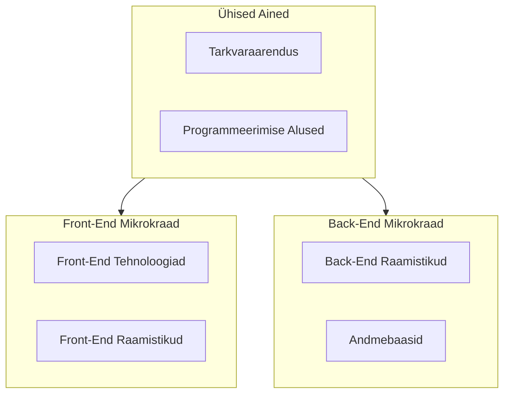

# Veebiarenduse mikrokraadid

See repositoorium sisaldab järgmiseid Veebiarenduse mikrokraade:

- [Front-End arendus](./FE)
- [Back-End arendus](./BE)

Repositooriumi ülesehitus on järgmine:

- [`Subjects`](./Subjects/) kaust sisaldab kõikide õppeainete õppematerjale
- [`Lessons`](./Lessons/) kaust sisaldab loengute nimekirja, slaide ja viiteid õppematerjalidele
  - [`Common-Lessons`](./Lessons/Common-Lessons/) kaust sisaldab ühiseid loenguid (tarkvaraarendus, programmeerimise alused)
  - [`Front-End`](./Lessons/Front-End/) kaust sisaldab Front-End arenduse loenguid
  - [`Back-End`](./Lessons/Back-End/) kaust sisaldab Back-End arenduse loenguid
- [`Subjects`](./Subjects/) kaustas on iga mikrokraadi õppeained eraldi kaustades õppeainete kaupa
  - Ühised ained
    - [`Software-Development`](./Subjects/Software-Development/) kaust sisaldab tarkvaraarenduse õppeaine materjale
    - [`Programming-Basics`](./Subjects/Programming-Basics/) kaust sisaldab programmeerimise aluste õppeaine materjale
  - Front-End arendus
    - [`Front-End-Technologies`](./Subjects/Front-End-Technologies/) kaust sisaldab Front-End arenduse õppeaine materjale
    - [`Front-End-Frameworks`](./Subjects/Front-End-Frameworks/) kaust sisaldab Front-End raamistike õppeaine materjale
  - Back-End arendus
    - [`Back-End-Technologies`](./Subjects/Back-End-Technologies/) kaust sisaldab Back-End arenduse õppeaine materjale
    - [`Back-End-Frameworks`](./Subjects/Back-End-Frameworks/) kaust sisaldab Back-End raamistike õppeaine materjale
    - [`Databases`](./Subjects/Databases/) kaust sisaldab andmebaaside õppeaine materjale

Mikrokraadid on arendatud välja rahvusvahelise Erasmus projekti `2022-2-EE01-KA220-HED-000100317` raames.

## 2025. RKT Tarkvaraarenduse koolitus

Koolituse eesmärk on omandada terviklik arusaam nii tarkvaraarenduse kui ka programmeerimise ja versioonihalduse olemusest, põhimõtetest, meetoditest ja kasutatavatest tööriistadest. Koolituse jooksul kasutame materjale, mis on loodud Veebiarenduse mikrokraadide jaoks, kuid läbime neist ainult ühised ained - [tarkvaraarenduse](./Subjects/Software-Development/README.md) ja [programmeerimise alused](./Subjects/Programming-Basics/README.md). Soovi korral võivad osalejad läbida omal käel ka teised moodulid, mis on saadaval siin repositooriumis.

**Sihtgrupp**:

- IKT valdkonna töötajad, kes vajavad oma igapäevatöös teadmisi tarkvaaraarendusest ja programmeerimisest;
- täiskasvanud kes soovivad alustada karjääri IKT valdkonnas;
- IKT valdkonna töötajad kelle on aegunud erialased oskused.

**Eeldused**:

- elementaarsed arvutioskused;
- huvi programmeerimise ja tarkvaraarenduse vastu.

> Eelnev programmeerimisega kokkupuude pole vajalik.

**Koolituse maht (loengud + iseseisev töö)**: 8 EAP (8 x 26 tundi)

> 2024\. a RKT koolituse raames proovime lähenemist, kus õpilased loevad enne loengusse tulekut iseseisvalt vastava loengu materjalid läbi ja loengus keskendume praktilistele ülesannetele ja küsimustele.

## Ajakava ja viited loengutele

- [1. kohtumine](./Lessons/Common-Lessons/Lesson-01/README.md) (Haapsalus): 01.10.2024 kell 10:00 - 16:30
- [2. kohtumine](./Lessons/Common-Lessons/Lesson-02/README.md) ([Zoom]()): 08.10.2024 kell 10 - 15:00
- [3. kohtumine](./Lessons/Common-Lessons/Lesson-03/README.md) (Haapsalus): 15.10.2024 kell 10:00 - 16:30
- [4. kohtumine](./Lessons/Common-Lessons/Lesson-04/README.md) ([Zoom]()): 22.10.2024 kell 10 - 15:00
- [5. kohtumine](./Lessons/Common-Lessons/Lesson-05/README.md) (Haapsalus): 29.10.2024 kell 10:00 - 16:30
- [6. kohtumine](./Lessons/Common-Lessons/Lesson-06/README.md) ([Zoom]()): 05.11.2024 kell 10 - 15:00
- [7. kohtumine](./Lessons/Common-Lessons/Lesson-07/README.md) (Haapsalus): 12.11.2024 kell 10:00 - 16:30
- [8. kohtumine](./Lessons/Common-Lessons/Lesson-08/README.md) ([Zoom]()): 19.11.2024 kell 10 - 15:00
- [9. kohtumine](./Lessons/Common-Lessons/Lesson-09/README.md) (Haapsalus): 26.11.2024 kell 10:00 - 16:30
- [10. kohtumine](./Lessons/Common-Lessons/Lesson-10/README.md) ([Zoom]()): 03.12.2024 kell 10 - 15:00

## Discordi serveri kutse

Discordi server on mõeldud otsesuhtluseks õpetajate ja õpilaste vahel. Samuti saab seal omavahel suhelda, küsida abi ja jagada oma kogemusi.

- [Kutse link](https://discord.gg/7N5CcVhUv3)

## Mikrokraadide Struktuur

## Õpijuhend

Õppematerjalide läbitöötamine toimub loengute ja iseseisva tööna. Õppematerjalid, slaidid, harjutused ja iseseisvad tööd on saadaval repositooriumis vastavates kaustades.

Õppematerjale tuleks läbida vastavalt loengutele, kus on kirjeldatud teemad, nende järjekord ja viited õppematerjalidele.

Peale loenguid jääb õppijale iseseisev töö, kus tuleb läbi töötada õppematerjalid ja lahendada ülesandeid. Kohtumistel annab õpetaja tagasisidet, vastab küsimustele ja aitab lahendada tekkinud probleeme.
