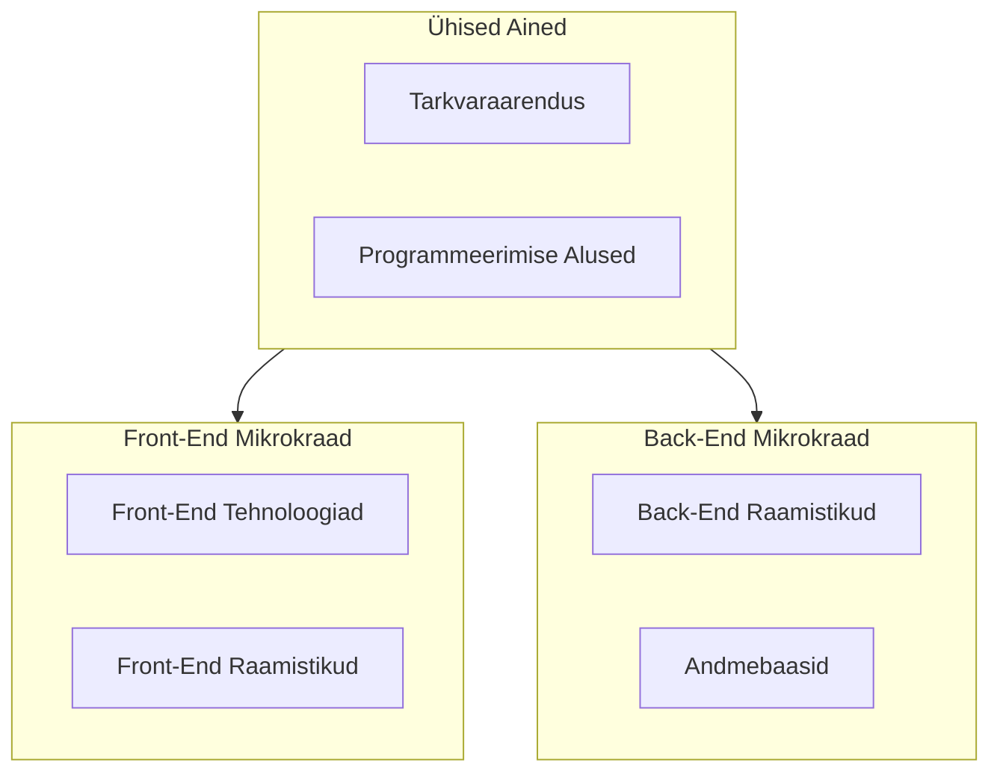

# Veebiarenduse mikrokraadid

See repositoorium sisaldab järgmiseid Veebiarenduse mikrokraade:

- [Front-End arendus](./FE)
- [Back-End arendus](./BE)

Mikrokraadid on arendatud välja rahvusvahelise Erasmus projekti raames.

## 2024. aasta pilootprogrammi kuupäevad

### Ühised ained

- [1. kohtumine](./Lessons/Common-Lessons/Lesson-01/README.md) (Haapsalus): 12.02.2024 kell 10:00 - 17:30
- [2. kohtumine](./Lessons/Common-Lessons/Lesson-02/README.md) ([Zoom](https://zoom.us/j/94501316239?pwd=MUE3VGpMcVZOTmU3ZHRQRkFsUFYwQT09)): 19.02.2024 kell 10 - 13:15
- [3. kohtumine](./Lessons/Common-Lessons/Lesson-03/README.md) (Haapsalus): 26.02.2024 kell 10:00 - 17:30
- [4. kohtumine](./Lessons/Common-Lessons/Lesson-04/README.md)  ([Zoom](https://zoom.us/j/94501316239?pwd=MUE3VGpMcVZOTmU3ZHRQRkFsUFYwQT09)): 04.03.2024 kell 10 - 13:15
- [5. kohtumine](./Lessons/Common-Lessons/Lesson-05/README.md) (Haapsalus): 11.03.2024 kell 10:00 - 17:30
- [6. kohtumine](./Lessons/Common-Lessons/Lesson-06/README.md) ([Zoom](https://zoom.us/j/94501316239?pwd=MUE3VGpMcVZOTmU3ZHRQRkFsUFYwQT09)): 18.03.2024 kell 10 - 13:15
- [7. kohtumine](./Lessons/Common-Lessons/Lesson-07/README.md) (Haapsalus): 25.03.2024 kell 10:00 - 17:30
- [8. kohtumine](./Lessons/Common-Lessons/Lesson-08/README.md) ([Zoom](https://zoom.us/j/94501316239?pwd=MUE3VGpMcVZOTmU3ZHRQRkFsUFYwQT09)): 01.04.2024 kell 10 - 13:15
- [9. kohtumine](./Lessons/Common-Lessons/Lesson-09/README.md) (Haapsalus): 08.04.2024 kell 10:00 - 17:30
- [10. kohtumine](./Lessons/Common-Lessons/Lesson-10/README.md) ([Zoom](https://zoom.us/j/94501316239?pwd=MUE3VGpMcVZOTmU3ZHRQRkFsUFYwQT09)): 15.04.2024 kell 10 - 13:15

### Front-End arenduse kohtumised

- [1. kohtumine](./Lessons/Front-End/Lesson-01/README.md) 30.04.2024 kell 10:00 - 13:15 ([Zoom](https://zoom.us/j/94501316239?pwd=MUE3VGpMcVZOTmU3ZHRQRkFsUFYwQT09))
- [2. kohtumine](./Lessons/Front-End/Lesson-02/README.md) 07.05.2024 kell 10:00 - 17:30
- [3. kohtumine](./Lessons/Front-End/Lesson-03/README.md) 14.05.2024 kell 10:00 - 13:15 ([Zoom](https://zoom.us/j/94501316239?pwd=MUE3VGpMcVZOTmU3ZHRQRkFsUFYwQT09))
- [4. kohtumine](./Lessons/Front-End/Lesson-04/README.md) 21.05.2024 kell 10:00 - 17:30
- [5. kohtumine](./Lessons/Front-End/Lesson-05/README.md) 28.05.2024 kell 10:00 - 13:15 ([Zoom](https://zoom.us/j/94501316239?pwd=MUE3VGpMcVZOTmU3ZHRQRkFsUFYwQT09))
- [6. kohtumine](./Lessons/Front-End/Lesson-06/README.md) 04.06.2024 kell 10:00 - 17:30
- [7. kohtumine](./Lessons/Front-End/Lesson-07/README.md) 11.06.2024 kell 10:00 - 13:15 ([Zoom](https://zoom.us/j/94501316239?pwd=MUE3VGpMcVZOTmU3ZHRQRkFsUFYwQT09))
- [8. kohtumine](./Lessons/Front-End/Lesson-08/README.md) 18.06.2024 kell 10:00 - 17:30
- [9. kohtumine](./Lessons/Front-End/Lesson-09/README.md) 02.07.2024 kell 10:00 - 13:15 ([Zoom](https://zoom.us/j/94501316239?pwd=MUE3VGpMcVZOTmU3ZHRQRkFsUFYwQT09))
- [10. kohtumine](./Lessons/Front-End/Lesson-10/README.md) 09.07.2024 kell 10:00 - 17:30

### Back-End arenduse kohtumised

- [1. kohtumine](./Lessons/Back-End/Lesson-01/README.md) 29.04.2024 kell 10:00 - 17:30
- [2. kohtumine](./Lessons/Back-End/Lesson-02/README.md) 06.05.2024 kell 10:00 - 13:15 ([Zoom](https://zoom.us/j/94501316239?pwd=MUE3VGpMcVZOTmU3ZHRQRkFsUFYwQT09))
- [3. kohtumine](./Lessons/Back-End/Lesson-03/README.md) 13.05.2024 kell 10:00 - 17:30
- [4. kohtumine](./Lessons/Back-End/Lesson-04/README.md) 20.05.2024 kell 10:00 - 13:15 ([Zoom](https://zoom.us/j/94501316239?pwd=MUE3VGpMcVZOTmU3ZHRQRkFsUFYwQT09))
- [5. kohtumine](./Lessons/Back-End/Lesson-05/README.md) 27.05.2024 kell 10:00 - 17:30
- [6. kohtumine](./Lessons/Back-End/Lesson-06/README.md) 03.06.2024 kell 10:00 - 13:15 ([Zoom](https://zoom.us/j/94501316239?pwd=MUE3VGpMcVZOTmU3ZHRQRkFsUFYwQT09))
- [7. kohtumine](./Lessons/Back-End/Lesson-07/README.md) 10.06.2024 kell 10:00 - 17:30
- [8. kohtumine](./Lessons/Back-End/Lesson-08/README.md) 17.06.2024 kell 10:00 - 13:15 ([Zoom](https://zoom.us/j/94501316239?pwd=MUE3VGpMcVZOTmU3ZHRQRkFsUFYwQT09))
- [9. kohtumine](./Lessons/Back-End/Lesson-09/README.md) 01.07.2024 kell 10:00 - 17:30
- [10. kohtumine](./Lessons/Back-End/Lesson-10/README.md) 08.07.2024 kell 10:00 - 13:15 ([Zoom](https://zoom.us/j/94501316239?pwd=MUE3VGpMcVZOTmU3ZHRQRkFsUFYwQT09))

## Discordi serveri kutse

Discordi server on mõeldud otsesuhtluseks õpetajate ja õpilaste vahel. Samuti saab seal omavahel suhelda, küsida abi ja jagada oma kogemusi.

- [Kutse link](https://discord.gg/7N5CcVhUv3)

## Zoomi link online kohtumiste jaoks

- [Zoomi link](https://zoom.us/j/94501316239?pwd=MUE3VGpMcVZOTmU3ZHRQRkFsUFYwQT09)

## Mikrokraadide Struktuur

## Õpijuhend

Õppematerjalide läbitöötamine toimub loengute ja iseseisva tööna. Õppematerjalid, slaidid jms on saadaval repositooriumis vastavates kaustades.

Õppematerjale tuleks läbida vastavalt loengutele, kus on kirjeldatud teemad, nende järjekord ja viited õppematerjalidele.

Peale loenguid jääb õppijale iseseisev töö, kus tuleb läbi töötada õppematerjalid ja lahendada ülesandeid. Kohtumistel annab õpetaja tagasisidet, vastab küsimustele ja aitab lahendada tekkinud probleeme.
