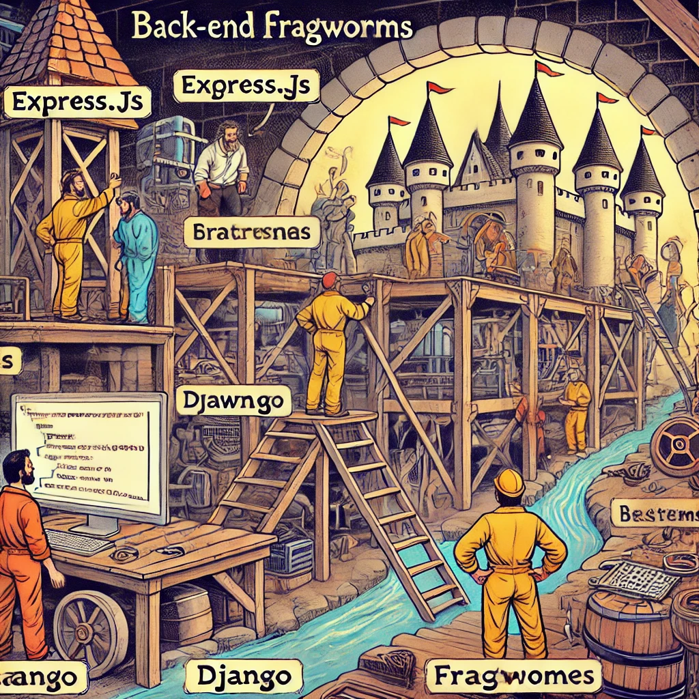

# Back-End raamistikud

Pildi allikas: Dall-E by OpenAI

Back-End raamistikud pakuvad süvitsi minevat uurimist tänapäeva serveripoolse rakenduse arendamise meetoditest, tööriistadest ja parimatest praktikatest. Õppurid sukelduvad põhilistesse kontseptsioonidesse nagu marsruutimine, vahevara (_middleware_), autentimine ja andmebaasioperatsioonid. Kursuse vältel osalevad õpilased praktilistes projektides, luues jõudluspõhiseid ja turvalisi rakendusi, mis on valmis reaalsetes stsenaariumides kasutamiseks. See teekond tutvustab neile ka ulatuslikku tööriistade komplekti ja ökosüsteemi, mis on omased kaasaegsele tagarakenduste arendusele.

## Kirjeldus

- **Maht**: 4 EAP (4 x 26 tundi)
- **Õppeaine eesmärgid**: õppeaine eesmärk on arendada õppurite oskusi kasutada kaasaegseid tagarakenduste raamistikke, et arendada vastupidavaid, skaleeritavaid ja turvalisi serveripoolseid rakendusi.

Kursuse lõpuks peaksid õppurid olema osavad serveri arhitektuuri põhimõtetes, API arenduses, andmebaaside integreerimises ja laiemas ökosüsteemis, mis on seotud kaasaegse tagarakenduste arendusega.

## Õpiväljundid

Selle aine läbinud õpilane:

- loob CRUD API kasutades Express.js raamistikku;
- kasutab Express vahevara kontrollimaks päringu/vastuse tsüklit;
- kasutab loodud API andmete talletamiseks andmebaasi;
- kasutab API kasutajate õiguste ja ligipääsu kontrollimiseks autentimist ja autoriseerimist.

## Teemad

- Sissejuhatus
- [Tööriistad](./Topics/Tools/README.md)
- [API](./Topics/API/README.md)
- [HTTP](./Topics/HTTP/README.md)
- [HTTP meetodid](./Topics/HTTP-Methods/README.md)
- [Express](./Topics/Express/README.md)
- [Struktureerimine](./Topics/Structuring/README.md)
- [Andmete saatmine API-sse](./Topics/Sending-Data-To-Express/README.md)
- [Vahevara](./Topics/Middleware/README.md)
- [Express Router](./Topics/Routes/README.md)
- [Autentimine ja autoriseerimine](./Topics/Auth/README.md)
- [Bcrypt](./Topics/Bcrypt/README.md)
- [JWT](./Topics/JWT/README.md)
- [Andmete saatmine Express API-le - Header](./Topics/Sending-Data-To-Express/README.md#header)
- [Automaattestimine](./Topics/Testing-Node-API/README.md)
- [Veahaldus](./Topics/Error-Handling/README.md)
- [Logimine](./Topics/Logging/README.md)

## Loengud (esialgne plaan, mis võib muutuda kursuse jooksul)

### Esimene loeng: Sissejuhatus Back-End raamistikesse

Maht: 8 tundi.

- Sissejuhatus
- [Tööriistad](./Topics/Tools/README.md)
- [API](./Topics/API/README.md)
- [HTTP](./Topics/HTTP/README.md)
- [Http meetodid](./Topics/HTTP-Methods/README.md)
- [Express](./Topics/Express/README.md)
- [Struktureerimine](./Topics/Structuring/README.md)

### Teine loeng (Zoom): Andmete saatmine API-sse

Maht: 4 tundi.

- Meenutame eelmist loengut
- [Struktureerimine](./Topics/Structuring/README.md) - Kontrollerid
- [Andmete saatmine API-sse](./Topics/Sending-Data-To-Express/README.md)
  - Query string
  - Body
- API tööriistade kasutamine
  - Thunder Client

### Kolmas loeng: Kordamine

Maht: 8 tundi.

- Meenutame eelmist loengut
- Kordamine
  - Struktureerimine
  - Andmete saatmine API-sse

### Neljas loeng (Zoom): Vahevara

Maht: 4 tundi.

- Meenutame eelmist loengut
- [Vahevara](./Topics/Middleware/README.md)
- [Express Router](./Topics/Routes/README.md)

### Viies loeng: Autentimine ja autoriseerimine

Maht: 8 tundi.

- Meenutame eelmist loengut
- [Autentimine ja autoriseerimine](./Topics/Auth/README.md)
- [Bcrypt](./Topics/Bcrypt/README.md)
- [JWT](./Topics/JWT/README.md)
- [Andmete saatmine Express API-le - Header](./Topics/Sending-Data-To-Express/README.md#header)
- Autentimise ja autoriseerimise rakendamine
