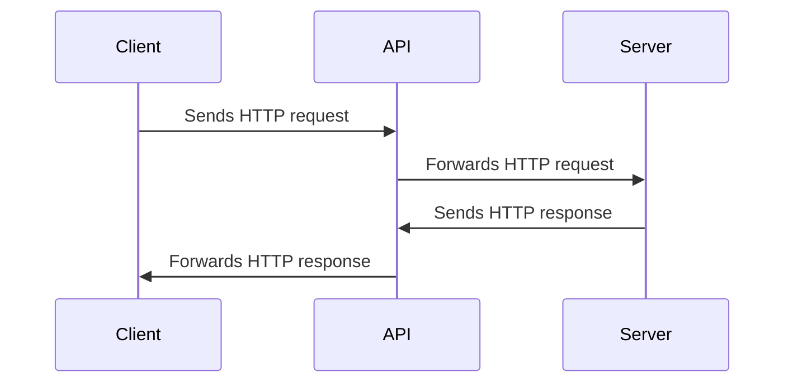

# API - Application Programming Interface

Selle kursuse kontekstis on mõeldud üle HTTP protokolli töötavat API-t, ehk Veebi API-t (Web API).

Veebi API tähistab veebirakenduste programmeerimisliidest. See on protokollide, tööriistade ja mehhanismide kogum veebipõhiste rakenduste loomiseks, mis saavad üksteisega Interneti kaudu suhelda.

Veebi API-dele pääseb tavaliselt juurde `HTTP` päringute ja vastuste abil ning need võimaldavad veebipõhistel rakendustel suhelda teiste rakenduste pakutavate andmete ja teenustega, sageli erinevates serverites või erinevates kohtades üle maailma.



## Veebi API-sid on mitut tüüpi, sealhulgas:

- **RESTful API-d**: *Representational State Transfer* (REST) on populaarne arhitektuuristiil veebi API-de loomiseks, mis kasutavad andmete toomiseks ja töötlemiseks HTTP-päringuid. RESTful API-d on loodud skaleeritavateks, töökindlateks ja hõlpsasti kasutatavateks.
- **SOAP API-d**: *Simple Object Access Protocol* (SOAP) on teine populaarne protokoll veebi API-de loomiseks, mis kasutavad andmete vahetamiseks XML-põhiseid sõnumeid. SOAP API-sid kasutatakse sageli ettevõtte tasemel rakendustes, mis nõuavad keerukat sõnumivahetust ja tehingute tuge.
- **GraphQL API-d**: *GraphQL* on suhteliselt uus tehnoloogia veebi API-de loomiseks, mis võimaldab klientidel nõuda ainult neid andmeid, mida nad vajavad, selle asemel et hankida terveid ressursse. GraphQL API-sid kasutatakse sageli kaasaegsetes veebi- ja mobiilirakendustes, mis nõuavad tõhusat andmete otsimist ja töötlemist.

Veebi API-d on kaasaegse veebiarenduse olulised komponendid ning võimaldavad arendajatel luua keerulisi ja funktsioonirikkaid rakendusi, kasutades ära Interneti võimsust ja globaalse arendajakogukonna kollektiivseid ressursse.

## API ressurss

Veebi API-de kontekstis on ressurss mis tahes andmeosa või funktsionaalsus, millele saab Interneti kaudu juurde pääseda või mida saab URI (ühtne ressursiidentifikaator) ja HTTP-päringuid kasutades manipuleerida.

Ressurss võib olla ükskõik milline ühest andmeüksusest (nt kliendikirje andmebaasis) kuni seotud üksuste koguni, näiteks veebipoe toodete loendini. Ressursid võivad sisaldada ka keerukamaid funktsioone, näiteks otsingumootorit või makselüüsi.

RESTful API-s esitatakse ressursid URI-s tavaliselt nimisõnadena ja nende ressurssidega toimingute tegemiseks kasutatakse HTTP-meetodeid (GET, POST, PUT, DELETE jne). Näiteks võivad tüüpilisel RESTful API-l olla sellised URI-d nagu:

- `/customers`
- `/customers/123`
- `/orders/456`
- `/products/search?q=keyword`

Selles näites esindab esimene URI klientide kogumit, teine URI konkreetset klienti ID-ga 123, kolmas URI konkreetset tellimust ID-ga 456 ja neljas URI esindab otsingupäringut toodete kohta, mis vastavad märksõna "märksõna".

Ressursse ja URI-d selgelt ja järjepidevalt määratledes võivad veebi API-d pakkuda lihtsat ja intuitiivset liidest andmetele ja funktsioonidele Interneti kaudu juurdepääsuks. See muudab arendajatel lihtsamaks veebipõhiste rakenduste loomise, mis suudavad suhelda teiste süsteemide ja teenustega, olenemata nende asukohast või rakendamise üksikasjadest.

Valikut tasuta kasutatavatest veebi API-dest näeb näiteks siit: https://github.com/public-apis/public-apis

## API vastus

Tüüpiliselt tagastab veebi API päringu vastuseks andmed, mis on esitatud JSON-i (JavaScripti objekti märkide) või XML-i (Extensible Markup Language) kujul. JSON on muutunud veebi API-de standardvastuse vorminguks, kuna see on kerge ja lihtne lugeda ja kirjutada. XML-i kasutatakse endiselt mõnes veebi API-s, eriti SOAP API-des, kuid see on JSON-i kõrval vähem levinud.

Veebi API vastus võib sisaldada ka muid andmeid, näiteks päringu olekut, veateateid, metaandmeid ja muid kasulikke teavet. Näiteks võib veebi API vastus sisaldada HTTP olekukoodi, mis näitab, kas päring õnnestus või mitte, ja veateadet, mis selgitab, miks päring ebaõnnestus.

Veebi API vastus võib sisaldada ka metaandmeid, mis kirjeldavad andmeid, mida API tagastab, näiteks andmete tüüpi, vormingut ja struktuuri. See võib olla kasulik, kui veebi API tagastab andmeid, millel on keeruline struktuur, näiteks andmeid, mis on seotud teiste andmetega.

Tüüpiline API vastus võib näiteks välja näha selline:

```json
{
  "status": 200,
  "message": "OK",
  "data": {
    "id": 123,
    "name": "John Smith",
    "email": "john@smith.com",
    "phone": "555-123-4567"
  }
}
```

Selles näites on veebi API vastus JSON-i objekt, mis sisaldab kolme võtme-väärtuse paari. Esimene võtme-väärtuse paar sisaldab päringu olekut. Teine võtme-väärtuse paar sisaldab teadet päringu kohta. Kolmas võtme-väärtuse paar sisaldab andmeid, mis on päringu tulemus.

Kui API vastus sisaldab nimekirja andmetest, näiteks kliendikirjete loendit, võib see välja näha selline:

```json
{
  "status": 200,
  "message": "OK",
  "data": [
    {
      "id": 123,
      "name": "John Smith",
      "email": "john@smith.com",
      "phone": "555-123-4567"
    },
    {
      "id": 456,
      "name": "Jane Doe",
      "email": "jane@doe.com",
      "phone": "555-987-6543"
    }
  ]
}
```

## CRUD API

`CRUD` on akronüüm, mis tähistab nelja põhitoimingut, mida saab teha andmetega: **Create**, **Read**, **Update** ja **Delete**. Need on ka põhitoimingud, mida saab teha veebi API-dega.

- **Create** - loob uue andmekirje
- **Read** - loeb olemasoleva andmekirje
- **Update** - uuendab olemasolevat andmekirjet
- **Delete** - kustutab olemasoleva andmekirje

Sageli käivad need toimingud käsikäes HTTP meetoditega, millega neid toiminguid teostatakse:

- **Create** - kasutab HTTP POST-meetodit
- **Read** - kasutab HTTP GET-meetodit
- **Update** - kasutab HTTP PUT- või PATCH-meetodit
- **Delete** - kasutab HTTP DELETE-meetodit