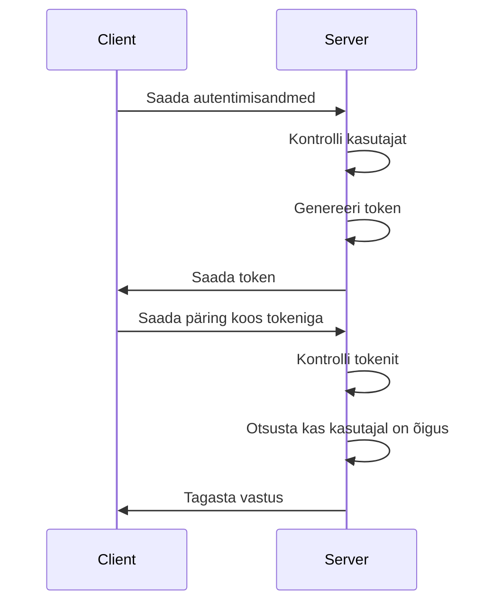

# Autentimine ja Autoriseerimine

Selles peatükis käsitleme autentimise ja autoriseerimise mõisteid ning protsessi. Autentimine on protsess, millega kasutaja tuvastab ennast süsteemis, samas kui autoriseerimine on protsess, millega määratakse kindlaks, milliseid toiminguid kasutaja saab teha.

Pildi allikas: Dall-E by OpenAI

- [Autentimine ja Autoriseerimine](#autentimine-ja-autoriseerimine)
  - [Õpiväljundid](#õpiväljundid)
  - [Autentimine](#autentimine)
  - [Autoriseerimine](#autoriseerimine)
  - [Autentimine ja autoriseerimine üldiselt](#autentimine-ja-autoriseerimine-üldiselt)
  - [Autentimise ja autoriseerimise protsess Front-End rakenduses](#autentimise-ja-autoriseerimise-protsess-front-end-rakenduses)
  - [Autentimise ja autoriseerimise protsess Back-End rakenduses](#autentimise-ja-autoriseerimise-protsess-back-end-rakenduses)

## Õpiväljundid

Selle peatüki lõpuks peaksid õppijad olema võimelised:

- selgitama autentimise ja autoriseerimise mõisteid;
- selgitama autentimise ja autoriseerimise protsessi.

## Autentimine

Autentimine on protsess, millega üks kasutaja, süsteem või muu olem (objekt) saab kontrollida teise olemi väidetava identiteedi tõesust, tavaliselt mingit tüüpi identsustõendi alusel:

- miski, mida Sa tead  (näiteks parool, PIN-kood, robotilõks, turvaküsimus);
- miski, mis Sul on (näiteks ID-kaart, pangakaart, telefoni number, e-mail, riistvarapääsmik, paroolikaart, sertifikaat) või
- miski, mis Sa oled (sõrmejälg, näo pilt või topograafia, iirise struktuur, ...).

## Autoriseerimine

`Autoriseerimine` ehk volitamine on protsess, mis annab (või keelab) õiguse ligi pääseda (võrgu)ressurssidele. Näiteks enamik e-kaubanduse turvasüsteeme põhineb kaheastmelisel protsessil. Esiteks toimub `autentimine`, kus kontrollitakse, et kasutaja on tõesti see, kellena ta esineb, seejärel toimub `autoriseerimine`, mis lubab kasutajal juurde pääseda temale ette nähtud ressurssidele.

[Allikas](https://sisu.ut.ee/autentimine/m%C3%B5isted)

## Autentimine ja autoriseerimine üldiselt

Kui meil on rakendus või API, millel on erinevad kasutajad, siis tõenäoliselt on meil vaja ka neile kasutajatele määrata erinevaid rolle. Näiteks on tõenäoliselt vaja API-le eraldi administraatori rollis kasutajat, kes saaks vajadusel teha muudatusi kasutajate andmetes või muudes süsteemi seadetes, mida tavakasutaja teha ei tohiks.

Kasutaja autentimise protsess on tavaliselt järgmine:

1. Kasutaja saadab oma autentimisandmed (nt kasutajanimi ja parool) serverile.
2. Server kontrollib, kas antud kasutajanimi ja parool on õiged.
3. Samuti kontrollitakse, millised õigused kasutajal on (nt kasutaja, administraator jne).
4. Kui autentimine on edukas, genereeritakse kasutajale token, mis saadetakse tagasi kasutajale/kliendile, mida kasutatakse edaspidi autentimiseks. Token sisadab tavaliselt nii kasutaja identifikaatorit, kasutaja rolli või õiguseid ja tokeni aegumise aega.
5. Kasutaja saadab edaspidi tokeni iga päringuga kaasa, et server saaks tuvastada kasutaja ja tema õigused.
6. Server kontrollib tokenit ja otsustab, kas kasutajal on õigus teha antud päringut.
7. Kui kasutajal on õigus, siis päring töödeldakse vastavalt.
8. Kui kasutajal pole õigust, siis päring tagastab vastava veateate või staatuse.
9. Autentimistoken aegub teatud aja möödudes ja kasutaja peab uue tokeni saamiseks uuesti autentimise läbima.

## Autentimise ja autoriseerimise protsess Front-End rakenduses

Front-Endi vaates on meil vaja luua kasutajale võimalus sisestada oma kasutajanimi ja parool (või mõni muu autentimisviis) ning seejärel saata need andmed serverile. Kui autentimine on edukas, siis server saadab tagasi autentimistokeni, mis tuleb meil kuidagi salvestada ja edaspidi kaasa saata iga päringuga.

Näiteks salvestatakse token tavaliselt kasutaja brauseri `localStorage` või `sessionStorage` objekti. Kui kasutaja sulgeb brauseri või tabi, siis `sessionStorage` objekt kustutatakse, kuid `localStorage` objekt jääb alles ka siis, kui brauser suletakse ja uuesti avatakse.

## Autentimise ja autoriseerimise protsess Back-End rakenduses

Back-Endi vaates on meil vaja luua serveri pool, mis suudab vastu võtta kasutaja autentimisandmed, kontrollida neid ja genereerida autentimistokeni. Samuti peab server suutma kontrollida iga päringuga kaasa saadetud tokenit ja otsustada, kas kasutajal on õigus teha antud päringut.

Selle kursuse käigus kasutame tokeni genereerimiseks ja kontrollimiseks `JWT` (JSON Web Token) tehnoloogiat. JWT on standard, mis defineerib kompaktse ja isetasanduva viisi turvaliselt edastada teavet JSON objektis.

JWT genereerimisel kasutatakse salajast võtit, mis on ainult serveri poolel ja mida kasutatakse tokeni allkirjastamiseks. Kui token on allkirjastatud, siis seda ei saa muuta ilma, et allkiri muutuks - see tagab tokeni autentsuse.

Tokeni kontrollimiseks saame kasutada sama salajast võtit, et dekodeerida token ja kontrollida, kas token on õige ja kasutaja on autenditud.

Võtme kontrollimist rakendame kasutades `middleware` funktsiooni, mis kontrollib iga päringut ja otsustab, kas kasutajal on õigus teha antud päringut. Nimetatud funktsiooni saame rakendada kõikidele päringutele, millele soovime autentimist ja autoriseerimist rakendada.
