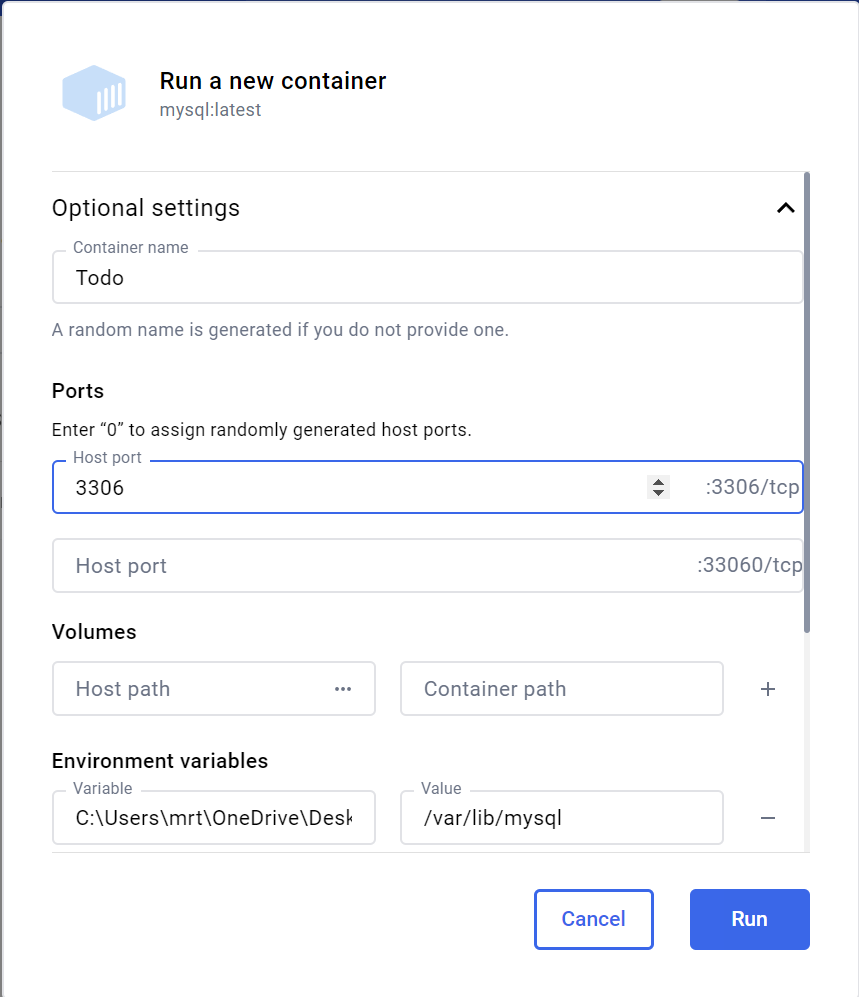

# MySQL Dockeris

Selles peatükis räägime MySQL-i kasutamisest Dockeri konteineris.


Pildi allikas: Dall-E by OpenAI

- [MySQL Dockeris](#mysql-dockeris)
  - [Õpiväljundid](#õpiväljundid)
  - [MySQL image ja konteineri loomine Docker Dekstopis](#mysql-image-ja-konteineri-loomine-docker-dekstopis)
  - [MySQL konteineri loomine terminali kaudu](#mysql-konteineri-loomine-terminali-kaudu)
  - [Allikad](#allikad)
  - [Harjutused](#harjutused)

## Õpiväljundid

Selle peatüki lõpuks peaksid õppijad olema võimelised:

- tõmbama alla ja käivitama MySQL-i Dockeri konteineris;
- seadistama MySQL-i konteineri kasutamiseks.

Üks lihtsamaid viise oma arvutis MySQL-i kasutamiseks on seda kasutada läbi Dockeri. Dockeri kasutamiseks peab arvutis olema Docker Desktop. Kui seda ei ole, siis saab selle alla laadida [siit](https://www.docker.com/products/docker-desktop).

## MySQL image ja konteineri loomine Docker Dekstopis

Kõigepealt käivitame Docker Desktopi ja otsime Docker Hubist MySQL-i image'i. Selleks kirjutame Docker Desktop-i akna üleval olevale otsinguaknasse `mysql` ja vajutame esimese tulemuse taga olevale `Pull`nupule, mis tõmbab meie arvutisse MySQL-i ametliku Image'i.


Seejärel tuleb minna vasakul menüüd `Images` jaotisesse ja vajutada MySQL-i Image järel olevale `Run` nupule, mis on `Actions` tulbas.


Seejärel avanevas `Run a new container` aknas tuleb valida `Optional settings` ja täita nõutud väljad:

- `Container name`: loodava konteineri nimi
- `Ports`: port, millel MySQL päringuid vastu võtab (vaikimisi 3306)
- `Volumes`: kui soovite, et konteineri andmed oleksid salvestatud arvutisse, siis tuleb määrata kaust, kuhu andmed salvestatakse ja see siduda konteineri kaustaga.
- `Environment variables`: nende abil saab määrata erinevaid MySQL-i seadeid, nagu kasutajanimi, parool jne.
  - `MYSQL_ROOT_PASSWORD`: MySQL-i root kasutaja parool
  - `MYSQL_DATABASE`: loodava andmebaasi nimi
  - `MYSQL_USER`: loodava kasutaja nimi
  - `MYSQL_PASSWORD`: loodava kasutaja parool
  - ...



Kui seadistused on määratud, tuleb vajutada `Run` nupule, mis loob konteineri ja käivitab selle.

Selle tulemusena on meil käivitatud MySQL-i konteiner, millele saame ligi pääseda läbi terminali (mis on saadaval ka Docker Desktop-is), ühenduda mõne SQL tööriistaga (nagu näiteks SQLTools VS Code-is) või siis juba meie enda loodud rakendusega, mis kasutab MySQL-i andmebaasi

## MySQL konteineri loomine terminali kaudu

Kui soovite luua MySQL konteineri terminali kaudu, siis saate samade seadistustega konteineri luua järgmise käsu abil:

// andmebaasi nimi: todo, root parool: super-secret, kasutaja: todo-user, kasutaja parool: secret, volume: docker kaust `mysql-data` sidumine konteineri kaustaga `/var/lib/mysql`

```bash
docker run --name mysql-todo -e MYSQL_ROOT_PASSWORD=super-secret -e MYSQL_DATABASE=todos -e MYSQL_USER=todo-user -e MYSQL_PASSWORD=my-secret -p 3306:3306 -v mysql-data:/var/lib/mysql -d mysql
```

Kui käivitate selle käsu, siis luuakse MySQL konteiner, millel on järgmised seaded:

- **Andmebaasi nimi:** `todos`
- **Root kasutaja parool:** `super-secret`
- **Kasutaja:** `todo-user`
- **Kasutaja parool:** `my-secret`
- **Port:** `3306`
- **Volume:** `mysql-data`, mis on seotud konteineri kaustaga `/var/lib/mysql`
- **Konteineri nimi:** `mysql-todo`
- **Image:** mysql
- Käivitatakse taustal (*detach mode*)

Kui soovite kontrollida, kas konteiner on käivitatud, siis saate seda teha järgmise käsu abil:

```bash
docker ps
```

Nüüd on meil olemas keskkond, kus saame kasutada MySQL-i andmebaasi. Soovi korral saame selle lihtsalt peatada, kustutada või uuesti käivitada. Samas saame ka luua uusi konteinereid, mis kasutavad sama MySQL-i Image'i.

## Allikad

- [Docker Official Documentation](https://docs.docker.com/)
- [MySQL Official Docker Image](https://hub.docker.com/_/mysql)
- [Docker Hub](https://hub.docker.com/)

## Harjutused

- Loo MySQL konteiner Docker Desktopis oma arvutis kasutades endale sobivaid seadeid.
