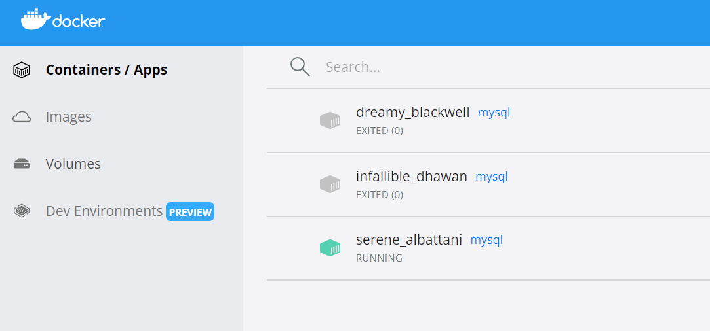
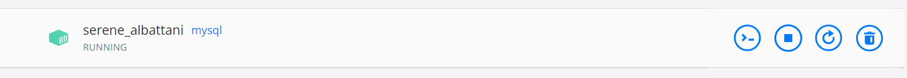

# MySQL Dockeris

Üks lihtsamaid viise oma arvutis MySQL-i kasutamiseks on seda kasutada läbi Dockeri. Dockeri kasutamiseks peab arvutis olema Docker Desktop. Kui seda ei ole, siis saab selle alla laadida [siit](https://www.docker.com/products/docker-desktop).

## MySQL image ja konteineri loomine

Järgmisena on vaja MySQL (või ka näiteks MariaDB) imaget, mille saab alla laadida docker hub-ist: https://hub.docker.com/_/mysql

Image allalaadimiseks tuleks minna käsureale ja sinna kirjutada: ```docker pull mysql```

Docker konteineri käivitamiseks imagest on käsk `docker run imageName`. MySQL-i imagest konteineri käivitamiseks on siis käsk: ```docker run mysql```

Kui proovida sellisel viisil MySQL-i käivitada, siis tuleb välja, et see ei tööta ja ekraanile kuvatakse:
```bash
$ docker run mysql
2023-10-31 15:49:19+00:00 [Note] [Entrypoint]: Entrypoint script for MySQL Server 8.2.0-1.el8 started.
2023-10-31 15:49:19+00:00 [Note] [Entrypoint]: Switching to dedicated user 'mysql'
2023-10-31 15:49:19+00:00 [Note] [Entrypoint]: Entrypoint script for MySQL Server 8.2.0-1.el8 started.
2023-10-31 15:49:20+00:00 [ERROR] [Entrypoint]: Database is uninitialized and password option is not specified
    You need to specify one of the following as an environment variable:
    - MYSQL_ROOT_PASSWORD
    - MYSQL_ALLOW_EMPTY_PASSWORD
    - MYSQL_RANDOM_ROOT_PASSWORD
```

Probleem seisneb selles, et MySQLi image tahab saada parooli, et hiljem oleks võimalik ka andmebaasiga ühendust võtta.

Selleks lisame eelnevale käsule juurde võtme `-e` ja selle järele keskkonnamuutuja (environment variable) `MYSQL_ROOT_PASSWORD=parool`. Selle abil anname MySQL-ile teada, mis on `root` parool.

Käsk näeb siis välja selline: ```docker run -e MYSQL_ROOT_PASSWORD=my-secret-pw mysql```

Seejuures on oluline, et keskkonnamuutuja tuleb lisada enne image nime.

Kui nüüd see käsk käivitada, siis on näha, et MySQL läheb käima ja hakkab näitama meile ekraanil logi. Lisaks, kui me käivitame nüüd `Docker Desktop` programmi, siis näeme seal, et eksisteerib juba mitu konteinerit, millest osa töötavad ja osa mitte:



Kui konteineri nime peale minna, siis ilmuvad konteineri juurde nupud, millest saame konteinerisse sisse minna, seisma panna, taaskäivitada ja kustutada.



Hetkel sellisel kujul meil sellest konteinerist suuremat kasu ei ole, kuna see töötab isoleeritud keskkonnas ja sellele ligi ei pääse. Selleks, et me saaksime näiteks oma arvutis läbi mingi rakenduse selle konteineris oleva MySQL-iga ühendust võtta, peame konteinerit luues avama mingi **pordi**, mille kaudu oleks võimalik MySQL-iga suhelda. Selleks kasutame võtit `-p` (avab kõik pordid) või `-p välimine port:sisemine port`. Kuna me teame, et MySQL töötab pordil **3306**, siis lisame docker run käsule võtme `-p 3306:3306`, mis tähendab, et näitame dockeri konteinerist välja porti numbriga **3306** ja suuname selle edasi sisemisele pordile numbriga **3306**.

Lisaks lisame võtme `-d`, mis käivitab konteineri taustal, nii et MySQLi logi ei jää meile aknasse ette. Käsk näeb siis välja selline: ```docker run -p 3306:3306 -d -e MYSQL_ROOT_PASSWORD=my-secret-pw mysql```

Nüüd näeme Docker Desktop-is uut konteinerit, mille juures on ka avatud port näha:


Nüüd on meil võimalik ka mingi programmiga juba konteineris oleva MySQL-iga suhelda, kuigi meil on praegu selline olukord, kus konteineri kustutamisel kaovad ära ka andmed, mis on andmebaasi salvestatud. Tihtipeale ongi see okei, kuid kui meil oleks vaja, et andmed säiliksid ja vajadusel saaksime konteineri uuesti luua nii, et vanad andmed seal sees oleksid, siis on meil vaja teha nii, et andmed salvestataks meie arvuti failisüsteemi, mitte ainult konteinerisse. Selle jaoks on omakorda võti `-v`, millele järgneb teekond kohalikus failisüsteemis:teekond konteineri failisüsteemis. Docker Hub-is olevas MySQLi image dokumentatsioonist leiame, et konteineris hoitakse olulisi faile `/var/lib/mysql` kaustas. Seega lisame olemasolevale käsklusele juurde `-v data:/var/lib/mysql` ja käsk näeb kokku välja selline: ```docker run -p 3306:3306 -d -v data:/var/lib/mysql -e MYSQL_ROOT_PASSWORD=my-secret-pw mysql```

Nüüd seda käsku käivitades näeme, et saame veateate, mis ütleb, et port **3306** on juba kasutusel. See tähendab, et samas arvutis ei saa ühe pordi peal mitu erinevat rakendust töötada. Seega peame olemasoleva konteineri seisma panema ja võime ka ära kustutada. Seda saab lihtsalt teha Docker Desktopis konteineri peal klõpsates ja prügikasti märki vajutades. Nüüd saame uue konteineri käivitada, sellega suhelda ja sinna kirjutatud andmed jäävad ka alles.