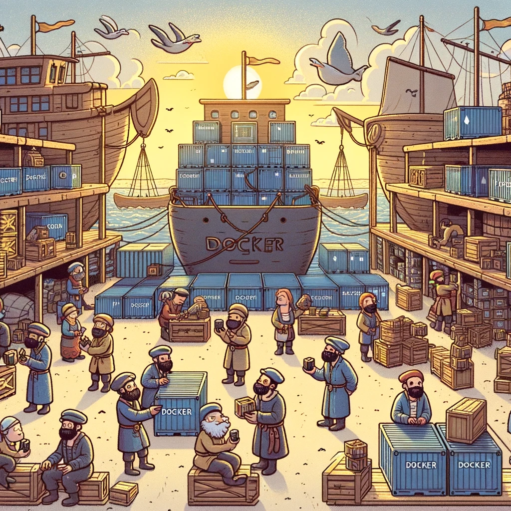

# Docker: Mis see on ja milleks seda kasutatakse



Pildi allikas: Dall-E by OpenAI

## Sissejuhatus

Docker on avatud lähtekoodiga platvorm, mis võimaldab arendajatel ja IT-spetsialistidel luua, juurutada ja hallata rakendusi konteinerites. Konteinerid võimaldavad rakenduste ja nende sõltuvuste isoleeritud keskkonnas käitamist, mis tagab ühtlase ja ennustatava käitumise kõikides etappides, alates arendusest kuni tootmiseni.

- [Docker: Mis see on ja milleks seda kasutatakse](#docker-mis-see-on-ja-milleks-seda-kasutatakse)
  - [Sissejuhatus](#sissejuhatus)
  - [Õpiväljundid](#õpiväljundid)
  - [Docker-i põhimõisted](#docker-i-põhimõisted)
  - [Docker-i tööpõhimõte](#docker-i-tööpõhimõte)
    - [Konteinerid vs virtuaalmasinad](#konteinerid-vs-virtuaalmasinad)
  - [Docker-i põhikomponendid](#docker-i-põhikomponendid)
    - [Docker Engine](#docker-engine)
    - [Docker Image](#docker-image)
    - [Docker Container](#docker-container)
    - [Docker Compose](#docker-compose)
  - [Docker Desktop](#docker-desktop)
    - [Docker Desktopi installatsioon ja seadistus](#docker-desktopi-installatsioon-ja-seadistus)
      - [Windows](#windows)
      - [macOS](#macos)
  - [Docker-i kasutusjuhud ja eelised](#docker-i-kasutusjuhud-ja-eelised)
    - [Kasutusjuhud](#kasutusjuhud)
    - [Eelised](#eelised)
  - [Allikad](#allikad)
  - [Kontrollküsimused või harjutus](#kontrollküsimused-või-harjutus)

## Õpiväljundid

Selle peatüki lõpuks peaksid õppijad olema võimelised:

- selgitama, mis on Docker ja kuidas see töötab;
- kirjeldama konteinerite ja virtuaalmasinate erinevusi;
- nimetama Docker-i põhikomponente ja nende funktsionaalsust;
- kirjeldama Docker-i kasutusjuhtumeid ja eeliseid;
- installeerima Docker Desktopi oma arvutisse.

## Docker-i põhimõisted

**Docker:** Docker on platvorm, mis kasutab konteineriseerimistehnoloogiat, et pakkida rakendused ja nende sõltuvused ühte isoleeritud üksusesse, mida nimetatakse konteineriks.

**Konteiner:** Konteiner on kerge, isoleeritud keskkond, mis sisaldab kõiki vajalikke faile ja sõltuvusi rakenduse käivitamiseks. Konteinerid jagavad sama operatsioonisüsteemi tuuma (*kernelit*), mis muudab need tõhusamaks kui virtuaalmasinad.

**Docker Image (*tõmmis*):** Docker Image on fail, mis sisaldab kõiki rakenduse käivitamiseks vajalikke komponente, sealhulgas koodi, raamistikke, sõltuvusi ja süsteemi tööriistu. Image-d on `read-only`-d ja neid kasutatakse konteinerite loomiseks.

**Docker Container:** Docker Container on Imagest loodud eksemplar, mis käitab rakendust isoleeritud keskkonnas. Konteinerid on kerged ja käivituvad kiiresti.

**Dockerfile:** Dockerfile on `yml` formaadis tekstifail, mis sisaldab juhiseid Docker Image loomiseks. See määratleb, millised komponendid ja sammud on vajalikud Image loomiseks.

**Docker Hub:** Docker Hub on pilvepõhine repositoorium, kus kasutajad saavad jagada, tõmmata ja üles laadida Docker Image-id.

## Docker-i tööpõhimõte

Docker kasutab konteinerite tehnoloogiat, mis võimaldab rakenduste ja nende sõltuvuste pakkimist, arendamist ja käitamist isoleeritud keskkonnas. Konteinerid töötavad otseselt host-operatsioonisüsteemi peal, jagades sama kernelit, mis muudab need kergemaks ja tõhusamaks kui traditsioonilised virtuaalmasinad.

### Konteinerid vs virtuaalmasinad

Konteinerid ja virtuaalmasinad (VM-id) on mõlemad isoleeritud keskkonnad, kuid nende tööpõhimõtted ja kasutusjuhud erinevad.

- **Konteinerid:**
  - jagavad host-operatsioonisüsteemi kernelit;
  - on väiksemamahulised ja käivituvad kiiremini;
  - pakuvad paremat jõudlust ja efektiivsust;
  - sobivad hästi mikroteenuste arhitektuuride ja pilvepõhiste rakenduste jaoks.

- **Virtuaalmasinad:**
  - käitavad täisväärtuslikku operatsioonisüsteemi koos oma kerneliga;
  - on suuremamahulisemad ja käivituvad reeglina aeglasemalt;
  - pakuvad täielikku isolatsiooni ja turvalisust;
  - sobivad hästi mitmesuguste operatsioonisüsteemide käitamiseks samal riistvaral.

## Docker-i põhikomponendid

### Docker Engine

Docker Engine on Docker-i peamine komponent, mis vastutab konteinerite loomise ja käitamise eest. See koosneb kolmest osast:

- **Server (Docker Daemon):** Teenus, mis haldab konteinerite elutsüklit.
- **REST API:** Liides, mis võimaldab suhtlust Docker Daemoniga.
- **CLI (Command Line Interface):** Käsurea tööriist, mis võimaldab kasutajatel suhelda Dockeriga.

### Docker Image

Docker Image on rakenduse ja selle sõltuvuste muudetamatu mall, mida kasutatakse konteinerite loomiseks. Image-d ehitatakse `Dockerfile` abil.

Näide Dockerfile-st:

```Dockerfile
# Alustatakse baas-Image-ga
FROM node:14

# Määratakse töökaust konteineris
WORKDIR /app

# Kopeeritakse package.json ja package-lock.json
COPY package*.json ./

# Installitakse sõltuvused
RUN npm install

# Kopeeritakse ülejäänud rakenduse kood
COPY . .

# Määratakse käivituskäsk
CMD ["node", "app.js"]
```

### Docker Container

Docker Container on jooksva rakenduse eksemplar, mis on loodud Docker Image-st. Konteinerid on kerged, isoleeritud ja neid saab hõlpsasti käivitada, peatada ja eemaldada.

Näide konteineri loomisest ja käivitamisest:

```bash
docker build -t my-node-app .
docker run -d -p 3000:3000 my-node-app
```

### Docker Compose

Docker Compose on tööriist, mis võimaldab määratleda ja hallata mitme konteineriga rakendusi. See kasutab `YAML` konfiguratsioonifaili `docker-compose.yml`, et määratleda teenused, võrgud ja mahud.

Näide `docker-compose.yml` failist:

```yaml
version: '3'
services:
  web:
    image: my-node-app
    ports:
      - "3000:3000"
  db:
    image: mysql:5.7
    environment:
      MYSQL_ROOT_PASSWORD: example
```

## Docker Desktop

Docker Desktop on tööriist, mis pakub lihtsat ja kasutajasõbralikku viisi Docker-i konteinerite haldamiseks ja arendamiseks Windowsi ja macOS platvormidel. Docker Desktop ühendab endas kõik vajalikud tööriistad, sealhulgas Docker Engine, Docker CLI, Docker Compose ja Kubernetes, et arendajad saaksid kiiresti alustada konteineripõhiste rakenduste loomist ja haldamist.

Inimestele, kes ei ole harjunud või kes ei sooovi kasutada käsurea tööriistu, pakub Docker Desktop lihtsat kasutajaliidest, mis võimaldab konteinerite loomist, käivitamist ja haldamist visuaalselt.

### Docker Desktopi installatsioon ja seadistus

#### Windows

- Laadige alla Docker Desktopi installer [Docker-i ametlikult veebisaidilt](https://www.docker.com/products/docker-desktop).
- Käivitage installer ja järgige juhiseid, et installida Docker Desktop.
- Pärast installatsiooni lõpetamist käivitage Docker Desktop ja logige sisse oma Docker Hubi kontoga (valikuline).

#### macOS

- Laadige alla Docker Desktopi DMG-fail [Docker-i ametlikult veebisaidilt](https://www.docker.com/products/docker-desktop).
- Avage DMG-fail ja lohistage Docker Desktopi ikoon rakenduste kausta.
- Käivitage Docker Desktop rakenduste kaustast ja logige sisse oma Docker Hubi kontoga (valikuline).

## Docker-i kasutusjuhud ja eelised

### Kasutusjuhud

- **Mikroteenuste arhitektuur:** Docker võimaldab mikroteenuste isoleeritud ja sõltumatut juurutamist.
- **Pilvepõhised rakendused:** Konteinerid võimaldavad skaleeritavust ja paindlikkust pilvepõhiste rakenduste jaoks.
- **Arendus ja testimine:** Docker võimaldab ühtlast arendus- ja testimiskeskkonda, mis vähendab vigu ja kiirendab arendustsüklit.
- **Pärandsüsteemide moderniseerimine:** Docker aitab pärandsüsteeme konteineriseerida ja viia need kaasaegsematele platvormidele.

### Eelised

- **Kergemad ja kiiremad kui virtuaalmasinad.**
- **Lihtne paigaldamine ja haldamine.**
- **Skaleeritavus ja portatiivsus.**
- **Ühtlane käitumine erinevates keskkondades.**
- **Tugev ökosüsteem ja lai kogukond.**

## Allikad

- [Docker Official Documentation](https://docs.docker.com/)
- [Docker for Dummies by Earl Waud](https://www.amazon.com/Docker-Dummies-Earl-Waud/dp/1119564687)
- [Docker Hub](https://hub.docker.com/)
- [Learning Docker by Jeeva S. Chelladhurai](https://www.amazon.com/Learning-Docker-Jeeva-Chelladhurai/dp/1783984869)
- [Docker for Developers by Richard Bullington-McGuire](https://www.amazon.com/Docker-Developers-Richard-Bullington-McGuire/dp/1789617384)

## Kontrollküsimused või harjutus

- Mis on Docker ja kuidas see erineb virtuaalmasinatest?
- Selgitage Docker Image ja Docker Container vahelist erinevust.
- Kirjutage lihtne Dockerfile, mis loob Node.js rakenduse pildi.
- Mis on Docker Compose ja kuidas see aitab mitme konteineriga rakendusi hallata?

