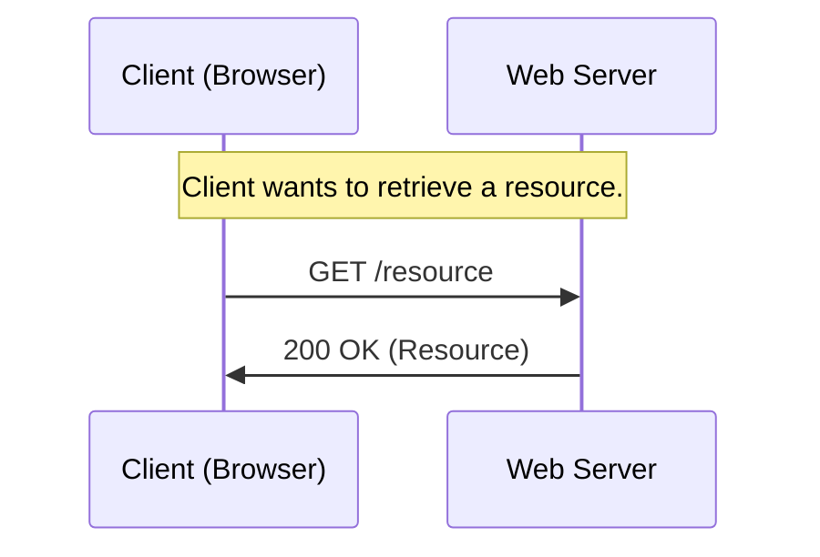
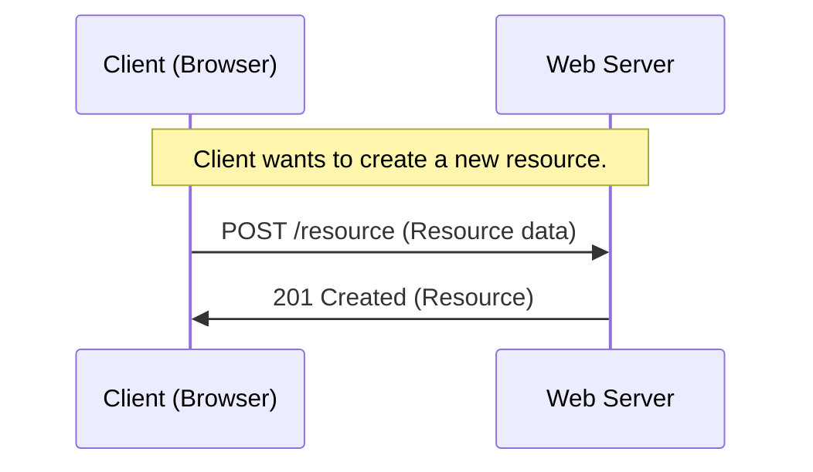
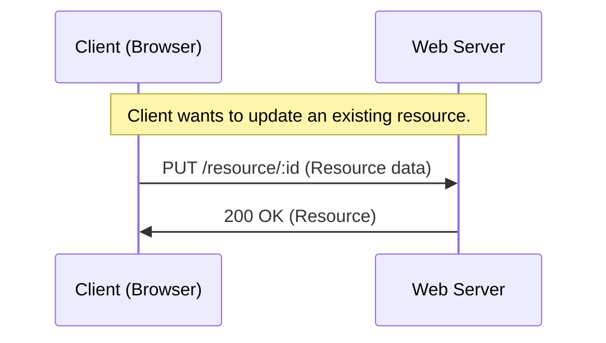
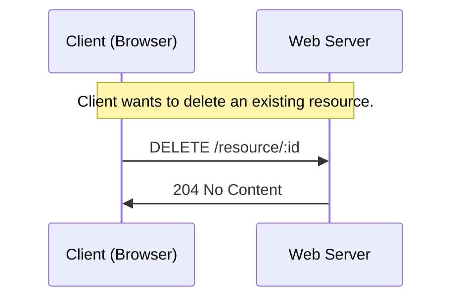
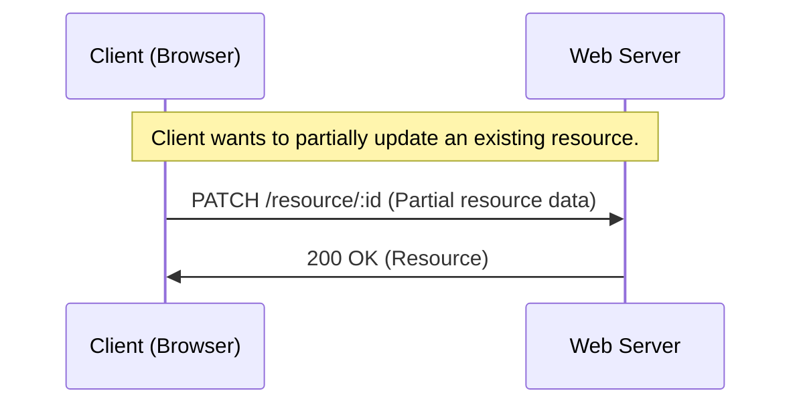

# HTTP päringu meetodid (*Request methods*)

HTTP päringu meetodeid kasutatakse selleks, et näidata, milliseid toiminguid soovitakse HTTP päringus URI-ga (*Uniform Resource Identifier*) tuvastatud ressursiga sooritada.

- **GET:** GET-meetodit kasutatakse serverist ressursi toomiseks. See on ohutu ja idempotentne meetod, mis tähendab, et mitmel identsel päringul on sama mõju kui ühel päringul. Vastus GET-päringule sisaldab tavaliselt taotletud ressurssi või selle esitust sõnumi kehas.

Eelnevas näites saadab klient serverile `HTTP GET` päringu ressursi toomiseks. Server vastab olekukoodiga `200 OK` koos nõutud ressursiga.

- **POST:** POST-meetodit kasutatakse andmete esitamiseks serverisse ressursi loomiseks või värskendamiseks. See ei ole idempotentne, mis tähendab, et mitmel identsel päringul võib olla erinev mõju. Vastus POST-päringule sisaldab tavaliselt loodud või värskendatud ressursi esitust sõnumi kehas.

Selles näites saadab klient uue ressursi loomiseks serverile `HTTP POST`-päringu, esitades päringu kehas vajalikud andmed. Server vastab olekukoodiga `201 Created` koos vastloodud ressursiga.

- **PUT:** PUT-meetodit kasutatakse serveris olemasoleva ressursi värskendamiseks. See on idempotentne, mis tähendab, et mitmel identsel päringul on sama mõju kui ühel päringul. Vastus PUT-päringule sisaldab tavaliselt värskendatud ressursi esitust sõnumi kehas.

Selles näites saadab klient serverile `HTTP PUT` päringu olemasoleva ressursi värskendamiseks, esitades vajalikud andmed päringu kehas. Server vastab olekukoodiga `200 OK` koos värskendatud ressursiga.

- **DELETE:** DELETE meetodit kasutatakse ressursi kustutamiseks serverist. See on idempotentne, mis tähendab, et mitmel identsel päringul on sama mõju kui ühel päringul. Vastus DELETE päringule sisaldab tavaliselt kinnitussõnumit sõnumi kehas.

Selles näites saadab klient serverile `HTTP DELETE` päringu olemasoleva ressursi kustutamiseks. Server töötleb päringu, kustutab ressursi ja vastab olekukoodiga `204 No content`.

- **PATCH:** PATCH-meetodit kasutatakse serveris olemasoleva ressursi osa värskendamiseks. See ei ole idempotentne, mis tähendab, et mitmel identsel päringul võib olla erinev mõju. Vastus PATCH-päringule sisaldab tavaliselt värskendatud ressursi esitust sõnumi kehas.

Selles näites saadab klient serverile `HTTP PATCH` päringu olemasoleva ressursi osaliseks värskendamiseks, esitades ainult vajalikud andmed, mida tuleb päringu kehas muuta. Server töötleb päringu, värskendab ressurssi osaliselt ja vastab olekukoodiga `200 OK` koos värskendatud ressursiga.

- **OPTIONS:** meetodit OPTIONS kasutatakse ressursi jaoks saadaolevate valikute toomiseks. See on ohutu ja idempotentne meetod, mis tähendab, et mitmel identsel päringul on sama mõju kui ühel päringul. Vastus OPTIONSi päringule sisaldab tavaliselt teavet toetatud meetodite, päiste ja muude ressursi valikute kohta.

Need HTTP-päringu meetodid võimaldavad klientidel suhelda serveri ressurssidega standardsel ja järjepideval viisil, sõltumata serveri juurutamise üksikasjadest.

Allikad:

- <https://developer.mozilla.org/en-US/docs/Web/HTTP/Methods>
