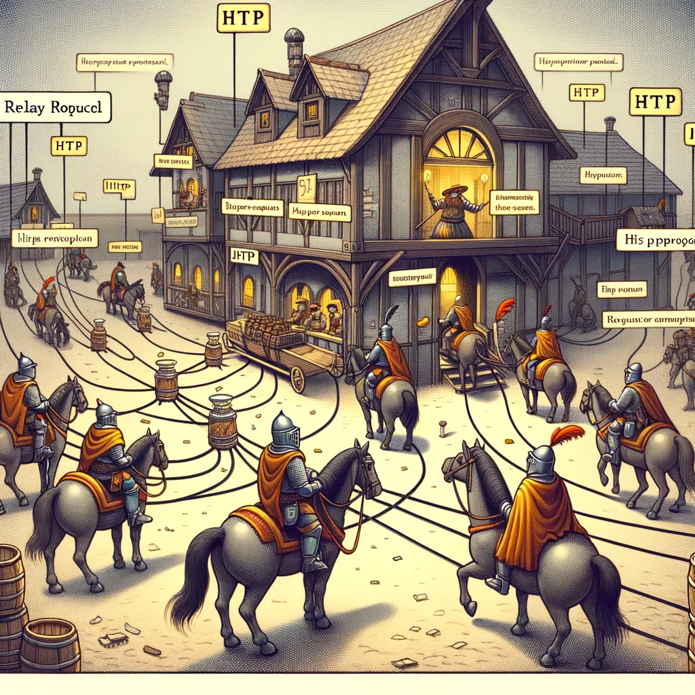

# HTTP (*Hypertext Transfer Protocol*)

Selles peatükis käsitleme HTTP-d, selle päringumeetodeid ja vastusekoode.

Pildi allikas: Dall-E by OpenAI

- [HTTP (*Hypertext Transfer Protocol*)](#http-hypertext-transfer-protocol)
  - [Õpiväljundid](#õpiväljundid)
  - [Mis on HTTP?](#mis-on-http)
  - [HTTP päringumeetodid](#http-päringumeetodid)
  - [HTTP vastuskoodid](#http-vastuskoodid)
  - [Näited HTTP vastuskoodidest](#näited-http-vastuskoodidest)
    - [1xx (Informational)](#1xx-informational)
    - [2xx (Successful)](#2xx-successful)
    - [3xx (Redirection)](#3xx-redirection)
    - [4xx (Client Error)](#4xx-client-error)
    - [5xx (Server Error)](#5xx-server-error)

## Õpiväljundid

Peale selle peatüki läbimist oskad:

- Selgitada, mis on HTTP ja kuidas see toimib;
- Kirjeldada erinevaid HTTP päringumeetodeid ja nende kasutusjuhtumeid;
- Määratleda HTTP vastusekoodid ja nende tähendused;
- Selgitada, kuidas HTTP vastusekoode kasutatakse päringute tulemuste ja olekute kajastamiseks.

## Mis on HTTP?

HTTP tähistab hüperteksti edastusprotokolli. See on rakenduskihi protokoll, mida kasutatakse andmete edastamiseks Interneti kaudu.

HTTP on World Wide Web alus ja seda kasutavad veebibrauserid veebilehtede, piltide, videote ja muu sisu pärimiseks ja toomiseks veebiserveritest. Seda kasutavad ka veebiserverid neile päringutele vastamiseks ja nõutud sisu kliendile tagasi saatmiseks.

HTTP põhineb klient-serveri mudelil, kus klient saadab serverile päringusõnumi (*request*) ja server vastab vastusesõnumiga (*response*). HTTP-päringuid algatavad tavaliselt kasutaja veebibrauser või muud kliendipoolsed rakendused ning need võivad sisaldada erinevat tüüpi teavet, näiteks päringumeetodeid (nt GET, POST, PUT, DELETE), päiseid ja andmeid.

HTTP on olekuta (*stateless*) protokoll, mis tähendab, et iga päring ja vastus on sõltumatud ega tugine kliendi ja serveri vahelisele varasemale suhtlusele. See võimaldab suuremat skaleeritavust ja paindlikkust, kuid nõuab ka täiendavaid mehhanisme, nagu küpsised või seansimärgid, et säilitada kliendi ja serveri vaheline olekupõhine suhtlus.

## HTTP päringumeetodid

HTTP päringumeetodeid kasutatakse selleks, et näidata soovitud toimingut ressursile, mis on tuvastatud HTTP-päringus URI-ga (Uniform Resource Identifier). Järgnevalt on välja toodud kõige levinumad HTTP-päringu meetodid.

- **GET:** GET-meetodit kasutatakse serverist ressursi pärimiseks. See on ohutu ja idempotentne meetod, mis tähendab, et mitmel identsel päringul on sama mõju kui ühel päringul. Vastus GET-päringule sisaldab tavaliselt taotletud ressurssi või selle esitust sõnumi kehas.

- **POST**: POST-meetodit kasutatakse andmete edastamiseks serverisse ressursi loomiseks või värskendamiseks. See ei ole idempotentne, mis tähendab, et mitmel identsel päringul võib olla erinev mõju. Vastus POST-päringule sisaldab tavaliselt loodud või värskendatud ressursi esitust sõnumi kehas.

- **PUT**: PUT-meetodit kasutatakse serveris olemasoleva ressursi värskendamiseks. See on idempotentne, mis tähendab, et mitmel identsel päringul on sama mõju kui ühel päringul. Vastus PUT-päringule sisaldab tavaliselt värskendatud ressursi esitust sõnumi kehas.

- **DELETE**: DELETE meetodit kasutatakse ressursi kustutamiseks serverist. See on idempotentne, mis tähendab, et mitmel identsel päringul on sama mõju kui ühel päringul. Vastus DELETE päringule sisaldab tavaliselt kinnitussõnumit sõnumi kehas.

- **PATCH**: PATCH-meetodit kasutatakse serveris olemasoleva ressursi osa värskendamiseks. See ei ole idempotentne, mis tähendab, et mitmel identsel päringul võib olla erinev mõju. Vastus PATCH-päringule sisaldab tavaliselt värskendatud ressursi esitust sõnumi kehas.

- **OPTIONS**: meetodit OPTIONS kasutatakse ressursi jaoks saadaolevate valikute toomiseks. See on ohutu ja idempotentne meetod, mis tähendab, et mitmel identsel päringul on sama mõju kui ühel päringul. Vastus OPTIONSi päringule sisaldab tavaliselt teavet toetatud meetodite, päiste ja muude ressursi valikute kohta.

Need HTTP-päringu meetodid võimaldavad klientidel suhelda serveri ressurssidega standardsel ja järjepideval viisil, sõltumata serveri juurutamise üksikasjadest.

## HTTP vastuskoodid

HTTP vastuskoodid on kolmekohalised koodid, mis näitavad HTTP vastussõnumi olekut. HTTP vastuskoodid on viis klassi, millest igaüks esindab erinevat tüüpi vastust:

- **1xx** (*Informational*): need olekukoodid näitavad, et server on päringu kätte saanud ja jätkab selle töötlemist. Kõige tavalisem neist koodidest on `100`, mis näitab, et server on päringu algosa kätte saanud ja ootab, et klient saadaks ülejäänud osad.

- **2xx** (*Successful*): need olekukoodid näitavad, et server on päringu edukalt vastu võtnud, mõistnud ja töödeldud. Kõige tavalisem neist koodidest on `200`, mis näitab, et päring oli edukas ja server tagastab nõutud andmed.

- **3xx** (*Redirection*): need olekukoodid näitavad, et klient peab taotluse täitmiseks tegema lisatoiminguid. Kõige tavalisem neist koodidest on `302`, mis näitab, et taotletud ressurss on ajutiselt teisaldatud uuele URL-ile.

- **4xx** (*Client Error*): need olekukoodid näitavad, et server ei saanud taotlust töödelda kliendipoolse vea tõttu. Kõige tavalisem neist koodidest on `404`, mis näitab, et soovitud ressurssi serverist ei leitud.

- **5xx** (*Server Error*): need olekukoodid näitavad, et server ei saanud serveripoolse vea tõttu päringut töödelda. Kõige tavalisem neist koodidest on 500, mis näitab, et serveris esines sisemine viga, mis takistas päringu töötlemist.

HTTP vastusekoodid pakuvad serveritele standardiseeritud viisi päringu oleku kliendile tagastamiseks, võimaldades klientidel vigadele või muudele ootamatutele olukordadele õigesti reageerida. HTTP-päringute vastusekoode kontrollides saavad kliendid kindlaks teha, kas päring oli edukas või mitte, ja võtta vastuse põhjal vajalikud toimingud.

## Näited HTTP vastuskoodidest

### 1xx (Informational)

- 100 - Continue
- 101 - Switching Protocols
- 102 - Processing
  
### 2xx (Successful)

- 200 - OK
- 201 - Created
- 202 - Accepted
- 204 - No Content

### 3xx (Redirection)

- 300 - Multiple Choices
- 301 - Moved Permanently
- 302 - Found
- 304 - Not Modified
- 307 - Temporary Redirect

### 4xx (Client Error)

- 400 - Bad Request
- 401 - Unauthorized
- 403 - Forbidden
- 404 - Not Found
- 409 - Conflict
- 415 - Unsupported Media Type
- 429 - Too Many Requests

### 5xx (Server Error)

- 500 - Internal Server Error
- 501 - Not Implemented
- 502 - Bad Gateway
- 503 - Service Unavailable
- 504 - Gateway Timeout

Need on vaid mõned näited paljudest olemasolevatest HTTP vastusekoodidest. Oluline on märkida, et erinevad veebiserverid või veebirakendused võivad kasutada täiendavaid vastusekoode, mis on spetsiifilised nende rakendamiseks.

Allikad:

- <https://developer.mozilla.org/en-US/docs/Web/HTTP/Methods>
- <https://developer.mozilla.org/en-US/docs/Web/HTTP/Status>
