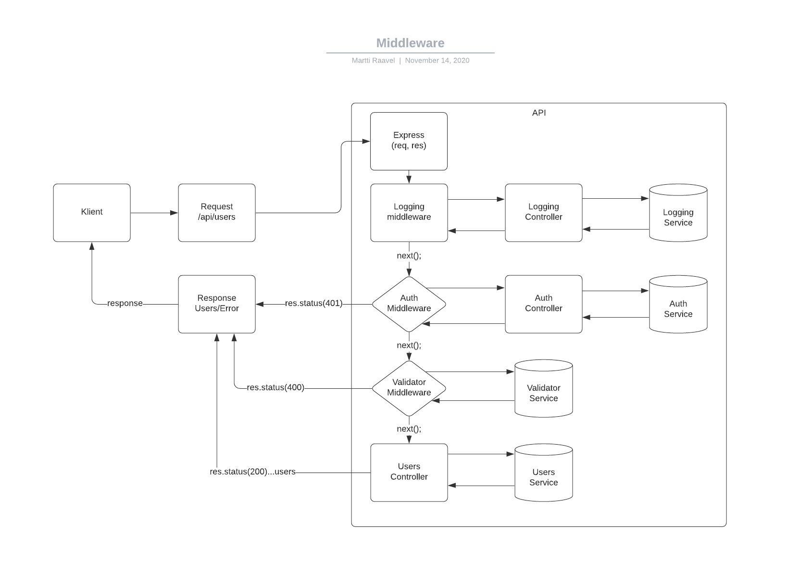

# Vahevara ehk Middleware

`Middleware` funktsioonid on funktsioonid, millel on juurdepääs päringuobjektile (`req`), vastuseobjektile (`res`) ja järgmisele funktsioonile rakenduse päringu-vastuse tsüklis.

`Next` funktsioon on Express-ruuteri funktsioon, mis käivitamisel käivitab `middleware` praeguse `middleware`’i järel.

`Middleware` saab:

- Käivitada koodi
- Teha muudatusi request ja response objektides
- Lõpetada request-response tsüklit
- Kutsuda välja järjekorrast järgmine middleware

Meeles peab pidama, et kui `middleware` ei lõpeta päringu-vastuse tsüklit (näiteks `return res.status(200).json…`), siis peab middleware kutsuma välja `next()` funktsiooni, muidu jääb rakendus 'rippuma'.

Logimise `middleware` näide:

```javascript
// Http päringute konsooli logimise middleware
import { Request, Response, NextFunction } from 'express';

export default (req: Request, res: Response, next: NextFunction) => {
  // Väljastatakse päringu sihtaadress, meetod ja aeg
  console.log(req.url, req.method, new Date().toISOString());
  // Next funktsiooni käivitamine annab järjekorra üle järgmisele middleware'le
  next();
}
```

`Middleware`-t saab kasutada erinevalt.

Üks variantidest on registreerida `middleware` kõikidele päringutele:

```javascript
...
// Middleware importimine
import logger from './middlewares/logger';

...

// Middleware registreerimine
app.use(logger);

...
```

Teine variant on registreerida `middleware` ainult teatud marsuutidele:

```javascript
...
// Middleware importimine
import logger from './middlewares/logger';

...

// Middleware registreerimine
app.get('/api', logger, (req, res) => {
  res.send('Hello World!');
});
...
```

