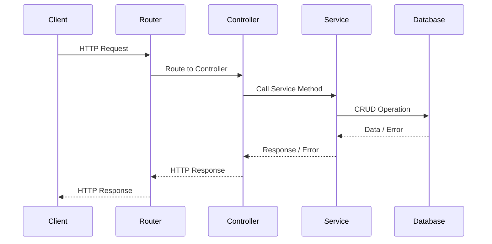

# API struktureerimine

Kui kogu API kood kirjutada ühte faili, siis muutub see üsna ruttu raskesti loetavaks, hallatavaks ja muudetavaks. Seetõttu on hea API jagada erinevateks mooduliteks, millest igaüks tegeleb ühe kindla asjaga.

API struktureerimisel on mitmeid erinevaid viise ja põhimõtteid, kuidas seda teha, kuid üldiselt on kõige olulisem, et API oleks loetav, hallatav ja muudetav.

Siin materjalides kasutame API struktureerimiseks järgnevaid põhimõtteid:

- iga ressurss jagatakse vähemalt neljaks mooduliks: `model`, `controller`, `service` ja `router`
- iga moodul on eraldi failis
- iga ressursiga seotud moodul on ressursi nimega kaustas

Näiteks:

```text
src
├───components
│   ├───users
│   │   ├───usersControllers.js
│   │   ├───usersModels.js
│   │   ├───usersRouters.js
│   │   └───usersServices.js
│   └───...
app.js
...

```

## Models

Model on moodul, mis kirjeldab ressursi struktuuri. Modeli abil saab määrata, millised väljad ressursil on, millised väljad on kohustuslikud, millised väljad on valikulised jne.

## Kontrollerid

Kontrollerid toimivad vahendajatena HTTP päringute ja vastuste ning rakendusloogika vahel. Tavaliselt vastutavad kontrollerid järgmiste ülesannete eest:

- **Päringu andmete valideerimine**: Kas saadud päringuparameetrid, keha või päised on korrektsed?
- **Päringu suunamine**: Päringu suunamine sobivale teenusele või utiliidile edasiseks töötluseks.
- **Vea käsitsemine**: Teenuse poolt tagastatud andmete olemasolu ja korrektsuse kontrollimine. Kui ilmneb viga, siis sobivaks HTTP veavastuseks vormindamine.
- **Vastuse vormindamine**: Teenuse poolt saadud andmete HTTP vastuseks sobivaks vormindamine.
- **Päringu/vastuse logimine**: Vajadusel päringu ja vastuse logimine.
- **Turvalisus**: Vajadusel autentimise ja autoriseerimise rakendamine.

Nimetatud funktsioonid ja tegevused võivad vajadusel täieneda ja samuti võib kontrollerite ülesannete hulk erinevates rakendustes erineda. Ka on võimalik osade funktsioonide täitmine delegeerida näiteks vahevaradele (*middleware*).

## Teenused

Teenused sisaldavad äri- või rakendusloogikat ning on seega kontrolleritest sõltumatud. Teenused tegelevad järgmiste ülesannetega:

- **Andmete haldus**: CRUD (Create, Read, Update, Delete) operatsioonide teostamine andmebaasi või muu andmeallika suhtes.
- **Ärireeglid**: Arvutused, valideerimine või andmete transformeerimine jne.
- **Kolmandate osapoolte integratsioon**: Kolmandate osapoolte teenuste/API-idega ühendumine andmete saamiseks/saatmiseks.
- **Vahemälu haldus**: Jõudluse parandamine vahemälu abil.
- **Veakäsitlus**: Vigade käsitlemine ja nende kontrollerile edastamine.

## Marsruuterid (routers)

Marsruuterid on moodulid, mis vastutavad päringute suunamise eest õigesse kontrollerisse. Marsuuter 'vaatab', millise ressursi ja millise päringumeetodi kohta on päring tehtud ning suunab selle vastava ressursi kontrollerisse.

## Voodiagramm

Eelnvalt nimetatud näidet illustreerib järgmine diagramm:



1. **Client**: Kasutaja või süsteem, mis saadab API-le HTTP päringu.
2. **Router**: Marsruutija, mis otsustab, milline kontroller peaks päringuga tegelema.
3. **Controller**: Kontroller, mis vastutab päringu valideerimise ja teenuse kutsumise eest.
4. **Service**: Teenus, mis sisaldab äri- ja rakendusloogikat ning tegeleb andmebaasi või muu ressursiga.
5. **Database**: Andmebaas, kust teenus saab või sinna salvestab andmeid.

- Klient saadab HTTP päringu, mis jõuab esmalt marsruutijasse (Router).
- Marsruutija suunab päringu vastavasse kontrollerisse (Controller).
- Kontroller kutsub välja sobiva teenuse meetodi (Service).
- Teenus teeb vajaliku CRUD operatsiooni andmebaasis (Database).
- Andmebaas vastab teenusele, mis omakorda edastab selle info või vea kontrollerile.
- Kontroller koostab ja edastab HTTP vastuse, mis läbib marsruutija ja jõuab tagasi klienti.

