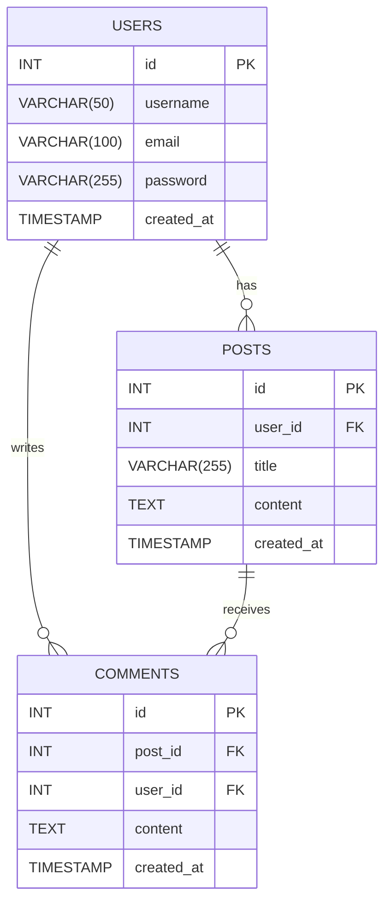

# MySQL Tabelite Loomine, Muutmine ja Kustutamine

MySQL on võimas relatsiooniline andmebaasihaldussüsteem, mida kasutatakse laialdaselt erinevate rakenduste, sealhulgas veebirakenduste, andmete haldamiseks. MySQL-i abil saate luua andmebaase ja tabeleid, määrata väljade tüüpe ja atribuute, muuta olemasolevaid tabeleid ning kustutada tabeleid ja nende andmeid. Selles õppematerjalis käsitleme MySQL-i tabelite loomise, muutmise ja kustutamise põhialuseid ning pakume praktilisi näiteid, kasutades blogi rakenduse andmebaasi, mis sisaldab kasutajate, postituste ja kommentaaride tabeleid.

## Õpiväljundid

Selle õppematerjali lõpuks peaksid õppijad olema võimelised:

- Selgitama MySQL-i tabelite loomise põhimõtteid.
- Loome tabeleid, määrates väljade tüüpe ja atribuute.
- Muutma olemasolevaid tabeleid, lisades, kustutades või muutes veerge.
- Kustutama tabeleid andmebaasist.
- Kasutama põhikäske andmebaasi ja tabelite loomiseks, muutmiseks ja kustutamiseks.

## Näites kasutatud andmebaasi skeem



## Tabelite Loomine

### Andmebaasi loomine

Enne tabelite loomist peate looma andmebaasi, kuhu tabelid salvestatakse.

```sql
CREATE DATABASE blog;
USE blog;
```

### Tabeli loomine

Tabeli loomiseks kasutate `CREATE TABLE` käsku, millele järgneb tabeli nimi ja veergude määratlused.

#### Sõltumatu tabel

```sql
CREATE TABLE users (
    id INT AUTO_INCREMENT PRIMARY KEY,
    username VARCHAR(50) NOT NULL,
    email VARCHAR(100) NOT NULL,
    password VARCHAR(255) NOT NULL,
    created_at TIMESTAMP DEFAULT CURRENT_TIMESTAMP
);
```

### Väljade Tüübid ja Atribuudid

#### Väljade Tüübid

- **INT**: Täisarv. Kasutatakse numbriliste väärtuste jaoks.
- **VARCHAR(n)**: Muutuvpikkusega tähemärkide ahel, kus `n` määrab maksimaalse pikkuse.
- **TEXT**: Pikad tekstilised andmed.
- **DATE**: Kuupäev.
- **DATETIME**: Kuupäev ja kellaaeg.
- **TIMESTAMP**: Kuupäev ja kellaaeg, mida uuendatakse automaatselt.
- **BOOLEAN**: Tõeväärtus (TRUE või FALSE).

#### Väljade Atribuudid

- **PRIMARY KEY**: Määrab veeru, mis unikaalselt identifitseerib tabeli iga rea.
- **AUTO_INCREMENT**: Kasutatakse numbriliste väärtuste automaatseks suurendamiseks.
- **NOT NULL**: Määrab, et veerg ei tohi sisaldada tühiväärtust.
- **DEFAULT**: Määrab veeru vaikeväärtuse.

### Blogi Rakenduse Näide

Loome andmebaasi tabelitega, mis on omavahel seotud ja toetavad blogi rakenduse funktsionaalsust.

#### Kasutajate tabel

```sql
CREATE TABLE users (
    id INT AUTO_INCREMENT PRIMARY KEY,
    username VARCHAR(50) NOT NULL,
    email VARCHAR(100) NOT NULL,
    password VARCHAR(255) NOT NULL,
    created_at TIMESTAMP DEFAULT CURRENT_TIMESTAMP
);
```

#### Postituste tabel

Postituste tabel sisaldab viidet kasutajate tabelile, määrates, milline kasutaja on postituse teinud.

```sql
CREATE TABLE posts (
    id INT AUTO_INCREMENT PRIMARY KEY,
    user_id INT NOT NULL,
    title VARCHAR(255) NOT NULL,
    content TEXT NOT NULL,
    created_at TIMESTAMP DEFAULT CURRENT_TIMESTAMP,
    FOREIGN KEY (user_id) REFERENCES users(id)
);
```

#### Kommentaaride tabel

Kommentaaride tabel sisaldab viiteid nii kasutajate kui ka postituste tabelitele, et määrata, milline kasutaja on kommentaari teinud ja millisele postitusele see kommentaar kuulub.

```sql
CREATE TABLE comments (
    id INT AUTO_INCREMENT PRIMARY KEY,
    post_id INT NOT NULL,
    user_id INT NOT NULL,
    content TEXT NOT NULL,
    created_at TIMESTAMP DEFAULT CURRENT_TIMESTAMP,
    FOREIGN KEY (post_id) REFERENCES posts(id),
    FOREIGN KEY (user_id) REFERENCES users(id)
);
```

## Tabelite Muutmine

Tabelite muutmine võib hõlmata veergude lisamist, kustutamist või muutmist ning olemasolevate tabeli struktuuride kohandamist vastavalt vajadusele.

### Veeru Lisamine

Veeru lisamiseks tabelisse kasutatakse `ALTER TABLE` käsku koos `ADD` klausega.

#### Näide: Veeru lisamine

```sql
ALTER TABLE users ADD COLUMN bio TEXT;
```

### Veeru Kustutamine

Veeru kustutamiseks tabelist kasutatakse `ALTER TABLE` käsku koos `DROP COLUMN` klausega.

#### Näide: Veeru kustutamine

```sql
ALTER TABLE users DROP COLUMN bio;
```

### Veeru Muutmine

Veeru muutmiseks, näiteks veeru tüübi muutmiseks või uue vaikeväärtuse määramiseks, kasutatakse `ALTER TABLE` käsku koos `MODIFY` või `CHANGE` klausega.

#### Näide: Veeru tüübi muutmine

```sql
ALTER TABLE users MODIFY COLUMN email VARCHAR(150);
```

#### Näide: Veeru nime muutmine

```sql
ALTER TABLE users CHANGE COLUMN username user_name VARCHAR(50);
```

### Mitme Veeru Lisamine

Mitme veeru lisamiseks kasutatakse `ALTER TABLE` käsku koos mitme `ADD` klausliga.

#### Näide: Mitme veeru lisamine

```sql
ALTER TABLE users 
ADD COLUMN bio TEXT,
ADD COLUMN date_of_birth DATE;
```

### Veergude Lisamine Kommentaaride Tabelisse

Jätkates eelmist blogi näidet, lisame uusi veerge kommentaaride tabelisse.

```sql
ALTER TABLE comments 
ADD COLUMN is_approved BOOLEAN DEFAULT FALSE,
ADD COLUMN likes INT DEFAULT 0;
```

### Veergude Lisamine Postituste Tabelisse

Lisame veerge postituste tabelisse, näiteks kategooria ja märksõnad.

```sql
ALTER TABLE posts 
ADD COLUMN category VARCHAR(50),
ADD COLUMN tags VARCHAR(255);
```

### Veergude Lisamine ja Muutmine

Näide, kus lisame veeru ja muudame olemasoleva veeru tüüpi.

```sql
ALTER TABLE users 
ADD COLUMN phone_number VARCHAR(15),
MODIFY COLUMN password VARCHAR(500);
```

## Tabelite Kustutamine

Tabeli kustutamiseks andmebaasist kasutatakse `DROP TABLE` käsku. See eemaldab tabeli ja kõik selles sisalduvad andmed jäädavalt.

### Tabeli Kustutamine

#### Näide: Tabeli kustutamine

```sql
DROP TABLE comments;
```

#### Näide: Mitme tabeli kustutamine

```sql
DROP TABLE posts, users;
```

## Täielik Näide: Tabelite Loomine, Muutmine ja Kustutamine

### Tabelite Loomine

```sql
CREATE DATABASE blog;
USE blog;

CREATE TABLE users (
    id INT AUTO_INCREMENT PRIMARY KEY,
    username VARCHAR(50) NOT NULL,
    email VARCHAR(100) NOT NULL,
    password VARCHAR(255) NOT NULL,
    created_at TIMESTAMP DEFAULT CURRENT_TIMESTAMP
);

CREATE TABLE posts (
    id INT AUTO_INCREMENT PRIMARY KEY,
    user_id INT NOT NULL,
    title VARCHAR(255) NOT NULL,
    content TEXT NOT NULL,
    created_at TIMESTAMP DEFAULT CURRENT_TIMESTAMP,
    FOREIGN KEY (user_id) REFERENCES users(id)
);

CREATE TABLE comments (
    id INT AUTO_INCREMENT PRIMARY KEY,
    post_id INT NOT NULL,
    user_id INT NOT NULL,
    content TEXT NOT NULL,
    created_at TIMESTAMP DEFAULT CURRENT_TIMESTAMP,
    FOREIGN KEY (post_id) REFERENCES posts(id),
    FOREIGN KEY (user_id) REFERENCES users(id)
);
```

### Tabelite Muutmine

```sql
-- Veeru lisamine kasutajate tabelisse
ALTER TABLE users ADD COLUMN bio TEXT;

-- Veeru kustutamine kasutajate tabelist
ALTER TABLE users DROP COLUMN bio;

-- Veeru tüübi muutmine
ALTER TABLE users MODIFY COLUMN email VARCHAR(150);

-- Veeru nime muutmine
ALTER TABLE users CHANGE COLUMN username user_name VARCHAR(50);

-- Mitme veeru lisamine kommentaaride tabelisse
ALTER TABLE comments 
ADD COLUMN is_approved BOOLEAN DEFAULT FALSE,
ADD COLUMN likes INT DEFAULT 0;

-- Mitme veeru lisamine postituste tabelisse
ALTER TABLE posts 
ADD COLUMN category VARCHAR(50),
ADD COLUMN tags VARCHAR(255);

-- Veergude lisamine ja muutmine kasutajate tabelis
ALTER TABLE users 
ADD COLUMN phone_number VARCHAR(15),
MODIFY COLUMN password VARCHAR(500);
```

### Tabelite Kustutamine

```sql
-- Kommentaaride tabeli kustutamine
DROP TABLE comments;

-- Mitme tabeli kustutamine
DROP TABLE posts, users;
```
