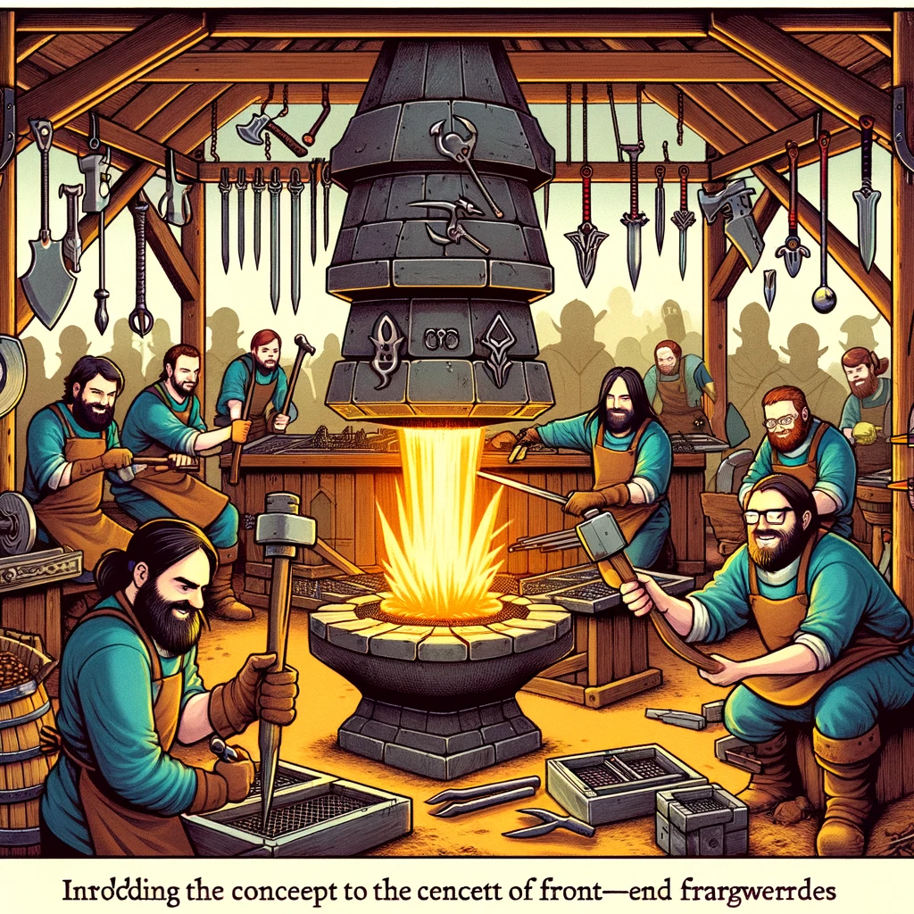

# JavaScripti Front-End raamistikud: Ülevaade

JavaScript on veebiarenduse lahutamatu osa, võimaldades dünaamilist ja interaktiivset sisu. JavaScripti front-end raamistikud ja teegid pakuvad struktuuritud lähenemist keerukate ja interaktiivsete kasutajaliideste loomiseks. Selles peatükis antakse ülevaade JavaScripti front-end raamistikest ja teekidest, nende omadustest ja kasutusjuhtudest.

Pildi allikas: Dall-E by OpenAI

- [JavaScripti Front-End raamistikud: Ülevaade](#javascripti-front-end-raamistikud-ülevaade)
  - [Õpiväljundid](#õpiväljundid)
  - [JavaScripti front-end raamistikud ja teegid](#javascripti-front-end-raamistikud-ja-teegid)
    - [Raamistik vs teek](#raamistik-vs-teek)
  - [Populaarsed JavaScripti front-end raamistikud ja teegid](#populaarsed-javascripti-front-end-raamistikud-ja-teegid)
    - [React](#react)
    - [Angular](#angular)
    - [Vue.js](#vuejs)
    - [Svelte](#svelte)
  - [Front-end raamistikute ja teekide eelised](#front-end-raamistikute-ja-teekide-eelised)
  - [Allikad](#allikad)
  - [Kontrollküsimused või harjutus](#kontrollküsimused-või-harjutus)

## Õpiväljundid

Selle peatüki lõpuks peaksid õppijad olema võimelised:

- selgitama, mis on JavaScripti front-end raamistik;
- tundma populaarsemaid JavaScripti front-end raamistikud ja teeke;
- aru saama front-end raamistikute ja teekide peamistest omadustest ja eelistest.

## JavaScripti front-end raamistikud ja teegid

JavaScripti front-end raamistikud ja teegid pakuvad tööriistu ja raamistikke, mis lihtsustavad veebirakenduste arendamist. Need raamistikud ja teegid aitavad hallata DOM-i manipuleerimist, sündmuste käsitlemist ja andmehaldust, pakkudes samas struktureeritud lähenemist koodi organiseerimisele.

### Raamistik vs teek

- **Raamistik:** Raamistik määratleb rakenduse struktuuri ja pakub reeglid ja konventsioonid, mille järgi rakendust ehitatakse. Raamistik võtab kontrolli enda kätte ja käivitab koodi vastavalt vajadusele.
- **Teek:** Teek on tööriistade kogum, mida saab kasutada teatud funktsionaalsuse lisamiseks rakendusse. Teek annab arendajale kontrolli selle üle, millal ja kuidas koodi kasutatakse.

## Populaarsed JavaScripti front-end raamistikud ja teegid

### React

**React** on populaarne JavaScripti teek, mida kasutatakse kasutajaliideste loomiseks. Selle töötas välja Facebook ja see põhineb komponentidel, mis võimaldavad arendajatel luua korduvkasutatavaid UI komponente. React kasutab virtuaalset DOM-i, mis parandab jõudlust ja annab arendajatele suurema kontrolli renderdamisprotsessi üle.

- **Peamised omadused:**
  - Komponentidel põhinev arhitektuur
  - Virtuaalne DOM
  - Ühesuunaline andmevoog
  - React Hooks ja funktsionaalne programmeerimine
- **Kasutusjuhud:**
  - Dünaamilised veebirakendused
  - Ühelehe rakendused (SPA)
  - Korduvkasutatavad UI komponendid

### Angular

**Angular** on täisfunktsionaalne JavaScripti raamistik, mida arendab Google. Angular kasutab TypeScripti ja pakub ulatuslikku tööriistade komplekti veebirakenduste arendamiseks, sealhulgas andmesidumine, teenused, suunamine ja testimine. Angular järgib MVC (Model-View-Controller) arhitektuuri, mis aitab hoida koodi organiseeritud ja skaleeritavana.

- **Peamised omadused:**
  - MV* arhitektuur
  - Kahesuunaline andmesidumine
  - Komponentidel põhinev struktuur
  - Sisseehitatud suunamine ja HTTP teenused
- **Kasutusjuhud:**
  - Suured ja keerukad veebirakendused
  - Ettevõtte taseme rakendused
  - Ühelehe rakendused (SPA)

### Vue.js

**Vue.js** on progressiivne JavaScripti raamistik, mis keskendub kasutajaliideste ja ühelehe rakenduste arendamisele. Vue.js on tuntud oma lihtsuse ja paindlikkuse poolest, pakkudes samas võimsaid tööriistu ja funktsioone. Vue.js kasutab komponentidel põhinevat lähenemist ja toetab nii ühesuunalist kui ka kahesuunalist andmesidumist.

- **Peamised omadused:**
  - Komponentidel põhinev arhitektuur
  - Kerge ja paindlik
  - Ühesuunaline ja kahesuunaline andmesidumine
  - Reaktiivne andmeside
- **Kasutusjuhud:**
  - Väikesed kuni keskmise suurusega rakendused
  - Ühelehe rakendused (SPA)
  - Kiire prototüüpide loomine

### Svelte

**Svelte** on kaasaegne JavaScripti raamistik, mis erineb teistest raamistikest, kuna see teeb enamiku tööst kompileerimise ajal, mitte brauseris. Svelte kirjutab komponente tavalisse JavaScripti, mis teeb rakendused kiireks ja väiksemaks.

- **Peamised omadused:**
  - Kompileerimise aegne töötlus
  - Kerge ja kiire
  - Lihtne õppida ja kasutada
  - Reaktiivne andmeside
- **Kasutusjuhud:**
  - Väikesed ja keskmise suurusega rakendused
  - Ühelehe rakendused (SPA)
  - Projekti kiire algus ja prototüüpide loomine

## Front-end raamistikute ja teekide eelised

- **Korduvkasutatavad komponendid:** Komponentidel põhinev arhitektuur võimaldab luua korduvkasutatavaid UI komponente, mis vähendab koodi duplikaate ja lihtsustab hooldust.
- **Jõudlus:** Virtuaalne DOM ja optimeeritud renderdamisprotsessid parandavad veebirakenduste jõudlust.
- **Modulaarsus:** Raamistikud ja teegid jagavad rakenduse väikesteks, hallatavateks osadeks, mis parandab koodi organiseerimist ja skaleeritavust.
- **Arendusefektiivsus:** Sisseehitatud tööriistad ja funktsioonid, nagu suunamine, andmesidumine ja testimine, kiirendavad arendusprotsessi.
- **Kogukond ja tugi:** Suur kogukond ja ulatuslik dokumentatsioon pakuvad tuge ja ressursse probleemide lahendamiseks ja parimate praktikate õppimiseks.

## Allikad

- [React Official Documentation](https://react.dev/)
- [Angular Official Documentation](https://angular.io/docs)
- [Vue.js Official Documentation](https://vuejs.org/v2/guide/)
- [Svelte Official Documentation](https://svelte.dev/docs)
- [JavaScript Front-End Frameworks and Libraries](https://www.javascriptstuff.com/)

## Kontrollküsimused või harjutus

- Mis on JavaScripti front-end raamistik ja kuidas see erineb teegist?
- Nimetage vähemalt kolm populaarset JavaScripti front-end raamistikku ja teeki.
- Selgitage Reacti peamisi omadusi ja kasutusjuhte.
