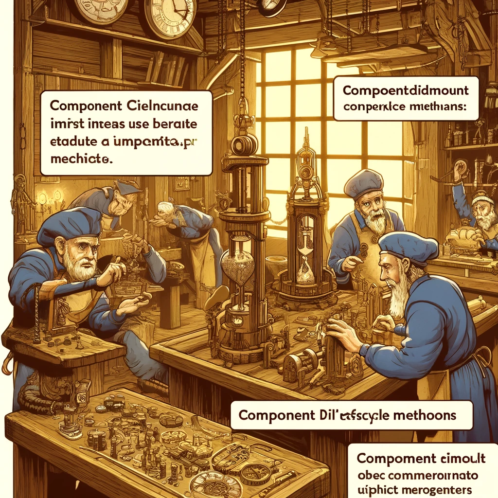

# Reacti Elutsükli Meetodid (Lifecycle Methods)

Reacti elutsükli meetodid võimaldavad arendajatel teostada koodi konkreetsetes punktides komponentide elutsükli jooksul. Need meetodid on eriti olulised klassipõhistes komponentides, kus need pakuvad võimalust hallata komponentide loomist, ajakohastamist ja eemaldamist. Selles peatükis käsitleme Reacti elutsükli meetodeid, nende kasutamist ja praktilisi näiteid.



Pildi allikas: Dall-E by OpenAI

- [Reacti Elutsükli Meetodid (Lifecycle Methods)](#reacti-elutsükli-meetodid-lifecycle-methods)
  - [Õpiväljundid](#õpiväljundid)
  - [Reacti Elutsükli Meetodid Klassipõhistes Komponentides](#reacti-elutsükli-meetodid-klassipõhistes-komponentides)
    - [Loomise Etapp](#loomise-etapp)
    - [Ajakohastamise Etapp](#ajakohastamise-etapp)
    - [Eemaldamise Etapp](#eemaldamise-etapp)
  - [Elutsükli Meetodid Funktsionaalsetes Komponentides](#elutsükli-meetodid-funktsionaalsetes-komponentides)
    - [`useEffect` Hook](#useeffect-hook)
      - [componentDidMount ja componentWillUnmount](#componentdidmount-ja-componentwillunmount)
      - [componentDidUpdate](#componentdidupdate)
  - [Praktiline Näide: Täielik Elutsükli Meetodite Kasutamine](#praktiline-näide-täielik-elutsükli-meetodite-kasutamine)
    - [Klassipõhine Komponent](#klassipõhine-komponent)
    - [Funktsionaalne Komponent Hookidega](#funktsionaalne-komponent-hookidega)
  - [Allikad](#allikad)
  - [Kontrollküsimused või harjutus](#kontrollküsimused-või-harjutus)
  - [Harjutus](#harjutus)

## Õpiväljundid

Selle peatüki lõpuks peaksid õppijad olema võimelised:

- selgitama, mis on Reacti elutsükli meetodid ja miks neid kasutatakse;
- kasutama erinevaid elutsükli meetodeid klassipõhistes komponentides;
- rakendama elutsükli meetodeid, et hallata komponentide loomist, ajakohastamist ja eemaldamist;
- mõistma funktsionaalsete komponentide elutsükli juhtimist Hookide abil.

## Reacti Elutsükli Meetodid Klassipõhistes Komponentides

Reacti elutsükli meetodid võib jagada kolme põhietappi: loomine, ajakohastamine ja eemaldamine.

### Loomise Etapp

1. **constructor(props)**: See meetod kutsub välja komponendi loomisel. Tavaliselt kasutatakse seda meetodit oleku esialgseks seadistamiseks ja sidumiste loomiseks.

```javascript
class MyComponent extends React.Component {
  constructor(props) {
    super(props);
    this.state = { count: 0 };
  }
  
  render() {
    return <div>{this.state.count}</div>;
  }
}
```

1. **componentDidMount()**: See meetod kutsub välja kohe pärast komponendi esmakordset renderdamist. Seda kasutatakse sageli andmete toomiseks või teatud DOM manipulatsioonide teostamiseks.

```javascript
class MyComponent extends React.Component {
  componentDidMount() {
    // Kood, mis täidetakse pärast komponenti paigaldamist
    console.log("Component did mount");
  }
  
  render() {
    return <div>Component</div>;
  }
}
```

### Ajakohastamise Etapp

1. **shouldComponentUpdate(nextProps, nextState)**: See meetod määrab, kas komponent peaks uuesti renderdatama, kui rekvisiidid või olek muutuvad. See võib parandada jõudlust, kui seda kasutatakse õigesti.

```javascript
class MyComponent extends React.Component {
  shouldComponentUpdate(nextProps, nextState) {
    // Naase true või false
    return nextState.count !== this.state.count;
  }
  
  render() {
    return <div>{this.state.count}</div>;
  }
}
```

2. **componentDidUpdate(prevProps, prevState)**: See meetod kutsub välja kohe pärast komponenti värskendamist. Seda saab kasutada pärast DOM-i värskendamist teatud tegevuste teostamiseks.

```javascript
class MyComponent extends React.Component {
  componentDidUpdate(prevProps, prevState) {
    if (prevState.count !== this.state.count) {
      console.log("Component did update");
    }
  }
  
  render() {
    return <div>{this.state.count}</div>;
  }
}
```

### Eemaldamise Etapp

1. **componentWillUnmount()**: See meetod kutsub välja vahetult enne komponendi eemaldamist DOM-ist. Seda kasutatakse puhastamiseks, näiteks ajutiste ressursside vabastamiseks või sündmuste eemaldamiseks.

```javascript
class MyComponent extends React.Component {
  componentWillUnmount() {
    // Puhastustegevused
    console.log("Component will unmount");
  }
  
  render() {
    return <div>Component</div>;
  }
}
```

## Elutsükli Meetodid Funktsionaalsetes Komponentides

Funktsionaalsetes komponentides hallatakse elutsüklit Hookide abil, peamiselt `useEffect` hooki kasutades.

### `useEffect` Hook

`useEffect` hook võimaldab hallata kõrvalmõjusid funktsionaalsetes komponentides ja simuleerida klassipõhiste komponentide elutsükli meetodeid.

#### componentDidMount ja componentWillUnmount

```javascript
import React, { useEffect } from 'react';

function MyComponent() {
  useEffect(() => {
    console.log("Component did mount");
    
    return () => {
      console.log("Component will unmount");
    };
  }, []); // Tühja sõltuvustemassiivi kasutamine tähendab, et effect käivitatakse ainult üks kord
  
  return <div>Component</div>;
}
```

#### componentDidUpdate

```javascript
import React, { useState, useEffect } from 'react';

function MyComponent() {
  const [count, setCount] = useState(0);

  useEffect(() => {
    console.log("Component did update", count);
  }, [count]); // Käivita effect ainult siis, kui count muutub
  
  return (
    <div>
      <p>{count}</p>
      <button onClick={() => setCount(count + 1)}>Increment</button>
    </div>
  );
}
```

## Praktiline Näide: Täielik Elutsükli Meetodite Kasutamine

### Klassipõhine Komponent

```javascript
import React from 'react';

class MyComponent extends React.Component {
  constructor(props) {
    super(props);
    this.state = { count: 0 };
    this.increment = this.increment.bind(this);
  }

  increment() {
    this.setState({ count: this.state.count + 1 });
  }

  componentDidMount() {
    console.log("Component did mount");
  }

  shouldComponentUpdate(nextProps, nextState) {
    return nextState.count !== this.state.count;
  }

  componentDidUpdate(prevProps, prevState) {
    if (prevState.count !== this.state.count) {
      console.log("Component did update");
    }
  }

  componentWillUnmount() {
    console.log("Component will unmount");
  }

  render() {
    return (
      <div>
        <p>Count: {this.state.count}</p>
        <button onClick={this.increment}>Increment</button>
      </div>
    );
  }
}

export default MyComponent;
```

### Funktsionaalne Komponent Hookidega

```javascript
import React, { useState, useEffect } from 'react';

function MyComponent() {
  const [count, setCount] = useState(0);

  useEffect(() => {
    console.log("Component did mount");

    return () => {
      console.log("Component will unmount");
    };
  }, []);

  useEffect(() => {
    console.log("Component did update", count);
  }, [count]);

  return (
    <div>
      <p>Count: {count}</p>
      <button onClick={() => setCount(count + 1)}>Increment</button>
    </div>
  );
}

export default MyComponent;
```

## Allikad

- [React Official Documentation - State and Lifecycle](https://reactjs.org/docs/state-and-lifecycle.html)
- [React Official Documentation - Hooks API Reference](https://reactjs.org/docs/hooks-reference.html)
- [JavaScript Front-End Frameworks and Libraries](https://www.javascriptstuff.com/)

## Kontrollküsimused või harjutus

- Mis on Reacti elutsükli meetodid ja miks neid kasutatakse?
- Kirjeldage erinevusi componentDidMount ja componentWillUnmount vahel.
- Kuidas kasutatakse shouldComponentUpdate meetodit ja miks see võib olla kasulik?
- Selgitage, kuidas kasutada `useEffect` hooki funktsionaalsetes komponentides.
- Looge näide, mis demonstreerib komponentide loomist, ajakohastamist ja eemaldamist kasutades elutsükli meetodeid.

## Harjutus

- Looge klassipõhine komponent, mis kuvab andmete loendi, toob andmed serverist componentDidMount meetodi abil ja uuendab andmete loendit componentDidUpdate meetodi abil.
- Looge funktsionaalne komponent, mis teeb sama, kasutades `useEffect` hooki.
- Katsetage komponentide eemaldamist ja veenduge, et vajalikud puhastustegevused toimuvad componentWillUnmount või `useEffect` return funktsiooni abil.