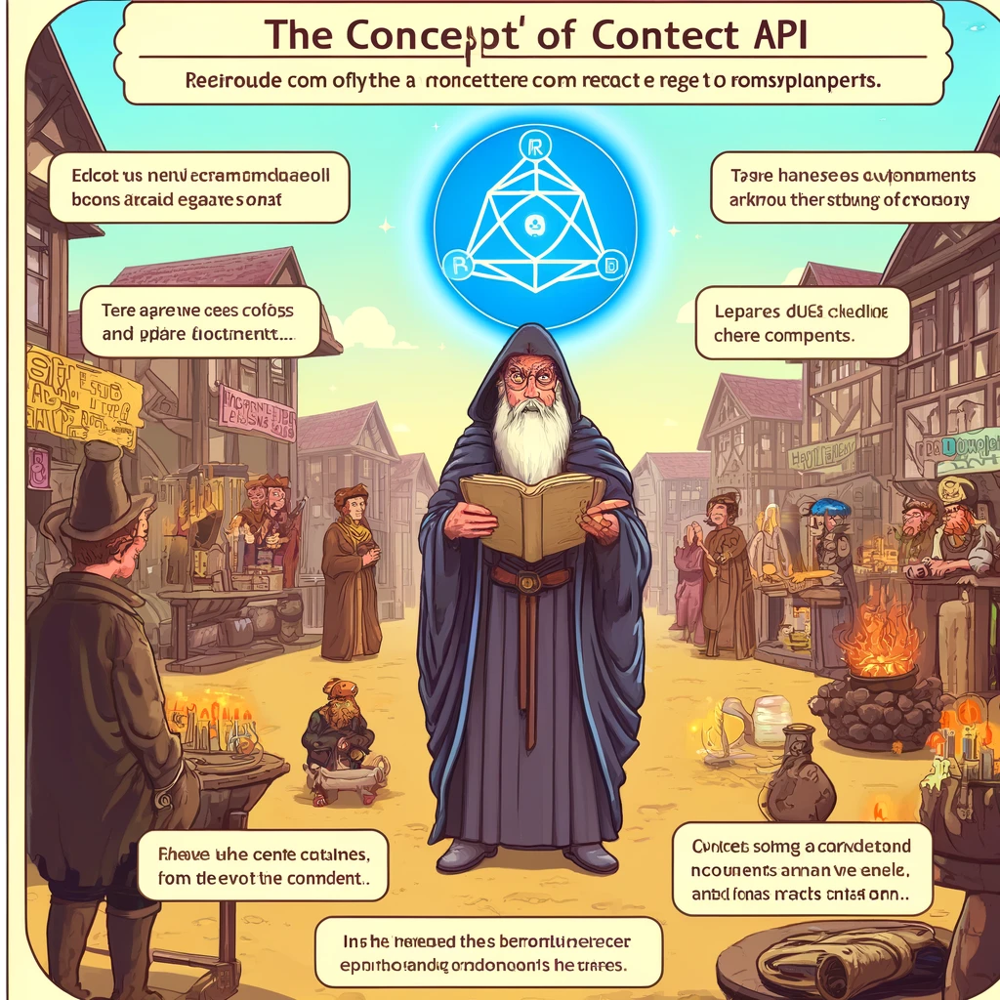

# React Context API

React Context API on võimas vahend, mis võimaldab teil jagada väärtusi komponentide vahel ilma, et peaksite neid väärtusi edastama iga komponentide ahela kaudu käsitsi. See on eriti kasulik globaalse oleku, näiteks teema, autentimise või keele seadete haldamiseks.



Pildi allikas: Dall-E by OpenAI

- [React Context API](#react-context-api)
  - [Õpiväljundid](#õpiväljundid)
  - [React Context API Käsitlus](#react-context-api-käsitlus)
    - [Konteksti loomine](#konteksti-loomine)
    - [`Provider` Komponendi Kasutamine](#provider-komponendi-kasutamine)
    - [`Consumer` Komponendi Kasutamine](#consumer-komponendi-kasutamine)
    - [`useContext` Hooki Kasutamine](#usecontext-hooki-kasutamine)
  - [Näide: Teema Halduse Rakendamine Context API-ga](#näide-teema-halduse-rakendamine-context-api-ga)
    - [Loo Konteksti Fail](#loo-konteksti-fail)
    - [Kasuta `ThemeProvider` Peamise Rakenduse Ümber](#kasuta-themeprovider-peamise-rakenduse-ümber)
    - [Tarbi Teema Konteksti Komponendis](#tarbi-teema-konteksti-komponendis)
  - [Kokkuvõte](#kokkuvõte)
  - [Kontrollküsimused](#kontrollküsimused)
  - [Harjutus](#harjutus)
  - [Allikad](#allikad)

## Õpiväljundid

Pärast selle peatüki läbimist peaksid olema võimelised:

- Selgitama, mis on React Context API ja millal seda kasutada.
- Looma ja konfigureerima React Contexti.
- Tarbima Contexti andmeid erinevates komponentides.
- Käsitlema ja uuendama Contexti väärtusi rakenduses.

---

## React Context API Käsitlus

### Konteksti loomine

Konteksti loomine algab `React.createContext` funktsiooniga. See loob konteksti objekti, mis sisaldab `Provider` ja `Consumer` komponente.

```javascript
import React from 'react';

// Loo konteksti objekt
const MyContext = React.createContext();
```

### `Provider` Komponendi Kasutamine

`Provider` komponent on koht, kus sa määrad andmed, mida soovid jagada. See komponent ümbritseb neid komponente, mis vajavad juurdepääsu konteksti väärtustele.

```javascript
// App.js
import React, { useState } from 'react';
import MyContext from './MyContext';
import MyComponent from './MyComponent';

const App = () => {
  const [value, setValue] = useState('Hello, World!');

  return (
    <MyContext.Provider value={{ value, setValue }}>
      <MyComponent />
    </MyContext.Provider>
  );
};

export default App;
```

### `Consumer` Komponendi Kasutamine

`Consumer` komponent võimaldab ligipääsu konteksti väärtustele. See võib olla kasulik lihtsamates olukordades, kuid sageli kasutame `useContext` hooki.

```javascript
// MyComponent.js
import React from 'react';
import MyContext from './MyContext';

const MyComponent = () => (
  <MyContext.Consumer>
    {({ value, setValue }) => (
      <div>
        <p>{value}</p>
        <button onClick={() => setValue('Hello, React!')}>Change Text</button>
      </div>
    )}
  </MyContext.Consumer>
);

export default MyComponent;
```

### `useContext` Hooki Kasutamine

`useContext` hook võimaldab lihtsamat ja kaasaegsemat viisi konteksti väärtuste kasutamiseks funktsionaalsetes komponentides.

```javascript
// MyComponent.js
import React, { useContext } from 'react';
import MyContext from './MyContext';

const MyComponent = () => {
  const { value, setValue } = useContext(MyContext);

  return (
    <div>
      <p>{value}</p>
      <button onClick={() => setValue('Hello, React!')}>Change Text</button>
    </div>
  );
};

export default MyComponent;
```

## Näide: Teema Halduse Rakendamine Context API-ga

Loome lihtsa näite, kuidas Context API-d kasutada teema haldamiseks rakenduses. Meil on tume ja hele teema, mida saame vahetada `Provider` ja `useContext` abil.

### Loo Konteksti Fail

```javascript
// ThemeContext.js
import React, { createContext, useState } from 'react';

export const ThemeContext = createContext();

export const ThemeProvider = ({ children }) => {
  const [theme, setTheme] = useState('light');

  const toggleTheme = () => {
    setTheme((prevTheme) => (prevTheme === 'light' ? 'dark' : 'light'));
  };

  return (
    <ThemeContext.Provider value={{ theme, toggleTheme }}>
      {children}
    </ThemeContext.Provider>
  );
};
```

### Kasuta `ThemeProvider` Peamise Rakenduse Ümber

```javascript
// App.js
import React from 'react';
import { ThemeProvider } from './ThemeContext';
import ThemedComponent from './ThemedComponent';

const App = () => (
  <ThemeProvider>
    <ThemedComponent />
  </ThemeProvider>
);

export default App;
```

### Tarbi Teema Konteksti Komponendis

```javascript
// ThemedComponent.js
import React, { useContext } from 'react';
import { ThemeContext } from './ThemeContext';

const ThemedComponent = () => {
  const { theme, toggleTheme } = useContext(ThemeContext);

  const styles = {
    light: { background: '#fff', color: '#000' },
    dark: { background: '#000', color: '#fff' },
  };

  return (
    <div style={styles[theme]}>
      <p>The current theme is {theme}</p>
      <button onClick={toggleTheme}>Toggle Theme</button>
    </div>
  );
};

export default ThemedComponent;
```

## Kokkuvõte

- **React Context API** pakub viisi, kuidas jagada väärtusi komponentide vahel ilma "prop drilling'uta".
- **`Provider`** määrab konteksti väärtused, mida jagatakse kõigi alamkomponentide vahel.
- **`Consumer` ja `useContext`** võimaldavad komponentidel tarbida konteksti väärtusi.
- **Context API** on eriti kasulik globaalse oleku haldamiseks, nagu teema või autentimine.

## Kontrollküsimused

1. Mis on React Context API ja millal peaksite seda kasutama?
2. Kuidas loote ja kasutate `Provider` komponenti React Context API-s?
3. Kuidas tarbite konteksti väärtusi `Consumer` komponendi ja `useContext` hooki abil?
4. Miks võib Context API olla parem valik võrreldes prop drilling'uga?

## Harjutus

- **Loo konteksti haldamiseks lihtne rakendus, kus saad vahetada keelt (nt inglise ja eesti vahel) ja kuvada vastavat tervitusteksti valitud keeles.**
- **Kasuta `Provider` ja `useContext`, et hallata valitud keelt ja muuta rakenduse sisu dünaamiliselt.**

## Allikad

- [React Documentation - Context](https://react.dev/reference/react/useContext)
- [React Context API for Beginners](https://www.freecodecamp.org/news/react-context-for-beginners/)
