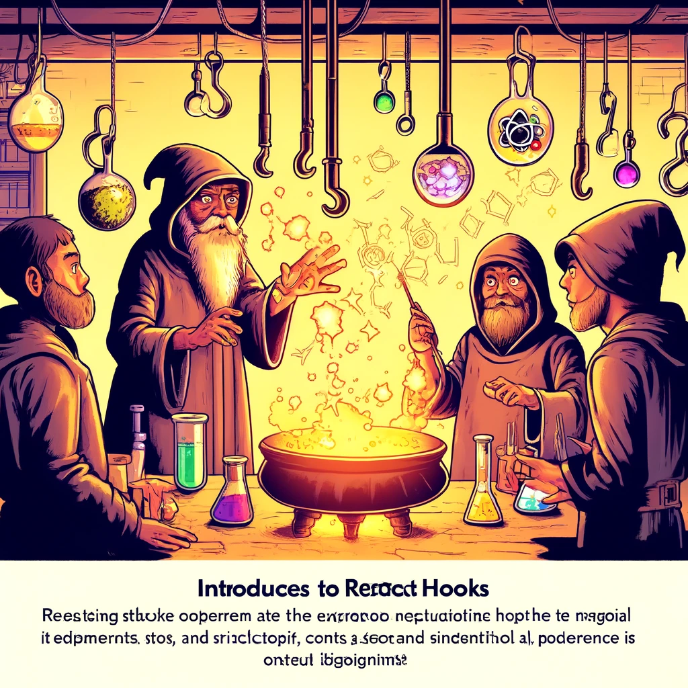

# Reacti Hookid

Reacti Hookid on funktsioonid, mis võimaldavad kasutada olekut ja muid Reacti funktsioone funktsionaalsetes komponentides. Hookid võimaldavad hallata olekut, käivitada kõrvalmõjusid ja kasutada muid Reacti funktsioone ilma klassipõhiste komponentideta. Hookid tutvustati Reacti versioonis 16.8 ning need on muutnud funktsionaalsete komponentide kasutamise ja haldamise palju lihtsamaks ja võimsamaks.



Pildi allikas: Dall-E by OpenAI

- [Reacti Hookid](#reacti-hookid)
  - [Õpiväljundid](#õpiväljundid)
  - [Hookide põhitõed](#hookide-põhitõed)
    - [Mis on Hookid?](#mis-on-hookid)
    - [Hookide reeglid](#hookide-reeglid)
  - [`useState` Hook](#usestate-hook)
    - [Näide: `useState` hooki kasutamine](#näide-usestate-hooki-kasutamine)
  - [`useEffect` Hook](#useeffect-hook)
    - [Näide: `useEffect` hooki kasutamine](#näide-useeffect-hooki-kasutamine)
  - [Muud levinumad Hookid](#muud-levinumad-hookid)
    - [`useContext` Hook](#usecontext-hook)
    - [Näide: `useContext` hooki kasutamine](#näide-usecontext-hooki-kasutamine)
    - [`useReducer` Hook](#usereducer-hook)
    - [Näide: `useReducer` hooki kasutamine](#näide-usereducer-hooki-kasutamine)
    - [`useRef` Hook](#useref-hook)
    - [Näide: `useRef` hooki kasutamine](#näide-useref-hooki-kasutamine)
  - [Kohandatud Hookid](#kohandatud-hookid)
    - [Näide: Kohandatud hooki loomine](#näide-kohandatud-hooki-loomine)
  - [Allikad](#allikad)
  - [Kontrollküsimused või harjutus](#kontrollküsimused-või-harjutus)
  - [Harjutus](#harjutus)

## Õpiväljundid

Selle peatüki lõpuks peaksid õppijad olema võimelised:

- selgitama, mis on Hookid ja miks neid kasutatakse;
- kasutama `useState` hooki oleku haldamiseks funktsionaalsetes komponentides;
- kasutama `useEffect` hooki kõrvalmõjude haldamiseks;
- kirjeldama ja kasutama teisi levinumaid hooke nagu `useContext`, `useReducer` ja `useRef`;
- looma oma kohandatud hooke.

## Hookide põhitõed

### Mis on Hookid?

Hookid on erifunktsioonid, mis võimaldavad kasutada olekut ja muid Reacti funktsioone funktsionaalsetes komponentides. Hookid järgivad teatavaid reegleid, näiteks tuleb neid kutsuda ainult funktsiooni ülemisel tasemel ega tohi kutsuda tingimuslikult või silmuste sees.

### Hookide reeglid

- **Kutsuge hooke ainult funktsioonide ülemisel tasemel:** Ärge kutsuge hooke tsüklites, tingimustes ega sisefunktsioonides.
- **Kutsuge hooke ainult Reacti funktsionaalsetes komponentides või kohandatud hookides:** Ärge kasutage hooke väljaspool Reacti komponente.

## `useState` Hook

`useState` hook võimaldab komponentidel hallata ja ajakohastada oma olekut. See tagastab massiivi, mis sisaldab praegust oleku väärtust ja funktsiooni, mis võimaldab olekut uuendada.

### Näide: `useState` hooki kasutamine

```javascript
import React, { useState } from 'react';

function Counter() {
  const [count, setCount] = useState(0);

  return (
    <div>
      <p>You clicked {count} times</p>
      <button onClick={() => setCount(count + 1)}>
        Click me
      </button>
    </div>
  );
}

export default Counter;
```

## `useEffect` Hook

`useEffect` hook võimaldab käivitada kõrvalmõjusid funktsionaalsetes komponentides, näiteks andmete toomine, tellimused ja DOM-i manipuleerimine. `useEffect` käivitub pärast iga renderdamist vaikimisi.

### Näide: `useEffect` hooki kasutamine

```javascript
import React, { useState, useEffect } from 'react';

function Example() {
  const [count, setCount] = useState(0);

  useEffect(() => {
    document.title = `You clicked ${count} times`;

    return () => {
      // Cleanup, kui component unmountitakse või effect uuendatakse
      console.log('Cleanup');
    };
  }, [count]); // Ainult kui count muutub

  return (
    <div>
      <p>You clicked {count} times</p>
      <button onClick={() => setCount(count + 1)}>
        Click me
      </button>
    </div>
  );
}

export default Example;
```

## Muud levinumad Hookid

### `useContext` Hook

`useContext` hook võimaldab kasutada konteksti väärtusi komponentide puus ilma prop drillinguta.

### Näide: `useContext` hooki kasutamine

```javascript
import React, { createContext, useContext, useState } from 'react';

const MyContext = createContext();

function MyProvider({ children }) {
  const [value, setValue] = useState("Hello from Context!");

  return (
    <MyContext.Provider value={value}>
      {children}
    </MyContext.Provider>
  );
}

function MyComponent() {
  const value = useContext(MyContext);
  return <p>{value}</p>;
}

function App() {
  return (
    <MyProvider>
      <MyComponent />
    </MyProvider>
  );
}

export default App;
```

### `useReducer` Hook

`useReducer` hook on alternatiiv `useState`-ile, mis sobib keerukama oleku loogika jaoks, eriti kui olek sõltub mitmest alamolekust või tegevusest.

### Näide: `useReducer` hooki kasutamine

```javascript
import React, { useReducer } from 'react';

const initialState = { count: 0 };

function reducer(state, action) {
  switch (action.type) {
    case 'increment':
      return { count: state.count + 1 };
    case 'decrement':
      return { count: state.count - 1 };
    default:
      throw new Error();
  }
}

function Counter() {
  const [state, dispatch] = useReducer(reducer, initialState);

  return (
    <div>
      <p>Count: {state.count}</p>
      <button onClick={() => dispatch({ type: 'increment' })}>+</button>
      <button onClick={() => dispatch({ type: 'decrement' })}>-</button>
    </div>
  );
}

export default Counter;
```

### `useRef` Hook

`useRef` hook võimaldab hoida viiteid DOM elementidele või muudele väärtustele, mis säilivad komponentide renderdamiste vahel muutumatuna.

### Näide: `useRef` hooki kasutamine

```javascript
import React, { useRef } from 'react';

function TextInputWithFocusButton() {
  const inputEl = useRef(null);

  const onButtonClick = () => {
    inputEl.current.focus();
  };

  return (
    <div>
      <input ref={inputEl} type="text" />
      <button onClick={onButtonClick}>Focus the input</button>
    </div>
  );
}

export default TextInputWithFocusButton;
```

## Kohandatud Hookid

Kohandatud hookid võimaldavad taaskasutada loogikat komponentide vahel. Kohandatud hook on lihtsalt JavaScripti funktsioon, mis kasutab teisi hooke.

### Näide: Kohandatud hooki loomine

```javascript
import React, { useState, useEffect } from 'react';

function useWindowWidth() {
  const [width, setWidth] = useState(window.innerWidth);

  useEffect(() => {
    const handleResize = () => setWidth(window.innerWidth);
    window.addEventListener('resize', handleResize);
    return () => window.removeEventListener('resize', handleResize);
  }, []);

  return width;
}

function App() {
  const width = useWindowWidth();

  return <div>Window width: {width}</div>;
}

export default App;
```

## Allikad

- [React Official Documentation - Hooks](https://reactjs.org/docs/hooks-intro.html)
- [React Hooks API Reference](https://reactjs.org/docs/hooks-reference.html)
- [JavaScript Front-End Frameworks and Libraries](https://www.javascriptstuff.com/)

## Kontrollküsimused või harjutus

- Mis on hookid ja miks neid kasutatakse Reactis?
- Kuidas kasutada `useState` hooki oleku haldamiseks?
- Kirjeldage `useEffect` hooki ja kuidas seda kasutatakse kõrvalmõjude haldamiseks.
- Kuidas kasutada `useContext` hooki konteksti väärtuste saamiseks?
- Millal on soovitatav kasutada `useReducer` hooki?

## Harjutus

- Looge uus React projekt, kasutades Create React App tööriista.
- Looge komponent, mis kasutab `useState` hooki, et hallata ja kuvada klikkide arvu.
- Looge komponent, mis kasutab `useEffect` hooki, et muuta dokumendi tiitlit vastavalt olekule.
