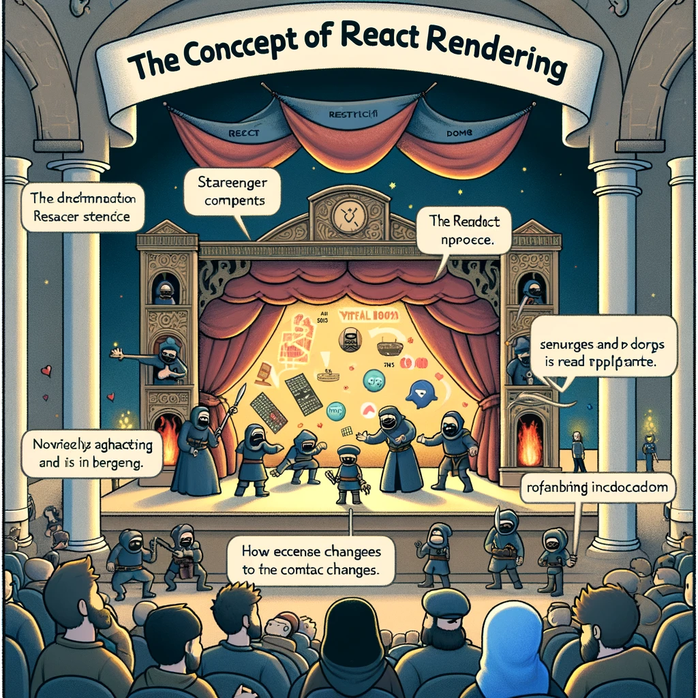

# Reacti Renderdamine ja Tingimuslik Renderdamine

Reacti renderdamine ja tingimuslik renderdamine on olulised kontseptsioonid, mis võimaldavad arendajatel luua dünaamilisi ja interaktiivseid kasutajaliideseid. Renderdamine määrab, kuidas komponenti ja selle lapskomponente kuvatakse DOM-is. Tingimuslik renderdamine võimaldab kuvada komponente või elemente sõltuvalt teatud tingimustest.



Pildi allikas: [Dall-E by OpenAI](https://openai.com/)

- [Reacti Renderdamine ja Tingimuslik Renderdamine](#reacti-renderdamine-ja-tingimuslik-renderdamine)
  - [Õpiväljundid](#õpiväljundid)
  - [Reacti Renderdamine](#reacti-renderdamine)
    - [Mis on renderdamine?](#mis-on-renderdamine)
    - [Renderdamine funktsionaalsetes komponentides](#renderdamine-funktsionaalsetes-komponentides)
    - [Renderdamine klassipõhistes komponentides](#renderdamine-klassipõhistes-komponentides)
    - [Reacti virtuaalne DOM](#reacti-virtuaalne-dom)
  - [Tingimuslik renderdamine](#tingimuslik-renderdamine)
    - [If-lause kasutamine](#if-lause-kasutamine)
    - [Ternaaroperaatori kasutamine](#ternaaroperaatori-kasutamine)
    - [Loogilise JA (\&\&) operaatori kasutamine](#loogilise-ja--operaatori-kasutamine)
    - [Elementide muutmine muutujates](#elementide-muutmine-muutujates)
    - [Tingimuslik renderdamine klassipõhises komponendis](#tingimuslik-renderdamine-klassipõhises-komponendis)
  - [Praktiline näide: Login ja Logout](#praktiline-näide-login-ja-logout)
    - [Funktsionaalne komponent](#funktsionaalne-komponent)
    - [Klassipõhine komponent](#klassipõhine-komponent)
  - [Allikad](#allikad)
  - [Kontrollküsimused või harjutus](#kontrollküsimused-või-harjutus)
  - [Harjutus](#harjutus)

## Õpiväljundid

Selle peatüki lõpuks peaksid õppijad olema võimelised:

- selgitama, mis on renderdamine Reactis;
- kirjeldama, kuidas React uuendab DOM-i vastavalt komponentide olekule ja propsidele;
- kasutama tingimuslikku renderdamist, et kuvada komponente ja elemente vastavalt teatud tingimustele;
- rakendama erinevaid tingimusliku renderdamise tehnikaid Reactis.

## Reacti Renderdamine

### Mis on renderdamine?

Renderdamine on protsess, mille käigus Reacti komponendid muudetakse DOM elementideks, mis kuvatakse brauseris. React kasutab virtuaalset DOM-i, et optimeerida renderdamisprotsessi ja vähendada tegeliku DOM-i värskenduste arvu.

### Renderdamine funktsionaalsetes komponentides

Funktsionaalsetes komponentides toimub renderdamine, kui komponent tagastab JSX-i.

```javascript
import React from 'react';

function Greeting(props) {
  return <h1>Hello, {props.name}!</h1>;
}

export default Greeting;
```

### Renderdamine klassipõhistes komponentides

Klassipõhistes komponentides toimub renderdamine `render` meetodi kaudu.

```javascript
import React, { Component } from 'react';

class Greeting extends Component {
  render() {
    return <h1>Hello, {this.props.name}!</h1>;
  }
}

export default Greeting;
```

### Reacti virtuaalne DOM

Virtuaalne DOM on kergversioon tegelikust DOM-ist, mida React kasutab muudatuste jälgimiseks ja efektiivseks värskendamiseks. Kui komponenti renderdatakse, värskendab React virtuaalset DOM-i ja seejärel sünkroniseerib muudatused tegeliku DOM-iga, vähendades seeläbi jõudlust mõjutavate DOM-i operatsioonide arvu.

## Tingimuslik renderdamine

Tingimuslik renderdamine võimaldab kuvada komponente või elemente ainult teatud tingimustel. Reactis on mitmeid viise tingimusliku renderdamise teostamiseks, sealhulgas if-lause, loogilised JA (&&) ja VÕI (||) operaatorid ning ternaaroperaator.

### If-lause kasutamine

If-lauset saab kasutada tingimusliku renderdamise jaoks funktsiooni sees.

```javascript
function Greeting(props) {
  if (props.isLoggedIn) {
    return <h1>Welcome back!</h1>;
  } else {
    return <h1>Please sign in.</h1>;
  }
}
```

### Ternaaroperaatori kasutamine

Ternaaroperaator on lühike viis tingimusliku renderdamise teostamiseks.

```javascript
function Greeting(props) {
  return props.isLoggedIn ? <h1>Welcome back!</h1> : <h1>Please sign in.</h1>;
}
```

### Loogilise JA (&&) operaatori kasutamine

Loogilist JA operaatorit saab kasutada, kui soovite kuvada midagi ainult siis, kui tingimus on tõene.

```javascript
function Greeting(props) {
  return (
    <div>
      {props.isLoggedIn && <h1>Welcome back!</h1>}
      {!props.isLoggedIn && <h1>Please sign in.</h1>}
    </div>
  );
}
```

### Elementide muutmine muutujates

Tingimuslik renderdamine võib olla ka puhtam, kui loote muutuja, mis sisaldab tingimuslikku sisu, ja seejärel kasutate seda renderdamise ajal.

```javascript
function Greeting(props) {
  let message;
  if (props.isLoggedIn) {
    message = <h1>Welcome back!</h1>;
  } else {
    message = <h1>Please sign in.</h1>;
  }

  return <div>{message}</div>;
}
```

### Tingimuslik renderdamine klassipõhises komponendis

```javascript
import React, { Component } from 'react';

class Greeting extends Component {
  render() {
    if (this.props.isLoggedIn) {
      return <h1>Welcome back!</h1>;
    } else {
      return <h1>Please sign in.</h1>;
    }
  }
}

export default Greeting;
```

## Praktiline näide: Login ja Logout

### Funktsionaalne komponent

```javascript
import React, { useState } from 'react';

function App() {
  const [isLoggedIn, setIsLoggedIn] = useState(false);

  const handleLogin = () => {
    setIsLoggedIn(true);
  };

  const handleLogout = () => {
    setIsLoggedIn(false);
  };

  return (
    <div>
      {isLoggedIn ? (
        <div>
          <h1>Welcome back!</h1>
          <button onClick={handleLogout}>Logout</button>
        </div>
      ) : (
        <div>
          <h1>Please sign in.</h1>
          <button onClick={handleLogin}>Login</button>
        </div>
      )}
    </div>
  );
}

export default App;
```

### Klassipõhine komponent

```javascript
import React, { Component } from 'react';

class App extends Component {
  constructor(props) {
    super(props);
    this.state = {
      isLoggedIn: false
    };
  }

  handleLogin = () => {
    this.setState({ isLoggedIn: true });
  };

  handleLogout = () => {
    this.setState({ isLoggedIn: false });
  };

  render() {
    const { isLoggedIn } = this.state;

    return (
      <div>
        {isLoggedIn ? (
          <div>
            <h1>Welcome back!</h1>
            <button onClick={this.handleLogout}>Logout</button>
          </div>
        ) : (
          <div>
            <h1>Please sign in.</h1>
            <button onClick={this.handleLogin}>Login</button>
          </div>
        )}
      </div>
    );
  }
}

export default App;
```

## Allikad

- [React Official Documentation - Rendering Elements](https://reactjs.org/docs/rendering-elements.html)
- [React Official Documentation - Conditional Rendering](https://reactjs.org/docs/conditional-rendering.html)
- [JavaScript Front-End Frameworks and Libraries](https://www.javascriptstuff.com/)

## Kontrollküsimused või harjutus

- Mis on renderdamine Reactis ja kuidas see töötab?
- Kirjeldage erinevusi funktsionaalsete ja klassipõhiste komponentide renderdamise vahel.
- Kuidas kasutada if-lauset tingimusliku renderdamise teostamiseks Reactis?
- Mis on ternaaroperaator ja kuidas seda kasutada tingimuslikuks renderdamiseks?
- Kuidas kasutada loogilist JA (&&) operaatorit tingimusliku renderdamise jaoks?

## Harjutus

- Looge uus React projekt, kasutades Create React App tööriista.
- Looge komponent, mis kuvab tervituse sõnumi sõltuvalt kasutaja sisselogimise olekust (kasutades if-lauset).
- Muutke komponenti, et kasutada tingimuslikku renderdamist ternaaroperaatori abil.
- Lisage funktsioon, mis võimaldab kasutajal sisse ja välja logida, ning uuendage komponenti vastavalt sellele olekule.
- Katsetage loogilise JA (&&) operaatori kasutamist, et kuvada elemente ainult siis, kui tingimus on tõene.