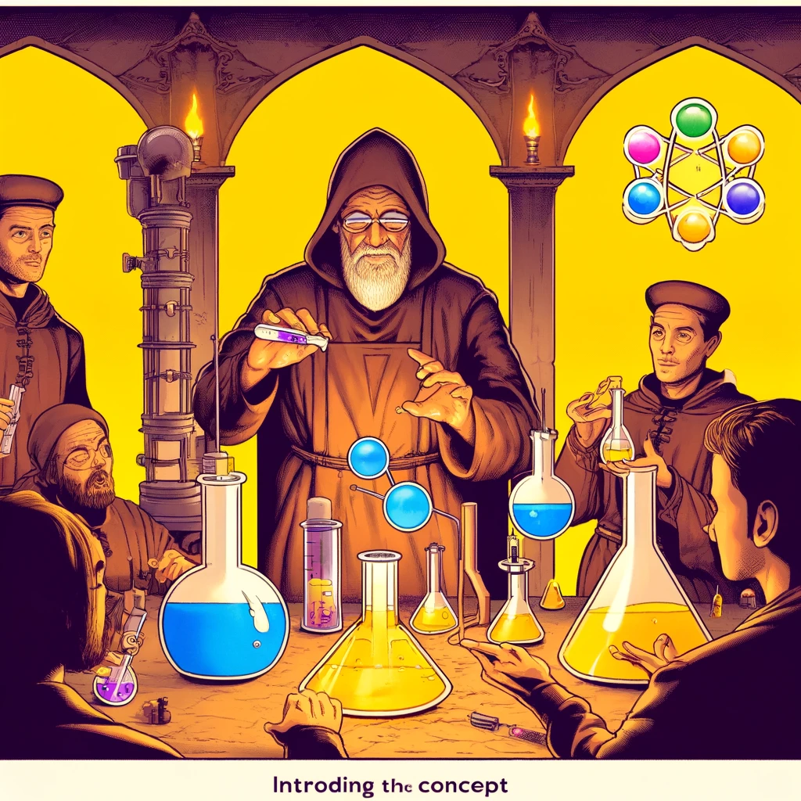

# React: Ülevaade ja kasutamine

React on populaarne avatud lähtekoodiga JavaScripti teek, mida kasutatakse kasutajaliideste loomiseks. Selle töötas välja Facebook ja see on muutunud üheks enim kasutatavaks tööriistaks tänu oma komponentidel põhinevale arhitektuurile ja jõudlusele. React keskendub komponentide loomisele, mis võimaldavad arendajatel luua korduvkasutatavaid ja isoleeritud UI tükke.



Pildi allikas: Dall-E by OpenAI

- [React: Ülevaade ja kasutamine](#react-ülevaade-ja-kasutamine)
  - [Õpiväljundid](#õpiväljundid)
  - [Reacti põhimõisted](#reacti-põhimõisted)
  - [React projekti loomine ja seadistamine](#react-projekti-loomine-ja-seadistamine)
    - [Create React App](#create-react-app)
      - [Create React App installimine](#create-react-app-installimine)
  - [React komponendid](#react-komponendid)
    - [Funktsionaalsed komponendid](#funktsionaalsed-komponendid)
    - [Klassipõhised komponendid](#klassipõhised-komponendid)
  - [React Hooks ja olekuhaldus (*state management*)](#react-hooks-ja-olekuhaldus-state-management)
    - [useState](#usestate)
    - [useEffect](#useeffect)
  - [Reacti põhimõtted ja tehnikad](#reacti-põhimõtted-ja-tehnikad)
    - [Ühesuunaline andmevoog](#ühesuunaline-andmevoog)
  - [Allikad](#allikad)
  - [Kontrollküsimused või harjutus](#kontrollküsimused-või-harjutus)
  - [Harjutus](#harjutus)

## Õpiväljundid

Selle peatüki lõpuks peaksid õppijad olema võimelised:

- selgitama, mis on React ja kuidas see töötab;
- looma React projekt ja seadistama arenduskeskkonna;
- loome ja haldama React komponente;
- kasutama React Hooks-i ja olekuhaldust (*state management*).

## Reacti põhimõisted

**Komponendid:** Reacti põhielemendid, mis võimaldavad arendajatel jagada kasutajaliidese väikesteks, hallatavateks tükkideks. Komponendid võivad olla funktsionaalsed või klassipõhised.

**Virtuaalne DOM:** React kasutab virtuaalset DOM-i, mis on kergversioon tegelikust DOM-ist. See võimaldab Reactil teha efektiivseid uuendusi ja renderdusi, võrreldes muutusi enne tegeliku DOM-i värskendamist.

**JSX:** JavaScripti laiendus, mis võimaldab HTML-i kirjutamist JavaScripti sees. JSX muudab koodi lugemise ja kirjutamise lihtsamaks.

**Hooks:** Reacti funktsioonid, mis võimaldavad kasutada olekut (*state*) ja muid Reacti omadusi funktsionaalsetes komponentides. Kõige levinumad Hookid on `useState` ja `useEffect`.

## React projekti loomine ja seadistamine

React-iga on võimalik alustada mitut moodi - luua käsitsi projekt, kuhu paigaldada React-iga seotud teegid, või kasutada mõnda tööriista, mis aitab erinevad seadistused ja paigaldused automaatselt teha. Sellised tööriistad on näiteks:

- [Create React App](https://create-react-app.dev/)
- [Vite](https://vitejs.dev/)
- [Create Next App](https://nextjs.org/docs/api-reference/create-next-app)

Kõik need tööriistad aitavad kiiresti luua uue React projekti, mis on kohe seadistatud ja valmis kasutamiseks.

Siin keskendume Create React App tööriistale, kuna see on üks levinumaid ja lihtsamaid viise (kuigi mitte kõige uuem) uue React projekti loomiseks ja meie eesmärkide jaoks sobib hästi.

### Create React App

Create React App on mugav tööriist, mis võimaldab kiiresti seadistada ja käivitada uut React projekti ilma käsitsi konfiguratsioonita.

#### Create React App installimine

1. Veenduge, et teil on paigaldatud Node.js ja npm.
2. Avage terminal ja käivitage järgmine käsk:

```bash
npx create-react-app my-app
```

3. Liikuge oma projekti kausta:

```bash
cd my-app
```

4. Käivitage rakendus:

```bash
npm start
```

See käsk avab teie vaikimisi brauseris uue React rakenduse.

## React komponendid

### Funktsionaalsed komponendid

Funktsionaalsed komponendid on lihtsad JavaScripti funktsioonid, mis võtavad argumentidena propsid ja tagastavad Reacti elemente.

*Props* on komponendi parameetrid, mis võimaldavad andmete edastamist vanemkomponentidelt lapskomponentidele.

Näide:

```javascript
import React from 'react';

function Greeting(props) {
  return <h1>Hello, {props.name}!</h1>;
}

export default Greeting;
```

> Nagu näha, siis toimub React-is moodulite ja komponentide eksportimine ja importimine kasutades `export default` ja `import` võtmesõnu, erinevalt sellest, kuidas me varasemalt oleme seda teinud Node.js-is.

### Klassipõhised komponendid

Klassipõhised komponendid on ES6 klassid, mis laiendavad React.Component klassi ja sisaldavad renderdamismeetodit.

Näide:

```javascript
import React, { Component } from 'react';

class Greeting extends Component {
  render() {
    return <h1>Hello, {this.props.name}!</h1>;
  }
}

export default Greeting;
```

## React Hooks ja olekuhaldus (*state management*)

React Hooks on funktsioonid, mis võimaldavad kasutada olekut (*state*) ja muid Reacti omadusi funktsionaalsetes komponentides. Hooks on kasulikud oleku haldamiseks, elutsüklite sündmuste käsitlemiseks ja muudeks funktsioonideks.

*State* on komponendi andmete hoidmise viis, mis võimaldab komponendil reageerida kasutaja toimingutele ja uuendada oma välimust vastavalt.

### useState

`useState` Hook võimaldab funktsionaalsetes komponentides oleku kasutamist.

Näide:

```javascript
import React, { useState } from 'react';

function Counter() {
  const [count, setCount] = useState(0);

  return (
    <div>
      <p>You clicked {count} times</p>
      <button onClick={() => setCount(count + 1)}>
        Click me
      </button>
    </div>
  );
}

export default Counter;
```

### useEffect

`useEffect` Hook võimaldab külge haakida kõrvalmõjusid funktsionaalsetesse komponentidesse (nt andmete toomine, tellimused).

Näide:

```javascript
import React, { useState, useEffect } from 'react';

function DataFetcher() {
  const [data, setData] = useState([]);

  useEffect(() => {
    fetch('https://api.example.com/data')
      .then(response => response.json())
      .then(data => setData(data));
  }, []);

  return (
    <ul>
      {data.map(item => (
        <li key={item.id}>{item.name}</li>
      ))}
    </ul>
  );
}

export default DataFetcher;
```

## Reacti põhimõtted ja tehnikad

### Ühesuunaline andmevoog

React järgib ühesuunalist andmevoogu, mis tähendab, et andmed liiguvad vanematelt komponentidelt allapoole lastakomponentidele. See tagab koodi lihtsuse ja parema kontrolli oleku üle.

## Allikad

- [React Official Documentation](https://reactjs.org/docs/getting-started.html)
- [React Hooks Documentation](https://reactjs.org/docs/hooks-intro.html)
- [Create React App Documentation](https://create-react-app.dev/docs/getting-started/)

## Kontrollküsimused või harjutus

- Mis on React ja kuidas see töötab?
- Mis on React Hooks ja kuidas neid kasutatakse? Tooge näiteid `useState` ja `useEffect` kasutamisest.
- Mis on ühesuunaline andmevoog ja miks see on Reactis oluline?

## Harjutus

- Looge uus React projekt, kasutades Create React App tööriista.
- Looge funktsionaalne komponent, mis kuvab kasutaja nime ja võimaldab seda muuta.
- Lisage komponent, mis loeb ja kuvab andmeid välisest API-st, kasutades `useEffect` Hooki.
- Looge rakendus, mis koosneb mitmest komponendist, mis suhtlevad omavahel, kasutades ühesuunalist andmevoogu.
