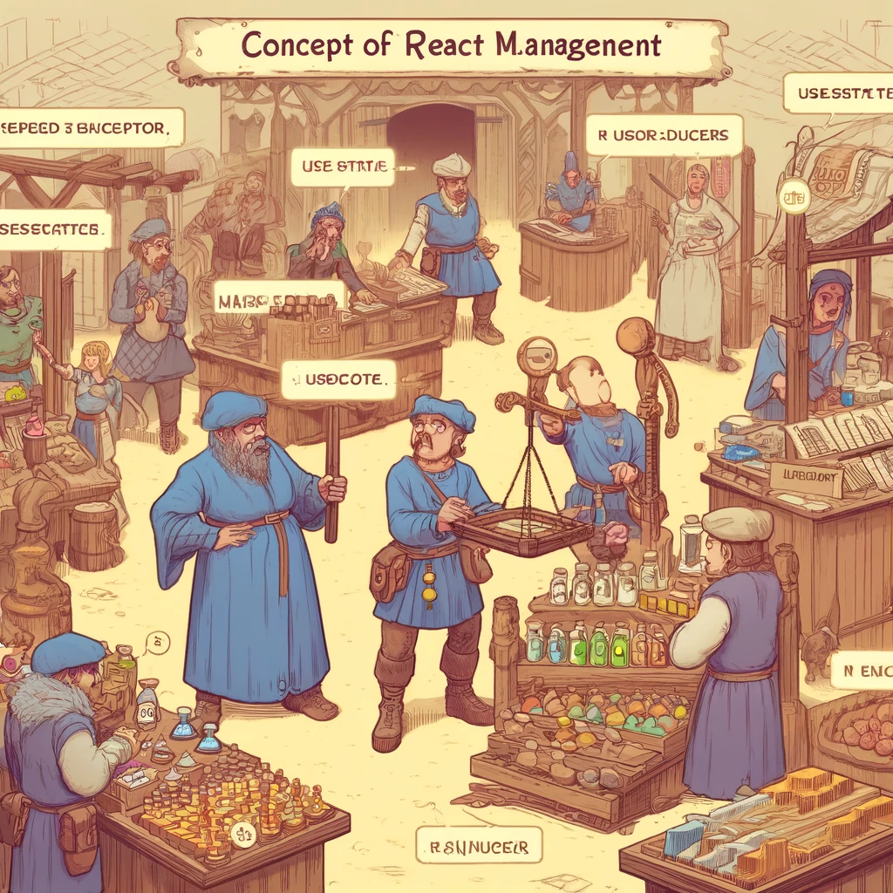

# Reacti olekuhaldus (*state management*)

Reacti olekuhaldus (*state management*) on keskne kontseptsioon, mis võimaldab komponentidel hallata ja ajakohastada oma sisemist olekut. Olekuhaldus on oluline dünaamiliste ja interaktiivsete veebirakenduste loomiseks, kuna see võimaldab komponentidel reageerida kasutaja sisenditele ja muudele sündmustele. Selles peatükis käsitleme olekuhalduse põhitõdesid, `useState` hooki kasutamist, oleku edasiandmist (*prop drilling*) ja keerukamate olekuhaldusraamistike nagu Redux kasutamist.



Pildi allikas: Dall-E by OpenAI

- [Reacti olekuhaldus (*state management*)](#reacti-olekuhaldus-state-management)
  - [Õpiväljundid](#õpiväljundid)
  - [Reacti olekuhaldus: Põhitõed](#reacti-olekuhaldus-põhitõed)
    - [Mis on olek (*state*)?](#mis-on-olek-state)
    - [`useState` hook](#usestate-hook)
      - [`useState` hooki kasutamine](#usestate-hooki-kasutamine)
    - [Olek ja props](#olek-ja-props)
    - [Olekumuutused ja renderdamine](#olekumuutused-ja-renderdamine)
  - [Prop drilling](#prop-drilling)
    - [Näide prop drillingust](#näide-prop-drillingust)
  - [Keerukamate olekuhaldusraamistike kasutamine](#keerukamate-olekuhaldusraamistike-kasutamine)
    - [Redux](#redux)
      - [Reduxi põhikontseptsioonid](#reduxi-põhikontseptsioonid)
      - [Näide Reduxi kasutamisest](#näide-reduxi-kasutamisest)
  - [Context API](#context-api)
    - [Näide Context API kasutamisest](#näide-context-api-kasutamisest)
  - [Allikad](#allikad)
  - [Kontrollküsimused või harjutus](#kontrollküsimused-või-harjutus)
  - [Harjutus](#harjutus)

## Õpiväljundid

Selle peatüki lõpuks peaksid õppijad olema võimelised:

- selgitama, mis on olek (*state*) Reactis ja kuidas see töötab;
- kasutama `useState` hooki oleku haldamiseks funktsionaalsetes komponentides;
- rakendama oleku edasiandmist (*prop drilling*) komponentide vahel;
- kirjeldama ja kasutama keerukamaid olekuhaldusraamistikke nagu Redux.

## Reacti olekuhaldus: Põhitõed

### Mis on olek (*state*)?

Olek (*state*) on objekti kujul andmete kogum, mis on komponendi privaatne ja mida saab muuta ainult seesama komponent. Olek määrab, kuidas komponent käitub ja mida see renderdab.

### `useState` hook

`useState` on Reacti hook, mis võimaldab funktsionaalsetes komponentides olekut hallata. See tagastab massiivi, mis sisaldab kahte elementi: praegust oleku väärtust ja funktsiooni, mis võimaldab olekut uuendada.

#### `useState` hooki kasutamine

```javascript
import React, { useState } from 'react';

function Counter() {
  const [count, setCount] = useState(0);

  return (
    <div>
      <p>You clicked {count} times</p>
      <button onClick={() => setCount(count + 1)}>
        Click me
      </button>
    </div>
  );
}

export default Counter;
```

### Olek ja props

Olek ja props on Reactis kaks peamist mehhanismi andmete haldamiseks. Olek on komponendi sisemine ja privaatne, samas kui propsid on andmed, mida antakse vanemkomponendilt lapsekomponendile.

### Olekumuutused ja renderdamine

Kui komponendi olek muutub, käivitab React uuesti renderdamise, et värskendada kasutajaliidest vastavalt uuele olekule.

## Prop drilling

Prop drilling on protsess, kus andmeid (props) edastatakse vanemkomponendist lapsekomponentidele läbi mitme taseme. Kuigi see on lihtne viis andmete edastamiseks, võib see suuremate ja keerukamate rakenduste puhul muutuda raskesti hallatavaks.

### Näide prop drillingust

```javascript
function ParentComponent() {
  const [message, setMessage] = useState("Hello from Parent!");

  return <ChildComponent message={message} />;
}

function ChildComponent(props) {
  return <GrandchildComponent message={props.message} />;
}

function GrandchildComponent(props) {
  return <p>{props.message}</p>;
}
```

## Keerukamate olekuhaldusraamistike kasutamine

Suuremate rakenduste puhul võib prop drilling muutuda keerukaks ja ebaefektiivseks. Sellistel juhtudel on kasulik kasutada keerukamaid olekuhaldusraamistikke nagu Redux või Context API.

### Redux

Redux on populaarne olekuhaldusraamistik, mis võimaldab hallata rakenduse olekut tsentraliseeritud viisil. Redux järgib kolme põhiseadust:

1. **Üksik allikas tõde:** Rakenduse kogu olek salvestatakse ühes keskses olekupoes.
2. **Oleku on kirjutuskaitsega:** Ainus viis oleku muutmiseks on saata tegevus (action), mis kirjeldab, mis peaks muutuma.
3. **Oleku muutmine puhaste funktsioonidega:** Muutusi kirjeldavad puhtad funktsioonid, mida kutsutakse reduktoriteks (reducers).

#### Reduxi põhikontseptsioonid

- **Store:** Keskne olekupood, mis haldab kogu rakenduse olekut.
- **Action:** JavaScripti objekt, mis kirjeldab oleku muutust.
- **Reducer:** Puhas funktsioon, mis võtab vastu praeguse oleku ja tegevuse ning tagastab uue oleku.

#### Näide Reduxi kasutamisest

1. **Installige Redux ja React-Redux:**

```bash
npm install redux react-redux
```

2. **Looge Reduxi pood ja reduktor:**

```javascript
import { createStore } from 'redux';

// Tegevuse määratlus
const increment = () => {
  return {
    type: 'INCREMENT'
  };
};

// Reduktori määratlus
const counter = (state = 0, action) => {
  switch (action.type) {
    case 'INCREMENT':
      return state + 1;
    default:
      return state;
  }
};

// Poe loomine
const store = createStore(counter);

store.subscribe(() => console.log(store.getState()));

store.dispatch(increment()); // Suurendab olekut ühe võrra
```

3. **Integreerige Redux Reactiga:**

```javascript
import React from 'react';
import ReactDOM from 'react-dom';
import { Provider, useDispatch, useSelector } from 'react-redux';
import { createStore } from 'redux';

// Tegevuse määratlus
const increment = () => {
  return {
    type: 'INCREMENT'
  };
};

// Reduktori määratlus
const counter = (state = 0, action) => {
  switch (action.type) {
    case 'INCREMENT':
      return state + 1;
    default:
      return state;
  }
};

// Poe loomine
const store = createStore(counter);

function Counter() {
  const count = useSelector(state => state);
  const dispatch = useDispatch();

  return (
    <div>
      <p>Count: {count}</p>
      <button onClick={() => dispatch(increment())}>
        Increment
      </button>
    </div>
  );
}

ReactDOM.render(
  <Provider store={store}>
    <Counter />
  </Provider>,
  document.getElementById('root')
);
```

## Context API

Context API on Reacti sisseehitatud mehhanism, mis võimaldab jagada andmeid komponentpuu kaudu ilma prop drillinguta. Context API sobib väiksemate ja keskmise suurusega rakenduste jaoks.

### Näide Context API kasutamisest

1. **Looge Context:**

```javascript
import React, { createContext, useContext, useState } from 'react';

const MyContext = createContext();

function MyProvider({ children }) {
  const [value, setValue] = useState("Hello from Context!");

  return (
    <MyContext.Provider value={value}>
      {children}
    </MyContext.Provider>
  );
}

function MyComponent() {
  const value = useContext(MyContext);
  return <p>{value}</p>;
}

function App() {
  return (
    <MyProvider>
      <MyComponent />
    </MyProvider>
  );
}

export default App;
```

## Allikad

- [React Official Documentation](https://react.dev)
- [Redux Official Documentation](https://redux.js.org/)

## Kontrollküsimused või harjutus

- Mis on olek (*state*) ja kuidas see erineb propsidest?
- Kuidas kasutada `useState` hooki funktsionaalsetes komponentides?
- Mis on prop drilling ja millal võib see probleemiks osutuda?
- Kirjeldage Reduxi põhikontseptsioone ja kuidas need aitavad lahendada olekuhalduse probleeme.
- Kuidas kasutada Context API-d andmete jagamiseks komponentpuu kaudu?

## Harjutus

- Looge uus React projekt, kasutades Create React App tööriista.
- Looge komponent, mis haldab ja kuvab oma olekut, kasutades `useState` hooki.
- Rakendage prop drilling, et edastada olekut vanemkomponendilt lapsekomponentidele.
- Integreerige Redux, et hallata rakenduse olekut tsentraliseeritud viisil.
- Kasutage Context API-d, et jagada olekut komponentpuu kaudu ilma prop drillinguta.
