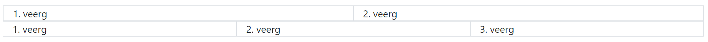
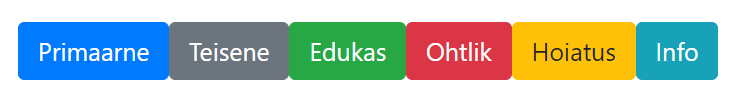
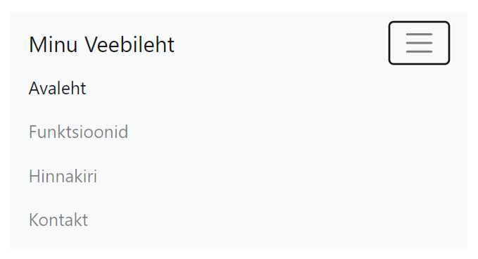

# Bootstrap CSS raamistik

Bootstrap on populaarne front-end veebiarenduse raamistik, mis aitab kiiresti luua esteetiliselt meeldivaid ja reageerivaid veebilehti. See pakub hulgaliselt HTML- ja CSS-põhiseid disainimalle komponentide jaoks nagu nupud, vormid ja navigeerimisribad ning JavaScripti pluginaid interaktiivsete elementide jaoks nagu hüpikaknad ja slaidiseansid.


Pildi allikas: Dall-E by OpenAI

- [Bootstrap CSS raamistik](#bootstrap-css-raamistik)
  - [Õpiväljundid](#õpiväljundid)
  - [Bootstrapi Omadused](#bootstrapi-omadused)
  - [Alustamine Bootstrapiga](#alustamine-bootstrapiga)
    - [CDN-i Kasutamine](#cdn-i-kasutamine)
    - [Lihtne Näide](#lihtne-näide)
  - [Bootstrap Grid-süsteem](#bootstrap-grid-süsteem)
    - [Grid-klassid](#grid-klassid)
    - [Näide Grid-süsteemi kasutamisest](#näide-grid-süsteemi-kasutamisest)
  - [Bootstrap nupud](#bootstrap-nupud)
    - [Nupu Klassid](#nupu-klassid)
    - [Näide Nuppudest](#näide-nuppudest)
  - [Bootstrap Vormid](#bootstrap-vormid)
    - [Vormide tüübid](#vormide-tüübid)
    - [Näide Vormidest](#näide-vormidest)
  - [Bootstrap Navigeerimisriba](#bootstrap-navigeerimisriba)
    - [Navigeerimisriba Klassid](#navigeerimisriba-klassid)
    - [Näide Navigeerimisribast](#näide-navigeerimisribast)
  - [Kokkuvõte](#kokkuvõte)

## Õpiväljundid

Peale selle õppetüki läbimist suudad:

- selgitada, mis on Bootstrap ja miks seda kasutatakse;
- kasutada Bootstrapi eelvalmistatud komponente ja grid-süsteemi.
- Lisada Bootstrapi oma veebilehele kasutades CDN-i.

## Bootstrapi Omadused

- **Reageerivad Layoutid:** Bootstrap kasutab paindlikke grid-süsteeme, mis kohanduvad erinevate seadmete ekraanisuurustega. Grid-süsteem põhineb 12-veeruliseks jaotatud konteineritel, mis aitavad kujundada kohanduvaid ja dünaamilisi paigutusi.
- **Eelvalmistatud Komponendid:** Pakub rikkalikku valikut HTML- ja CSS-põhiseid komponente, nagu nupud, sisendvormid, navigeerimisribad, jumbotronid, kuvapildid, kaardid ja palju muud, mis kiirendavad arendusprotsessi.
- **JavaScripti Pluginad:** Bootstrap sisaldab mitmeid jQuery-põhiseid JavaScripti pluginaid, mis võimaldavad interaktiivseid funktsioone nagu modalid, tooltipid, popoversid, kollapsid ja muud dünaamilised käitumised.
- **Kohandatavus:** Kuigi Bootstrap tuleb eelseadistatud kujundusega, võimaldab see kohandada tema värve, fonte ja muid elemente vastavalt vajadusele, kasutades Sass-i (CSS-i preprotsessor).
- **Ulatuslik Dokumentatsioon ja Kogukond:** Bootstrap on hästi dokumenteeritud, mis muudab selle õppimise ja kasutamise lihtsaks. Suur kasutajakogukond tähendab, et ressursse ja tuge on kergesti leitav.

## Alustamine Bootstrapiga

Bootstrapi kasutamise alustamiseks on kaks peamist meetodit: kas laadida alla Bootstrapi failid ja linkida need oma HTML-lehega või kasutada CDN-i (*Content Delivery Network*).

### CDN-i Kasutamine

Lihtsaim viis Bootstrapi kasutamiseks on lisada järgmised lingid oma HTML-dokumendi `<head>` osasse:

```html
<!-- Bootstrapi CSS -->
<link rel="stylesheet" href="https://cdn.jsdelivr.net/npm/bootstrap@4.0.0/dist/css/bootstrap.min.css">

<!-- Valikuline JavaScript -->
<!-- jQuery, Popper.js ja Bootstrap JS -->
<script src="https://code.jquery.com/jquery-3.5.1.slim.min.js"></script>
<script src="https://cdn.jsdelivr.net/npm/popper.js@1.16.1/dist/umd/popper.min.js"></script>
<script src="https://stackpath.bootstrapcdn.com/bootstrap/5.3.2/js/bootstrap.min.js"></script>
```

### Lihtne Näide

Siin on näide lihtsast Bootstrapiga loodud veebilehest:

```html
<!DOCTYPE html>
<html lang="et">
<head>
    <meta charset="UTF-8">
    <meta name="viewport" content="width=device-width, initial-scale=1.0">
    <title>Bootstrapi Näidis</title>
    <link rel="stylesheet" href="https://cdn.jsdelivr.net/npm/bootstrap@4.0.0/dist/css/bootstrap.min.css">
</head>
<body>
    <div class="container">
        <h1>Tere tulemast Bootstrapi!</h1>
        <p>See on lihtne näide.</p>
        <button type="button" class="btn btn-primary">Vajuta mind</button>
    </div>

    <script src="https://code.jquery.com/jquery-3.5.1.slim.min.js"></script>
    <script src="https://cdn.jsdelivr.net/npm/popper.js@1.16.1/dist/umd/popper.min.js"></script>
    <script src="https://stackpath.bootstrapcdn.com/bootstrap/5.3.2/js/bootstrap.min.js"></script>
</body>
</html>
```

See kood loob lihtsa veebilehe, mis kasutab Bootstrapi grid-süsteemi elementide paigutamiseks, samuti Bootstrapi stiilis nuppu.

## Bootstrap Grid-süsteem

Bootstrapi grid-süsteem on 12-veeruline süsteem, mis võimaldab arendajatel luua reageerivaid ja dünaamilisi paigutusi. Grid-süsteem jagab ekraani 12 võrdseks veeruleks, mida saab kasutada elementide paigutamiseks vastavalt nende suurusele.

Grid veerud lisatakse tavaliselt `<div class="row">` elemendi sisse, mis omakorda on paigutatud `<div class="container">` või `<div class="container-fluid">` elemendi sisse.

### Grid-klassid

Grid-süsteemi kasutamiseks lisatakse HTML-elementidele klassid, mis määravad nende laiuse vastavalt 12-veerulisele süsteemile.

Näiteks:

- `.col-6`: Element võtab 6 veergu (pool ekraanist).
- `.col-4`: Element võtab 4 veergu (kolmandik ekraanist).
- `.col-3`: Element võtab 3 veergu (veerand ekraanist).
- `.col-12`: Element võtab kogu laiuse.

### Näide Grid-süsteemi kasutamisest

```html
<div class="container border">
    <div class="row border">
        <div class="col-6 border">1. veerg</div>
        <div class="col-6 border">2. veerg</div>
    </div>
    <div class="row">
        <div class="col-4 border">1. veerg</div>
        <div class="col-4 border">2. veerg</div>
        <div class="col-4 border">3. veerg</div>
    </div>
</div>
```

See näide loob kaks rida, kus esimeses reas on kaks veergu (igaüks võtab pool ekraanist) ja teises reas on kolm veergu (igaüks võtab kolmandiku ekraanist).



> `border` klass on lisatud elementidele, et näidata nende piire.

## Bootstrap nupud

Bootstrapi nupud on stiilsed ja interaktiivsed elemendid, mida saab kasutada kasutajaliidese funktsioonide ja toimingute esiletoomiseks. Nupud võivad olla erinevat tüüpi, nagu primaarne, teisene, edukas, ohtlik jne.

### Nupu Klassid

Bootstrap nuppude stiilide määramiseks kasutatakse järgmisi klassinimesid:

- `.btn`: Põhiline nupu klass.
- `.btn-primary`: Primaarne nupp.
- `.btn-secondary`: Teisene nupp.
- `.btn-success`: Edukas nupp.
- `.btn-danger`: Ohtlik nupp.
- `.btn-warning`: Hoiatusnupp.
- `.btn-info`: Infonupp.
- jne.

### Näide Nuppudest

```html
<button type="button" class="btn btn-primary">Primaarne</button>
<button type="button" class="btn btn-secondary">Teisene</button>
<button type="button" class="btn btn-success">Edukas</button>
<button type="button" class="btn btn-danger">Ohtlik</button>
<button type="button" class="btn btn-warning">Hoiatus</button>
<button type="button" class="btn btn-info">Info</button>
```

Eelenev kood näeb välja järgmine:



Põhjalikumalt saad nuppude kohta lugeda [Bootstrapi ametlikust dokumentatsioonist](https://getbootstrap.com/docs/5.3/components/buttons/).

## Bootstrap Vormid

Bootstrapi vormid on stiilsed ja kasutajasõbralikud elemendid, mis võimaldavad kasutajatel sisestada ja esitada andmeid. Bootstrapi vormid kasutavad spetsiaalseid klassinimesid, mis määravad nende stiili ja paigutuse.

### Vormide tüübid

Bootstrapi vormide loomiseks kasutatakse järgmisi klassinimesid:

- `.form-group`: Ümbritseb vormielemendid ja lisab nende vahele ruumi.
- `.form-control`: Määrab vormielemendi stiili.
- `.form-check`: Vormielementide kontrollimiseks kasutatav klass.
- `.form-check-input`: Kontrollimiseks kasutatava sisendi klass.
- `.form-check-label`: Kontrollimiseks kasutatava sildi klass.
- `.form-text`: Vormielemendi abiteksti klass.
- `.form-inline`: Vormi paigutuse klass, mis asetab elemendid üksteise kõrvale.
- `.form-horizontal`: Vormi paigutuse klass, mis asetab elemendid horisontaalselt.
- jne.

### Näide Vormidest

```html
<form>
    <div class="form-group">
        <label for="name">Nimi:</label>
        <input type="text" class="form-control" id="name">
    </div>
    <div class="form-group" id="email-group">
        <label for="email">E-post:</label>
        <input type="email" class="form-control" id="email">
        <small class="form-text text-muted">Me ei jaga teie e-posti aadressi kellegagi.</small>
    </div>
    <div class="form-group form-check">
        <input type="checkbox" class="form-check-input" id="subscribe">
        <label class="form-check-label" for="subscribe">Tellin uudiskirja</label>
    </div>
    <button type="submit" class="btn btn-primary">Saada</button>
</form>
```

Eelenev kood loob lihtsa vormi, mis sisaldab nime, e-posti ja tellimise valikut.


Vormide kohta saad rohkem lugeda [Bootstrapi ametlikust dokumentatsioonist](https://getbootstrap.com/docs/5.3/components/forms/).

## Bootstrap Navigeerimisriba

Bootstrapi navigeerimisriba on stiilne ja interaktiivne element, mis aitab kasutajatel liikuda veebilehel erinevate sektsioonide vahel. Bootstrapi navigeerimisriba kasutab spetsiaalseid klassinimesid, mis määravad selle stiili ja paigutuse.

### Navigeerimisriba Klassid

Bootstrapi navigeerimisriba loomiseks kasutatakse järgmisi klassinimesid:

- `.navbar`: Põhiline navigeerimisriba klass.
- `.navbar-expand`: Määrab navigeerimisriba laiendamise reeglid.
- `.navbar-light`: Heleda taustaga navigeerimisriba.
- `.navbar-dark`: Tume taustaga navigeerimisriba.
- `.navbar-brand`: Navigeerimisriba logo või brändi nimi.
- `.navbar-nav`: Navigeerimisriba menüü klass.
- `.nav-item`: Navigeerimisriba menüü elemendi klass.
- `.nav-link`: Navigeerimisriba menüü lingi klass.
- jne.

### Näide Navigeerimisribast

```html
<nav class="navbar navbar-expand-lg navbar-light bg-light">
    <a class="navbar-brand" href="#">Minu Veebileht</a>
    <button class="navbar-toggler" type="button" data-toggle="collapse" data-target="#navbarNav" aria-controls="navbarNav" aria-expanded="false" aria-label="Toggle navigation">
        <span class="navbar-toggler-icon"></span>
    </button>
    <div class="collapse navbar-collapse" id="navbarNav">
        <ul class="navbar-nav">
            <li class="nav-item active">
                <a class="nav-link" href="#">Avaleht <span class="sr-only">(current)</span></a>
            </li>
            <li class="nav-item">
                <a class="nav-link" href="#">Funktsioonid</a>
            </li>
            <li class="nav-item">
                <a class="nav-link" href="#">Hinnakiri</a>
            </li>
            <li class="nav-item">
                <a class="nav-link" href="#">Kontakt</a>
            </li>
        </ul>
    </div>
</nav>
```

Eelenev kood loob lihtsa navigeerimisriba, mis sisaldab logo, menüüd ja lingid erinevatele lehtedele.


Selle navigeerimisriba juures tuleb märkida, et see on kohanduv vastavalt ekraani suurusele - kui veebilehitseja aken muutub väiksemaks, siis navigeerimisriba muutub kokkutõmmatavaks menüüks, mida saab avada ja sulgeda.



Navigeerimisriba kohta saad rohkem lugeda [Bootstrapi ametlikust dokumentatsioonist](https://getbootstrap.com/docs/5.3/components/navbar/).

## Kokkuvõte

Bootstrapi kasutamine võimaldab arendajatel kiiresti luua esteetiliselt meeldivaid ja reageerivaid veebilehti, kasutades eelvalmistatud komponente ja grid-süsteemi. Bootstrapi eelised hõlmavad reageerivaid paigutusi, rikkalikke komponente, JavaScripti pluginaid, kohandatavust ja ulatuslikku dokumentatsiooni. Siin toodud näited on vaid väike osa võimalustest, mida Bootstrap pakub. Kui soovid Bootstrapi kohta rohkem teada saada, siis lisainfot saab siit: [Bootstrapi ametlikku dokumentatsiooni](https://getbootstrap.com/)
