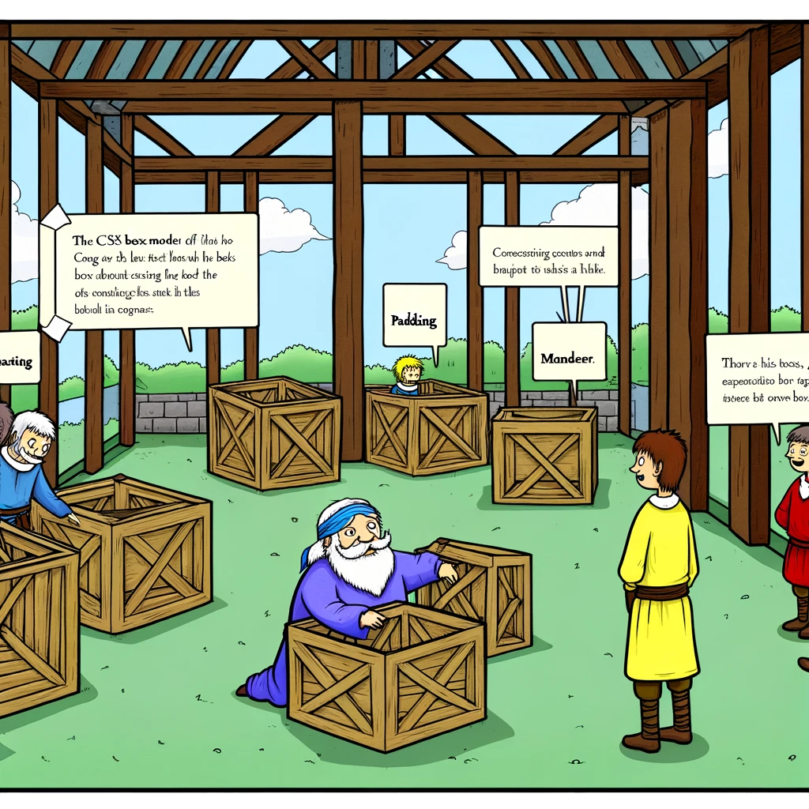

# Kastimudel

Selles peatükis käsitleme CSS-i kastimudelit ja selle kahte peamist tüüpi: standardne ja alternatiivne kastimudel.



- [Kastimudel](#kastimudel)
  - [Õpiväljundid](#õpiväljundid)
  - [Mis on kastimudel?](#mis-on-kastimudel)
  - [Standardne kastimudel](#standardne-kastimudel)
  - [Alternatiivne kastimudel](#alternatiivne-kastimudel)

## Õpiväljundid

Peale selle peatüki läbimist oskad:

- kirjeldada CSS-i kastimudelit;
- selgitada standardse ja alternatiivse kastimudeli erinevusi;
- kasutada CSS-i kastimudelit oma veebilehtede kujundamisel.

## Mis on kastimudel?

CSS kastimudel on HTML-elementide ristkülikukujuline paigutusmudel. See koosneb neljast osast: `sisu`, `polsterdus` (*padding*), `piir` (*border*) ja `veeris` (*margin*).

`Sisu` on elemendi tegelik sisu. `Polsterdus` on ruum sisu ja piiri vahel. `Piir` on elemendi piir. `Veeris` on ruum piiri ja järgmise elemendi vahel.


[Pildi allikas](https://developer.mozilla.org/en-US/docs/Learn/CSS/Building_blocks/The_box_model/box-model.png)

## Standardne kastimudel

Standardne kastimudel on CSS-is vaikimisi kastimudel. Seda kasutavad enamik brausereid. Standardse kastimudeli puhul arvutatakse elemendi laius ja kõrgus järgmiselt:

- `laius = sisu laius + polsterdus vasakul + polsterdus paremal + piir vasakul + piir paremal`;
- `kõrgus = sisu kõrgus + polsterdus ülal + polsterdus all + piir ülal + piir all`;

Kui eeldame, et kastil on järgmised CSS-reeglid:

```css
.box {
  width: 350px;
  height: 150px;
  margin: 10px;
  padding: 25px;
  border: 5px solid black;
}
```

Kasti laius ja kõrgus arvutatakse järgmiselt:

- `laius = 350px + 25px + 25px + 5px + 5px = 410px`;
- `kõrgus = 150px + 25px + 25px + 5px + 5px = 210px`;


[Pildi allikas](https://developer.mozilla.org/en-US/docs/Learn/CSS/Building_blocks/The_box_model/standard-box-model.png)

> Elemendi laius ja kõrgus ei sisalda veeriseid.

## Alternatiivne kastimudel

Alternatiivses kastimudelis on elemendi laius ja kõrgus vastavalt `width` ja `height` väärtustele. Polsterdus ja piir arvutatakse juba laiuse ja kõrguses sisse ja selle võrra on sisul vähem ruumi.

Kui eeldame, et kastil on samad CSS-reeglid kui eespool:

```css
.box {
  box-sizing: border-box;
  width: 350px;
  height: 150px;
  margin: 10px;
  padding: 25px;
  border: 5px solid black;
}
```

Kasti laius ja kõrgus arvutatakse järgmiselt:

- `laius = 350px`;
- `kõrgus = 150px`;


[Pildi allikas](https://developer.mozilla.org/en-US/docs/Learn/CSS/Building_blocks/The_box_model/alternate-box-model.png)

Elemendil alternatiivse mudeli sisselülitamiseks seadke sellel `box-sizing: border-box`:

```css
.box {
  box-sizing: border-box;
}
```

Alternatiivse kastimudeli kasutamiseks kõigil oma elementidel (mis on arendajate seas tavaline valik), seadke box-sizing atribuut `<html>` elemendil ja laske kõigil teistel elementidel selle väärtuse pärida:

```css
html {
  box-sizing: border-box;
}

*, *::before, *::after {
  box-sizing: inherit;
}
```

Kastimudeli kohta saate lugeda rohkem [siit](https://developer.mozilla.org/en-US/docs/Learn/CSS/Building_blocks/The_box_model)
