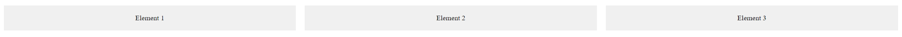

# CSS `display: flex` omadus

Selles õppematerjalis käsitleme CSS-i `display: flex` omadust, mis on võimas tööriist paindlike ja kohandatavate paigutuste loomiseks veebilehtedel.


Pildi allikas: Dall-E by OpenAI

- [CSS `display: flex` omadus](#css-display-flex-omadus)
  - [Õpiväljundid](#õpiväljundid)
  - [Põhiline Kasutamine](#põhiline-kasutamine)
  - [Peamised Omadused ja Nende Kasutamine](#peamised-omadused-ja-nende-kasutamine)
    - [`flex-direction`](#flex-direction)
    - [`justify-content`](#justify-content)
    - [`align-items`](#align-items)
    - [`flex-wrap`](#flex-wrap)
    - [`flex`](#flex)
  - [Täisnäide](#täisnäide)

## Õpiväljundid

Pärast selle teema läbimist oskad:

- Selgitada, mis on CSS-i `display: flex` omadus;
- kirjeldada, kuidas kasutada `display: flex` omadust elementide paigutamiseks;
- rakendada `display: flex` omadust, et luua paindlikke paigutusi.

`display: flex` on CSS-i omadus, mis võimaldab luua paindlikke ja kohandatavaid paigutusi HTML-i elementidele. Flexbox (paindlikkasti kast) modelleerib elementide paigutust rida-realt (või veerg-veerult) ja võimaldab kontrollida nende paigutust, järjekorda, suurust ja vahesid.

## Põhiline Kasutamine

```css
.container {
    display: flex;
}
```

## Peamised Omadused ja Nende Kasutamine

### `flex-direction`

Määrab paindliku konteineri põhisuuna - rida/veerg.

Näide:

```css
.container {
    display: flex;
    flex-direction: row; /* Vaikeväärtus */
}
```

Võimalikud väärtused:

- `row` - Elemente paigutatakse rida-realt
- `row-reverse` - Elemente paigutatakse rida-realt, kuid tagurpidi
- `column` - Elemente paigutatakse veerg-veerult
- `column-reverse` - Elemente paigutatakse veerg-veerult, kuid tagurpidi

### `justify-content`

Kontrollib elementide paigutust flex konteineri peamises teljes.

Näide:

```css
.container {
    display: flex;
    justify-content: center; /* Keskele joondamine */
}
```

### `align-items`

Kontrollib elementide paigutust flex konteineri ristteljel.

Näide:

```css
.container {
    display: flex;
    align-items: center; /* Vertikaalselt keskele joondamine */
}
```

### `flex-wrap`

Määrab, kas flexi elementid peaksid mahuma ühte ritta/veergu või mitmesse

Näide:

```css
.container {
    display: flex;
    flex-wrap: wrap; /* Vajadusel mähkige järgmisele reale */
}
```

### `flex`

Määrab kuidas flexi element peaks kasutama ruumi vastavalt saadaolevale ruumile flex konteineris.

Näide:

```css
.item {
    flex: 1; /* Iga element võtab ühtviisi jagamata ruumi */
}
```

> Arv `flex` omaduse järel näitab, kui palju ruumi element peaks võtma võrreldes teiste elementidega. Näiteks `flex: 1 1 200px` tähendab, et element peaks võtma sama palju ruumi kui teised elemendid, kuid mitte rohkem kui 200 pikslit.

## Täisnäide

HTML:

```html
<div class="container">
    <div class="item">Element 1</div>
    <div class="item">Element 2</div>
    <div class="item">Element 3</div>
</div>
```

CSS:

```css
.container {
    display: flex;
    justify-content: space-around;
    align-items: center;
    flex-wrap: wrap;
}

.item {
    flex: 1 1 200px;
    padding: 20px;
    margin: 10px;
    background-color: #f0f0f0;
    text-align: center;
}
```

Tulemus näeb välja järgmine:



Oluline on mõista, et samal leheküljel on võimalik kasutada mitmeid jaotusi (konteinereid), mida saab kombineerida vastavalt vajadusele. Näiteks eraldi jaotis menüü loomiseks, eraldi jaotis lehekülje sisu kuvamiseks jne. `display: flex` omaduse abil saad luua paindlikke paigutusi, mis kohanduvad sisu ja ekraani suurusega, pakkudes samal ajal kontrolli elementide paigutuse ja suuruse üle.
