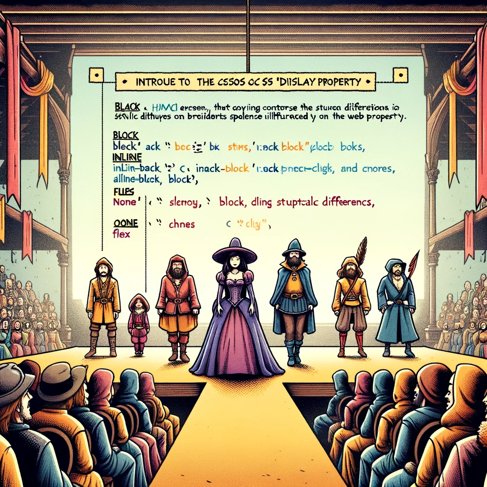

# CSS Display Property

Selles õppematerjalis käsitleme CSS-i `display` omadust, mis on üks olulisemaid CSS-i omadusi, mida kasutatakse elemendi kuvamise viisi määramiseks veebilehel.



Pildi allikas: Dall-E by OpenAI

## Õpiväljundid

Pärast selle teema läbimist oskad:

- Selgitada, mis on CSS-i `display` omadus;
- kirjeldada erinevaid `display` väärtusi ja nende mõju;
- rakendada `display` omadust, et hallata lehe paigutust.

## Mis on CSS Display omadus?

CSS-i `display` omadus määrab, kuidas element dokumentide voos esitatakse. See omadus on väga võimas, kuna see võimaldab kontrollida elementide paigutust ilma HTML-struktuuri muutmata.

Osa veebilehe elemente kasutavad ära terve vaba ruumi laiuse (neile eelneb ja järgneb reavahetus). Selliseid elemente nimetatakse plokielementideks (*block element*), tüüpilisteks näideteks on `<h1>`, `<p>` ja `<div>`.

Osa elemente võtavaid vaid nii palju ruumi kui hädavajalik ning ei too kaasa kohustuslikke reavahetusi, neid nimetatakse reaelementideks (*inline element*). Tüüpilisteks näideteks on `<a>`, `` ja `<span>`.

## Peamised Display Väärtused

`display` omadusel on mitmeid väärtusi, kuid siin on mõned enimkasutatavad:

- **`block`**: Muudab elemendi plokielemendiks, mis tähendab, et ta hõivab kogu vanema elemendi laiuse ja algab uuest reast.
- **`inline`**: Muudab elemendi reasisesteks, mis tähendab, et elemendid asetsevad üksteise kõrval samal real, hõivamata rohkem ruumi kui nende sisu.
- **`inline-block`**: Kombineerib `inline` ja `block` omaduste käitumised. Elemendid on reas, kuid saate määrata laiuse ja kõrguse nagu plokielementidel.
- **`none`**: Peidab elemendi dokumentide voost, muutes selle nähtamatuks ja mitte-interaktiivseks.
- **`flex`**: Muudab elemendi paindlikuks konteineriks, mis võimaldab lastelementide paindlikku paigutust.
- **`grid`**: Muudab elemendi ruudustikukonteineriks, mis võimaldab keerukamate paigutuste loomist ruudustiku abil.

> **Märkus:** Need on vaid mõned näited `display` omaduse väärtustest. CSS-is on palju muid väärtusi, mis võimaldavad elementide paigutust täpsemalt hallata.
>
> Nimekiri kõigist `display` omaduse väärtustest on saadaval [MDN veebisaidil](https://developer.mozilla.org/en-US/docs/Web/CSS/display).

## Näited ja Kasutusalad

### Block

Block-elementide kasutamine on kasulik, kui soovid luua selgelt eristatavaid osasid oma veebilehel, nagu päised, jalused ja sektsioonid.

```css
div {
  display: block;
}
```

### Inline

Inline-elemente kasutatakse tavaliselt teksti sees, nagu rõhutatud sõnad või lingid, mis ei tohiks murda teksti voogu.

```css
span {
  display: inline;
}
```

### Inline-Block

Inline-block on ideaalne väikeste komponentide jaoks, mida soovid reas näidata, kuid millel on vajalik määrata kindlad mõõtmed.

```css
button {
  display: inline-block;
  width: 100px;
  height: 50px;
}
```

### None

Kasuta `display: none`, kui soovid elementi peita, näiteks dünaamiliselt vormi välju, mis ilmuvad teatud tingimustel.

```css
.hidden {
  display: none;
}
```

### Flex

Flexbox on võimas tööriist paigutuste loomiseks, mis nõuavad elementide paigutamist ühes dimensioonis (kas rida või veerg).

```css
.container {
  display: flex;
  justify-content: space-between;
}
```

### Grid

Ruudustikku kasutatakse keerukamate paigutuste jaoks, kus on vaja hallata elementide paigutust nii ridade kui veergude kaupa.

```css
.grid-container {
  display: grid;
  grid-template-columns: repeat(3, 1fr);
}
```

## Kokkuvõtteks

CSS-i `display` omadus on üks olulisemaid omadusi veebilehe paigutuse mõistmisel ja hallatamisel. Selle mitmekülgsus võimaldab veebiarendajatel luua puhtaid, reageerivaid ja ligipääsetavaid veebilehti. Oluline on mõista, millal ja kuidas erinevaid `display` väärtusi kasutada, et maksimeerida oma veebilehe visuaalset ja funktsionaalset potentsiaali.

## Harjutused

### Harjutus 1: Lihtsa navigeerimisriba loomine

**Eesmärk**: Stiilige põhiline horisontaalne navigeerimisriba.

**Kirjeldus**: Kujunda põhiline veebileht navigeerimisribaga, mis koosneb järjestamata loendi üksustest. Navigeerimisriba peaks olema horisontaalne, iga loendi üksus kuvatakse järjest. Stiilige loendi üksused, lisades polsterduse, piiri ja taustavärvi. Hiirega loendi üksusele minnes muutke selle taustavärvi.

**Oodatavad ülesanded**:

- Rakenda stiilimine (polsterdus, piir, taustavärv) loendi üksustele.
- Muuda loendi üksuste taustavärv hiirega minnes

> Vihje: Kasuta `list-style-type: none`, et eemaldada loendi üksustelt täpp.
>
> Vihje: Kasuta `display: inline` või `display: inline-block`, et paigutada loendi üksused horisontaalselt.
>
> Vihje: Kasuta `:hover` pseudo-klassi, et muuta loendi üksuste taustavärv hiirega minnes.

<details>
<summary>Lahendus</summary>

```html
<!DOCTYPE html>
<html>
  <head>
    <title>Lihtsa navigeerimisriba loomine</title>
    <link rel="stylesheet" href="style.css">
  </head>
  <body>
    <ul>
      <li>Avaleht</li>
      <li>Meist

</li>
      <li>Kontakt</li>
    </ul>
  </body>
</html>
```

```css
ul {
  list-style-type: none;
  margin: 0;
  padding: 0;
}

li {
  display: inline-block;
  padding: 10px;
  border: 1px solid black;
  background-color: yellow;
}

li:hover {
  background-color: red;
}
```

</details>
