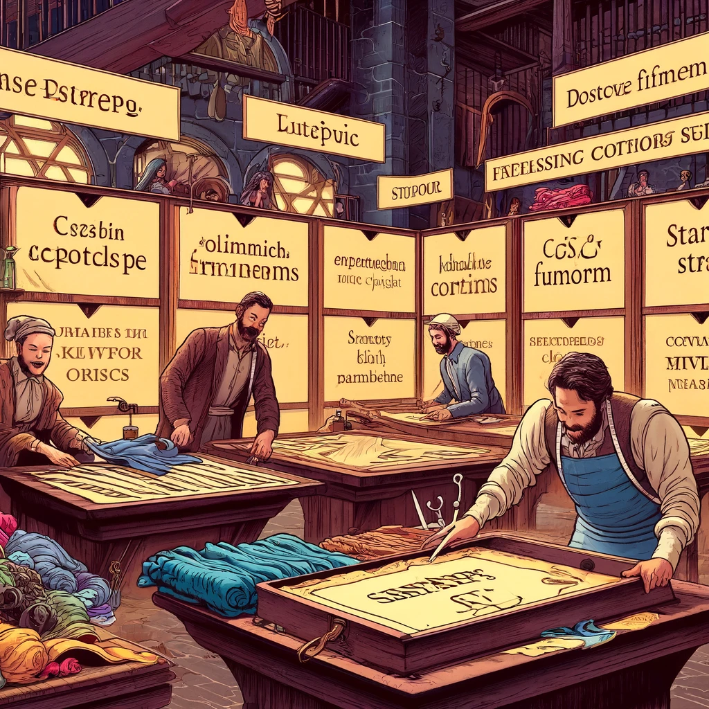

# CSS-i raamistikud

See õppematerjal annab ülevaate populaarsetest CSS-i raamistikest, mis aitavad arendajatel kiiresti ja efektiivselt luua esteetiliselt meeldivaid ja reageerivaid veebilehti. Raamistikud pakuvad valmis CSS-i klasse ja komponente, mis teevad veebilehtede kujundamise lihtsamaks ja kiiremaks.

Pildi allikas: Dall-E by OpenAI

- [CSS-i raamistikud](#css-i-raamistikud)
  - [Õpiväljundid](#õpiväljundid)
  - [Mis on CSS-i raamistikud?](#mis-on-css-i-raamistikud)
  - [Populaarsed CSS-i raamistikud](#populaarsed-css-i-raamistikud)
  - [CSS-i raamistike eelised](#css-i-raamistike-eelised)
  - [CSS-i raamistike piirangud](#css-i-raamistike-piirangud)
  - [Kokkuvõte](#kokkuvõte)
  - [Allikad](#allikad)

## Õpiväljundid

Peale selle õppematerjali läbimist suudad:

- mõista, mis on CSS-i raamistikud ja milleks neid kasutatakse;
- nimetada mõnda populaarset CSS-i raamistikku ja selel omadusi;
- kirjeldada CSS-i raamistike peamisi eeliseid ja piiranguid.

## Mis on CSS-i raamistikud?

CSS-i raamistikud on eelnevalt kirjutatud CSS-i koodikogud, mis pakuvad mugavaid stiilide, paigutuste ja komponentide malle. Need on mõeldud veebiarenduse kiirendamiseks, pakkudes järjepidevat stiili ja toetust mitmesugustele disainilahendustele.

## Populaarsed CSS-i raamistikud

- **Bootstrap**: Üks kõige laialdasemalt kasutatavaid raamistikke, mis pakub rikkalikku valikut komponente nagu nupud, vormid ja navigeerimisribad. Bootstrap on tuntud oma paindliku *grid*-süsteemi poolest, mis toetab reageerivat veebidisaini. Bootsteapi kohta saad lugeda rohkem [siit](https://getbootstrap.com/).
- **Foundation**: Teine populaarne raamistik, mida iseloomustavad keerukamad komponendid ja utiliidid. Foundation on suunatud professionaalsetele arendajatele, pakkudes rohkem kohandamisvõimalusi kui Bootstrap. Foundationi kohta saad lugeda rohkem [siit](https://get.foundation/).
- **Tailwind CSS**: Funktsionaalne CSS-raamistik, mis võimaldab arendajatel kiiresti luua kohandatud disainilahendusi ilma eelnevalt defineeritud komponentideta. Tailwindi lähenemine "utility-first" on ideaalne neile, kes eelistavad stiilide üle täielikku kontrolli. Tailwind CSS-i kohta saad lugeda rohkem [siit](https://tailwindcss.com/).
- **Bulma**: Veel üks raamistik, mis on tuntud oma lihtsuse ja modulaarsuse poolest. Bulma kasutab Flexboxi tehnoloogiat, et pakkuda intuitiivset ja paindlikku paigutussüsteemi. Bulma kohta saad lugeda rohkem [siit](https://bulma.io/).

## CSS-i raamistike eelised

- **Kiirus**: Valmiskomponendid ja klassid vähendavad aega, mis kulub veebilehtede visuaalse osa arendamisele.
- **Järjepidevus**: Raamistikud aitavad säilitada kujunduse järjepidevust kogu projekti või ettevõtte veebilehtede vahel.
- **Reageerivus**: Enamik raamistikke pakub sisseehitatud tuge reageerivale disainile, mis tagab veebilehtede korrektse kuvamise erinevatel seadmetel.

## CSS-i raamistike piirangud

- **Kohandatavuse puudumine**: Mõned raamistikud võivad olla üleliia piiravad, jättes arendajatele vähem võimalusi kohandamiseks.
- **Õppimiskõver**: Iga raamistik nõuab spetsiifiliste klasside ja süsteemide õppimist, mis võib alguses tunduda keeruline.
- **Täiendav koormus**: Raamistike kasutamine võib suurendada veebilehe laadimisaega, eriti kui kasutatakse palju sisseehitatud funktsioone, mida tegelikult ei vajata.

## Kokkuvõte

CSS-i raamistikud on väärtuslikud tööriistad veebiarenduses, eriti kui on vaja kiiresti luua visuaalselt atraktiivseid ja funktsionaalseid veebilehti. Valides sobiva raamistiku, tuleks arvestada projekti nõudmisi, meeskonna oskusi ja raamistiku pakutavaid võimalusi ning piiranguid.

## Allikad

- Bootstrap [koduleht](https://getbootstrap.com/)
- Foundation [koduleht](https://get.foundation/)
- Tailwind CSS [koduleht](https://tailwindcss.com/)
- Bulma [koduleht](https://bulma.io/)
