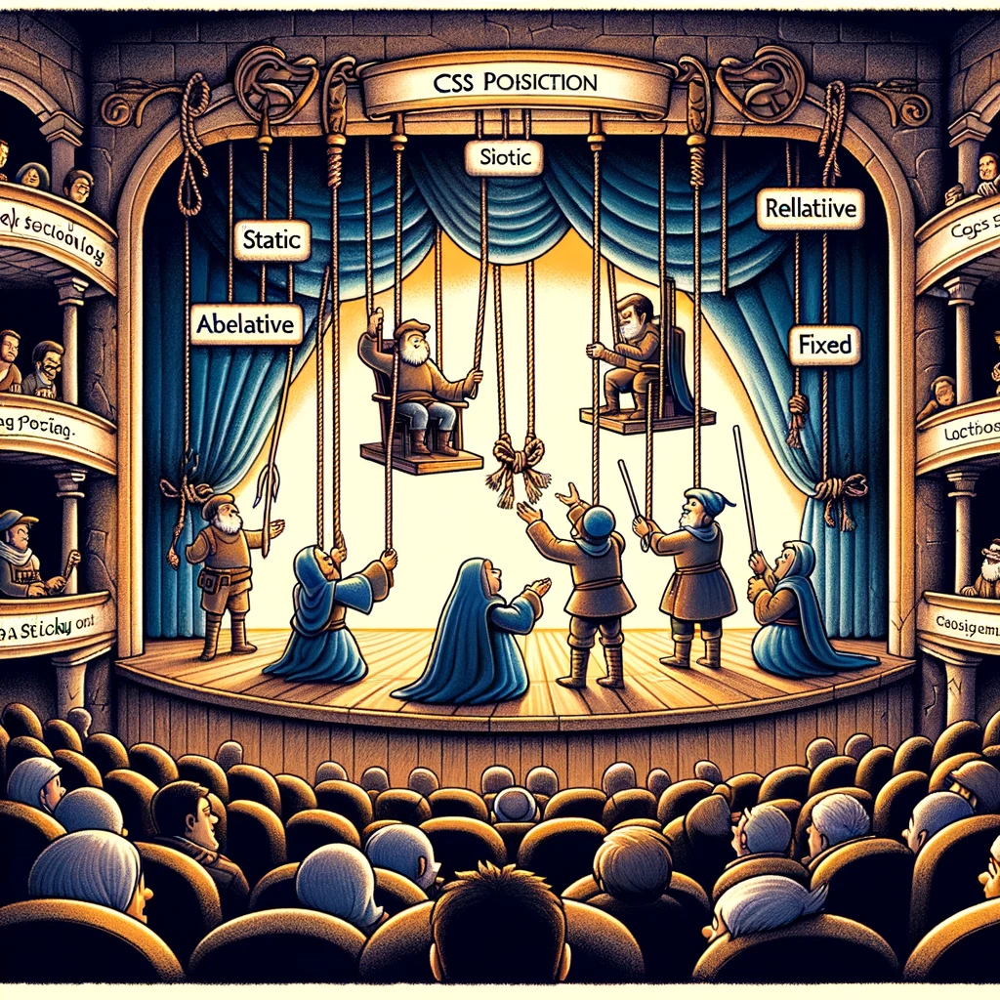

# CSS Position Property

Selles õppematerjalis käsitleme CSS-i `position` omadust, mis on oluline tööriist elementide paigutamiseks veebilehel. Mõistmine, kuidas erinevad `position` väärtused toimivad, aitab arendajatel luua dünaamilisi ja kohandatud paigutusi.



Pildi allikas: Dall-E by OpenAI

## Õpiväljundid

Pärast selle teema läbimist oskad:

- Selgitada, mis on CSS-i `position` omadus;
- kirjeldada erinevaid `position` väärtusi ja nende mõju;
- rakendada `position` omadust, et kontrollida elementide asukohta.

## Mis on CSS Position Property?

CSS-i `position` omadus võimaldab arendajatel määrata elemendi paigutuse meetodi. Selle omaduse abil saate määrata, kuidas element paigutatakse suhtes oma tavapärase vooga või teiste elementidega.

## Peamised Position Väärtused

- **`static`**: Vaikeseade, mis jätab elemendi tavapärasesse voogu. `top`, `right`, `bottom`, ja `left` omadused ei mõjuta `static` elemendi asukohta.
- **`relative`**: Paigutab elemendi suhteliselt tema tavapärasest asukohast. See võimaldab elemendil liikuda ilma teisi elemente mõjutamata.
- **`absolute`**: Eemaldab elemendi dokumendi elementide voost ja paigutab selle suhtes lähima positsioneeritud vanema elemendiga.
- **`fixed`**: Paigutab elemendi nähtava ala suhtes ja see jääb paigale isegi kerimisel.
- **`sticky`**: Kombinatsioon `relative` ja `fixed` paigutusest. Element on `relative` kuni teatud punktini, kus see muutub `fixed`.

> **Märkus:** Elemendi positsiooni saame määrata ka `top`, `right`, `bottom`, ja `left` omaduste abil, mis määravad elemendi asukoha suhtes selle elemendi konteineriga.

## Näited ja Kasutusalad

### HTML näide

```html
<!DOCTYPE html>
<html lang="en">
<head>
  <meta charset="UTF-8">
  <meta http-equiv="X-UA-Compatible" content="IE=edge">
  <meta name="viewport" content="width=device-width, initial-scale=1.0">
  <title>CSS Position Property</title>
  <link rel="stylesheet" href="styles.css">
</head>
<body>
  <div class="container">
    <div class="child child-1">Child 1</div>
    <div class="child child-1">Child 2</div>
    <div class="child child-1">Child 3</div>
  </div>
</body>
</html>
```

### Static

Enamik HTML elemente kasutab vaikimisi `static` paigutust, mis tähendab, et need asuvad seal, kuhu lehe normaalne voog neid paigutab. See tähendab, et `top`, `right`, `bottom`, ja `left` omadused ei mõjuta elementi.

```css
div {
  position: static;
}
```

### Relative

`Relative` paigutus võimaldab nihutada elementi oma normaalsest asukohast, ilma et see mõjutaks teiste elementide asukohta.

```css
.child-1 {
  background-color: #0f0;
  position: relative;
  top: 20px;
  left: 10px;
}
```

### Absolute

`Absolute` paigutusega element eemaldatakse normaalsest voost ja paigutatakse suhtes oma lähima positsioneeritud vanema suhtes.

```css
.container {
  position: relative;
}

.child-2 {
  background-color: #f00;
  position: absolute;
  top: 0;
  right: 0;
}
```

### Fixed

`Fixed` paigutus fikseerib elemendi kindlale positsioonile vaateaknas, olenemata lehe kerimisest.

```css
.child-3 {
  background-color: #778899;
  position: fixed;
  bottom: 0;
  right: 0;
}
```

### Sticky

`Sticky` paigutus võimaldab elemendil käituda nagu `relative` paigutuses kuni kasutaja kerib elemendi teatud punkti, millest alates see muutub `fixed`.

```css
header {
  position: sticky;
  top: 0;
}
```

### CSS fail kokku

```css
.constainer {
  border: 1px solid black;
  display: flex;
  position: relative;
}

.child {
  display: inline-block;
  height: 100px;
  width: 100px;
  border: 1px solid black;
}

.child-1 {
  background-color: #0f0;
  position: relative;
  top: 20px;
  left: 10px;
}

.child-2 {
  background-color: #f00;
  position: absolute;
  top: 0;
  right: 0;
}

.child-3 {
  background-color: #778899;
  position: fixed;
  bottom: 0;
  right: 0;
}

```

See näide paigutab kolm erinevat elementi lehe erinevatesse kohtadesse, kasutades erinevaid `position` väärtusi.

## Kokkuvõte

CSS-i `position` omadus on oluline tööriist elementide paigutamiseks veebilehel. Selle omaduse abil saate määrata, kuidas element paigutatakse suhtes oma tavapärase vooga või teiste elementidega. Erinevad `position` väärtused võimaldavad teil luua dünaamilisi ja kohandatud paigutusi, mis vastavad teie disaini vajadustele.
