# Kaskaadstiililehed (CSS - *Cascading Style Sheets*)

Selles teemas õpime Kaskaadstiililehtede kohta (CSS).


Pildi allikas: Dall-E by OpenAI

- [Kaskaadstiililehed (CSS - *Cascading Style Sheets*)](#kaskaadstiililehed-css---cascading-style-sheets)
  - [Õpiväljundid](#õpiväljundid)
  - [Mis on CSS?](#mis-on-css)
  - [Selektorid](#selektorid)
    - [Märgendi selektorid](#märgendi-selektorid)
    - [Klassi selektorid](#klassi-selektorid)
    - [ID selektorid](#id-selektorid)
    - [Atribuudi selektorid](#atribuudi-selektorid)
    - [Pseudo-klassi selektorid](#pseudo-klassi-selektorid)
  - [Omadused](#omadused)
  - [Väärtused](#väärtused)
  - [Ühikud](#ühikud)
    - [Absoluutsed ühikud](#absoluutsed-ühikud)
    - [Suhtelised ühikud](#suhtelised-ühikud)
    - [Väärtused, mis ei nõua ühikuid](#väärtused-mis-ei-nõua-ühikuid)
  - [Värvid](#värvid)
    - [Värvinimed](#värvinimed)
    - [RGB](#rgb)
    - [Heksadetsimaalne](#heksadetsimaalne)
    - [RGBA](#rgba)
  - [Kuidas rakendada CSS-i HTML-ile](#kuidas-rakendada-css-i-html-ile)
    - [Inline CSS](#inline-css)
    - [Sisemine CSS](#sisemine-css)
    - [Väline CSS](#väline-css)
  - [CSS-i rakendamise viiside ühendamine HTML-is](#css-i-rakendamise-viiside-ühendamine-html-is)
  - [Harjutused](#harjutused)
    - [Harjutus 1 - Põhiline CSS-i stiilimine](#harjutus-1---põhiline-css-i-stiilimine)
    - [Harjutus 2: Sisusektsiooni stiilimine veergudega](#harjutus-2-sisusektsiooni-stiilimine-veergudega)

## Õpiväljundid

Pärast selle teema läbimist oskad:

- selgitada, mis on CSS ja kuidas seda kasutatakse HTML elementide stiilimiseks;
- kasutada CSS selektoreid HTML elementide valimiseks;
- kasutada CSS omadusi valitud HTML elementide stiilimiseks;
- kasutada CSS väärtusi CSS omaduse väärtuse määramiseks;
- kasutada CSS ühikuid elemendi suuruse määramiseks;
- kasutada CSS värve elemendi värvi määramiseks;
- rakendada CSS-i HTML-le kasutades inline CSS-i, sisemist CSS-i ja välist CSS-i;
- ühendada erinevaid viise CSS-i rakendamiseks HTML-is;
- selgitada, mis on kastimudel ja kuidas seda kasutatakse HTML elementide paigutamiseks;
- selgitada erinevust standardse kastimudeli ja alternatiivse kastimudeli vahel;
- kasutada standardset kastimudelit ja alternatiivset kastimudelit HTML elementide paigutamiseks;

## Mis on CSS?

CSS on lühend, mis tähistab Cascading Style Sheets (kaskaadstiililehed). CSS on stiililehtede keel, mis kirjeldab, kuidas HTML elemendid peaksid olema kuvatud.

CSS on keel, mida kasutatakse HTML elementide stiilimiseks. Seda kasutatakse veebilehtede värvide, fontide, paigutuste ja muu lisamiseks. CSS on koos HTML-i ja JavaScriptiga üks veebi põhitehnoloogiaid.

CSS on loodud esitluse ja sisu eraldamiseks, sealhulgas paigutuse, värvide ja fontidega. See eraldamine parandab sisu ligipääsetavust, pakub rohkem paindlikkust ja kontrolli esitlusomaduste määramisel, võimaldab mitmel veebilehel jagada vormindust, määrates vastava CSS-i eraldi `.css` failis, ja vähendab struktuurse sisu keerukust ja kordust.

Kui HTML kirjeldab veebilehe struktuuri, siis CSS kirjeldab, kuidas see struktuur peaks välja nägema. CSS on stiililehtede keel, mis võimaldab määratleda, kuidas teie veebilehe elemendid peaksid kuvatama.

Näiteks kui soovid oma veebilehel teksti värvi muuta, saad seda teha CSS-i abil. Saad kasutada CSS-i ka fondi suuruse, fondipere, taustavärvi, piirivärvi, piiri laiuse, piiri stiili jne muutmiseks:

Kui me võtame lihtsa HTML-dokumendi ja lisame sellele mõned CSS-i, saame järgmise tulemuse:

```html
<!DOCTYPE html>
<html>
  <head>
    <title>Minu esimene veebileht</title>
    <style>
      p {
        color: red;
        font-size: 20px;
        font-family: Arial, Helvetica, sans-serif;
        background-color: yellow;
        border-color: black;
        border-width: 1px;
        border-style: solid;
      }
    </style>
  </head>
  <body>
    <p>Tere, maailm!</p>
  </body>
```

Näidisleht näeb välja selline:

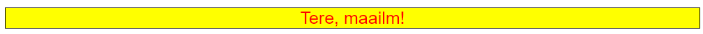

## Selektorid

Kui soovime HTML-elemendile mingit stiili rakendada, peame selle esmalt valima, et määrata, millist elementi soovime stiilida. HTML-elementi saab valida CSS-selektori abil. CSS-selektoreid kasutatakse HTML-elementide valimiseks, mida soovite stiilida. Selektorid muudavad CSS-i võimsamaks, võimaldades teil sihtida konkreetseid elemente oma veebilehel. Näiteks saame valida HTML-elemente järgnevalt:

- märgendi nime järgi;
- klassi nime järgi;
- id järgi;
- atribuudi järgi;
- pseudo-klassi järgi;
- jne.

Kui kirjutame CSS-i, peame määrama kaks asja:

- selektori
- deklaratsiooniploki.

Selektorit kasutatakse HTML-elementide valimiseks, mida soovime stiilida. Deklaratsiooniplokk on kasutatud CSS-reeglite määramiseks, mis rakendatakse valitud HTML-elementidele. Deklaratsiooniplokk on ümbritsetud loogeliste sulgudega `{}`. Loogeliste sulgude sees saame määratleda ühe või mitu CSS-reeglit. Iga CSS-reegel koosneb omadusest ja väärtusest. Omadus järgneb koolonile `:` ja väärtus järgneb semikoolonile `;`.

### Märgendi selektorid

Märgendi selektoreid kasutatakse HTML-elementide valimiseks nende märgendi nime järgi. Selektorid ei ole tõstutundlikud, mis tähendab, et `p` ja `P` on samad selektorid. Näiteks kui soovime valida kõik `<p>` elemendid meie veebilehel, saame kasutada järgmist selektorit:

```css
p {
  color: red;
}
```

Selles näites on `<p>` elementide selektor `p`. Selektorit järgnevad loogelised sulud `{}`. loogeliste sulgude sees oleme määranud CSS-reegli, mis rakendatakse kõigile `<p>` elementidele meie veebilehel. CSS-reegel koosneb omadusest ja väärtusest. Selles näites on omadus `color` ja väärtus `red`. Omadust järgneb koolon `:` ja väärtust järgneb semikoolon `;`.

### Klassi selektorid

Kui soovime valida kõik elemendid klassiga `class="my-class"`, saame kasutada järgmist selektorit:

```css
.my-class {
  /* CSS-reeglid */
}
```

Klassi selektorid algavad punktiga `.`, millele järgneb klassi nimi. Selles näites on klassi nimi `my-class`.

### ID selektorid

Kui soovime valida kõik elemendid ID-ga `id="my-id"`, saame kasutada järgmist selektorit:

```css
#my-id {
  /* CSS-reeglid */
}
```

ID selektorid algavad räsimärgiga `#`, millele järgneb ID nimi. Selles näites on ID nimi `my-id`.

### Atribuudi selektorid

Kui soovime valida kõik elemendid `attribute="value"`, saame kasutada järgmist selektorit:

```css
[attribute="value"] {
  /* CSS-reeglid */
}
```

Atribuudi selektorid algavad kandilise suluga `[` järgneb atribuudi nimi, järgneb võrdusmärk `=`, järgneb atribuudi väärtus, järgneb sulgev kandiline sulg `]`. Selles näites on atribuudi nimi `attribute` ja atribuudi väärtus `value`.

### Pseudo-klassi selektorid

Pseudo-klassi selektorid on kasutatud HTML-elementide valimiseks nende oleku järgi. Näiteks kui soovime valida kõik `<a>` elemendid, mille kohal hiirega hõljutakse, saame kasutada järgmist selektorit:

```css
a:hover {
  /* CSS-reeglid */
}
```

Esmalt määrame selektori (`a`), seejärel määrame pseudo-klassi (`:hover`). Selektor ja pseudo-klass on eraldatud kooloniga `:`.

Kõige levinumad pseudo-klassid on:

- `:active` - valib aktiivse lingi;
- `:focus` - valib elemendi, mis on fookuses;
- `:hover` - valib elemendi, millel hõljutakse;
- `:link` - valib kõik külastamata lingid;
- `:visited` - valib kõik külastatud lingid;
- `:first-child` - valib elemendi esimese lapse;
- jne.

CSS selektorite täieliku nimekirja leiate [siit](https://developer.mozilla.org/en-US/docs/Web/CSS/CSS_selectors)

## Omadused

CSS omadusi kasutatakse valitud HTML-elementide stiilimiseks. Igal CSS omadusel on nimi ja väärtus. Nimele järgneb koolon `:` ja väärtusele järgneb semikoolon `;`. Näiteks kui soovime muuta oma veebilehe teksti värvi, saame kasutada järgmist CSS-reeglit:

```css
p {
  color: red;
}
```

**Tulemus:**

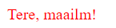

Selles näites on omadus `color` ja väärtus `red`. Omadust järgneb koolon `:` ja väärtust järgneb semikoolon `;`.

On palju erinevaid CSS omadusi. Mõned kõige levinumad CSS omadused on:

- `color` - määrab teksti värvi;
- `font-size` - määrab teksti fondi suuruse;
- `font-family` - määrab teksti fondipere;
- `background-color` - määrab elemendi taustavärvi;
- `border-color` - määrab elemendi piirivärvi;
- `border-width` - määrab elemendi piiri laiuse;
- `border-style` - määrab elemendi piiri stiili;
- `border` - määrab elemendi raamjoone;
- `width` - määrab elemendi laiuse;
- `height` - määrab elemendi kõrguse;
- `margin` - määrab elemendi veerise;
- `padding` - määrab elemendi polsterduse;
- `text-align` - määrab teksti horisontaalse joonduse;
- `vertical-align` - määrab teksti vertikaalse joonduse;
- `display` - määrab elemendi kuvamiskäitumise;
- `position` - määrab elemendi positsiooni;
- jne

CSS omaduste täieliku nimekirja leiate [siit](https://developer.mozilla.org/en-US/docs/Web/CSS/Reference)

## Väärtused

CSS väärtusi kasutatakse CSS omaduse väärtuse määramiseks. Igal CSS väärtusel on nimi ja väärtus. Nimele järgneb koolon `:` ja väärtusele järgneb semikoolon `;`. Näiteks kui soovime muuta oma veebilehe teksti värvi, saame kasutada järgmist CSS-reeglit:

```css
p {
  color: blue;
  font-size: 40px;
  font-family: Arial, Helvetica, sans-serif;
}
```

**Tulemus:**


Selles näites on CSS-reegel kolme omadusega, mis on rakendatud kõigile veebilehe lõikudele: `color`, `font-size` ja `font-family`. Igal omadusel on väärtus. `color` omaduse väärtus on `blue`. `font-size` omaduse väärtus on `40px`. `font-family` omaduse väärtus on `Arial, Helvetica, sans-serif`.

> `font-family` omadusel on mitu väärtust. Brauser kasutab esimest väärtust, mis on kasutaja arvutis saadaval. Kui ükski fondidest ei ole saadaval, kasutab brauser kasutaja arvuti vaikefondi.

Teine näide mitme väärtuse kasutamisest CSS-omaduse jaoks on `border` omadus. `border` omadus on lühendatud omadus `border-width`, `border-style` ja `border-color` omaduste määramiseks. Näiteks kui soovime määrata elemendi piiri, saame kasutada järgmist CSS-reeglit:

```css
p {
  border: 1px solid black;
}
```

Selles näites on `border` omadusel kolm väärtust: `1px`, `solid` ja `black`. Esimene väärtus (`1px`) määrab piiri laiuse. Teine väärtus (`solid`) määrab piiri stiili. Viimane väärtus (`black`) määrab piiri värvi.

**Tulemus:**

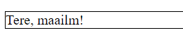

## Ühikud

CSS ühikuid kasutatakse elemendi suuruse määramiseks. On kaks tüüpi CSS ühikuid: `absoluutsed ühikud` ja `suhtelised ühikud`.

### Absoluutsed ühikud

Absoluutsed ühikud on fikseeritud ühikud. Need ei ole suhtelised millegi suhtes. Näiteks kui soovime määrata elemendi laiuse absoluutse ühiku abil, saame kasutada järgmist CSS-reeglit:

```css
p {
  width: 100px;
}
```

Selles näites on elemendi laius `100px`. Laius ei ole suhteline millegi suhtes. See on fikseeritud `100px`.

Mõned kõige levinumad absoluutsed ühikud on:

- `cm` - sentimeetrid - 1cm = 37,8px;
- `mm` - millimeetrid - 1mm = 3,78px;
- `Q` - veerand-millimeetrid - 1Q = 0,95px;
- `in` - tollid - 1in = 96px;
- `pc` - pikad - 1pc = 16px;
- `pt` - punktid - 1pt = 1,33px;
- `px` - pikslid - 1px = 1/96 tolli;

Tavaliselt kasutame absoluutse ühikuna `px`.

### Suhtelised ühikud

Suhtelised ühikud on suhtelised millegi muu suhtes (vanemaelemendi, juurelemendi jne suhtes). Näiteks kui soovime määrata elemendi laiuse suhtelise ühiku abil, saame kasutada järgmist CSS-reeglit:

```css
p {
  width: 100%;
}
```

Selles näites on elemendi laius `100%`. Laius on suhteline vanemaelemendi laiusele. Kui vanemaelemendi laius on `100px`, on elemendi laius `100px`. Kui vanemaelemendi laius on `200px`, on elemendi laius `200px`. Kui vanemaelemendi laius on `300px`, on elemendi laius `300px`. Ja nii edasi.

Mõned kõige levinumad suhtelised ühikud on:

- `%` - protsent;
- `em` - vanemaelemendi fondi suurus;
- `rem` - juurelemendi fondi suurus;
- `vw` - 1% vaateakna laiusest;
- `vh` - 1% vaateakna kõrgusest;
- `vmin` - 1% vaateakna laiusest või kõrgusest, olenevalt sellest, kumb on väiksem;
- `vmax` - 1% vaateakna laiusest või kõrgusest, olenevalt sellest, kumb on suurem;
- jne.

### Väärtused, mis ei nõua ühikuid

Mõned väärtused ei nõua ühikuid. Näiteks kui soovime määrata elemendi läbipaistvuse, saame kasutada järgmist CSS-reeglit:

```css
p {
  opacity: 0.5;
}
```

**Tulemus:**

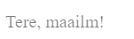

Selles näites on elemendi läbipaistvus `0.5`. Läbipaistvus ei ole suhteline millegi suhtes. See on fikseeritud `0.5`.

Mõned kõige levinumad väärtused, mis ei nõua ühikuid, on:

- `opacity` - määrab elemendi läbipaistvuse;
- `z-index` - määrab elemendi virna järjekorra;
- `order` - määrab elemendi järjekorra;
- jne.

## Värvid

Värve kasutatakse elemendi värvi määramiseks. On palju erinevaid viise värvide määramiseks CSS-is. Mõned kõige levinumad viisid on:

- `color name` - näiteks `red`, `green`, `blue` jne;
- `rgb` - näiteks `rgb(255, 0, 0)`, `rgb(0, 255, 0)`, `rgb(0, 0, 255)` jne;
- `hexadecimal` - näiteks `#ff0000`, `#00ff00`, `#0000ff` jne;
- `rgba` - näiteks `rgba(255, 0, 0, 0.5)`, `rgba(0, 255, 0, 0.5)`, `rgba(0, 0, 255, 0.5)` jne;

### Värvinimed

CSS-is on palju värvinimesid. Mõned kõige levinumad värvinimed on:

- `red` - punane värv;
- `green` - roheline värv;
- `blue` - sinine värv;
- `yellow` - kollane värv;
- `orange` - oranž värv;
- `purple` - lilla värv;
- `pink` - roosa värv;
- `black` - must värv;
- `white` - valge värv;
- jne

Värvinimed leiate [siit](https://developer.mozilla.org/en-US/docs/Web/CSS/named-colors)

### RGB

RGB tähistab `red`, `green` ja `blue`. See on värvimudel, mida kasutatakse värvi punase, rohelise ja sinise osakaalu määramiseks. Igal värvil on väärtus vahemikus `0` kuni `255`. Näiteks kui soovime määrata värvi roheline, saame kasutada järgmist RGB värvi:

```css
p {
  color: rgb(0, 255, 0);
}
```

**Tulemus:**

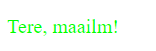

Selles näites on elemendi värv `rgb(0, 255, 0)`. Esimene number (`0`) määrab värvis punase osakaalu. Teine number (`255`) määrab värvis rohelise osakaalu. Viimane number (`0`) määrab värvis sinise osakaalu. Selles näites on punase osakaal `0`, rohelise osakaal `255` ja sinise osakaal `0`. See tähendab, et värv on roheline.

Mõned kõige levinumad RGB värvid on:

- `rgb(255, 0, 0)` - punane värv;
- `rgb(0, 255, 0)` - roheline värv;
- `rgb(0, 0, 255)` - sinine värv;
- `rgb(255, 255, 0)` - kollane värv;
- `rgb(255, 165, 0)` - oranž värv;
- `rgb(128, 0, 128)` - lilla värv;
- `rgb(255, 192, 203)` - roosa värv;
- `rgb(0, 0, 0)` - must värv;
- `rgb(255, 255, 255)` - valge värv;
- jne

### Heksadetsimaalne

Heksadetsimaalne tähendab alus 16. See on numbrisüsteem 16 erineva numbriga. Esimesed 10 numbrit on `0` kuni `9`, nagu oleme harjunud kümnendsüsteemis. Kuid järgmised 6 numbrit on `a` kuni `f`, mis tähistavad kümnendsüsteemi numbreid `11` kuni `16`. Heksadetsimaalseid numbreid on raske lugeda, nii et saame kasutada [kalkulaatoreid](https://www.binaryhexconverter.com/hex-to-decimal-converter), kui peame heksadetsimaalseid numbreid kümnendarvudeks teisendama.

Nagu RGB puhul, saame ka heksadetsimaalsetes värvides määrata värvi punase, rohelise ja sinise osakaalu. Igal värvil on väärtus vahemikus `00` (0 kümnendsüsteemis) kuni `ff` (255 kümnendsüsteemis). Näiteks kui soovime määrata värvi punane, saame kasutada järgmist heksadetsimaalset värvi:

```css
p {
  color: #0000ff;
}
```

**Tulemus:**

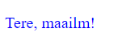

Selles näites on elemendi värv `#0000ff`. Esimesed kaks tähemärki (`00`) määravad värvis punase osakaalu. Teised kaks tähemärki (`00`) määravad värvis rohelise osakaalu. Viimased kaks tähemärki (`ff`) määravad värvis sinise osakaalu. Selles näites on punase osakaal `00`, rohelise osakaal `00` ja sinise osakaal `ff`. See tähendab, et värv on sinine.

Mõned kõige levinumad heksadetsimaalsed värvid on:

- `#ff0000` - punane värv;
- `#00ff00` - roheline värv;
- `#0000ff` - sinine värv;
- `#ffff00` - kollane värv;
- `#ffa500` - oranž värv;
- `#800080` - lilla värv;
- `#ffc0cb` - roosa värv;
- `#000000` - must värv;
- `#ffffff` - valge värv;
- jne

Põhimõtteliselt on HEX lihtsalt lühem viis RGB kirjutamiseks. Näiteks `rgb(255, 0, 0)` on sama mis `#ff0000`. `rgb(0, 255, 0)` on sama mis `#00ff00`. `rgb(0, 0, 255)` on sama mis `#0000ff`. `rgb(255, 255, 0)` on sama mis `#ffff00`. `rgb(255, 165, 0)` on sama mis `#ffa500`. `rgb(128, 0, 128)` on sama mis `#800080`. `rgb(255, 192, 203)` on sama mis `#ffc0cb`. `rgb(0, 0, 0)` on sama mis `#000000`. `rgb(255, 255, 255)` on sama mis `#ffffff`.

HEX-värvide leidmiseks saate kasutada [HEX kalkulaatorit](https://www.w3schools.com/colors/colors_hexadecimal.asp).

### RGBA

RGBA tähistab `red`, `green`, `blue` ja `alpha`. See on värvimudel, mida kasutatakse värvi punase, rohelise, sinise ja alfa osakaalu määratlemiseks. Igal värvil on väärtus vahemikus `0` kuni `255`. Alfa väärtus on vahemikus `0` kuni `1`. Alfa tähendab läbipaistvust. `0` tähendab täielikku läbipaistvust ja `1` tähendab täielikku läbipaistmatust. Näiteks kui soovime määrata värvi punane, saame kasutada järgmist RGBA värvi:

```css
p {
  color: rgba(255, 0, 0, 0.5);
}
```

**Tulemus:**

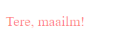

Selles näites on elemendi värv `rgba(255, 0, 0, 0.5)`. Esimene number (`255`) määrab värvis punase osakaalu. Teine number (`0`) määrab värvis rohelise osakaalu. Viimane number (`0`) määrab värvis sinise osakaalu. Viimane number (`0.5`) määrab värvis alfa osakaalu.

Alfa väärtuse võrdlemiseks võime selle muuta `1`-ks ja näha erinevust:

```css
p {
  color: rgba(255, 0, 0, 1);
}
```

**Tulemus:**

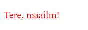

## Kuidas rakendada CSS-i HTML-ile

CSS-i rakendamiseks HTML-ile on kolm viisi:

- inline CSS;
- sisemine CSS;
- väline CSS;

### Inline CSS

Inline CSS-i kasutatakse CSS-i rakendamiseks ühele HTML elemendile. Näiteks kui soovime muuta ühe lõigu värvi, saame kasutada järgmist HTML-koodi:

```html
<p style="color: red">Tere, maailm!</p>
```

Selles näites on kasutatud `style` atribuuti CSS-i rakendamiseks `<p>` elemendile. `style` atribuut on järgnenud topeltjutumärkidele `""`. Topeltjutumärkide sees oleme määranud CSS-reeglid, mis rakendatakse `<p>` elemendile. CSS-reeglid koosnevad omadusest ja väärtusest. Selles näites on omadus `color` ja väärtus `red`.

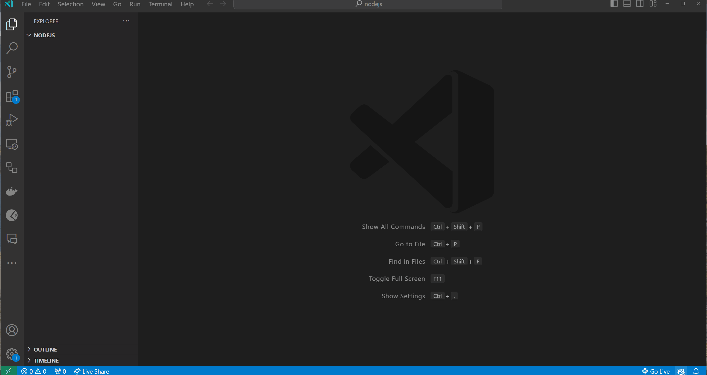

### Sisemine CSS

Sisemist CSS-i kasutatakse CSS-i rakendamiseks ühele HTML-lehele. Näiteks kui soovime muuta kõigi lõikude värvi ühel HTML-lehel, saame kasutada järgmist HTML-koodi:

```html
<!DOCTYPE html>
<html>
  <head>
    <title>Minu esimene veebileht</title>
    <style>
      p {
        color: red;
      }
    </style>
  </head>
  <body>
    <p>Tere, maailm!</p>
  </body>
</html>
```

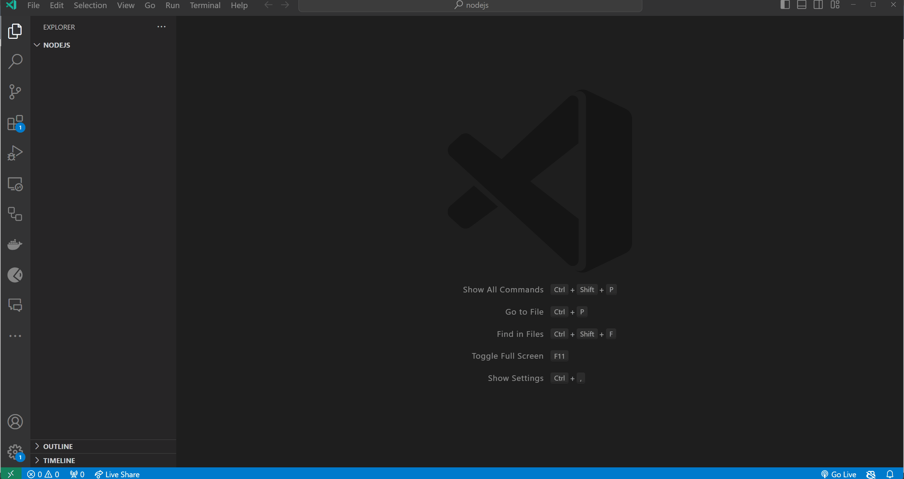

Selles näites kasutasime `<style>` märgendit CSS-i rakendamiseks HTML-lehele. `<style>` märgendile järgneb selector `p`, millele omakorda loogeliste sulgude sees CSS-reeglid, mis rakendatakse HTML-lehele. Selles näites rakendame punast värvi kõikidele lõikudele HTML-lehel.

### Väline CSS

Välist CSS-i kasutatakse CSS-i rakendamiseks mitmele HTML-lehele. Näiteks kui soovime muuta kõigi lõikude värvi mitmel HTML-lehel, saame kasutada järgmist HTML-koodi:

```html
<!DOCTYPE html>
<html>
  <head>
    <title>Minu esimene veebileht</title>
    <link rel="stylesheet" href="style.css">
  </head>
  <body>
    <p>Tere, maailm!</p>
  </body>
</html>
```

`style.css` fail:

```css
p {
  color: red;
}
```

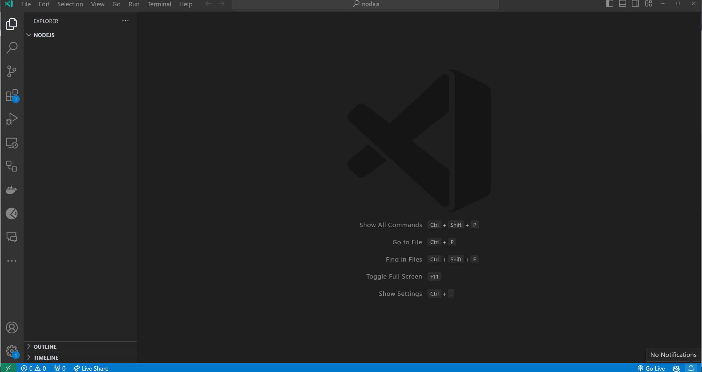

Selles näites kasutasime `<link>` märgendit CSS-i rakendamiseks HTML-lehele. `<link>` märgendis kasutatakse `rel="stylesheet"` atribuuti, mis määrab, et tegemist on peamise stiilifailiga. Sellele järgneb omakorda `href="style.css"` atribuut, mis määrab stiililehe asukoha. `

`style.css` failis oleme määranud CSS-reeglid, mis rakendatakse HTML-lehele. Selles näites rakendame punast värvi kõigile lõikudele HTML-lehel.

## CSS-i rakendamise viiside ühendamine HTML-is

Soovi korral on võimalik ühendada kõik kolm viisi CSS-i rakendamiseks HTML-is. Näiteks kui soovime muuta ühe lõigu värvi, saame kasutada järgmist HTML-koodi:

```html
<!DOCTYPE html>
<html>
  <head>
    <title>Minu esimene veebileht</title>
    <style>
      p {
        color: red;
      }
    </style>
  </head>
  <body>
    <p>Tere, maailm!</p>
    <p style="color: blue">Tere, maailm!</p>
  </body>
</html>
```

Kaskaad CSS-is tähendab, et stiilid rakendatakse kindlas järjekorras. Järjekord on järgmine:

1. Brauseri vaikeväärtused;
2. Väline stiilileht;
3. Sisemine stiilileht (jaotuses `<head>`);
4. Inline stiil (HTML elemendi sees);

Eelmises näites on teise lõigu värv `blue`. See on seetõttu, et inline stiil rakendatakse pärast sisemist stiililehte.


## Harjutused

Loo `index.html` ja `style.css` failid. Ühenda `style.css` fail `index.html` failiga. Kasuta `style.css` faili CSS-koodi kirjutamiseks. Kasuta `index.html` faili HTML-koodi kirjutamiseks.

Testi oma koodi, avades `index.html` faili brauseris.

Proovi lahendada harjutused ilma lahendusi vaatamata. Kui jääte hätta, võite vaadata lahendusi.

### Harjutus 1 - Põhiline CSS-i stiilimine

**Eesmärk**: Rakenda põhilisi stiile HTML-elementidele.

**Kirjeldus**: Loo HTML-fail, mis sisaldab `h1` märgendit pealkirjaks, `p` märgendit lõiguks ja `div` elementi. Kirjuta CSS-fail, et stiilida neid elemente. Muuda `h1` märgendi värvi ja fondi suurust. Lõigu jaoks määra erinev `font-family` ja `color`. Anna `div`-ile tahke piir, määra taustavärv ja reguleeri selle polsterdust.

**Oodatavad ülesanded**:

- Stiili `h1` märgend konkreetse värviga ja fondi suurusega.
- Rakenda lõigule erinev `font-family` ja `color`.
- Anna `div`-ile `border`, `background color` ja `padding`.

> Vihje: Kasuta `border` omadust, et anda `div`-ile tahke piir konkreetse laiuse ja värviga.

<details>
<summary>Lahendus</summary>

```html
<!DOCTYPE html>
<html>
  <head>
    <title>Põhiline CSS-i stiilimine</title>
    <link rel="stylesheet" href="style.css">
  </head>
  <body>
    <h1>Tere, maailm!</h1>
    <p>See on lõik.</p>
    <div>See on div.</div>
  </body>
</html>
```

```css
h1 {
  color: red;
  font-size: 50px;
}

p {
  font-family: Arial, Helvetica, sans-serif;
  color: blue;
}

div {
  border: 5px solid black;
  background-color: yellow;
  padding: 25px;
}
```

</details>

### Harjutus 2: Sisusektsiooni stiilimine veergudega

**Eesmärk**: Loo sisuala, mis on jagatud veergudeks.

**Kirjeldus**: Ehita veebilehe osa, mille eesmärk on kuvada sisu kolmes veerus. Kasuta `div` elemente, et esindada iga veergu. Stiili iga `div` nii, et neil oleks piir, polsterdus ja fikseeritud laius protsentides ning need on paigutatud kõrvuti.

**Oodatavad ülesanded**:

- Loo kolm `div` elementi, mis toimivad veergudena.
- Stiili `div`-id piiriga, polsterdusega ja määra fikseeritud laius protsentides.
- Kasuta `float` või `display: inline-block`, et paigutada `div`-id kõrvuti.
