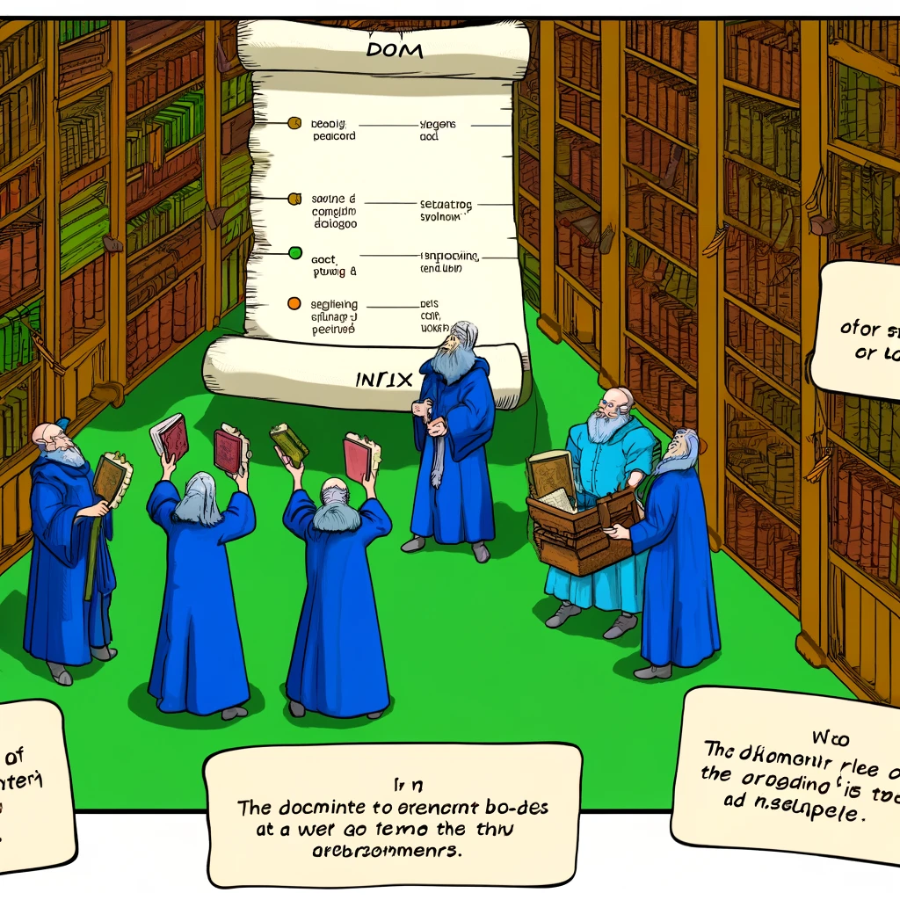

# Dokumendi Objekti Mudel (DOM)

Selles õppematerjalis saad teada, mis on Dokumendi Objekti Mudel ehk DOM ja miks on see veebiarenduses oluline.



Pildi allikas: Dall-E by OpenAI

- [Dokumendi Objekti Mudel (DOM)](#dokumendi-objekti-mudel-dom)
  - [Õpiväljundid](#õpiväljundid)
  - [Mis on DOM?](#mis-on-dom)
  - [Miks on DOM oluline?](#miks-on-dom-oluline)
  - [Kuidas kasutada DOM-i](#kuidas-kasutada-dom-i)
  - [DOM-i manipuleerimise näited](#dom-i-manipuleerimise-näited)

## Õpiväljundid

Pärast selle materjali läbimist oskad:

- Selgitada, mis on Dokumendi Objekti Mudel (DOM) ja kuidas see toimib;
- näidata, kuidas kasutada DOM-i elementide valimiseks ja nendega manipuleerimiseks;
- kirjeldada, kuidas DOM võimaldab veebilehtedel olla dünaamilised ja interaktiivsed;
- näidata, kuidas kasutada DOM-i sündmuste käsitlemiseks ja reageerimiseks.

## Mis on DOM?

Dokumendi Objekti Mudel (DOM) on programmeerimisliides, mida veebibrauserid kasutavad veebidokumentide kujundamiseks. See kujutab kogu lehe sisu, struktuuri ja stiili objektidena, millele saab juurde pääseda ja neid muuta JavaScripti kaudu. DOM esitab dokumendi hierarhilise puuna, võimaldades arendajatel valida üksikuid elemente ja manipuleerida nendega dünaamiliselt.

Kõige lihtsam viis DOM-i mõistmiseks on kujutada ette HTML-dokumenti, mis on esitatud puuna, kus iga element on sõlme ja iga sõlme omadused ja atribuudid on objektid. Näiteks HTML-dokumendi `<body>` element on DOM-i puus sõlm, millel on omadused nagu `textContent`, `innerHTML` ja `style`. Kui soovid kogu lehe objekti ise vaadata, saad seda teha, avades brauseriarendaja tööriistad ja vaadates DOM-i puud Elementide paneelil.

## Miks on DOM oluline?

- **Dünaamiline sisu**: DOM võimaldab arendajatel JavaScripti abil lehe sisu dünaamiliselt muuta. See tähendab, et saate programmiliselt lisada, eemaldada ja muuta HTML-elemente ja nende stiile, ilma et peaksite lehte uuesti laadima.
- **Interaktiivsus**: DOM võimaldab arendajatel lisada interaktiivsust veebilehtedele. Näiteks saavad kasutajad klõpsata nupul, mis muudab lehe välimust või käivitab uue funktsionaalsuse ilma lehte uuesti laadimata.
- **Reageerimine sündmustele**: DOM võimaldab JavaScriptil reageerida erinevatele sündmustele, nagu klõpsud, klaviatuuri sisestused ja hiire liigutused, muutes veebikogemuse rikkalikumaks ja interaktiivsemaks.

## Kuidas kasutada DOM-i

DOM-i kasutamine hõlmab HTML-elementide valimist ja nendega manipuleerimist JavaScripti abil. Siin on mõned näited:

- **Elementide valimine**: Saate valida elemendid nende ID, klassi, sildi nime või muude atribuutide alusel. Näiteks `document.getElementById('header')` valib elemendi, mille ID on "header".

- **Elementide lisamine**: Saate luua uusi elemente ja lisada need dokumendipuusse. Näiteks `document.createElement('p')` loob uue lõigu elemendi.

- **Elementide muutmine**: Saate muuta olemasolevate elementide omadusi, sisu või stiili. Näiteks `element.innerHTML = 'Tere tulemast!'` muudab valitud elemendi sisu.

- **Sündmuste käsitlemine**: Saate seada sündmusekuulajad, mis reageerivad kasutaja tegevustele. Näiteks `button.addEventListener('click', function() { alert('Nuppu vajutati!'); });` lisab nupule klõpsusündmuse kuulaja.

## DOM-i manipuleerimise näited

- **Sisu muutmine**: Muutke veebilehe teksti või HTML-sisu.
  
```javascript
document.getElementById('myElement').textContent = 'Uus tekst';
```

- **Stiili muutmine**: Muutke elemendi stiili, näiteks värvi või fonti.

```javascript
document.getElementById('myElement').style.color = 'red';
```

- **Elementide lisamine/eemaldamine**: Lisage uusi elemente või eemaldage olemasolevad.

```javascript
var newElement = document.createElement('div');
document.body.appendChild(newElement);
```

- **Sündmuse käsitsemine**: Seadistage reaktsioonid kasutajategevustele.

```javascript
var button = document.getElementById('myButton');
button.addEventListener('click', function() {
  alert('Nuppu vajutati!');
});
 ```

DOM on veebiarenduses keskne mõiste, mis võimaldab rikkalikku ja interaktiivset kasut

ajakogemust. DOM-i tundmine ja oskus seda efektiivselt kasutada on igale veebiarendajale hädavajalik oskus. Kui soovid DOM-i kohta rohkem teada saada, vaata [MDN Web Docs](https://developer.mozilla.org/en-US/docs/Web/API/Document_Object_Model).
