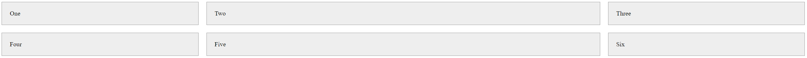
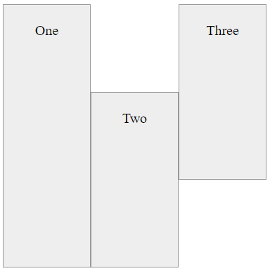

# Grid

Selles teemas õpime CSS Gridi põhitõdesid.


Pildi allikas: Dall-E by OpenAI

- [Grid](#grid)
  - [Õpiväljundid](#õpiväljundid)
  - [Mis on CSS Grid?](#mis-on-css-grid)
  - [Miks kasutada CSS Gridi?](#miks-kasutada-css-gridi)
  - [Kuidas kasutada CSS Gridi](#kuidas-kasutada-css-gridi)
    - [Ruudustiku konteiner](#ruudustiku-konteiner)
    - [Ruudustiku veerud](#ruudustiku-veerud)
  - [Otsesed ja kaudsed ruudustikud](#otsesed-ja-kaudsed-ruudustikud)
  - [Ruudustiku esemete paigutamine](#ruudustiku-esemete-paigutamine)
  - [Harjutused](#harjutused)
    - [Harjutus 1: Ruudustiku loomine](#harjutus-1-ruudustiku-loomine)
    - [Harjutus 2: Malelaua ruudustiku loomine](#harjutus-2-malelaua-ruudustiku-loomine)

## Õpiväljundid

Pärast selle teema läbimist oskad:

- Selgitada, mis on CSS Grid;
- Selgitada, miks kasutada CSS Gridi;
- Kasutada CSS Gridi ruudustiku veebilehe loomisel.

## Mis on CSS Grid?

CSS Grid on paigutussüsteem, mis võimaldab sul hõlpsalt luua keerukaid elementide paigutusi veebilehel. See on kahemõõtmeline süsteem, mis tähendab, et see suudab hallata nii veerge kui ridu, erinevalt *flexboxist*, mis on suuresti ühemõõtmeline süsteem. CSS Gridi toetavad kõik kaasaegsed brauserid.

Grid pakub ruudustikupõhist paigutussüsteemi, koos ridade ja veergudega, muutes veebilehtede kujundamise lihtsamaks ilma hõljumise (*float*) ja paigutuse (*position*) atribuutide kasutamiseta. See pakub paremat paindlikkuse ja kontrolli taset CSS-i lehekülje paigutustes.

Põhimõtteliselt võime mõelda CSS Gridile kui tabelile, kus saame määratleda ridade ja veergude arvu ning seejärel paigutada esemed tabelisse. Esemed võivad hõlmata mitut rida ja veergu ning neid saab paigutada tabelis kuhu iganes.

## Miks kasutada CSS Gridi?

- **Kahemõõtmeline paigutus**: Grid võimaldab töötada samaaegselt nii ridade kui veergudega, mis ei ole Flexboxiga (ühemõõtmeline süsteem) võimalik.
- **Fikseeritud ja paindlikud radade (track) suurused**: Saad defineerida ruudustiku fikseeritud radade suurustega - kus radade suurus on määratletud pikslites, või paindlike radade suurustega - kus radade suurus on määratletud protsentides või saadaoleva ruumi murdosadena.
- **Kontroll ja täpsus**: Saad valida täpselt paigutuse ja suuruse iga ruudustiku elemendi jaoks.
- **Reageeriv disain**: See lihtsustab reageeriva disaini loomist. Ruudustiku esemeid saab hõlpsalt ümber paigutada ja muuta nende suurust, kui veebilehitseja suurus muutub, ilma HTML-i muutmata.
- **Lisaradade loomine**: Saad automaatselt luua lisaradu (ridu ja veerge) ruudustiku konteineris, ilma HTML-i muutmata.
- **Keerukate paigutuste lihtsustamine**: See on ideaalne keerukate paigutuste jaoks, mis olid vanemate CSS-omadustega raskesti saavutatavad, vähendades vajadust täiendava märgistuse või keeruka skriptimise järele.
- **Brauseri tugi**: Kaasaegsed brauserid, sealhulgas Chrome'i, Firefoxi, Safari ja Edge'i viimased versioonid, toetavad Gridi, muutes selle laialdaselt kasutatavaks praeguses veebiarenduses.

> Ruudustiku rajad on ruudustiku veerud ja read. Ruudustiku rada võib olla veerg või rida.

## Kuidas kasutada CSS Gridi

### Ruudustiku konteiner

Ruudustiku loomiseks peame esmalt määratlema ruudustiku konteineri. Ruudustiku konteiner on element, mis sisaldab ruudustikku. Ruudustiku konteineri loomiseks peame määrama elemendi `display` omaduseks `grid` või `inline-grid`.

```css
.container {
  display: grid;
}
```

Nüüd saame luua HTML-elemente konteineri sisse, kus saavad ruudustiku elementideks. Lisame `div` elemendile `class="container"`, et muuta see ruudustiku konteineriks. Kõik konteineri sees olevad elemendid saavad omakorda ruudustiku elementideks. Lisame ka igale `div` elemendile `class="item"`, et saaksime neile stiile lisada.

```html
<body>
  <div class="container"> <!-- Ruudustiku konteiner -->
    <div class="item">Üks</div> <!-- Ruudustiku element -->
    <div class="item">Kaks</div>
    <div class="item">Kolm</div>
    <div class="item">Neli</div>
    <div class="item">Viis</div>
    <div class="item">Kuus</div>
  </div>
</body>
```

Lihtsalt demonstratsiooni eesmärgil lisame ruudustiku elementidele mõned stiilid.

```css
.item {
  background-color: #eee;
  border: 1px solid #999;
  padding: 20px;
}
```

Meie ruudustiku konteiner näeb nüüd välja selline:


### Ruudustiku veerud

Vaikimisi kuvab ruudustiku konteiner ruudustiku elemendid ühes veerus. Ruudustikuga mitme veeru loomiseks peame määratlema ruudustiku konteineris veergude arvu, kasutades omadust `grid-template-columns`.

```css
.container {
  display: grid;
  grid-template-columns: 200px 200px 200px;
}
```

Omadus `grid-template-columns` määratleb ruudustiku konteineris veergude arvu ja iga veeru laiuse. Ülaltoodud näites oleme määratlenud **kolm** veergu, igaühe laiusega **200 pikslit**.

Nüüd näeb meie ruudustiku konteiner välja selline:


Nagu näeme, on meil nüüd **kolm** veergu fikseeritud veerulaiustega. Veerud on **200 pikslit** laiad. Kui lisame rohkem ruudustiku elemente, paigutatakse need automaatselt järgmisse ritta.

Kui soovime dünaamilisi veerulaiusi, saame kasutada fikseeritud laiuste asemel protsente või saadaoleva ruumi murdosi. Murdosad on täpsustatud `fr` ühikuga. Näiteks kui soovime, et veerud võtaksid võrdse ruumi, saame kasutada iga veeru jaoks `1fr`.

```css
.container {
  display: grid;
  grid-template-columns: 1fr 1fr 1fr;
}
```

Nüüd näeb meie ruudustiku konteiner välja selline:


Nagu näeme, võtavad meie veerud nüüd ruudustiku konteineris kogu ruumi.

Lihtsalt selleks, et asjad natuke kenamad välja näeksid, lisame ruudustiku elementide vahele mõned vahed. Vahe on ruum ruudustiku elementide vahel. Vahet saame lisada ruudustiku elementide vahele, kasutades omadust `gap`.

Samuti muudame asja natuke huvitavamaks, muutes veerud erineva laiusega veegudeks - teeme esimese veeru **1fr**, teise veeru **2fr** ja kolmanda veeru **1fr**.

See tähendab, et esimene veerg võtab saadaolevast ruumist **1/4**, teine veerg võtab saadaolevast ruumist **2/4** ja kolmas veerg võtab saadaolevast ruumist **1/4**.

```css
.container {
  display: grid;
  grid-template-columns: 1fr 2fr 1fr;
  gap: 20px;
}
```

Nüüd näeb meie ruudustiku konteiner välja selline:



Saame samuti segada fikseeritud laiuseid ja dünaamilisi laiuseid. Näiteks kui soovime, et esimene veerg oleks **200 pikslit** lai, teine veerg võtaks saadaolevast ruumist **1/4** ja kolmas veerg võtaks saadaolevast ruumist **3/4**, saame seda teha nii:

```css
.container {
  display: grid;
  grid-template-columns: 200px 1fr 3fr;
  gap: 20px;
}
```

Nüüd on meil üks fikseeritud laiusega veerg ja kaks dünaamilise laiusega veergu. Huvitav on see, et dünaamilise laiusega veerud võtavad arvesse saadaolevat ruumi pärast fikseeritud laiusega veeru arvestamist ja kui me muudame brauseri suurust, siis dünaamilise laiusega veerud muudavad vastavalt suurust.


## Otsesed ja kaudsed ruudustikud

Meie ülalnimetatud näidetes oleme määratlenud ruudustiku konteineris veergude arvu, kasutades omadust `grid-template-columns`. Neid veerge nimetatakse otseseteks veergudeks. Otsene veerg on veerg, mille on loonud arendaja. Kuid meie näidetes on meil ka read, kuid me pole määratlenud ruudustiku konteineris ridade arvu. Need read on osa kaudsest ruudustikust.

Me saame luua otsese ruudustiku, määratledes ruudustiku konteineris ridade ja veergude arvu, kasutades omadusi `grid-template-columns` ja `grid-template-rows`.

```css
.container {
  display: grid;
  grid-template-columns: 1fr 2fr 1fr;
  grid-template-rows: 100px 100px;
  gap: 20px;
}
```

Nüüd näeb meie ruudustiku konteiner välja selline:


Nagu näeme, on meil nüüd otsene ruudustik **kahe** rea ja **kolme** veeruga. Esimene rida on **100 pikslit** kõrge, teine rida on **100 pikslit kõrge**, esimene veerg võtab saadaolevast ruumist **1/4**, teine veerg võtab saadaolevast ruumist **2/4** ja kolmas veerg võtab saadaolevast ruumist **1/4**.

Aga mis juhtub, kui lisame rohkem ruudustiku elemente? Lisame ruudustiku konteinerisse veel kolm ruudustiku elementi.

```html
<body>
  <div class="container">
    <div class="item">Üks</div>
    <div class="item">Kaks</div>
    <div class="item">Kolm</div>
    <div class="item">Neli</div>
    <div class="item">Viis</div>
    <div class="item">Kuus</div>
    <div class="item">Seitse</div>
    <div class="item">Kaheksa</div>
    <div class="item">Üheksa</div>
  </div>
</body>
```

Nagu näeme, on meil nüüd **kolm** rida, kuid oleme määratlenud ruudustiku konteineris ainult **kaks** rida. Kolmas rida on osa kaudsest ruudustikust. Kaudne ruudustik luuakse automaatselt, kui lisame rohkem ruudustiku elemente, kui oleme määratlenud ridu ja veerge ruudustiku konteineris. Samuti näeme, et kaudses ruudustikus olevatel ruudustiku elementidel ei ole sama kõrgus kui otsese ruudustiku ruudustiku esemetel.


Samuti saame määrata kaudse ruudustiku ridade kõrguse, kasutades omadust `grid-auto-rows`.

```css
.container {
  display: grid;
  grid-template-columns: 1fr 2fr 1fr;
  grid-auto-rows: 100px;
  gap: 20px;
}
```


## Ruudustiku esemete paigutamine

Kui soovime rohkem kontrolli ruudustiku elementide paigutamise üle, saame kasutada omadusi `grid-column-start`, `grid-column-end`, `grid-row-start` ja `grid-row-end`. Need omadused võimaldavad meil täpsustada, kus ruudustiku element peaks algama ja lõppema.

Enne nende omaduste kasutamist peame mõistma, kuidas ruudustik on struktureeritud. Ruudustik on struktureeritud veergudeks ja ridadeks. Igal veerul ja real on algusjoon ja lõppjoon. Algusjoon on joon, kus veerg või rida algab, ja lõppjoon on joon, kus veerg või rida lõpeb. Jooned on nummerdatud alates 1 ja ülespoole. Veergude jooned on nummerdatud vasakult paremale ja ridade jooned ülalt alla.


[Pildi allikas](https://developer.mozilla.org/en-US/docs/Web/CSS/CSS_grid_layout/Basic_concepts_of_grid_layout)

Saame kasutada omadusi `grid-column-start` ja `grid-column-end`, et täpsustada, kus ruudustiku element peaks algama ja lõppema horisontaalselt. Saame kasutada omadusi `grid-row-start` ja `grid-row-end`, et täpsustada, kus ruudustiku element peaks algama ja lõppema vertikaalselt.

Näiteks kui soovime luua **3x3** ruudustiku ja paigutada kolm elementi ruudustikku nii, et esimene element on esimeses reas ja esimeses veerus, teine element teises reas ja teises veerus ning kolmas element kolmandas reas ja kolmandas veerus, saame seda teha nii:

```html
<body>
  <div class="container">
    <div class="item box-1">Üks</div>
    <div class="item box-2">Kaks</div>
    <div class="item box-3">Kolm</div>
  </div>
</body>
```

```css
.container {
  display: grid;
  grid-template-columns: 100px 100px 100px;
  grid-template-rows: 100px 100px 100px;
}

.item {
  background-color: #eee;
  border: 1px solid #999;
  padding: 20px;
  text-align: center;
}

.box-1 {
  grid-column: 1 / 2;
  grid-row: 1 / 2;
}

.box-2 {
  grid-column: 2 / 3;
  grid-row: 2 / 3;
}

.box-3 {
  grid-column: 3 / 4;
  grid-row: 3 / 4;
}
```

Nagu näeme näitest, pidime looma elemendid klassidega `box-1`, `box-2` ja `box-3`, et saaksime neile eraldi stiile lisada. Esimene element on paigutatud esimese veeru esimesest joonest teise jooneni ja esimese rea esimesest joonest teise jooneni. Teised elemendid on paigutatud samamoodi, kuid erinevates veergudes ja ridades.


Veel üks näide:

```css
.box-1 {
  grid-column: 1 / 2;
  grid-row: 1 / 4

;
}

.box-2 {
  grid-column: 2 / 3;
  grid-row: 2 / 4;
}

.box-3 {
  grid-column: 3 / 4;
  grid-row: 1 / 3;
}
```



CSS Grid on palju rohkem, kui siin käsitlesime. Oleme alles *kriimustanud* CSS Gridi pinda. Kui soovid CSS Gridi kohta rohkem teada saada, vaata [CSS Gridi paigutuse](https://developer.mozilla.org/en-US/docs/Web/CSS/CSS_Grid_Layout) dokumentatsiooni MDN-is.

## Harjutused

Loo `index.html` ja `style.css` failid. Ühenda `style.css` fail `index.html` failiga. Kasuta `style.css` faili CSS-koodi kirjutamiseks. Kasuta `index.html` faili HTML-koodi kirjutamiseks.

Testi oma koodi, avades `index.html` faili brauseris.

Proovi lahendada harjutused ilma lahendusi vaatamata. Kui jääte hätta, võite vaadata lahendusi.

### Harjutus 1: Ruudustiku loomine

**Eesmärk**: Loo lihtne ruudustikupaigutus nelja võrdse laiusega veeruga.

**Kirjeldus**: Kujunda veebilehe paigutus, mis sisaldab ruudustikku nelja veeruga. Igal veerul peaks olema sama laius. Veergude vahel peaks olema **10** pikslit vahet. Võid kasutada `div` elemente ruudustiku konteineri ja ruudustiku elementide jaoks. Stiili ruudustiku elemendid erinevate taustavärvidega visuaalseks eristamiseks.

> Vihje: Kasuta `grid-template-columns` omadust veergude arvu ja nende laiuse määratlemiseks.
>
> Vihje: Kasuta `gap` omadust veergude vahelise vahemaa lisamiseks.
>
> Vihje: Kasuta `background-color` omadust ruudustiku esemetele taustavärvi lisamiseks.

<details>
<summary>Harjutus 1 Lahendus</summary>

```html
<!DOCTYPE html>
<html lang="en">
<head>
  <meta charset="UTF-8">
  <meta name="viewport" content="width=device-width, initial-scale=1.0">
  <link rel="stylesheet" href="style.css">
  <title>Dokument</title>
</head>
<body>
  <div class="container">
    <div class="item item-1">Üks</div>
    <div class="item item-2">Kaks</div>
    <div class="item item-3">Kolm</div>
    <div class="item item-4">Neli</div>
  </div>
</body>
</html>
```

```css
.container {
  display: grid;
  grid-template-columns: 1fr 1fr 1fr 1fr;
  gap: 10px;
}

.item {
  padding: 20px;
  text-align: center;
}

.item-1 {
  background-color: #eee;
}

.item-2 {
  background-color: #ddd;
}

.item-3 {
  background-color: #ccc;
}

.item-4 {
  background-color: #bbb;
}
```


</details>

### Harjutus 2: Malelaua ruudustiku loomine

**Eesmärk**: Loo malelaua ruudustikupaigutus nelja veeru ja nelja reaga võrdse laiuse ja kõrgusega. Tee nii, et see näeks välja nagu malelaud. See tähendab, et esimeses reas peaks olema must ruut esimeses veerus, valge ruut teises veerus, must ruut kolmandas veerus ja valge ruut neljandas veerus. Teises reas peaks olema valge ruut esimeses veerus, must ruut teises veerus, valge ruut kolmandas veerus ja must ruut neljandas veerus. Ja nii edasi.

**

Kirjeldus**: Kujunda veebilehe paigutus, mis sisaldab ruudustikku nelja veeru ja nelja reaga. Igal veerul ja real peaks olema sama laius ja kõrgus. Võid kasutada `div` elemente ruudustiku konteineri ja ruudustiku esemete jaoks. Stiili ruudustiku esemed nii, et need näeksid välja nagu malelaud.

> Vihje: Kasuta `grid-template-columns` omadust veergude arvu ja nende laiuse määratlemiseks.
>
> Vihje: Kasuta `grid-template-rows` omadust ridade arvu ja nende kõrguse määratlemiseks.

<details>
<summary>Harjutus 2 Lahendus</summary>

```html
<!DOCTYPE html>
<html lang="en">
<head>
  <meta charset="UTF-8">
  <meta name="viewport" content="width=device-width, initial-scale=1.0">
  <link rel="stylesheet" href="style.css">
  <title>Dokument</title>
</head>
<body>
  <div class="container">
    <div class="item item-1"></div>
    <div class="item item-2"></div>
    <div class="item item-3"></div>
    <div class="item item-4"></div>
    <div class="item item-5"></div>
    <div class="item item-6"></div>
    <div class="item item-7"></div>
    <div class="item item-8"></div>
    <div class="item item-9"></div>
    <div class="item item-10"></div>
    <div class="item item-11"></div>
    <div class="item item-12"></div>
    <div class="item item-13"></div>
    <div class="item item-14"></div>
    <div class="item item-15"></div>
    <div class="item item-16"></div>
  </div>
</body>
</html>
```

```css
.container {
  display: grid;
  grid-template-columns: 60px 60px 60px 60px;
  grid-template-rows: 60px 60px 60px 60px;
}

.item-1,
.item-3,
.item-6,
.item-8,
.item-9,
.item-11,
.item-14,
.item-16 {
  background-color: #000;
}

.item-2,
.item-4,
.item-5,
.item-7,
.item-10,
.item-12,
.item-13,
.item-15 {
  background-color: #fff;
}
```

> Märkus: Selle harjutuse lahendamiseks on palju erinevaid viise. See on vaid üks neist.
>
> Märkus: Saate ka kasutada `repeat()` funktsiooni lahenduse lihtsustamiseks. Näiteks `grid-template-columns: repeat(4, 60px);` loob neli veergu 60 piksli laiusega.

</details>
```
