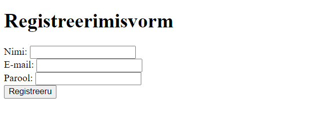

# HTML-i Vormid: Loomine ja Käsitlemine

Selles õppematerjalis käsitleme HTML-i vormide loomist ja käsitlemist. Vormid on veebilehtede olulised komponendid, mis võimaldavad kasutajatel sisestada andmeid ja interakteeruda veebisaitidega.


Pildi allikas: Dall-E by OpenAI

- [HTML-i Vormid: Loomine ja Käsitlemine](#html-i-vormid-loomine-ja-käsitlemine)
  - [Õpiväljundid](#õpiväljundid)
  - [Mis on HTML-i Vorm?](#mis-on-html-i-vorm)
  - [HTML-i Vormide Põhielemendid](#html-i-vormide-põhielemendid)
    - [HTML vormide atribuudid](#html-vormide-atribuudid)
  - [HTML vormi näide: Lihtne registreerimisvorm](#html-vormi-näide-lihtne-registreerimisvorm)
  - [Veel näiteid HMTL vormielementidest](#veel-näiteid-hmtl-vormielementidest)
    - [Valikmenüü (Select ja Option)](#valikmenüü-select-ja-option)
    - [Märkeruut (Checkbox)](#märkeruut-checkbox)
    - [Raadionupp](#raadionupp)
  - [Vormide esitamine ja andmete käsitlemine](#vormide-esitamine-ja-andmete-käsitlemine)
  - [Kokkuvõtteks](#kokkuvõtteks)
  - [Allikad](#allikad)

## Õpiväljundid

Pärast selle teema läbimist oskad:

- luua HTML-i vorme kasutades erinevaid sisendelemente;
- mõista vormide esitamise protsessi;
- Käsitleda vormide andmeid turvaliselt.

## Mis on HTML-i Vorm?

HTML-i vorm koosneb ühest või mitmest sisendväljast, mille kasutajad saavad täita. Vormid võimaldavad kasutajatel esitada teavet, nagu nimed, aadressid ja paroolid, mis on vajalikud ülesannete täitmiseks nagu kasutajakonto loomine, sisselogimine või andmete otsimine.

## HTML-i Vormide Põhielemendid

Vormid kasutavad `<form>` elementi, mis määratleb, kuidas andmed saadetakse serverisse. Siin on mõned peamised elemendid, mida kasutatakse HTML-i vormides:

- **`<form>`**: Defineerib vormi ja selle omadused, nagu `action` (andmete saatmise sihtkoht) ja `method` (andmete saatmise meetod, tavaliselt `GET` või `POST`).
- **`<input>`**: Loo sisendväljad erinevat tüüpi andmete jaoks, nagu tekst, paroolid ja numbrid.
- **`<label>`**: Määrab märgised sisendväljadele, parandades ligipääsetavust ja kasutajakogemust.
- **`<textarea>`**: Võimaldab mitmerealist tekstisisestust.
- **`<button>`**: Loob nupud, nagu esitamis- või tühistamisnupud.
- **`<select>` ja `<option>`**: Loob rippmenüüd valikute jaoks.
- **`<checkbox>` ja `<radio>`**: Loob märkeruudud ja raadionupud valikute jaoks.

### HTML vormide atribuudid

Nagu näitest näha, siis saab lisada vormidele erinevaid atribuute, mis määravad vormi käitumise, välimus ja muud omadused. Mõned levinumad atribuudid on:

- `action`: Määrab URL-i, kuhu vormi andmed saadetakse.
- `method`: Määrab andmete saatmise meetodi, tavaliselt `GET` või `POST`.
- `name`: Määrab vormi elemendi nime.
- `id`: Määrab vormi elemendi unikaalse identifikaatori.
- `required`: Määrab, kas vormielement on kohustuslik.
- `placeholder`: Määrab vormielemendi kohatäite teksti.
- `value`: Määrab vormielemendi vaikimisi väärtuse.
- `type`: Määrab vormielemendi tüübi, nagu `text`, `email`, `password`, `checkbox` jne.
- `for`: Seob `<label>` elemendi `<input>` elemendiga.
- `checked`: Määrab, kas märkeruut või raadionupp on vaikimisi valitud.
- `selected`: Määrab, kas valik on vaikimisi valitud.
- `disabled`: Määrab, kas vormielement on vaikimisi keelatud.
- jne ...

## HTML vormi näide: Lihtne registreerimisvorm

```html
<h1>
  Registreerimisvorm
</h1>
<body>
  <form action="/submit-form" method="POST">
    <label for="name">Nimi:</label>
    <input type="text" id="name" name="name" required>
    <br>
    <label for="email">E-mail:</label>
    <input type="email" id="email" name="email" required>
    <br>
    <label for="password">Parool:</label>
    <input type="password" id="password" name="password" required>
    <br>
    <button type="submit">Registreeru</button>
  </form>
```

> `<label>` märgendite abil saame lisada teksti, mis kirjeldab sisendvälja eesmärki. `<label>` märgendi saab siduda sisendväljaga, kasutades `for` atribuuti, mis vastab sisendvälja `id` atribuudile. See parandab vormi ligipääsetavust ja kasutajakogemust.

Selles näites on lihtne registreerimisvorm, mis sisaldab nime, e-posti ja parooli sisestusvälju ning esitamisnuppu. Vormi andmed saadetakse serverisse `POST` meetodiga ja suunatakse `/submit-form` URL-ile.

Eelpool toodud näide näeb v'lja selline:



## Veel näiteid HMTL vormielementidest

### Valikmenüü (Select ja Option)

```html
<label for="country">Riik:</label>
<select id="country" name="country">
  <option value="usa">USA</option>
  <option value="canada">Kanada</option>
  <option value="uk">Suurbritannia</option>
</select>
```

### Märkeruut (Checkbox)

```html
<input type="checkbox" name="subscribe" id="subscribe">
<label for="subscribe">Telli uudiskiri</label>
```

### Raadionupp

```html
<input type="radio" name="gender" value="male" id="gender-male" checked>
<label for="gender-male">Mees</label>
<input type="radio" name="gender" value="female" id="gender-female">
<label for="gender-female">Naine</label>
```

## Vormide esitamine ja andmete käsitlemine

Kui kasutaja vajutab esitamisnuppu, kogutakse vormi andmed ja saadetakse serverisse määratud `action` URL-ile kasutades `method` atribuudis määratud meetodit.

## Kokkuvõtteks

HTML-i vormid on veebiarenduse põhielemendid, mis võimaldavad kasutajatel sisestada ja esitada andmeid. Nende õige kasutamine ja käsitlemine võimaldab luua turvalisi ja kasutajasõbralikke veebilehti. Vormide efektiivne rakendamine nõuab nii hea kasutajakogemuse kujundamist kui ka andmete turvalisuse tagamist.

## Allikad

- Mozilla Developer Network (MDN) - [HTML Forms](https://developer.mozilla.org/en-US/docs/Learn/Forms)
- W3Schools - [HTML Form Elements](https://www.w3schools.com/html/html_form_elements.asp)
