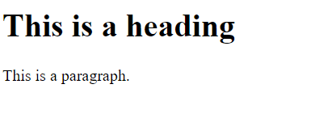
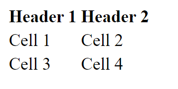
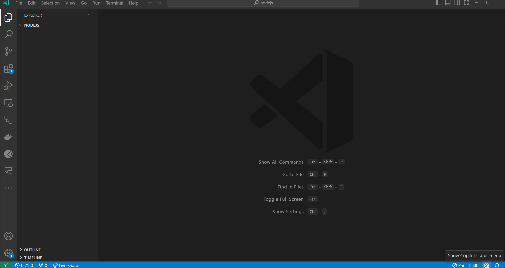
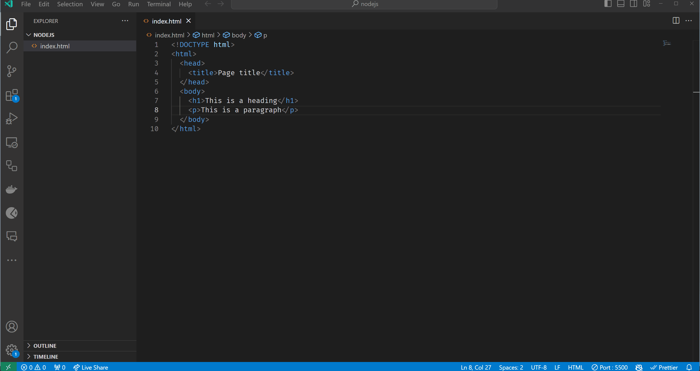
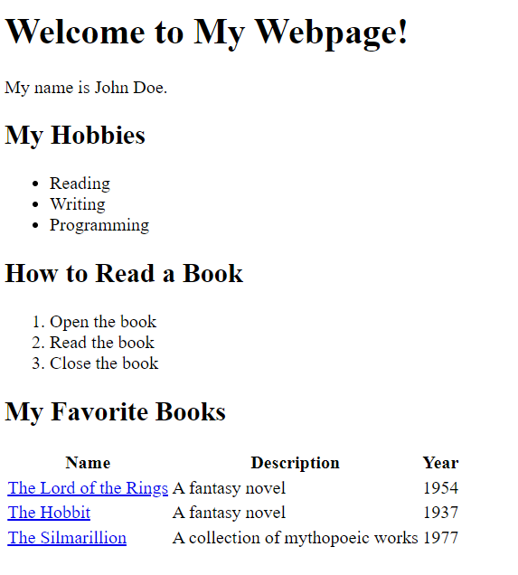

# Hüperteksi märgendikeel (Hyper Text Markup Language, *HTML*)

Selles peatükis räägime HTML-i põhitõdedest.

- [Hüperteksi märgendikeel (Hyper Text Markup Language, *HTML*)](#hüperteksi-märgendikeel-hyper-text-markup-language-html)
  - [Õpiväljundid](#õpiväljundid)
  - [HTML põhitõed](#html-põhitõed)
  - [HTML märgendid](#html-märgendid)
  - [HTML elemendid](#html-elemendid)
  - [Pesastatud HTML elemendid](#pesastatud-html-elemendid)
  - [HTML atribuudid](#html-atribuudid)
  - [HTML dokumendi struktuur](#html-dokumendi-struktuur)
  - [HTML dokumendi metaandmed](#html-dokumendi-metaandmed)
  - [Kuidas kirjutada HTML-i?](#kuidas-kirjutada-html-i)
  - [Kuidas käivitada HTML-i?](#kuidas-käivitada-html-i)
  - [Harjutused](#harjutused)
    - [Harjutus 1 - Põhiline HTML lehe struktuur](#harjutus-1---põhiline-html-lehe-struktuur)
    - [Harjutus 2 - HTML nimekirjad](#harjutus-2---html-nimekirjad)
    - [Harjutus 3 - HTML tabel ja lingid](#harjutus-3---html-tabel-ja-lingid)
    - [Kasutatud allikad](#kasutatud-allikad)

## Õpiväljundid

Pärast selle teema läbimist oskad:

- seletada, mis on HTML;
- seletada, mis on HTML märgendid;
- seletada, mis on HTML elemendid;
- seletada, mis on HTML atribuudid;
- seletada, mis on HTML dokumendi struktuur;
- seletada, mis on HTML dokumendi metaandmed;
- kirjutada lihtsa HTML dokumendi;
- avada HTML dokumendi veebiveebilehitsejais.

## HTML põhitõed

HTML on lühend, mis märgenditab Hyper Text Markup Language ja tähendab tõlgituna Hüperteksti Märgendikeel.

Märgendikeel tähendab, et erinevalt programmeerimiskeele kasutamisest arvuti juhendamiseks, kasutatakse märgendeid erinevat tüüpi sisu määratlemiseks. HTML on standardne märgendikeel veebilehtede loomiseks. HTML kirjeldab veebilehe struktuuri ja see koosneb elementide seeriast, mida kasutatakse sisu teatud viisil kuvamiseks või käitumiseks. Sisu ümbritsevad märgendid võivad muuta sõna või pildi hüperlingiks kuskile mujale lehele, võivad sõnad kursiivis kuvada, muuta fondi suuremaks või väiksemaks jne.

HTML-is ei öelda arvutile, mida teha, vaid öeldakse, mis midagi on. Näiteks võib öelda "see on lõik", "see on pealkiri", "see on link" jne. Veebilehitseja teab siis, kuidas kirjutatud sisu kuvada. Erinevad veebilehitsejad võivad seda erinevalt kuvada, kuid siiski need kõik teavad, millega on tegemist. Näiteks võib üks veebilehitseja kuvada lõiku erinevas fondis kui teine veebilehitseja, kuid mõlemad teavad, et tegemist on lõiguga.

## HTML märgendid

HTML märgendid on elemendinimed, mis on ümbritsetud nurksulgudega `<>` – HTML-is kasutatakse märgendit HTML elementide loomiseks, mis on HTML-lehtede ehituskivid. HTML märgendid on märksõnad nurksulgude vahel:

```html
<tagname></tagname>
```

HTML märgendid tulevad tavaliselt paarides nagu `<p>` ja `</p>`. Esimene märgend paarist on algustmärgend, teine märgend on lõpumärgend. Lõpumärgendit kirjutatakse nagu algusmärgendit, kuid enne märgendi nime lisatakse kaldkriips. Mõnedel HTML märgendil ei ole lõpumärgendit, nagu `<br>` märgend (mis näitab reavahetust).

HTML märgendeid on palju erinevaid. HTML märgendeid kasutatakse teksti kuvamiseks või vormindamiseks, piltide kuvamiseks, tabelite kuvamiseks, vormide kuvamiseks jne. Täielik nimekiri HTML märgenditest on leitav [siit](https://developer.mozilla.org/en-US/docs/Web/HTML/Element).

Raske on välja tuua kõige levinumaid HTML märgendeid, sest see sõltub sellest, mida sa üritad teha. Kuid on mõned HTML märgendid, mida kasutatakse väga tihti. Näiteks:

- `<h1>` - esimese taseme pealkiri;
- `<p>` - lõik, paragrahv;
- `<div>` - kasutatakse jaotuse või sektsiooni loomiseks HTML dokumendis;
- `<a>` - link, hüperlink;
- `` - pildi kuvamise märgend;
- `<table>` - tabeli loomise märgend;
- `<form>` - sisestusvormi loomise märgend;
- `<input>` - sisestusvormi välja loomise märgend;
- `<button>` - nupp;
- `<ul>` - järjestamata loend (täpploend);
- `<ol>` - järjestatud loend (nummerdatud loend);
- `<li>` - loendi element;
- jne.

## HTML elemendid

HTML element on defineeritud algustähise, mõne sisu ja lõputähisega:

```html
<tagname>Sisu läheb siia...</tagname>
```

> Tähiseid kasutatakse HTML elemendi alguse ja lõpu märgenditamiseks. Elemendi sisu on kõik algus- ja lõpumärgenid vahel olev, kaasa arvatud algus- ja lõpumärgendid.

Näiteks järgmine HTML kood defineerib esimese taseme pealkirja ja lõigu elemendi:

```html
<h1>See on pealkiri</h1>
<p>See on lõik.</p>
```

`<h1>` märgend defineerib esimese taseme pealkirja. `<p>` märgendi defineerib lõigu.

Veebilehitsejad ei näita HTML märgendit, kuid kasutavad neid lehe sisu renderdamiseks. Google Chrome'is kuvatakse see kood nii:



Nagu näha, siis `<h1>` märgend teeb teksti suuremaks ja paksemaks ning `<p>` märgend lisab lõigu ümber tühja ruumi.

## Pesastatud HTML elemendid

HTML elemendid võivad olla pesastatud (elemendid võivad sisaldada elemente). Enamik HTML elemente võib olla pesastatud (välja arvatud mõned HTML elemendid, nagu `<br>` märgendid).

Näiteks järgmine HTML kood defineerib esimese taseme pealkirja ja lõigu elemendi ning lõigu element sisaldab lingi elementi:

```html
<h1>See on pealkiri</h1>
<p>See on lõik.
  <a href="https://www.google.com/">Google</a>
</p>
```

HTML elementide pesastamine on väga tavaline. Näiteks `<body>` element sisaldab kõiki HTML dokumendi sisu ja `<head>` element sisaldab kõiki HTML dokumendi metaandmeid. Pesastamist kasutatakse ka elementide rühmitamiseks. Näiteks `<ul>` element sisaldab kõiki järjestamata nimekirja üksuseid (`<li>` elemente). Näiteks:

```html
<ul>
  <li>Üksus 1</li>
  <li>Üksus 2</li>
</ul>

<ol>
  <li>Üksus 1</li>
  <li>Üksus 2</li>
</ol>
```

Teine näide pesastatud HTML elementidest oleks tabel. Tabel sisaldab ridu (`<tr>` elemente). Tabeli esimene rida sisaldab tabeli päiseid (`<th>` elemente) ja teised read sisaldavad tabeli lahtrid (`<td>` elemente). Näiteks:

```html
<table>
  <tr>
    <th>Päis 1</th>
    <th>Päis 2</th>
  </tr>
  <tr>
    <td>Lahtr 1</td>
    <td>Lahtr 2</td>
  </tr>
  <tr>
    <td>Lahtr 3</td>
    <td>Lahtr 4</td>
  </tr>
</table>
```

Tabeli näide kuvatakse Google Chrome'is nii:



## HTML atribuudid

HTML atribuudid on erilised sõnad, mida kasutatakse algusmärgendites elemendi käitumise juhtimiseks. HTML atribuute kasutatakse HTML elementidele lisainformatsiooni andmiseks. HTML atribuudid on alati määratud algusmärgendites. HTML atribuudid on nimetatud/väärtustatud paaridena nagu: `nimi="väärtus"`.

Näiteks järgmine HTML kood defineerib esimese taseme pealkirja koos id atribuudiga:

```html
<h1 id="heading">See on pealkiri</h1>
```

`id` atribuut määrab HTML elemendile unikaalse id. `id` atribuudi väärtus peab olema HTML dokumendis unikaalne. `id` atribuuti kasutatakse elemendi tuvastamiseks lingi abil (kasutades fragmendi identifikaatorit), skriptimisel või stiilimisel (CSS-i abil).

On mõned märgendid, millel on enamasti ka mõned atribuudid. Näiteks `<a>` märgendit kasutatakse hüperlingi loomiseks ja sellel on tavaliselt `href` atribuut, mis määrab lingi sihtkoha URL-i. `` märgendit kasutatakse pildi kuvamiseks ja sellel on tavaliselt `src` atribuut, mis määrab kuvatava pildi URL-i. `img` märgendit jaoks kasutatakse ka tavaliselt `alt` atribuuti, mis määrab pildi alternatiivse teksti, kui pilti ei saa kuvada.

```html
<a href="https://www.google.com/">Google</a>

```

Levinuimad HTML atribuudid leiate [siit](https://developer.mozilla.org/en-US/docs/Web/HTML/Attributes).

## HTML dokumendi struktuur

HTML dokument on fail, mis sisaldab HTML koodi. HTML dokument koosneb järgmistest osadest:

- HTML dokumendi deklaratsioon;
- HTML dokumendi juurelement;
- HTML dokumendi päis;
- HTML dokumendi keha.

HTML dokumendi deklaratsioon on HTML dokumendi esimene rida. See ütleb veebilehitsejaile, et dokument on HTML dokument. HTML dokumendi deklaratsioon ei ole HTML märgend. See on juhend veebilehitsejaile. HTML dokumendi deklaratsioon kirjutatakse nii:

```html
<!DOCTYPE html>
```

HTML dokumendi juurelement `html` on HTML dokumendi kõige välimine element. See on kõigi teiste elementide vanem (*parent*) HTML dokumendis. See tähendab, et kõik teised elemendid HTML dokumendis on HTML dokumendi juurelemendi järeltulijad (*child*). HTML dokumendi juurelement kirjutatakse nii:

```html
<html>
  ...
</html>
```

HTML dokumendi `head` on HTML dokumendi esimene osa. See on HTML dokumendi osa, mid ei kuvata veebilehitseja aknas. Seda kasutatakse HTML dokumendi kohta teabe määramiseks, nagu:

- HTML dokumendi pealkiri,
- HTML dokumendi märgistik
- jne.

HTML dokumendi `head` kirjutatakse nii:

```html
<head>
  <title>Lehe pealkiri</title>
</head>
```

HTML dokumendi `body` on HTML dokumendi teine osa. See on HTML dokumendi osa, mis kuvatakse veebilehitsejai aknas. Kõik HTML dokumendi nähtav sisu kirjutatakse HTML dokumendi `body`-sse. HTML dokumendi `body` kirjutatakse nii:

```html
<body>
  <h1>See on pealkiri</h1>
  <p>See on lõik.</p>
</body>
```

Kui me paneme kõik need osad kokku, saame järgmise HTML dokumendi:

```html
<!DOCTYPE html>
<html>
  <head>
    <title>Lehe pealkiri</title>
  </head>
  <body>
    <h1>See on pealkiri</h1>
    <p>See on lõik.</p>
  </body>
</html>
```

Oluline on märkida, et kõik HTML elemendid on HTML dokumendi juurelemendi järeltulijad.

## HTML dokumendi metaandmed

HTML dokumendi metaandmed on andmed HTML dokumendi kohta. HTML dokumendi metaandmeid kasutavad veebilehitsejaid (kuidas sisu kuvada või lehte uuesti laadida), otsingumootorid (märksõnad) jne. HTML dokumendi metaandmeid määratakse HTML dokumendi `head`-is, kasutades `meta` märgendit ja atribuute. Näiteks:

```html
<head>
  <title>Lehe pealkiri</title>
  <meta charset="UTF-8">
  <meta name="description" content="Tasuta veebiõpetused">
  <meta name="keywords" content="HTML, CSS, JavaScript">
  <meta name="author" content="John Doe">
</head>
```

- `<title>` määrab HTML dokumendi pealkirja.
- `<meta charset="UTF-8">` määrab HTML dokumendi märgistiku.
- `<meta name="description" content="Tasuta veebiõpetused">` määrab HTML dokumendi kirjelduse.
- `<meta name="keywords" content="HTML, CSS, JavaScript">` määrab HTML dokumendi märksõnad.
- `<meta name="author" content="John Doe">` määrab HTML dokumendi autori.

> HTML metaandmed ei ole kohustuslikud, kuid soovitatav on neid igas HTML dokumendis kasutada.

HTML metaandmete kohta saate rohkem lugeda [siit](https://developer.mozilla.org/en-US/docs/Learn/HTML/Introduction_to_HTML/The_head_metadata_in_HTML).

## Kuidas kirjutada HTML-i?

HTML on tekstipõhine märgendikeel. See tähendab, et HTML dokument on tekstifail, mis sisaldab HTML koodi. Seega, HTML-i kirjutamiseks on vaja tekstiredaktorit. Saadaval on palju erinevaid tekstiredaktoreid, sealhulgas `Notepad++`, `Sublime Text`, `Atom`, `Visual Studio Code` jne. Võib kasutada ükskõik millist neist tekstiredaktoritest HTML-i kirjutamiseks. Selles kursuses kasutame HTML-i kirjutamiseks `Visual Studio Code` koodieditori.

HTML-i kirjutamise alustamiseks on vaja luua HTML dokument. HTML dokument on tekstifail, millel on `.html` laiend. Me saame luua HTML dokumendi, kasutades ükskõik millist tekstiredaktorit. Näiteks saame luua HTML dokumendi nimega `index.html`, kasutades `Visual Studio Code`:



Nagu näha, kui me kasutame `Visual Studio Code` või mõnda muud koodiredaktorit, aitavad redaktorid meil HTML-i kirjutada. Näiteks kui me tipime `<h1>` märgendit, lisab redaktor automaatselt `</h1>` lõpumärgendi. Samuti, kui me tipime `` märgendi, lisab redaktor automaatselt `>` märgendit lõppu. Redaktor pakub ka ettepanekuid, kui me ei mäleta mõnda märgendit või atribuuti.

Tegelikult saame kirjutada HTML-i kasutades ükskõik millist tekstiredaktorit, isegi `Notepad`-i. Kuid kui me kasutame `Notepad`-i, peame kõik märgendid ja atribuudid meelde jätma ja kõik märgendid ja atribuudid käsitsi tippima. Seega on parem kasutada koodiredaktorit, mis aitab meil HTML-i kirjutada.

## Kuidas käivitada HTML-i?

HTML-i käivitamiseks on vaja veebiveebilehitsejat. Saadaval on palju erinevaid veebiveebilehitsejaeid, sealhulgas `Google Chrome`, `Mozilla Firefox`, `Microsoft Edge`, `Opera`, `Safari` jne. Saate kasutada ükskõik millist neist veebiveebilehitsejatest HTML-i käivitamiseks. Selles kursuses kasutame HTML-i käivitamiseks `Google Chrome`.

HTML-i käivitamiseks on vaja avada HTML dokument veebiveebilehitsejas. Me saame avada HTML dokumendi veebiveebilehitsejas, topeltklõpsates HTML dokumendil. Siis avab arvuti HTML dokumendi vaikimisi veebiveebilehitsejas:



## Harjutused

Proovige harjutusi ise lahendada enne lahenduse vaatamist.

Testige alati oma koodi, et näha, kas see töötab nii, nagu soovite.

### Harjutus 1 - Põhiline HTML lehe struktuur

**Eesmärk**: Loo põhiline HTML leht standardsete elementidega.

**Kirjeldus**: Loo HTML leht (`index.html`), mis sisaldab põhistruktuuri: `doctype`, `html`, `head` ja `body` märgendit. `Body` sees lisa `h1` märgendit tekstiga "Welcome to My Webpage!", millele järgneb `p` (lõik) märgendit lühikese tutvustusega enda või valitud teema kohta.

Ava HTML leht veebiveebilehitsejais, et näha tulemust.

Tulemus peaks välja nägema umbes nii:


<details>
  <summary>Lahendus</summary>

  ```html
  <!DOCTYPE html>
  <html>
    <head>
      <title>Minu veebileht</title>
    </head>
    <body>
      <h1>Tere tulemast minu veebilehele!</h1>
      <p>Minu nimi on John Doe.</p>
    </body>
  </html>
  ```

</details>

### Harjutus 2 - HTML nimekirjad

**Eesmärk**: Kasuta HTML-i, et luua `järjestatud` ja `järjestamata` loendid.

**Kirjeldus**: Laienda `index.html` lehte. Lisa `järjestamata` loend (täpploend) oma lemmikhobidest. Seejärel lisa `järjestatud` loend (numbritega nimekiri) ühe nende hobide teostamise sammudest.

> Vihje: Kasuta vastavalt `ul` ja `ol` märgendit järjestamata ja järjestatud nimekirjade loomiseks. Kasuta `li` märgendit nimekirja üksuste loomiseks `ul` ja `ol` märgendite sees.
>
> Vihje: Sa võid kasutada erinevaid pealkirja tasemeid kahe nimekirja eristamiseks.

Tulemus peaks välja nägema umbes nii:


<details>
  <summary>Lahendus</summary>

  ```html
  <!DOCTYPE html>
  <html>
    <head>
      <title>Minu veebileht</title>
    </head>
    <body>
      <h1>Tere tulemast minu veebilehele!</h1>
      <p>Minu nimi on John Doe.</p>
      <h2>Minu hobid</h2>
      <ul>
        <li>Lugemine</li>
        <li>Kirjutamine</li>
        <li>Programmeerimine</li>
      </ul>
      <h2>Kuidas raamatut lugeda</h2>
      <ol>
        <li>Ava raamat</li>
        <li>Loe raamatut</li>
        <li>Sulge raamat</li>
      </ol>
    </body>
  </html>
  ```

</details>

### Harjutus 3 - HTML tabel ja lingid

**Eesmärk**: Loo tabel ja lisa hüperlingid.

**Kirjeldus**: Laienda veel `index.html` lehte. Loo tabel, mis loetleb vähemalt kolm eset (nt raamatud, filmid, retseptid), sealhulgas veerud eseme `nime`, lühikese `kirjelduse` ja `aasta` või asjakohase kuupäeva jaoks. Seejärel lisa `hüperlingid` välisveebisaitidele, mis annavad rohkem teavet iga eseme kohta.

> Vihje: Kasuta `table`, `tr`, `th` ja `td` märgendit, et luua tabel ridade ja veergudega.
>
> Vihje: Kasuta `a` märgendit koos `src` atribuudiga, et luua hüperlingid.

Testi hüperlinke, neil klõpsates.

Tulemus peaks välja nägema umbes nii:



<details>
  <summary>Lahendus</summary>

  ```html
  <!DOCTYPE html>
  <html>
    <head>
      <title>Minu veebileht</title>
    </head>
    <body>
      <h1>Tere tulemast minu veebilehele!</h1>
      <p>Minu nimi on John Doe.</p>
      <h2>Minu hobid</h2>
      <ul>
        <li>Lugemine</li>
        <li>Kirjutamine</li>
        <li>Programmeerimine</li>
      </ul>
      <h2>Kuidas raamatut lugeda</h2>
      <ol>
        <li>Ava raamat</li>
        <li>Loe raamatut</li>
        <li>Sulge raamat</li>
      </ol>
      <h2>Minu lemmikraamatud</h2>
      <table>
        <tr>
          <th>Nimi</th>
          <th>Kirjeldus</th>
          <th>Aasta</th>
        </tr>
        <tr>
          <td><a href="https://et.wikipedia.org/wiki/S%C3%B5rmuste_isand">Sõrmuste Isand</a></td>
          <td>Fantaasiaromaan</td>
          <td>1954</td>
        </tr>
        <tr>
          <td><a href="https://et.wikipedia.org/wiki/Hobit">Hobit</a></td>
          <td>Fantaasiaromaan</td>
          <td>1937</td>
        </tr>
        <tr>
          <td><a href="https://et.wikipedia.org/wiki/Silmarillion">Silmarillion</a></td>
          <td>Mythopoeic tööde kogumik</td>
          <td>1977</td>
        </tr>
      </table>
    </body>
  </html>
  ```

</details>

### Kasutatud allikad

- <https://developer.mozilla.org/en-US/docs/Web/HTML>
