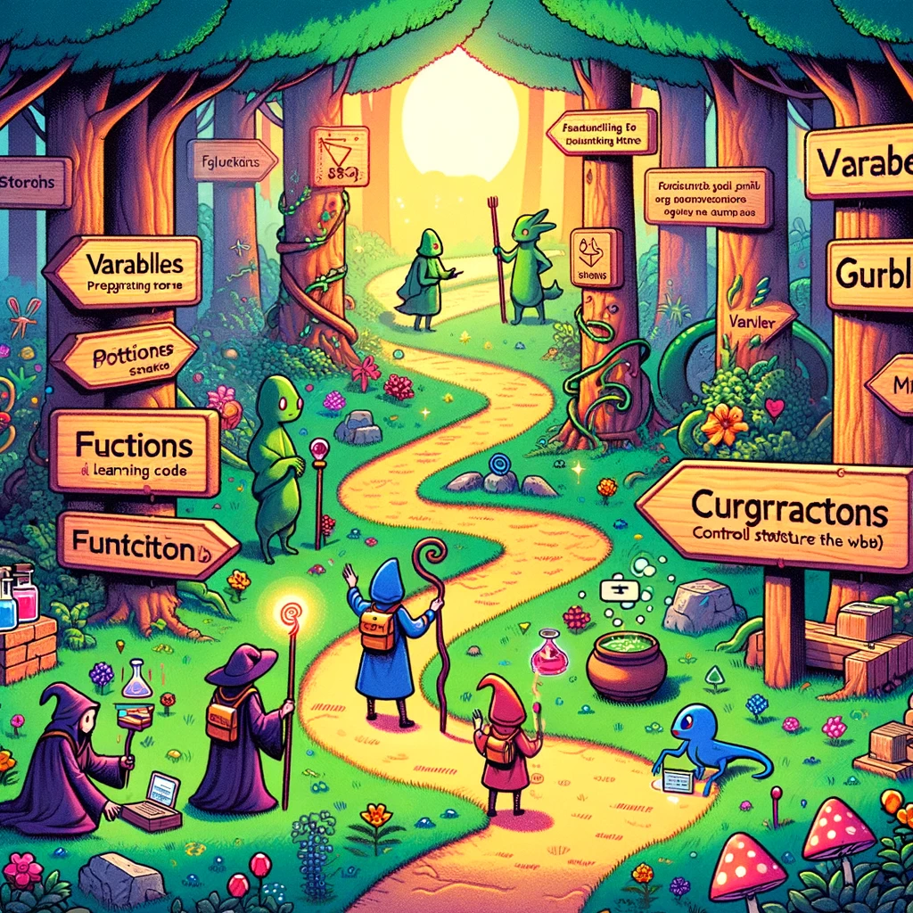

# Programmeerimise alused

Pildi allikas: Dall-E by OpenAI

## Kirjeldus

**"Programmeerimise alused"** on sissejuhatus arvutiprogrammeerimise maailma. Algajatele mõeldud aine katab põhilised kontseptsioonid, mida iga alustav programmeerija peab teadma. Õpilased õpivad muutujate, andmetüüpide, juhtstruktuuride, tsüklite, funktsioonide ja lihtsate algoritmide kasutamist. Praktiliste harjutuste ja projektide kaudu kirjutavad ja siluvad õpilased oma esimesed koodiread, rajades tee edasijõudnumatele õpingutele tarkvaraarenduses ja arvutiteaduses. Varasem programmeerimiskogemus ei ole nõutud, muutes selle ideaalseks lähtepunktiks kõigile, kel on huvi alustada programmeerimisega.

- **Maht**: 4 EAP (4 x 26 tundi)
- **Aine eesmärgid**: **"Programmeerimise alused"** aine eesmärk on tutvustada õpilastele arvutiprogrammeerimise põhikontseptsioone ja -põhimõtteid.

Kursuse lõpuks on õpilastel selge arusaam programmeerimise loogilisest struktuurist, nad on tuttavad põhilise koodi süntaksiga ja on suutelised kirjutama lihtsaid programme arvutusprobleemide lahendamiseks.

## Õpiväljundid

- **Programmeerimiskontseptsioonide mõistmine**: Tunneb ja kasutab programmide kirjutamisel põhilisi programmeerimiskonstruktsioone nagu muutujad, andmetüübid ja operaatorid.
- **Juhtstruktuurid**: Rakendab põhilisi juhtstruktuure, sealhulgas tsükleid (nt `for`, `while`) ja tingimuslauseid (nt `if-else` laused), et mõjutada programmi täitmise kulgu.
- **Funktsioonid ja meetodid**: Koostab ja kasutab funktsioone/meetodeid, et modulariseerida ja lihtsustada koodi, mõistes parameetrite, tagastusväärtuste ja funktsioonide käivitamise kontseptsioone.
- **Lihtsad algoritmid**: Koostab ja rakendab lihtsaid algoritme probleemide lahendamiseks, nagu väärtuse otsimine nimekirjast või numbrite järjestuse sorteerimine.
- **Andmestruktuurid**: Mõistab ja kasutab põhilisi andmestruktuure nagu massiivid ja objektid andmete korraldamiseks ja manipuleerimiseks.
- **Silumisoskused**: Tuvastab, jälgib ja lahendab põhilisi kodeerimisvigu (nii süntaksi kui ka loogika osas) kasutades silumistehnikaid ja -vahendeid.
- **Probleemilahendusoskused**: Analüüsib lihtsaid probleeme ja leiab neile arvutuslikud lahendused algoritmilise mõtlemise kaudu.
- **Põhiline sisend/väljund**: Rakendab põhilisi sisend- ja väljundioperatsioone kasutajatega suhtlemiseks.

## Õppematerjalid

Kursuse jooksul kasutame `Github`-i õppematerjalide jagamiseks ja kodutööde esitamiseks.

Õpilased peaksid järgima teemade ja loengute järjekorda. Igal teemal on `README` fail õppematerjalide ja harjutustega. Harjutused tuleb lahendada ja üles laadida `Github`-i. Kodutöö tuleb esitada enne järgmist loengut.

Järgmise loengu õppematerjalid tuleks läbi töötada enne loengut (välja arvatud esimene loeng). Loengutes arutleme teemade üle ja lahendame harjutusi õpitud teemade kohta.

## Teemad

- [Sissejuhatus](./Topics/Introduction/README.md)
- [Tööriistad](./Topics/Tools/README.md)
- [Javascript](./Topics/Javascript/README.md)
- [Node.JS](./Topics/NodeJS/README.md)
- [Hello World](./Topics/HelloWorld/README.md)
- [Algoritmid](./Topics/Algorithms/README.md)
- [Muutujad](./Topics/Variables/README.md)
- [Andmetüübid](./Topics/Data-Types/README.md)
- [Operaatorid ja avaldised](./Topics/Operators/README.md)
- [Silumine](./Topics/Debugging/README.md)
- [Tingimuslaused](./Topics/Conditionals/README.md)
- [Tsüklid](./Topics/Loops/README.md)
- [Funktsioonid](./Topics/Functions/README.md)
- [Andmestruktuurid](./Topics/Data-Structures/README.md)
- [Moodulid](./Topics/Modules/README.md)
- [NPM](./Topics/NPM/README.md)

## Loengud

### Loeng 1: Sissejuhatus programmeerimise alustesse

Maht: 4h

- Aine tutvustus
- Tööriistad
- Javascript
- NodeJS
- Hello World
- Muutujad
- Andmetüübid
- Koodi üleslaadimine Githubi
- Harjutused

### Loeng 2 (Zoom)

Maht: 2h

- Eelmise loengu meeldetuletus
- Kodutööde ajal tekkinud probleemide lahendamine
- Operaatorid ja avaldised
- Tingimuslaused
- Koodi üleslaadimine Githubi
- Harjutused

### Loeng 3

Maht: 4h

- Eelmise loengu meeldetuletus
- Kodutööde ajal tekkinud probleemide lahendamine
- Algoritmid
- Tsüklid
- Harjutused

### Loeng 4 (Zoom)

Maht: 2h

- Eelmise loengu meeldetuletus
- Kodutööde ajal tekkinud probleemide lahendamine
- Javascripti parimad praktikad
- Silumine
- Harjutused

### Loeng 5

Maht: 4h

- Eelmise loengu meeldetuletus
- Kodutööde ajal tekkinud probleemide lahendamine
- 
- 
- Harjutused

### Loeng 6 (Zoom)

Maht: 2h

- Eelmise loengu meeldetuletus
- Kodutööde ajal tekkinud probleemide lahendamine
- Harjutused

### Loeng 7

Maht: 4h

- Eelmise loengu meeldetuletus
- Kodutööde ajal tekkinud probleemide lahendamine

- Funktsioonid
- Harjutused

### Loeng 8 (Zoom)

Maht: 2h

- Eelmise loengu meeldetuletus
- Kodutööde ajal tekkinud probleemide lahendamine
- Harjutused

### Loeng 9

Maht: 4h

- Eelmise loengu meeldetuletus
- Kodutööde ajal tekkinud probleemide lahendamine
- Andmestruktuurid
- Moodulid
- Harjutused

### Loeng 10 (Zoom)

Maht: 2h

- Eelmise loengu meeldetuletus
- Kodutööde ajal tekkinud probleemide lahendamine
- NPM
- Lõplik Q&A
