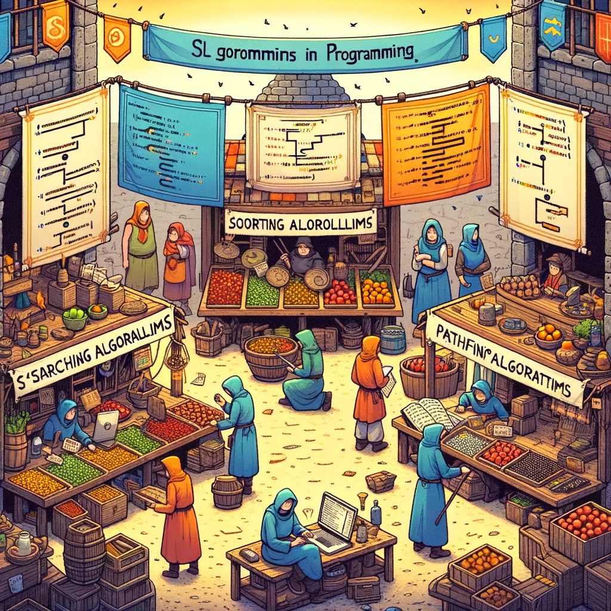
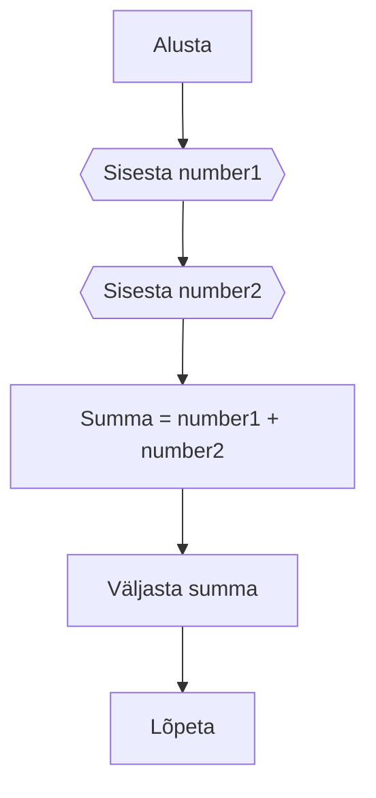
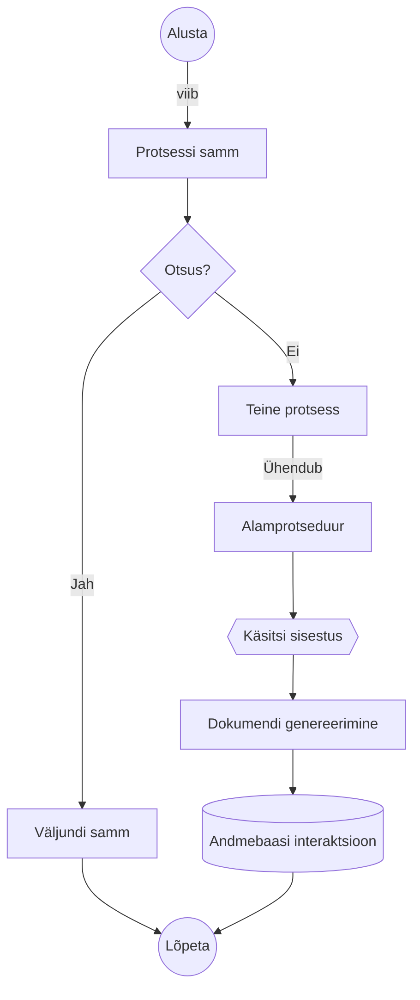
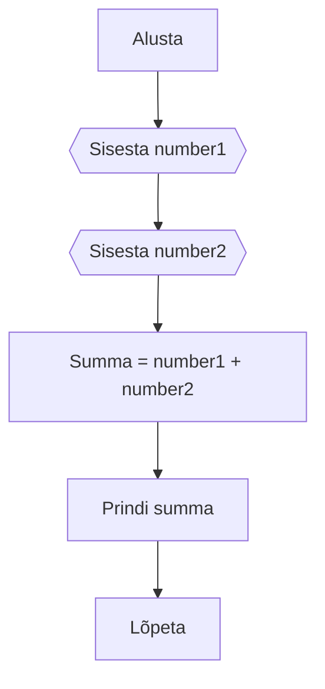

# Algoritmid

Selles teemas räägime algoritmidest ja kuidas neid disainida lihtsamate probleemide lahendamiseks.



Pildi allikas: Dall-E by OpenAI

- [Algoritmid](#algoritmid)
  - [Õpitulemused](#õpitulemused)
  - [Mis on algoritm?](#mis-on-algoritm)
  - [Algoritmide disainimine](#algoritmide-disainimine)
  - [Pseudokood](#pseudokood)
  - [Voodiagrammid](#voodiagrammid)
  - [Harjutused](#harjutused)
    - [Harjutus 1](#harjutus-1)
    - [Harjutus 2](#harjutus-2)
    - [Harjutus 3](#harjutus-3)

## Õpitulemused

Pärast selle teema läbimist suudate:

- Määratleda, mis on algoritm
- Disainida lihtsaid algoritme
- Kirjutada lihtsaid algoritme pseudokoodis
- Joonistada lihtsaid voodiagramme

## Mis on algoritm?

Sageli, kui peame programmeerimise abil lahendama mingit probleemi, kipume hüppama koodi kirjutamise juurde seejuures probleemi olemusele sisuliselt mõtlemata. See ei ole hea lähenemine, kuna see võib viia vigade ja tõrgeteni meie koodis. On parem esmalt mõelda sellele, kuidas samm-sammult probleemi lahendada ja alles seejärel hakata koodi kirjutama. Siin tulevadki mängu algoritmid.

Algoritm on kindlaksmääratud, selgelt defineeritud juhiste või samm-sammulise protsessi kogum, mille eesmärk on sooritada ülesanne või lahendada probleem. Arvutiteaduses ja programmeerimises kasutatakse algoritme andmete manipuleerimiseks, arvutuste tegemiseks, sisendi töötlemiseks ja automatiseeritud mõtlemise või muude otsustusprotsesside kirjeldamiseks ja sooritamiseks. Algoritme kasutatakse paljudes erinevates valdkondades, sealhulgas **matemaatikas**, **teaduses**, **inseneriteaduses** ja **majanduses**. Tegelikult kasutame algoritme oma igapäevaelus, näiteks kui järgime retsepti toiduvalmistamiseks, kui järgime juhiseid sihtkohta jõudmiseks või kui järgime juhiseid mööblieseme kokkupanekuks.

## Algoritmide disainimine

Kui üritame lahendada probleemi, siis on hea mõte järgida protsessi samm-sammult. See protsess on algoritmide disain. Algoritmide disainiprotsess hõlmab järgmisi samme:

- Mõista probleemi
- Tuvasta sisendid ja väljundid
- Tuvasta sammud, mida on vaja probleemi lahendamiseks
- Kirjuta algoritm pseudokoodis või joonistada voodiagramm
- Testi algoritmi erinevate sisenditega
- Täiusta algoritmi vajadusel

## Pseudokood

Pseudokood on lihtne, mitteametlik keel, mida kasutatakse algoritmi sammude kirjeldamiseks. See ei ole otseselt programmeerimiskeel, kuid see võib olla programmeerimiskeele sarnane. Pseudokoodi kasutatakse algoritmi sammude kirjeldamiseks viisil, mis on lihtne mõista.

Näiteks järgmine pseudokood kirjeldab algoritmi samme, mis arvutab ja väljastab kahe numbri summa:

```bash
ALUSTA
LOE number1
LOE number2
summa = number1 + number2
VÄLJASTA summa
LÕPETA
```

Kuna pseudokoodi ei ole mõeldud otseselt kävitamiseks (nagu programmikood), ei pea see järgima programmeerimiskeele süntaksit. See on mõeldud inimeste poolt lugemiseks, seega peaks see olema lihtne mõista. See on mõeldud ka inimeste poolt kirjutamiseks, seega peaks seda olema lihtne kirjutada. Algoritmide disainimisel on pseudokoodi kasutamine hea mõte, kuna see võimaldab meil keskenduda algoritmi loogikale ilma, et peaksime muretsema programmeerimiskeele süntaksi pärast.

## Voodiagrammid

Voodiagramm on diagramm, mis kujutab algoritmi samme. Seda kasutatakse algoritmi sammude graafiliseks kirjeldamiseks viisil, millest on lihtne aru saada. Voodiagramm on algoritmi graafiline esitus, mis kasutab sümboleid algoritmi erinevate sammude esindamiseks.

Näiteks järgmine voodiagramm kirjeldab algoritmi samme, mis arvutab ja väljastab kahe numbri summa:



Voodiagrammides kasutatakse järgmisi sümboleid algoritmi erinevate sammude esindamiseks:



## Harjutused

Loo voodiagramm või kirjuta pseudokood järgmiste algoritmide jaoks:

### Harjutus 1

Algoritm, mis võtab sisendiks kaks numbrit ja prindib nende kahe numbri summa.

<details>
<summary>Lahendus</summary>

</details>

### Harjutus 2

Kirjuta algoritm, mis võtab sisendiks kaks numbrit ja prindib suurema nende kahest numbrist.

### Harjutus 3

Kirjuta algoritm, mis võtab sisendiks kolm numbrit ja prindib nende kolme numbri keskmise.