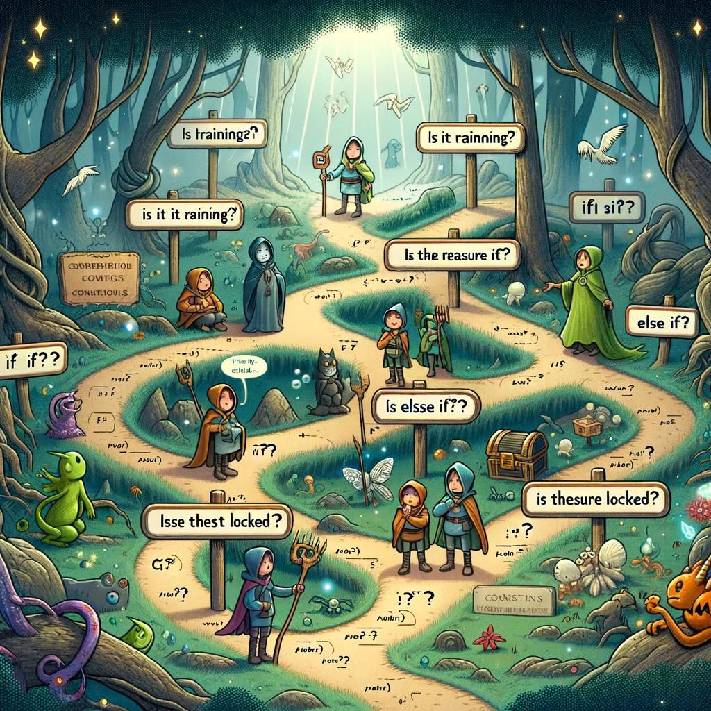
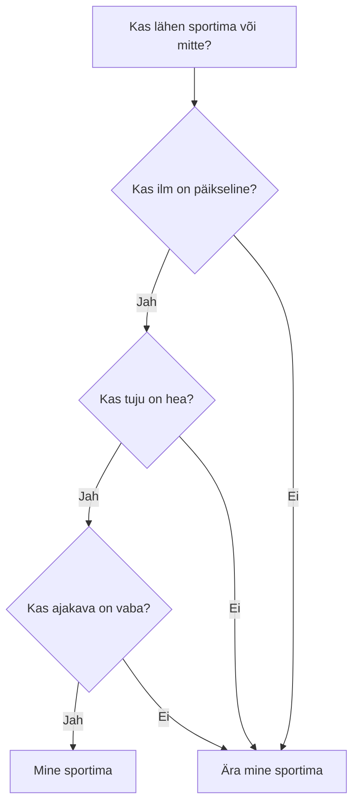
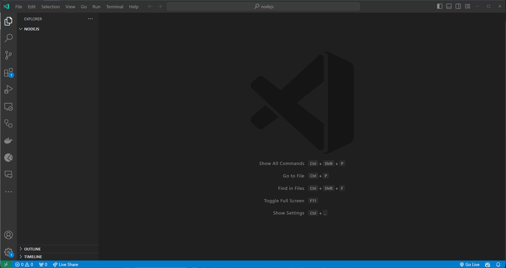

# Tingimuslaused

Selles teemas õpime Javascripti tingimuslausete kohta.



Pildi allikas: Dall-E by OpenAI

- [Tingimuslaused](#tingimuslaused)
  - [Õpiväljundid](#õpiväljundid)
  - [Mis on Tingimuslause?](#mis-on-tingimuslause)
  - [Tingimuslauste Mõistmine](#tingimuslauste-mõistmine)
    - [Tõeväärtus Avaldis](#tõeväärtus-avaldis)
    - [Võrdlusoperaatorid](#võrdlusoperaatorid)
  - [Tingimuslausete Tüübid](#tingimuslausete-tüübid)
    - [if](#if)
    - [if-else](#if-else)
    - [if-else-if](#if-else-if)
    - [switch](#switch)
    - [Ternaaroperaator](#ternaaroperaator)
    - [Tingimuslause tigimuslause sees](#tingimuslause-tigimuslause-sees)
  - [Tõesus ja Väärasus](#tõesus-ja-väärasus)
  - [Parimad tavad](#parimad-tavad)
  - [Harjutused](#harjutused)
    - [Harjutus 1 - Lihtne If-lause](#harjutus-1---lihtne-if-lause)
    - [Harjutus 2 - If-Else-lause](#harjutus-2---if-else-lause)
    - [Harjutus 3 - If-Else-If-lause](#harjutus-3---if-else-if-lause)

## Õpiväljundid

Pärast selle teema läbimist suudate:

- Määratleda, mis on tingimuslause
- Selgitada erinevust `if`, `if-else`, `if-else-if`, `switch` ja ternaaroperaatori vahel
- Selgitada, mida tähendab tõene ja väär tingimuslause kontekstis
- Kasutada parimaid tavasid tingimuslausete kirjutamisel

## Mis on Tingimuslause?

Tingimuslause on kontrollmehanism, mida kasutatakse tingimuse alusel valikute tegemislel. Näiteks saame kasutada tingimuslauset, et kontrollida, kas arv on positiivne või negatiivne, ja sooritada kontrolli tulemuse põhjal erinevaid toiminguid.

Oma mõtetes kasutame tingimuslausete pidevalt, kui teeme otsuseid. Näiteks, kui otsustame, kas minna sportima või mitte, kontrollime ilma, oma tuju, oma ajakava jne ja kontrolli tulemuse põhjal otsustame, kas minna sportima või mitte.



## Tingimuslauste Mõistmine

Tingimuslausete mõistmiseks peame mõistma tõeväärtus avaldisi ja võrdlusoperaatoreid.

### Tõeväärtus Avaldis

Tõeväärtus avaldis on avaldis, mis hindab avaldise väärtust tõeseks (`true`) või vääraks (`false`). Näiteks `5 > 3` on tõeväärtus avaldis, mille vastuseks on tõene (`true`), sest `5` on suurem kui `3`. `5 < 3` on jällegi avaldis, mille tulemus on väär (`false`), sest `5` ei ole väiksem kui `3`.

### Võrdlusoperaatorid

Võrdlusoperaatoreid kasutatakse kahe väärtuse võrdlemiseks ja tõeväärtuse tagastamiseks. Nagu me juba teame, siis on Javascriptis 6 võrdlusoperaatorit:

- `>`: suurem kui
- `<`: väiksem kui
- `>=`: suurem või võrdne
- `<=`: väiksem või võrdne
- `==`: võrdne
- `!=`: mittevõrdne

```js
console.log(5 > 3); // true
console.log(5 < 3); // false
console.log(5 >= 3); // true
console.log(5 <= 3); // false
console.log(5 == 3); // false
console.log(5 != 3); // true
```

## Tingimuslausete Tüübid

Javascriptis on 5 tüüpi tingimuslauseid:

- `if`
- `if-else`
- `if-else-if`
- `switch`
- `ternaaroperaator`

### if

`if` lauset kasutatakse koodiploki täitmiseks, kui tingimus on tõene.

`if` lausel on järgmine süntaks:

```js
if (tingimus) {
  // kood, mida täidetakse, kui tingimus on tõene
}
```

Näiteks:

```js
let weather = 'päikeseline';

if (weather === 'päikeseline') {
  console.log('Lähen randa!');
}
```
Selles näites kontrollime, kas ilm on päikeseline ja kui on, väljastame konsooli vastava teate.

### if-else

`if-else` lauset kasutatakse ühe koodiploki täitmiseks, kui tingimus on tõene, ja teise koodiploki täitmiseks, kui tingimus on väär. 

`if-else` lausel on järgmine süntaks:

```js
if (tingimus) {
  // kood, mida täidetakse, kui tingimus on tõene
} else {
  // kood, mida täidetakse, kui tingimus on väär
}
```

Näiteks:

```js
weather = 'päikeseline';

if (ilm === 'päikeseline') {
  console.log('Lähen randa!');
} else {
  console.log('Lähen kinno!');
}
```

Selles näites kontrollime, kas ilm on päikeseline ja kui on, väljastame konsooli ühe teate (`'Lähen randa!'`). Kui ilm ei ole päikseline, väljastame konsooli teise teate (`'Lähen kinno!'`).

### if-else-if

`if-else-if` lauset kasutatakse koodiploki täitmiseks, kui üks tingimus on tõene, ja teise koodiploki täitmiseks, kui teine tingimus on tõene. `if-else-if` lausel on järgmine süntaks:

```js
if (tingimus1) {
  // kood, mida täidetakse, kui tingimus1 on tõene
} else if (tingimus2) {
  // kood, mida täidetakse, kui tingimus2 on tõene
} else {
  // kood, mida täidetakse, kui tingimus1 ja tingimus2 on väärad
}
```

```js
let weather = 'vihmane';

if (weather === 'päikeseline') {
  console.log('Lähen randa!');
} else if (weather === 'vihmane') {
  console.log('Lähen kinno!');
} else {
  console.log('Jään koju!');
}
```

Selles näites kontrollime, kas ilm on `päikeseline` ja kui on, läheme randa. Kui ilm ei ole `päikeseline`, kontrollime, kas ilm on `vihmane` ja kui on, läheme kinno. Kui ilm ei ole `päikseline` ega `vihmane`, jääme koju.

### switch

`switch` lauset kasutatakse koodiploki täitmiseks erinevatel juhtudel. `switch` lausel on järgmine süntaks:

```js
switch (avaldis) {
  case väärtus1:
    // kood, mida täidetakse, kui avaldis on võrdne väärtus1-ga
    break;
  case väärtus2:
    // kood, mida täidetakse, kui avaldis on võrdne väärtus2-ga
    break;
  default:
    // kood, mida täidetakse, kui avaldis ei ole võrdne väärtus1 ega väärtus2-ga
}
```

Näiteks:

```js
let weather = 'vihmane';

switch (weather) {
  case 'päikeseline':
    console.log('Lähen randa!');
    break;
  case 'vihmane':
    console.log('Lähen kinno!');
    break;
  default:
    console.log('Jään koju!');
}
```
See näide on ekvivalentne eelmisele näitele if-else-if lausega.

### Ternaaroperaator

`Ternaaroperaatorit` kasutatakse koodiploki täitmiseks tingimuse põhjal.

`Ternaaroperaatoril` on järgmine süntaks:

```js
tingimus ? avaldis1 : avaldis2
```

Näiteks:

```js
let weather = 'vihmane';

weather === 'päikeseline' ? console.log('Lähen randa!') : console.log('Lähen kinno!');
```

See näide on ekvivalentne eelmisele näitele `if-else` lausega.

### Tingimuslause tigimuslause sees

```js
let weather = 'vihmane';

if (weather === 'päikeseline') {
  console.log('Lähen randa!');
} else {
  if (weather === 'vihmane') {
    console.log('Lähen kinno!');
  } else {
    console.log('Jään koju!');
  }
}
```

See näide on ekvivalentne eelmisele näitele `if-else-if` lausega, kuid see sisaldab rohkem koodi ja on raskem lugeda. Sellistel juhtudel on parem kasutada `if-else-if` tingimuslauset.


## Tõesus ja Väärasus

Javascriptis tõlgendatakse kõiki väärtusi tõeseks või vääraks. Selline tõlgendamine võib meille olla vahel kasulik, kuna näiteks selleks, et kontrollida, kas muutuja on määratud, saame lihtsalt kontrollida, kas muutuja on tõene (muutujal on väärtus) või väär (muutujal ei ole väärtust, või on sellel väärtus, mida tõlgendatakse vääraks).

Järgmised väärtused peetakse vääraseks:

- `false`
- `0`
- `''`
- `null`
- `undefined`
- `NaN`

Kõiki teisi väärtusi peetakse tõeseks.

Näiteks:

```js
let x = 5;

if (x) {
  console.log('x on tõene'); // see prinditakse konsooli, sest 5 tõlgendatakse tõeseks
} else {
  console.log('x on väär');
}

x = 0;

if (x) {
  console.log('x on tõene');
} else {
  console.log('x on väär'); // see prinditakse konsooli, sest 0 tõlgendatakse vääraks
}
```

## Parimad tavad

- Kasutage võrdlemisel `===` asemel `==`
- Kasutage võrdlemisel `!==` asemel `!=`
- Kasutage `if-else-if` lauset selle asemel, et kasutada `if` lauset `if` lause sees

## Harjutused

Loo fail nimega `index.js` (või teise valitud nimega) ja alusta allpool toodud harjutuste lahenduste lisamist.

Testi oma koodi käivitades `index.js` faili kasutades käsku `node index.js`.

Testi oma koodi erinevate väärtustega.

### Harjutus 1 - Lihtne If-lause

**Eesmärk**: Kontrolli, kas number on positiivne.

**Kirjeldus**: Kirjuta JavaScripti programm, milles deklareeritakse muutuja ja omistatakse sellele numbriline väärtus. Kasuta `if`-lauset, et prindida "Number on positiivne", kui number on suurem kui null. Testi oma koodi ka negatiivse väärtuse ja nulliga.

<details>
  <summary>Lahendus</summary>

```js
let number = 5;

if (number > 0) {
  console.log('Number on positiivne');
}
```


</details>

### Harjutus 2 - If-Else-lause

**Eesmärk**: Kontrolli, kas number on paaris või paaritu.

**Kirjeldus**: Kirjuta JavaScripti programm, mis võtab numbri ja kontrollib, kas arv on paaris või paaritu. Väljasta teade "Arv on paaris", kui arv on paaris ja "Arv on paaritu", kui arv on paaritu.

<details>
  <summary>Lahendus</summary>

```js
let number = 5;

if (number % 2 === 0) {
  console.log('Arv on paaris');
} else {
  console.log('Arv on paaritu');
}
```
</details>


### Harjutus 3 - If-Else-If-lause

**Eesmärk**: Hinnete klassifitseerimine.

**Kirjeldus**: Kirjuta JavaScripti programm, mis klassifitseerib õpilaste hindeid. Programm peaks võtma arvu (`0-100`) ja klassifitseerima selle järgmiselt:

- `A`: 90 ja üle selle
- `B`: 80 kuni 89
- `C`: 70 kuni 79
- `D`: 60 kuni 69
- `F`: alla 60

Väljasta hinne.

